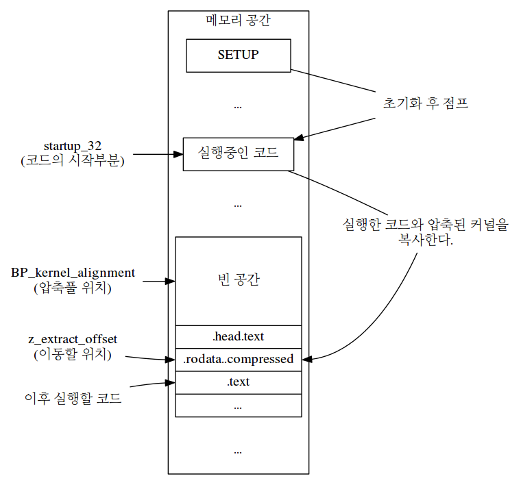
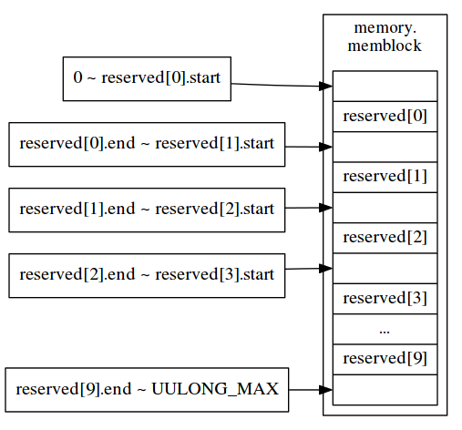
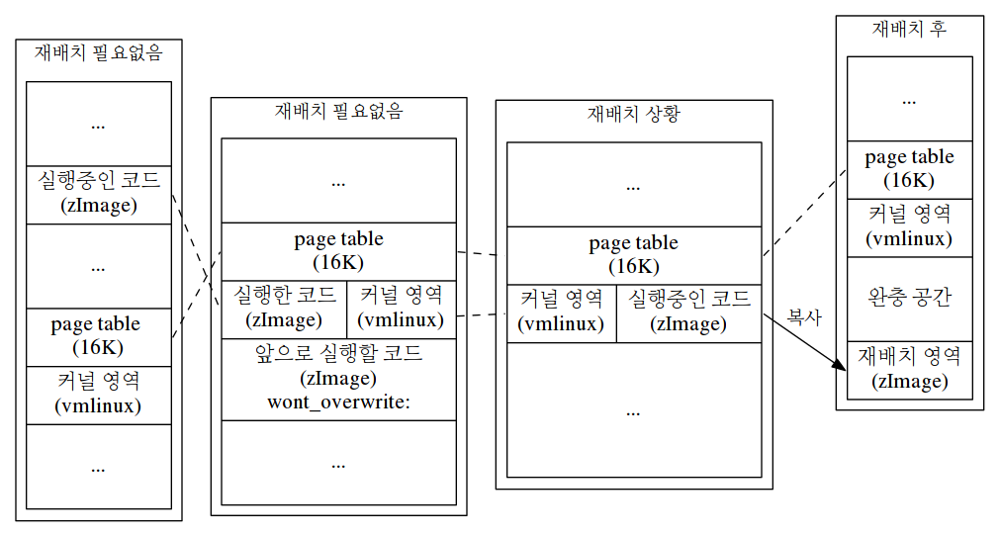
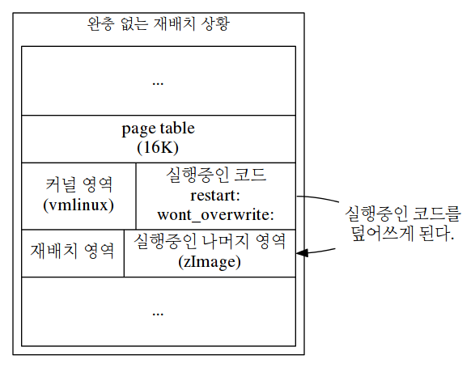

http://www.iamroot.org/ldocs/linux.html
iamroot의 linux 3.9.11 (x86_64) 자료 옮겨옴


Table of Contents
-----------------

-   [1 Intro](./test.md#sec-1)
-   [2 x86\_64 boot sequence](#sec-2)
-   [3 Makefile](#sec-3)
-   [4 arch/x86/Makefile](#sec-4)
-   [5 arch/x86/boot/Makefile](#sec-5)
-   [6 arch/x86/boot/compressed/Makefile](#sec-6)
-   [7 arch/x86/boot/header.S](#sec-7)
    -   [7.1 EFI header](#sec-7-1)
    -   [7.2 die()](#sec-7-2)
    -   [7.3 header](#sec-7-3)
-   [8 arch/x86/boot/main.c](#sec-8)
    -   [8.1 main()](#sec-8-1)
    -   [8.2 copy\_boot\_params()](#sec-8-2)
    -   [8.3 init\_heap()](#sec-8-3)
    -   [8.4 set\_bios\_mode()](#sec-8-4)
    -   [8.5 keyboard\_init()](#sec-8-5)
    -   [8.6 query\_ist()](#sec-8-6)
-   [9 arch/x86/boot/pm.c](#sec-9)
    -   [9.1 go\_to\_protected\_mode()](#sec-9-1)
    -   [9.2 mask\_all\_interrupts()](#sec-9-2)
    -   [9.3 realmode\_switch\_hook()](#sec-9-3)
    -   [9.4 reset\_coprocessor()](#sec-9-4)
    -   [9.5 setup\_gdt()](#sec-9-5)
    -   [9.6 setup\_idt()](#sec-9-6)
-   [10 arch/x86/boot/pmjump.S](#sec-10)
    -   [10.1 protected\_mode\_jump()](#sec-10-1)
    -   [10.2 in\_pm32()](#sec-10-2)
-   [11 arch/x86/boot/compressed/vmlinux.lds.S](#sec-11)
-   [12 arch/x86/boot/compressed/head\_64.S](#sec-12)
    -   [12.1 startup\_32](#sec-12-1)
    -   [12.2 startup\_64](#sec-12-2)
    -   [12.3 efi\_pe\_entry](#sec-12-3)
    -   [12.4 efi\_stub\_entry](#sec-12-4)
    -   [12.5 preferred\_addr](#sec-12-5)
-   [13 arch/x86/kernel/vmlinux.lds.S](#sec-13)
-   [14 arch/x86/kernel/Makefile](#sec-14)
-   [15 arch/x86/kernel/head\_64.S](#sec-15)
    -   [15.1 startup\_64](#sec-15-1)
    -   [15.2 secondary\_startup\_64](#sec-15-2)
    -   [15.3 pud\_index()](#sec-15-3)
    -   [15.4 NEXT\_PAGE()](#sec-15-4)
    -   [15.5 PMDS()](#sec-15-5)
    -   [15.6 early\_idt\_handlers](#sec-15-6)
    -   [15.7 early\_idt\_handler](#sec-15-7)
-   [16 arch/x86/kernel/head64.c](#sec-16)
    -   [16.1 x86\_64\_start\_kernel()](#sec-16-1)
    -   [16.2 x86\_64\_start\_reservations()](#sec-16-2)
    -   [16.3 reset\_early\_page\_tables()](#sec-16-3)
    -   [16.4 clear\_bss()](#sec-16-4)
    -   [16.5 early\_make\_pgtable()](#sec-16-5)
    -   [16.6 copy\_bootdata()](#sec-16-6)
    -   [16.7 get\_cmd\_line\_ptr()](#sec-16-7)
-   [17 init/main.c](#sec-17)
    -   [17.1 start\_kernel()](#sec-17-1)
    -   [17.2 lockdep\_init()](#sec-17-2)
    -   [17.3 smp\_setup\_processor\_id()](#sec-17-3)
    -   [17.4 boot\_cpu\_init()](#sec-17-4)
-   [18 arch/x86/boot/a20.c](#sec-18)
    -   [18.1 a20\_test()](#sec-18-1)
    -   [18.2 a20\_test\_long()](#sec-18-2)
    -   [18.3 a20\_test\_short()](#sec-18-3)
    -   [18.4 empty\_8042()](#sec-18-4)
    -   [18.5 enable\_a20()](#sec-18-5)
    -   [18.6 enable\_a20\_bios()](#sec-18-6)
    -   [18.7 enable\_a20\_fast()](#sec-18-7)
    -   [18.8 enable\_a20\_kbc()](#sec-18-8)
-   [19 arch/x86/boot/apm.c](#sec-19)
    -   [19.1 query\_apm\_bios()](#sec-19-1)
-   [20 arch/x86/boot/bioscall.S](#sec-20)
    -   [20.1 intcall()](#sec-20-1)
-   [21 arch/x86/boot/bitops.h](#sec-21)
    -   [21.1 test\_bit](#sec-21-1)
    -   [21.2 constant\_test\_bit()](#sec-21-2)
    -   [21.3 variable\_test\_bit()](#sec-21-3)
    -   [21.4 set\_bit()](#sec-21-4)
-   [22 arch/x86/boot/boot.h](#sec-22)
    -   [22.1 \_\_get\_heap()](#sec-22-1)
    -   [22.2 ARRAY\_SIZE](#sec-22-2)
    -   [22.3 biosregs](#sec-22-3)
    -   [22.4 BUILD\_BUG\_ON](#sec-22-4)
    -   [22.5 cmdline\_find\_option()](#sec-22-5)
    -   [22.6 cmdline\_find\_option\_bool()](#sec-22-6)
    -   [22.7 cpu\_features](#sec-22-7)
    -   [22.8 cpu\_relax()](#sec-22-8)
    -   [22.9 ds()](#sec-22-9)
    -   [22.10 fs()](#sec-22-10)
    -   [22.11 GET\_HEAP()](#sec-22-11)
    -   [22.12 gs()](#sec-22-12)
    -   [22.13 heap\_free()](#sec-22-13)
    -   [22.14 inb()](#sec-22-14)
    -   [22.15 inw()](#sec-22-15)
    -   [22.16 io\_delay()](#sec-22-16)
    -   [22.17 outb()](#sec-22-17)
    -   [22.18 outw()](#sec-22-18)
    -   [22.19 rdfs16()](#sec-22-19)
    -   [22.20 rdfs32()](#sec-22-20)
    -   [22.21 rdfs8()](#sec-22-21)
    -   [22.22 RESET\_HEAP()](#sec-22-22)
    -   [22.23 set\_fs()](#sec-22-23)
    -   [22.24 set\_gs()](#sec-22-24)
    -   [22.25 wrfs16()](#sec-22-25)
    -   [22.26 wrfs32()](#sec-22-26)
    -   [22.27 wrfs8()](#sec-22-27)
    -   [22.28 memcmp()](#sec-22-28)
    -   [22.29 outl()](#sec-22-29)
    -   [22.30 inl()](#sec-22-30)
-   [23 arch/x86/boot/cmdline.c](#sec-23)
    -   [23.1 \_\_cmdline\_find\_option()](#sec-23-1)
    -   [23.2 \_\_cmdline\_find\_option\_bool()](#sec-23-2)
    -   [23.3 myisspace()](#sec-23-3)
-   [24 arch/x86/boot/compressed/misc.c](#sec-24)
    -   [24.1 serial\_putchar()](#sec-24-1)
    -   [24.2 memset()](#sec-24-2)
    -   [24.3 decompress\_kernel()](#sec-24-3)
    -   [24.4 \_\_putstr()](#sec-24-4)
    -   [24.5 scroll()](#sec-24-5)
    -   [24.6 error()](#sec-24-6)
    -   [24.7 parse\_elf()](#sec-24-7)
-   [25 arch/x86/boot/copy.S](#sec-25)
    -   [25.1 memcpy()](#sec-25-1)
    -   [25.2 memset()](#sec-25-2)
    -   [25.3 copy\_from\_fs()](#sec-25-3)
    -   [25.4 copy\_to\_fs()](#sec-25-4)
-   [26 arch/x86/boot/cpu.c](#sec-26)
    -   [26.1 validate\_cpu()](#sec-26-1)
-   [27 arch/x86/boot/cpucheck.c](#sec-27)
    -   [27.1 check\_cpu()](#sec-27-1)
    -   [27.2 check\_flags()](#sec-27-2)
    -   [27.3 get\_flags()](#sec-27-3)
    -   [27.4 has\_eflag()](#sec-27-4)
    -   [27.5 has\_fpu()](#sec-27-5)
    -   [27.6 is\_amd()](#sec-27-6)
    -   [27.7 is\_centaur()](#sec-27-7)
    -   [27.8 is\_transmeta()](#sec-27-8)
    -   [27.9 req\_flags](#sec-27-9)
-   [28 arch/x86/boot/cpustr.h](#sec-28)
    -   [28.1 x86\_cap\_strs](#sec-28-1)
-   [29 arch/x86/boot/ctype.h](#sec-29)
    -   [29.1 isdigit()](#sec-29-1)
    -   [29.2 isxdigit()](#sec-29-2)
-   [30 arch/x86/boot/early\_serial\_console.c](#sec-30)
    -   [30.1 console\_init()](#sec-30-1)
    -   [30.2 early\_serial\_init()](#sec-30-2)
    -   [30.3 parse\_console\_uart8250()](#sec-30-3)
    -   [30.4 parse\_earlyprintk()](#sec-30-4)
    -   [30.5 probe\_baud()](#sec-30-5)
-   [31 arch/x86/boot/edd.c](#sec-31)
    -   [31.1 query\_edd()](#sec-31-1)
    -   [31.2 get\_edd\_info()](#sec-31-2)
    -   [31.3 read\_mbr\_sig()](#sec-31-3)
    -   [31.4 read\_mbr()](#sec-31-4)
-   [32 arch/x86/boot/mca.c](#sec-32)
    -   [32.1 query\_mca()](#sec-32-1)
-   [33 arch/x86/boot/memory.c](#sec-33)
    -   [33.1 detect\_memory()](#sec-33-1)
    -   [33.2 detect\_memory\_e820()](#sec-33-2)
    -   [33.3 detect\_memory\_e801()](#sec-33-3)
    -   [33.4 detect\_memory\_88()](#sec-33-4)
-   [34 arch/x86/boot/printf.c](#sec-34)
    -   [34.1 \_\_do\_div()](#sec-34-1)
    -   [34.2 number()](#sec-34-2)
    -   [34.3 printf()](#sec-34-3)
    -   [34.4 skip\_atoi()](#sec-34-4)
    -   [34.5 sprintf()](#sec-34-5)
    -   [34.6 vsprintf()](#sec-34-6)
-   [35 arch/x86/boot/regs.c](#sec-35)
    -   [35.1 initregs()](#sec-35-1)
-   [36 arch/x86/boot/setup.ld](#sec-36)
-   [37 arch/x86/boot/string.c](#sec-37)
    -   [37.1 strnlen()](#sec-37-1)
    -   [37.2 simple\_strtoull()](#sec-37-2)
    -   [37.3 strncmp()](#sec-37-3)
    -   [37.4 simple\_guess\_base()](#sec-37-4)
    -   [37.5 TOLOWER()](#sec-37-5)
    -   [37.6 strstr()](#sec-37-6)
    -   [37.7 strlen()](#sec-37-7)
    -   [37.8 strcmp()](#sec-37-8)
-   [38 arch/x86/boot/tools/build.c](#sec-38)
    -   [38.1 main()](#sec-38-1)
    -   [38.2 parse\_zoffset()](#sec-38-2)
    -   [38.3 PARSE\_ZOFS()](#sec-38-3)
    -   [38.4 update\_pecoff\_setup\_and\_reloc()](#sec-38-4)
    -   [38.5 update\_pecoff\_section\_header()](#sec-38-5)
    -   [38.6 update\_pecoff\_text()](#sec-38-6)
    -   [38.7 partial\_crc32\_one()](#sec-38-7)
    -   [38.8 partial\_crc32()](#sec-38-8)
-   [39 arch/x86/boot/tty.c](#sec-39)
    -   [39.1 bios\_putchar()](#sec-39-1)
    -   [39.2 getchar()](#sec-39-2)
    -   [39.3 getchar\_timeout()](#sec-39-3)
    -   [39.4 gettime()](#sec-39-4)
    -   [39.5 kbd\_flush()](#sec-39-5)
    -   [39.6 kbd\_pending()](#sec-39-6)
    -   [39.7 putchar()](#sec-39-7)
    -   [39.8 puts()](#sec-39-8)
-   [40 arch/x86/boot/vesa.h](#sec-40)
    -   [40.1 vesa\_general\_info](#sec-40-1)
    -   [40.2 vesa\_mode\_info](#sec-40-2)
-   [41 arch/x86/boot/video-bios.c](#sec-41)
    -   [41.1 video\_bios](#sec-41-1)
    -   [41.2 set\_bios\_mode()](#sec-41-2)
    -   [41.3 bios\_set\_mode()](#sec-41-3)
-   [42 arch/x86/boot/video-mode.c](#sec-42)
    -   [42.1 probe\_cards()](#sec-42-1)
    -   [42.2 bios\_probe()](#sec-42-2)
    -   [42.3 mode\_defined()](#sec-42-3)
    -   [42.4 set\_mode()](#sec-42-4)
    -   [42.5 raw\_set\_mode()](#sec-42-5)
    -   [42.6 vga\_recalc\_vertical()](#sec-42-6)
-   [43 arch/x86/boot/video-vesa.c](#sec-43)
    -   [43.1 video\_vesa](#sec-43-1)
    -   [43.2 vesa\_probe()](#sec-43-2)
    -   [43.3 vesa\_set\_mode()](#sec-43-3)
    -   [43.4 vesa\_store\_mode\_params\_graphics()](#sec-43-4)
    -   [43.5 vesa\_dac\_set\_8bits()](#sec-43-5)
    -   [43.6 vesa\_store\_pm\_info()](#sec-43-6)
    -   [43.7 vesa\_store\_edid()](#sec-43-7)
-   [44 arch/x86/boot/video-vga.c](#sec-44)
    -   [44.1 vga\_crtc()](#sec-44-1)
    -   [44.2 vga\_probe()](#sec-44-2)
    -   [44.3 vga\_set\_14font()](#sec-44-3)
    -   [44.4 vga\_set\_480\_scanlines()](#sec-44-4)
    -   [44.5 vga\_set\_80x30()](#sec-44-5)
    -   [44.6 vga\_set\_80x34()](#sec-44-6)
    -   [44.7 vga\_set\_80x43()](#sec-44-7)
    -   [44.8 vga\_set\_80x60()](#sec-44-8)
    -   [44.9 vga\_set\_8font()](#sec-44-9)
    -   [44.10 vga\_set\_basic\_mode()](#sec-44-10)
    -   [44.11 vga\_set\_mode()](#sec-44-11)
    -   [44.12 vga\_set\_vertical\_end()](#sec-44-12)
    -   [44.13 video\_vga](#sec-44-13)
-   [45 arch/x86/boot/video.c](#sec-45)
    -   [45.1 display\_menu()](#sec-45-1)
    -   [45.2 get\_entry()](#sec-45-2)
    -   [45.3 H()](#sec-45-3)
    -   [45.4 mode\_menu()](#sec-45-4)
    -   [45.5 restore\_screen()](#sec-45-5)
    -   [45.6 save\_screen()](#sec-45-6)
    -   [45.7 saved](#sec-45-7)
    -   [45.8 SCAN](#sec-45-8)
    -   [45.9 set\_video()](#sec-45-9)
    -   [45.10 store\_cursor\_position()](#sec-45-10)
    -   [45.11 store\_mode\_params()](#sec-45-11)
    -   [45.12 store\_video\_mode()](#sec-45-12)
-   [46 arch/x86/boot/video.h](#sec-46)
    -   [46.1 \_\_videocard](#sec-46-1)
    -   [46.2 card\_info](#sec-46-2)
    -   [46.3 mode\_info](#sec-46-3)
    -   [46.4 in\_idx()](#sec-46-4)
    -   [46.5 out\_idx()](#sec-46-5)
-   [47 arch/x86/include/asm/calling.h](#sec-47)
    -   [47.1 calling convention](#sec-47-1)
-   [48 arch/x86/include/asm/cpufeature.h](#sec-48)
    -   [48.1 X86\_FEATURE](#sec-48-1)
    -   [48.2 cpu\_has()](#sec-48-2)
    -   [48.3 REQUIRED\_MASK\_BIT\_SET()](#sec-48-3)
    -   [48.4 test\_cpu\_cap()](#sec-48-4)
    -   [48.5 set\_cpu\_cap()](#sec-48-5)
    -   [48.6 cpu\_has\_apic](#sec-48-6)
    -   [48.7 boot\_cpu\_has()](#sec-48-7)
    -   [48.8 clear\_cpu\_cap()](#sec-48-8)
    -   [48.9 setup\_clear\_cpu\_cap()](#sec-48-9)
-   [49 arch/x86/include/asm/required-features.h](#sec-49)
    -   [49.1 REQUIRED\_MASK](#sec-49-1)
-   [50 arch/x86/include/asm/segment.h](#sec-50)
    -   [50.1 GDT\_ENTRY()](#sec-50-1)
-   [51 arch/x86/include/uapi/asm/bootparam.h](#sec-51)
    -   [51.1 boot\_params](#sec-51-1)
    -   [51.2 setup\_header](#sec-51-2)
    -   [51.3 setup\_data](#sec-51-3)
-   [52 arch/x86/include/uapi/asm/byteorder.h](#sec-52)
-   [53 arch/x86/include/uapi/asm/e820.h](#sec-53)
    -   [53.1 e820entry](#sec-53-1)
    -   [53.2 e820map](#sec-53-2)
-   [54 arch/x86/include/uapi/asm/processor-flags.h](#sec-54)
    -   [54.1 EFLAGS](#sec-54-1)
    -   [54.2 CR0](#sec-54-2)
    -   [54.3 CR3](#sec-54-3)
    -   [54.4 CR4](#sec-54-4)
-   [55 include/linux/byteorder/generic.h](#sec-55)
    -   [55.1 cpu\_to\_le16()](#sec-55-1)
    -   [55.2 cpu\_to\_le32()](#sec-55-2)
    -   [55.3 le16\_to\_cpup()](#sec-55-3)
    -   [55.4 le32\_to\_cpup()](#sec-55-4)
-   [56 include/linux/unaligned/access\_ok.h](#sec-56)
    -   [56.1 get\_unaligned\_le16()](#sec-56-1)
    -   [56.2 get\_unaligned\_le32()](#sec-56-2)
    -   [56.3 put\_unaligned\_le16()](#sec-56-3)
    -   [56.4 put\_unaligned\_le32()](#sec-56-4)
-   [57 include/uapi/linux/byteorder/little\_endian.h](#sec-57)
    -   [57.1 \_\_cpu\_to\_le16()](#sec-57-1)
    -   [57.2 \_\_cpu\_to\_le32()](#sec-57-2)
    -   [57.3 \_\_le16\_to\_cpup()](#sec-57-3)
    -   [57.4 \_\_le32\_to\_cpup()](#sec-57-4)
-   [58 include/uapi/linux/const.h](#sec-58)
    -   [58.1 \_AC()](#sec-58-1)
    -   [58.2 \_\_AC()](#sec-58-2)
    -   [58.3 \_AT()](#sec-58-3)
-   [59 include/uapi/linux/edd.h](#sec-59)
    -   [59.1 edd\_device\_params](#sec-59-1)
    -   [59.2 edd\_info](#sec-59-2)
    -   [59.3 edd](#sec-59-3)
-   [60 include/uapi/linux/screen\_info.h](#sec-60)
    -   [60.1 screen\_info](#sec-60-1)
-   [61 Interrupt list](#sec-61)
    -   [61.1 int 0x10](#sec-61-1)
    -   [61.2 int 0x10,0](#sec-61-2)
    -   [61.3 int 0x10,1](#sec-61-3)
    -   [61.4 int 0x10,2](#sec-61-4)
    -   [61.5 int 0x10,3](#sec-61-5)
    -   [61.6 int 0x10,e](#sec-61-6)
    -   [61.7 int 0x10,f](#sec-61-7)
    -   [61.8 int 0x10,11](#sec-61-8)
    -   [61.9 int 0x10,1111](#sec-61-9)
    -   [61.10 int 0x10,1112](#sec-61-10)
    -   [61.11 int 0x10,12](#sec-61-11)
    -   [61.12 int 0x10,1a00](#sec-61-12)
    -   [61.13 int 0x10,4f00](#sec-61-13)
    -   [61.14 int 0x10,4f01](#sec-61-14)
    -   [61.15 int 0x10,4f02](#sec-61-15)
    -   [61.16 int 0x10,4f08](#sec-61-16)
    -   [61.17 int 0x10,4f0a](#sec-61-17)
    -   [61.18 int 0x10,4f15](#sec-61-18)
    -   [61.19 int 0x12](#sec-61-19)
    -   [61.20 int 0x13,2](#sec-61-20)
    -   [61.21 int 0x13,8](#sec-61-21)
    -   [61.22 int 0x13,41](#sec-61-22)
    -   [61.23 int 0x13,48](#sec-61-23)
    -   [61.24 int 0x15,2401](#sec-61-24)
    -   [61.25 int 0x15,53](#sec-61-25)
    -   [61.26 int 0x15,5300](#sec-61-26)
    -   [61.27 int 0x15,5303](#sec-61-27)
    -   [61.28 int 0x15,5304](#sec-61-28)
    -   [61.29 int 0x15,88](#sec-61-29)
    -   [61.30 int 0x15,c0](#sec-61-30)
    -   [61.31 int 0x15,ec00](#sec-61-31)
    -   [61.32 int 0x16,0](#sec-61-32)
    -   [61.33 int 0x16,1](#sec-61-33)
    -   [61.34 int 0x16,2](#sec-61-34)
    -   [61.35 int 0x16,3](#sec-61-35)
    -   [61.36 int 0x1a,2](#sec-61-36)
-   [62 scripts/Kbuild.include](#sec-62)
    -   [62.1 any-prereq](#sec-62-1)
    -   [62.2 build](#sec-62-2)
    -   [62.3 dot-target](#sec-62-3)
    -   [62.4 if\_changed](#sec-62-4)
-   [63 include/linux/kbuild.h](#sec-63)
    -   [63.1 OFFSET()](#sec-63-1)
    -   [63.2 DEFINE()](#sec-63-2)
    -   [63.3 COMMENT()](#sec-63-3)
-   [64 include/linux/stddef.h](#sec-64)
    -   [64.1 offsetof()](#sec-64-1)
-   [65 Kbuild](#sec-65)
-   [66 scripts/Makefile.build](#sec-66)
    -   [66.1 cc\_s\_c](#sec-66-1)
-   [67 arch/x86/kernel/asm-offsets.c](#sec-67)
-   [68 include/generated/asm-offsets.h](#sec-68)
-   [69 arch/x86/kernel/verify\_cpu.S](#sec-69)
    -   [69.1 verify\_cpu](#sec-69-1)
-   [70 arch/x86/boot/compressed/mkpiggy.c](#sec-70)
    -   [70.1 main()](#sec-70-1)
-   [71 arch/x86/boot/compressed/eboot.c](#sec-71)
    -   [71.1 make\_boot\_params()](#sec-71-1)
    -   [71.2 efi\_main()](#sec-71-2)
    -   [71.3 efi\_printk()](#sec-71-3)
    -   [71.4 efi\_char16\_printk()](#sec-71-4)
    -   [71.5 low\_alloc()](#sec-71-5)
    -   [71.6 \_\_get\_map()](#sec-71-6)
    -   [71.7 handle\_ramdisks()](#sec-71-7)
    -   [71.8 high\_alloc()](#sec-71-8)
    -   [71.9 setup\_graphics()](#sec-71-9)
    -   [71.10 setup\_gop()](#sec-71-10)
    -   [71.11 setup\_uga()](#sec-71-11)
    -   [71.12 setup\_efi\_pci()](#sec-71-12)
    -   [71.13 relocate\_kernel()](#sec-71-13)
    -   [71.14 exit\_boot()](#sec-71-14)
    -   [71.15 low\_free()](#sec-71-15)
-   [72 arch/x86/platform/efi/efi\_stub\_64.S](#sec-72)
    -   [72.1 efi\_call3](#sec-72-1)
    -   [72.2 efi\_call2](#sec-72-2)
    -   [72.3 efi\_call1](#sec-72-3)
    -   [72.4 efi\_call0](#sec-72-4)
    -   [72.5 efi\_call4](#sec-72-5)
    -   [72.6 efi\_call5](#sec-72-6)
    -   [72.7 efi\_call6](#sec-72-7)
    -   [72.8 RESTORE\_XMM](#sec-72-8)
    -   [72.9 SAVE\_XMM](#sec-72-9)
-   [73 arch/x86/include/asm/efi.h](#sec-73)
    -   [73.1 efi\_call\_phys3](#sec-73-1)
    -   [73.2 efi\_call\_phys2](#sec-73-2)
    -   [73.3 efi\_call\_phys1](#sec-73-3)
    -   [73.4 efi\_call\_phys0](#sec-73-4)
    -   [73.5 efi\_call\_phys5](#sec-73-5)
    -   [73.6 efi\_call\_phys6](#sec-73-6)
-   [74 arch/x86/boot/compressed/efi\_stub\_32.S](#sec-74)
    -   [74.1 efi\_call\_phys](#sec-74-1)
-   [75 include/linux/kernel.h](#sec-75)
    -   [75.1 round\_up()](#sec-75-1)
    -   [75.2 \_\_round\_mask()](#sec-75-2)
    -   [75.3 round\_down()](#sec-75-3)
    -   [75.4 PTR\_ALIGN()](#sec-75-4)
    -   [75.5 ALIGN()](#sec-75-5)
    -   [75.6 min()](#sec-75-6)
    -   [75.7 max()](#sec-75-7)
    -   [75.8 clamp()](#sec-75-8)
    -   [75.9 max\_t()](#sec-75-9)
    -   [75.10 min\_t()](#sec-75-10)
    -   [75.11 DIV\_ROUND\_UP()](#sec-75-11)
    -   [75.12 ARRAY\_SIZE()](#sec-75-12)
-   [76 arch/x86/include/asm/pci.h](#sec-76)
    -   [76.1 pci\_setup\_rom](#sec-76-1)
-   [77 arch/x86/include/asm/bootparam\_utils.h](#sec-77)
    -   [77.1 sanitize\_boot\_params()](#sec-77-1)
-   [78 arch/x86/boot/compressed/misc.h](#sec-78)
    -   [78.1 debug\_putstr()](#sec-78-1)
    -   [78.2 error\_putstr()](#sec-78-2)
-   [79 lib/decompress\_inflate.c](#sec-79)
    -   [79.1 gunzip()](#sec-79-1)
    -   [79.2 nofill()](#sec-79-2)
    -   [79.3 zlib\_inflate()](#sec-79-3)
-   [80 include/linux/decompress/mm.h](#sec-80)
    -   [80.1 malloc()](#sec-80-1)
    -   [80.2 free()](#sec-80-2)
-   [81 lib/zlib\_inflate/inflate.c](#sec-81)
    -   [81.1 zlib\_inflate\_workspacesize()](#sec-81-1)
    -   [81.2 zlib\_inflateInit2()](#sec-81-2)
    -   [81.3 zlib\_inflateReset()](#sec-81-3)
    -   [81.4 zlib\_inflateEnd()](#sec-81-4)
-   [82 lib/zlib\_inflate/infutil.h](#sec-82)
    -   [82.1 WS()](#sec-82-1)
    -   [82.2 inflate\_workspace](#sec-82-2)
-   [83 include/uapi/linux/elf.h](#sec-83)
    -   [83.1 elf64\_hdr](#sec-83-1)
    -   [83.2 elf32\_hdr](#sec-83-2)
-   [84 include/linux/slab\_def.h](#sec-84)
    -   [84.1 kmalloc()](#sec-84-1)
-   [85 arch/x86/include/asm/boot.h](#sec-85)
    -   [85.1 LOAD\_PHYSICAL\_ADDR()](#sec-85-1)
-   [86 include/asm-generic/vmlinux.lds.h](#sec-86)
    -   [86.1 HEAD\_TEXT](#sec-86-1)
-   [87 arch/x86/include/asm/page\_64\_types.h](#sec-87)
    -   [87.1 \_\_PAGE\_OFFSET](#sec-87-1)
    -   [87.2 \_\_PHYSICAL\_START()](#sec-87-2)
    -   [87.3 \_\_START\_KERNEL](#sec-87-3)
    -   [87.4 \_\_START\_KERNEL\_map](#sec-87-4)
    -   [87.5 \_\_PHYSICAL\_MASK\_SHIFT](#sec-87-5)
    -   [87.6 \_\_VIRTUAL\_MASK\_SHIFT](#sec-87-6)
-   [88 Documentation/x86/x86\_64/mm.txt](#sec-88)
-   [89 arch/x86/include/asm/page\_types.h](#sec-89)
    -   [89.1 PMD\_PAGE\_MASK](#sec-89-1)
    -   [89.2 PMD\_PAGE\_SIZE](#sec-89-2)
    -   [89.3 PHYSICAL\_PAGE\_MASK()](#sec-89-3)
    -   [89.4 PAGE\_MASK()](#sec-89-4)
    -   [89.5 \_\_PHYSICAL\_MASK()](#sec-89-5)
    -   [89.6 PAGE\_OFFSET()](#sec-89-6)
    -   [89.7 PAGE\_SIZE()](#sec-89-7)
    -   [89.8 PAGE\_SHIFT](#sec-89-8)
-   [90 arch/x86/include/asm/pgtable\_64\_types.h](#sec-90)
    -   [90.1 PMD\_SHIFT](#sec-90-1)
    -   [90.2 PTRS\_PER\_PMD](#sec-90-2)
    -   [90.3 PMD\_SIZE()](#sec-90-3)
-   [91 arch/x86/include/asm/pgtable.h](#sec-91)
    -   [91.1 pgd\_index()](#sec-91-1)
    -   [91.2 pud\_offset()](#sec-91-2)
    -   [91.3 pgd\_page\_vaddr()](#sec-91-3)
    -   [91.4 pgd\_val()](#sec-91-4)
    -   [91.5 pud\_index()](#sec-91-5)
    -   [91.6 pmd\_offset()](#sec-91-6)
    -   [91.7 pud\_page\_vaddr()](#sec-91-7)
    -   [91.8 pud\_val()](#sec-91-8)
    -   [91.9 pmd\_index()](#sec-91-9)
    -   [91.10 set\_pmd()](#sec-91-10)
    -   [91.11 pfn\_pte()](#sec-91-11)
    -   [91.12 massage\_pgprot()](#sec-91-12)
    -   [91.13 \_\_pte()](#sec-91-13)
    -   [91.14 pgd\_offset\_k()](#sec-91-14)
    -   [91.15 pgd\_offset()](#sec-91-15)
    -   [91.16 pgd\_none()](#sec-91-16)
    -   [91.17 pud\_none()](#sec-91-17)
    -   [91.18 \_\_pud()](#sec-91-18)
    -   [91.19 set\_pud()](#sec-91-19)
    -   [91.20 pmd\_none()](#sec-91-20)
    -   [91.21 pte\_offset\_kernel()](#sec-91-21)
    -   [91.22 pmd\_page\_vaddr()](#sec-91-22)
    -   [91.23 pmd\_val()](#sec-91-23)
    -   [91.24 set\_pte()](#sec-91-24)
    -   [91.25 pte\_index()](#sec-91-25)
    -   [91.26 pte\_clear()](#sec-91-26)
    -   [91.27 set\_pgd()](#sec-91-27)
-   [92 arch/x86/include/asm/linkage.h](#sec-92)
    -   [92.1 GLOBAL()](#sec-92-1)
-   [93 arch/x86/include/asm/pgtable\_types.h](#sec-93)
    -   [93.1 \_KERNPG\_TABLE()](#sec-93-1)
    -   [93.2 \_PAGE\_TABLE()](#sec-93-2)
    -   [93.3 \_\_PAGE\_KERNEL\_LARGE\_EXEC()](#sec-93-3)
    -   [93.4 \_\_PAGE\_KERNEL\_EXEC](#sec-93-4)
    -   [93.5 PTE\_PFN\_MASK()](#sec-93-5)
    -   [93.6 native\_pgd\_val()](#sec-93-6)
    -   [93.7 pgprot\_val()](#sec-93-7)
    -   [93.8 native\_make\_pte()](#sec-93-8)
    -   [93.9 native\_pud\_val()](#sec-93-9)
    -   [93.10 native\_make\_pud()](#sec-93-10)
    -   [93.11 native\_pmd\_val()](#sec-93-11)
    -   [93.12 \_\_pgprot()](#sec-93-12)
-   [94 init/init\_task.c](#sec-94)
    -   [94.1 init\_thread\_union](#sec-94-1)
-   [95 arch/x86/include/asm/thread\_info.h](#sec-95)
    -   [95.1 thread\_info](#sec-95-1)
    -   [95.2 INIT\_THREAD\_INFO()](#sec-95-2)
-   [96 include/linux/sched.h](#sec-96)
    -   [96.1 thread\_union](#sec-96-1)
-   [97 include/linux/bug.h](#sec-97)
    -   [97.1 BUILD\_BUG\_ON()](#sec-97-1)
    -   [97.2 BUILD\_BUG\_ON\_ZERO()](#sec-97-2)
-   [98 arch/x86/include/asm/special\_insns.h](#sec-98)
    -   [98.1 write\_cr3()](#sec-98-1)
    -   [98.2 native\_write\_cr3()](#sec-98-2)
    -   [98.3 read\_cr3()](#sec-98-3)
    -   [98.4 native\_read\_cr3()](#sec-98-4)
    -   [98.5 native\_read\_cr4()](#sec-98-5)
-   [99 arch/x86/lib/memset\_64.S](#sec-99)
    -   [99.1 memset](#sec-99-1)
-   [100 arch/x86/include/asm/desc.h](#sec-100)
    -   [100.1 set\_intr\_gate()](#sec-100-1)
    -   [100.2 \_set\_gate()](#sec-100-2)
    -   [100.3 pack\_gate()](#sec-100-3)
    -   [100.4 write\_idt\_entry()](#sec-100-4)
    -   [100.5 native\_write\_idt\_entry()](#sec-100-5)
    -   [100.6 native\_load\_idt()](#sec-100-6)
    -   [100.7 load\_idt()](#sec-100-7)
    -   [100.8 set\_intr\_gate\_ist()](#sec-100-8)
    -   [100.9 set\_system\_intr\_gate\_ist()](#sec-100-9)
-   [101 arch/x86/include/asm/desc\_defs.h](#sec-101)
    -   [101.1 PTR\_LOW()](#sec-101-1)
    -   [101.2 PTR\_MIDDLE()](#sec-101-2)
    -   [101.3 PTR\_HIGH()](#sec-101-3)
-   [102 include/asm-generic/bug.h](#sec-102)
    -   [102.1 BUG\_ON()](#sec-102-1)
    -   [102.2 WARN\_ON()](#sec-102-2)
    -   [102.3 \_\_WARN()](#sec-102-3)
-   [103 arch/x86/include/asm/bug.h](#sec-103)
    -   [103.1 BUG()](#sec-103-1)
-   [104 include/linux/compiler-gcc4.h](#sec-104)
    -   [104.1 unreachable()](#sec-104-1)
-   [105 arch/x86/include/asm/page.h](#sec-105)
    -   [105.1 \_\_pa()](#sec-105-1)
    -   [105.2 \_\_va()](#sec-105-2)
    -   [105.3 \_\_pa\_symbol()](#sec-105-3)
-   [106 arch/x86/include/asm/page\_64.h](#sec-106)
    -   [106.1 \_\_phys\_addr()](#sec-106-1)
    -   [106.2 \_\_phys\_addr\_nodebug()](#sec-106-2)
    -   [106.3 \_\_phys\_addr\_symbol()](#sec-106-3)
-   [107 arch/x86/mm/extable.c](#sec-107)
    -   [107.1 early\_fixup\_exception()](#sec-107-1)
    -   [107.2 search\_extable()](#sec-107-2)
    -   [107.3 ex\_insn\_addr()](#sec-107-3)
    -   [107.4 ex\_fixup\_addr()](#sec-107-4)
-   [108 kernel/extable.c](#sec-108)
    -   [108.1 search\_exception\_tables()](#sec-108-1)
-   [109 arch/x86/include/asm/asm.h](#sec-109)
    -   [109.1 \_ASM\_EXTABLE()](#sec-109-1)
-   [110 arch/x86/lib/memcpy\_64.S](#sec-110)
    -   [110.1 \_\_memcpy](#sec-110-1)
    -   [110.2 memcpy](#sec-110-2)
-   [111 arch/x86/kernel/microcode\_core\_early.c](#sec-111)
    -   [111.1 load\_ucode\_bsp()](#sec-111-1)
    -   [111.2 x86\_vendor()](#sec-111-2)
    -   [111.3 CPUID\_IS()](#sec-111-3)
    -   [111.4 x86\_family()](#sec-111-4)
-   [112 arch/x86/include/asm/processor.h](#sec-112)
    -   [112.1 have\_cpuid\_p()](#sec-112-1)
    -   [112.2 native\_cpuid()](#sec-112-2)
    -   [112.3 irq\_stack\_union](#sec-112-3)
    -   [112.4 cpu\_relax()](#sec-112-4)
    -   [112.5 rep\_nop()](#sec-112-5)
    -   [112.6 cpuinfo\_x86](#sec-112-6)
    -   [112.7 cpuid()](#sec-112-7)
    -   [112.8 \_\_cpuid](#sec-112-8)
    -   [112.9 cpuid\_count()](#sec-112-9)
    -   [112.10 cpuid\_eax()](#sec-112-10)
    -   [112.11 cpuid\_ebx()](#sec-112-11)
    -   [112.12 cpuid\_ecx()](#sec-112-12)
    -   [112.13 cpuid\_edx()](#sec-112-13)
-   [113 arch/x86/kernel/cpu/common.c](#sec-113)
    -   [113.1 have\_cpuid\_p()](#sec-113-1)
    -   [113.2 flag\_is\_changeable\_p()](#sec-113-2)
    -   [113.3 early\_cpu\_init()](#sec-113-3)
    -   [113.4 early\_identify\_cpu()](#sec-113-4)
    -   [113.5 identify\_cpu\_without\_cpuid()](#sec-113-5)
    -   [113.6 cpu\_detect()](#sec-113-6)
    -   [113.7 get\_cpu\_vendor()](#sec-113-7)
    -   [113.8 get\_cpu\_cap()](#sec-113-8)
    -   [113.9 filter\_cpuid\_features()](#sec-113-9)
-   [114 arch/x86/kernel/microcode\_intel\_early.c](#sec-114)
    -   [114.1 load\_ucode\_intel\_bsp()](#sec-114-1)
    -   [114.2 \_load\_ucode\_intel\_bsp()](#sec-114-2)
    -   [114.3 collect\_cpu\_info\_early()](#sec-114-3)
    -   [114.4 get\_x86\_family()](#sec-114-4)
    -   [114.5 get\_x86\_model()](#sec-114-5)
    -   [114.6 native\_rdmsr()](#sec-114-6)
    -   [114.7 native\_wrmsr()](#sec-114-7)
    -   [114.8 scan\_microcode()](#sec-114-8)
    -   [114.9 get\_matching\_model\_microcode()](#sec-114-9)
    -   [114.10 matching\_model\_microcode()](#sec-114-10)
    -   [114.11 \_save\_mc()](#sec-114-11)
    -   [114.12 load\_microcode()](#sec-114-12)
    -   [114.13 microcode\_pointer()](#sec-114-13)
    -   [114.14 generic\_load\_microcode\_early()](#sec-114-14)
    -   [114.15 apply\_microcode\_early()](#sec-114-15)
    -   [114.16 flush\_tlb\_early()](#sec-114-16)
    -   [114.17 print\_ucode()](#sec-114-17)
    -   [114.18 print\_ucode\_info()](#sec-114-18)
-   [115 arch/x86/include/asm/msr.h](#sec-115)
    -   [115.1 DECLARE\_ARGS()](#sec-115-1)
    -   [115.2 native\_read\_msr()](#sec-115-2)
    -   [115.3 EAX\_EDX\_RET()](#sec-115-3)
    -   [115.4 EAX\_EDX\_VAL()](#sec-115-4)
    -   [115.5 native\_write\_msr()](#sec-115-5)
    -   [115.6 rdmsrl()](#sec-115-6)
    -   [115.7 wrmsrl()](#sec-115-7)
-   [116 arch/x86/include/asm/processor.h](#sec-116)
    -   [116.1 sync\_core()](#sec-116-1)
-   [117 lib/earlycpio.c](#sec-117)
    -   [117.1 find\_cpio\_data()](#sec-117-1)
-   [118 include/uapi/linux/kernel.h](#sec-118)
    -   [118.1 \_\_ALIGN\_KERNEL()](#sec-118-1)
    -   [118.2 \_\_ALIGN\_KERNEL\_MASK()](#sec-118-2)
-   [119 arch/x86/include/asm/microcode\_intel.h](#sec-119)
    -   [119.1 get\_totalsize()](#sec-119-1)
    -   [119.2 microcode\_header\_intel](#sec-119-2)
    -   [119.3 get\_datasize()](#sec-119-3)
    -   [119.4 sigmatch()](#sec-119-4)
-   [120 arch/x86/kernel/microcode\_intel\_lib.c](#sec-120)
    -   [120.1 microcode\_sanity\_check()](#sec-120-1)
    -   [120.2 get\_matching\_sig()](#sec-120-2)
    -   [120.3 update\_match\_cpu()](#sec-120-3)
    -   [120.4 update\_match\_revision()](#sec-120-4)
    -   [120.5 get\_matching\_microcode()](#sec-120-5)
-   [121 arch/x86/include/asm/tlbflush.h](#sec-121)
    -   [121.1 \_\_native\_flush\_tlb\_global\_irq\_disabled()](#sec-121-1)
    -   [121.2 \_\_flush\_tlb\_one()](#sec-121-2)
    -   [121.3 \_\_flush\_tlb\_single()](#sec-121-3)
    -   [121.4 \_\_native\_flush\_tlb\_single()](#sec-121-4)
-   [122 include/linux/kern\_levels.h](#sec-122)
    -   [122.1 KERN\_SOH](#sec-122-1)
-   [123 arch/x86/include/asm/page\_32.h](#sec-123)
    -   [123.1 clear\_page()](#sec-123-1)
-   [124 arch/x86/kernel/head.c](#sec-124)
    -   [124.1 reserve\_ebda\_region()](#sec-124-1)
-   [125 arch/x86/include/asm/bios\_ebda.h](#sec-125)
    -   [125.1 get\_bios\_ebda()](#sec-125-1)
-   [126 arch/x86/include/asm/io.h](#sec-126)
    -   [126.1 phys\_to\_virt()](#sec-126-1)
    -   [126.2 virt\_to\_phys()](#sec-126-2)
    -   [126.3 BUILDIO()](#sec-126-3)
    -   [126.4 inb(), inw(), inl(), outb(), outw(), outl()](#sec-126-4)
    -   [126.5 inb\_p(), inw\_p(), in\_p(), outb\_p(), outw\_p(), out\_p()](#sec-126-5)
    -   [126.6 insb(), insw(), insl(), outsb(), outsw(), outsl()](#sec-126-6)
    -   [126.7 slow\_down\_io()](#sec-126-7)
-   [127 mm/memblock.c](#sec-127)
    -   [127.1 memblock\_reserve()](#sec-127-1)
    -   [127.2 early\_memblock()](#sec-127-2)
    -   [127.3 memblock\_add\_region()](#sec-127-3)
    -   [127.4 memblock\_cap\_size()](#sec-127-4)
    -   [127.5 memblock\_insert\_region()](#sec-127-5)
    -   [127.6 memblock\_merge\_regions()](#sec-127-6)
    -   [127.7 memblock\_double\_array()](#sec-127-7)
    -   [127.8 memblock\_find\_in\_range()](#sec-127-8)
    -   [127.9 memblock\_find\_in\_range\_node()](#sec-127-9)
    -   [127.10 \_\_next\_free\_mem\_range\_rev()](#sec-127-10)
    -   [127.11 memblock\_type\_name()](#sec-127-11)
    -   [127.12 memblock\_free()](#sec-127-12)
    -   [127.13 \_\_memblock\_remove()](#sec-127-13)
    -   [127.14 memblock\_isolate\_range()](#sec-127-14)
    -   [127.15 memblock\_remove\_region()](#sec-127-15)
-   [128 include/linux/memblock.h](#sec-128)
    -   [128.1 memblock\_dbg()](#sec-128-1)
    -   [128.2 memblock\_region](#sec-128-2)
    -   [128.3 memblock](#sec-128-3)
    -   [128.4 memblock\_type](#sec-128-4)
    -   [128.5 memblock\_set\_region\_node()](#sec-128-5)
    -   [128.6 memblock\_get\_region\_node()](#sec-128-6)
    -   [128.7 for\_each\_free\_mem\_range\_reverse()](#sec-128-7)
-   [129 arm boot sequence](#sec-129)
-   [130 arch/arm/boot/compressed/head.S](#sec-130)
-   [131 arch/arm/include/asm/assembler.h](#sec-131)
    -   [131.1 safe\_svcmode\_maskall](#sec-131-1)
-   [132 arch/x86/lib/memmove\_64.S](#sec-132)
    -   [132.1 memmove](#sec-132-1)
-   [133 include/linux/compiler.h](#sec-133)
    -   [133.1 likely()](#sec-133-1)
    -   [133.2 unlikely()](#sec-133-2)
    -   [133.3 \_\_acquire()](#sec-133-3)
    -   [133.4 ACCESS\_ONCE()](#sec-133-4)
    -   [133.5 \_\_percpu](#sec-133-5)
    -   [133.6 \_\_same\_type()](#sec-133-6)
-   [134 kernel/panic.c](#sec-134)
    -   [134.1 warn\_slowpath\_null()](#sec-134-1)
-   [135 mm/slab\_common.c](#sec-135)
    -   [135.1 slab\_is\_available()](#sec-135-1)
-   [136 include/linux/list.h](#sec-136)
    -   [136.1 INIT\_LIST\_HEAD()](#sec-136-1)
    -   [136.2 hlist\_add\_head()](#sec-136-2)
-   [137 lib/debugobjects.c](#sec-137)
    -   [137.1 debug\_objects\_early\_init()](#sec-137-1)
-   [138 include/linux/spinlock.h](#sec-138)
    -   [138.1 raw\_spin\_lock\_init()](#sec-138-1)
    -   [138.2 raw\_spin\_lock\_irqsave()](#sec-138-2)
    -   [138.3 do\_raw\_spin\_lock\_flags()](#sec-138-3)
    -   [138.4 raw\_spin\_unlock\_irqrestore()](#sec-138-4)
    -   [138.5 do\_raw\_spin\_unlock()](#sec-138-5)
    -   [138.6 spin\_lock\_init()](#sec-138-6)
    -   [138.7 spinlock\_check()](#sec-138-7)
-   [139 include/linux/spinlock\_types.h](#sec-139)
    -   [139.1 \_\_RAW\_SPIN\_LOCK\_UNLOCKED()](#sec-139-1)
    -   [139.2 \_\_RAW\_SPIN\_LOCK\_INITIALIZER()](#sec-139-2)
-   [140 include/linux/printk.h](#sec-140)
    -   [140.1 pr\_emerg()](#sec-140-1)
    -   [140.2 pr\_alert()](#sec-140-2)
    -   [140.3 pr\_crit()](#sec-140-3)
    -   [140.4 pr\_err()](#sec-140-4)
    -   [140.5 pr\_warn](#sec-140-5)
    -   [140.6 pr\_warning()](#sec-140-6)
    -   [140.7 pr\_notice()](#sec-140-7)
    -   [140.8 pr\_info()](#sec-140-8)
    -   [140.9 pr\_cont()](#sec-140-9)
-   [141 arch/x86/include/asm/stackprotector.h](#sec-141)
    -   [141.1 boot\_init\_stack\_canary()](#sec-141-1)
-   [142 include/linux/init.h](#sec-142)
    -   [142.1 \_\_setup\_param()](#sec-142-1)
    -   [142.2 \_\_init](#sec-142-2)
    -   [142.3 \_\_setup()](#sec-142-3)
    -   [142.4 early\_param()](#sec-142-4)
-   [143 drivers/char/random.c](#sec-143)
    -   [143.1 get\_random\_bytes()](#sec-143-1)
    -   [143.2 extract\_entropy()](#sec-143-2)
-   [144 include/linux/irqflags.h](#sec-144)
    -   [144.1 local\_irq\_disable()](#sec-144-1)
    -   [144.2 raw\_local\_irq\_disable()](#sec-144-2)
    -   [144.3 raw\_local\_irq\_enable()](#sec-144-3)
    -   [144.4 local\_irq\_enable()](#sec-144-4)
    -   [144.5 raw\_local\_irq\_save()](#sec-144-5)
    -   [144.6 local\_irq\_save()](#sec-144-6)
    -   [144.7 local\_irq\_restore()](#sec-144-7)
    -   [144.8 raw\_local\_irq\_restore()](#sec-144-8)
-   [145 arch/x86/include/asm/irqflags.h](#sec-145)
    -   [145.1 native\_irq\_disable()](#sec-145-1)
    -   [145.2 native\_irq\_enable()](#sec-145-2)
    -   [145.3 arch\_local\_irq\_disable()](#sec-145-3)
    -   [145.4 arch\_local\_irq\_enable()](#sec-145-4)
    -   [145.5 arch\_local\_irq\_restore()](#sec-145-5)
    -   [145.6 arch\_local\_save\_flags()](#sec-145-6)
    -   [145.7 native\_restore\_fl()](#sec-145-7)
    -   [145.8 native\_save\_fl()](#sec-145-8)
    -   [145.9 arch\_local\_irq\_save()](#sec-145-9)
    -   [145.10 arch\_irqs\_disabled\_flags()](#sec-145-10)
-   [146 crypto/fips.c](#sec-146)
    -   [146.1 fips\_enable()](#sec-146-1)
-   [147 lib/vsprintf.c](#sec-147)
    -   [147.1 simple\_strtol()](#sec-147-1)
    -   [147.2 simple\_strtoul()](#sec-147-2)
    -   [147.3 simple\_strtoull()](#sec-147-3)
-   [148 lib/kstrtox.c](#sec-148)
    -   [148.1 \_parse\_integer\_fixup\_radix()](#sec-148-1)
    -   [148.2 \_parse\_integer()](#sec-148-2)
-   [149 include/linux/ctype.h](#sec-149)
    -   [149.1 \_tolower()](#sec-149-1)
    -   [149.2 isxdigit()](#sec-149-2)
    -   [149.3 \_\_ismask()](#sec-149-3)
    -   [149.4 isspace()](#sec-149-4)
    -   [149.5 isupper()](#sec-149-5)
    -   [149.6 islower()](#sec-149-6)
    -   [149.7 isdigit()](#sec-149-7)
    -   [149.8 isalpha()](#sec-149-8)
    -   [149.9 isalnum()](#sec-149-9)
-   [150 lib/ctype.c](#sec-150)
    -   [150.1 \_ctype](#sec-150-1)
-   [151 include/linux/export.h](#sec-151)
    -   [151.1 \_\_EXPORT\_SYMBOL()](#sec-151-1)
    -   [151.2 kernel\_symbol](#sec-151-2)
    -   [151.3 EXPORT\_SYMBOL()](#sec-151-3)
    -   [151.4 EXPORT\_SYMBOL\_GPL()](#sec-151-4)
-   [152 kernel/time/tick-common.c](#sec-152)
    -   [152.1 tick\_init()](#sec-152-1)
-   [153 kernel/time/clockevents.c](#sec-153)
    -   [153.1 clockevents\_register\_notifier()](#sec-153-1)
-   [154 include/linux/typecheck.h](#sec-154)
    -   [154.1 typecheck()](#sec-154-1)
-   [155 kernel/spinlock.c](#sec-155)
    -   [155.1 \_raw\_spin\_lock\_irqsave()](#sec-155-1)
    -   [155.2 \_raw\_spin\_unlock\_irqrestore()](#sec-155-2)
-   [156 include/linux/spinlock\_api\_smp.h](#sec-156)
    -   [156.1 \_\_raw\_spin\_lock\_irqsave()](#sec-156-1)
    -   [156.2 \_\_raw\_spin\_unlock\_irqrestore()](#sec-156-2)
-   [157 include/linux/preempt.h](#sec-157)
    -   [157.1 preempt\_disable()](#sec-157-1)
    -   [157.2 inc\_preempt\_count()](#sec-157-2)
    -   [157.3 add\_preempt\_count()](#sec-157-3)
    -   [157.4 preempt\_count()](#sec-157-4)
    -   [157.5 sub\_preempt\_count()](#sec-157-5)
    -   [157.6 dec\_preempt\_count()](#sec-157-6)
    -   [157.7 preempt\_enable()](#sec-157-7)
    -   [157.8 preempt\_enable\_no\_resched()](#sec-157-8)
    -   [157.9 sched\_preempt\_enable\_no\_resched()](#sec-157-9)
-   [158 include/linux/compiler-gcc.h](#sec-158)
    -   [158.1 barrier()](#sec-158-1)
    -   [158.2 \_\_must\_be\_array()](#sec-158-2)
-   [159 arch/x86/include/asm/spinlock.h](#sec-159)
    -   [159.1 arch\_spin\_lock\_flags()](#sec-159-1)
    -   [159.2 arch\_spin\_lock()](#sec-159-2)
    -   [159.3 \_\_ticket\_spin\_lock()](#sec-159-3)
    -   [159.4 arch\_spin\_unlock()](#sec-159-4)
    -   [159.5 \_\_ticket\_spin\_unlock()](#sec-159-5)
-   [160 arch/x86/include/asm/cmpxchg.h](#sec-160)
    -   [160.1 xadd()](#sec-160-1)
    -   [160.2 \_\_xadd()](#sec-160-2)
    -   [160.3 \_\_xchg\_op()](#sec-160-3)
    -   [160.4 \_\_add()](#sec-160-4)
-   [161 arch/x86/include/asm/alternative.h](#sec-161)
    -   [161.1 LOCK\_PREFIX](#sec-161-1)
-   [162 kernel/notifier.c](#sec-162)
    -   [162.1 raw\_notifier\_chain\_register()](#sec-162-1)
    -   [162.2 notifier\_chain\_register()](#sec-162-2)
-   [163 include/linux/notifier.h](#sec-163)
    -   [163.1 notifier\_block](#sec-163-1)
-   [164 include/linux/rcupdate.h](#sec-164)
    -   [164.1 rcu\_assign\_pointer()](#sec-164-1)
    -   [164.2 \_\_rcu\_assign\_pointer()](#sec-164-2)
-   [165 arch/x86/include/asm/barrier.h](#sec-165)
    -   [165.1 smp\_wmb()](#sec-165-1)
    -   [165.2 wmb()](#sec-165-2)
-   [166 include/linux/smp.h](#sec-166)
    -   [166.1 smp\_processor\_id()](#sec-166-1)
-   [167 arch/x86/include/asm/smp.h](#sec-167)
    -   [167.1 raw\_smp\_processor\_id()](#sec-167-1)
-   [168 include/linux/percpu.h](#sec-168)
    -   [168.1 this\_cpu\_read()](#sec-168-1)
    -   [168.2 \_\_pcpu\_size\_call\_return](#sec-168-2)
-   [169 include/linux/percpu-defs.h](#sec-169)
    -   [169.1 \_\_verify\_pcpu\_ptr()](#sec-169-1)
    -   [169.2 DECLARE\_PER\_CPU\_SECTION()](#sec-169-2)
    -   [169.3 \_\_PCPU\_DUMMY\_ATTRS](#sec-169-3)
    -   [169.4 DEFINE\_PER\_CPU\_SECTION()](#sec-169-4)
    -   [169.5 \_\_PCPU\_ATTRS()](#sec-169-5)
    -   [169.6 DECLARE\_PER\_CPU\_READ\_MOSTLY()](#sec-169-6)
    -   [169.7 DEFINE\_PER\_CPU\_READ\_MOSTLY()](#sec-169-7)
-   [170 arch/x86/include/asm/percpu.h](#sec-170)
    -   [170.1 this\_cpu\_read\_1()](#sec-170-1)
    -   [170.2 this\_cpu\_read\_2()](#sec-170-2)
    -   [170.3 this\_cpu\_read\_4()](#sec-170-3)
    -   [170.4 this\_cpu\_read\_8()](#sec-170-4)
    -   [170.5 percpu\_from\_op()](#sec-170-5)
-   [171 include/asm-generic/percpu.h](#sec-171)
    -   [171.1 PER\_CPU\_BASE\_SECTION](#sec-171-1)
-   [172 kernel/cpu.c](#sec-172)
    -   [172.1 set\_cpu\_online()](#sec-172-1)
    -   [172.2 set\_cpu\_present()](#sec-172-2)
    -   [172.3 set\_cpu\_possible()](#sec-172-3)
    -   [172.4 set\_cpu\_active()](#sec-172-4)
-   [173 include/linux/cpumask.h](#sec-173)
    -   [173.1 cpumask](#sec-173-1)
    -   [173.2 cpumask\_check()](#sec-173-2)
    -   [173.3 cpumask\_bits()](#sec-173-3)
    -   [173.4 to\_cpumask()](#sec-173-4)
    -   [173.5 cpumask\_set\_cpu()](#sec-173-5)
    -   [173.6 cpumask\_clear\_cpu()](#sec-173-6)
-   [174 arch/x86/include/asm/bitops.h](#sec-174)
    -   [174.1 IS\_IMMEDIATE()](#sec-174-1)
    -   [174.2 CONST\_MASK\_ADDR()](#sec-174-2)
    -   [174.3 BITOP\_ADDR()](#sec-174-3)
    -   [174.4 set\_bit()](#sec-174-4)
    -   [174.5 clear\_bit()](#sec-174-5)
    -   [174.6 test\_bit()](#sec-174-6)
    -   [174.7 constant\_test\_bit()](#sec-174-7)
    -   [174.8 variable\_test\_bit()](#sec-174-8)
-   [175 include/linux/types.h](#sec-175)
    -   [175.1 DECLARE\_BITMAP()](#sec-175-1)
-   [176 include/linux/bitops.h](#sec-176)
    -   [176.1 BITS\_TO\_LONGS()](#sec-176-1)
    -   [176.2 BITS\_PER\_BYTE](#sec-176-2)
    -   [176.3 BIT()](#sec-176-3)
-   [177 mm/highmem.c](#sec-177)
    -   [177.1 page\_address\_init()](#sec-177-1)
    -   [177.2 page\_address\_slot](#sec-177-2)
-   [178 arch/x86/kernel/setup.c](#sec-178)
    -   [178.1 setup\_arch()](#sec-178-1)
    -   [178.2 early\_reserve\_initrd()](#sec-178-2)
    -   [178.3 get\_ramdisk\_image()](#sec-178-3)
    -   [178.4 get\_ramdisk\_size()](#sec-178-4)
    -   [178.5 old\_decode\_dev()](#sec-178-5)
    -   [178.6 parse\_setup\_data()](#sec-178-6)
-   [179 include/linux/mm.h](#sec-179)
    -   [179.1 PAGE\_ALIGN()](#sec-179-1)
-   [180 arch/x86/platform/olpc/olpc\_ofw.c](#sec-180)
    -   [180.1 olpc\_ofw\_detect()](#sec-180-1)
    -   [180.2 setup\_olpc\_ofw\_pgd()](#sec-180-2)
-   [181 arch/x86/mm/pgtable.c](#sec-181)
    -   [181.1 reserve\_top\_address()](#sec-181-1)
    -   [181.2 native\_set\_fixmap()](#sec-181-2)
    -   [181.3 \_\_native\_set\_fixmap()](#sec-181-3)
-   [182 arch/x86/kernel/traps.c](#sec-182)
    -   [182.1 early\_trap\_init()](#sec-182-1)
    -   [182.2 do\_debug()](#sec-182-2)
    -   [182.3 do\_int3()](#sec-182-3)
-   [183 arch/x86/kernel/entry\_64.S](#sec-183)
    -   [183.1 debug](#sec-183-1)
    -   [183.2 int3](#sec-183-2)
    -   [183.3 paranoidzeroentry\_ist](#sec-183-3)
-   [184 arch/x86/kernel/cpu/cpu.h](#sec-184)
    -   [184.1 cpu\_dev\_register()](#sec-184-1)
-   [185 lib/string.c](#sec-185)
    -   [185.1 strcmp()](#sec-185-1)
-   [186 arch/x86/lib/string\_32.c](#sec-186)
    -   [186.1 strcmp()](#sec-186-1)
-   [187 arch/x86/kernel/cpu/scattered.c](#sec-187)
    -   [187.1 init\_scattered\_cpuid\_features()](#sec-187-1)
-   [188 arch/x86/kernel/cpu/amd.c](#sec-188)
    -   [188.1 early\_init\_amd()](#sec-188-1)
    -   [188.2 early\_init\_amd\_mc()](#sec-188-2)
    -   [188.3 bsp\_init\_amd()](#sec-188-3)
-   [189 arch/x86/kernel/tsc.c](#sec-189)
    -   [189.1 check\_tsc\_unstable()](#sec-189-1)
-   [190 arch/x86/pci/early.c](#sec-190)
    -   [190.1 read\_pci\_config()](#sec-190-1)
-   [191 arch/x86/kernel/cpu/centaur.c](#sec-191)
    -   [191.1 early\_init\_centaur()](#sec-191-1)
-   [192 arch/x86/kernel/cpu/cyrix.c](#sec-192)
    -   [192.1 early\_init\_cyrix()](#sec-192-1)
    -   [192.2 \_\_do\_cyrix\_devid()](#sec-192-2)
-   [193 arch/x86/include/asm/processor-cyrix.h](#sec-193)
    -   [193.1 getCx86()](#sec-193-1)
    -   [193.2 setCx86()](#sec-193-2)
-   [194 arch/x86/kernel/io\_delay.c](#sec-194)
    -   [194.1 native\_io\_delay()](#sec-194-1)
-   [195 arch/x86/kernel/cpu/intel.c](#sec-195)
    -   [195.1 early\_init\_intel()](#sec-195-1)
-   [196 arch/x86/kernel/cpu/transmeta.c](#sec-196)
    -   [196.1 early\_init\_transmeta()](#sec-196-1)
-   [197 arch/x86/mm/ioremap.c](#sec-197)
    -   [197.1 early\_ioremap\_init()](#sec-197-1)
    -   [197.2 early\_ioremap\_pmd()](#sec-197-2)
    -   [197.3 early\_ioremap()](#sec-197-3)
    -   [197.4 \_\_early\_ioremap()](#sec-197-4)
    -   [197.5 early\_set\_fixmap()](#sec-197-5)
    -   [197.6 \_\_early\_set\_fixmap()](#sec-197-6)
    -   [197.7 early\_ioremap\_pte()](#sec-197-7)
    -   [197.8 early\_iounmap()](#sec-197-8)
    -   [197.9 early\_clear\_fixmap()](#sec-197-9)
-   [198 arch/x86/include/asm/fixmap.h](#sec-198)
    -   [198.1 \_\_fix\_to\_virt()](#sec-198-1)
    -   [198.2 fixed\_addresses](#sec-198-2)
    -   [198.3 \_\_virt\_to\_fix()](#sec-198-3)
    -   [198.4 FIXADDR\_TOP](#sec-198-4)
    -   [198.5 fix\_to\_virt()](#sec-198-5)
    -   [198.6 \_\_set\_fixmap()](#sec-198-6)
    -   [198.7 \_\_end\_of\_fixed\_addresses](#sec-198-7)
    -   [198.8 clear\_fixmap()](#sec-198-8)
-   [199 arch/x86/include/asm/pgalloc.h](#sec-199)
    -   [199.1 pmd\_populate\_kernel()](#sec-199-1)
    -   [199.2 pud\_populate()](#sec-199-2)
-   [200 arch/x86/mm/init\_64.c](#sec-200)
    -   [200.1 set\_pte\_vaddr()](#sec-200-1)
    -   [200.2 set\_pte\_vaddr\_pud()](#sec-200-2)
    -   [200.3 fill\_pmd()](#sec-200-3)
    -   [200.4 fill\_pte()](#sec-200-4)
-   [201 arch/x86/include/asm/pgtable\_64.h](#sec-201)
    -   [201.1 native\_set\_pud()](#sec-201-1)
    -   [201.2 native\_set\_pte()](#sec-201-2)
    -   [201.3 native\_pte\_clear()](#sec-201-3)
    -   [201.4 native\_set\_pgd()](#sec-201-4)
-   [202 include/linux/kdev\_t.h](#sec-202)
    -   [202.1 MKDEV()](#sec-202-1)
    -   [202.2 MAJOR()](#sec-202-2)
    -   [202.3 MINOR()](#sec-202-3)
-   [203 arch/x86/platform/efi/efi.c](#sec-203)
    -   [203.1 efi\_enabled()](#sec-203-1)
    -   [203.2 efi\_memblock\_x86\_reserve\_range()](#sec-203-2)
-   [204 arch/x86/kernel/x86\_init.c](#sec-204)
    -   [204.1 x86\_init\_noop()](#sec-204-1)
-   [205 arch/x86/kernel/e820.c](#sec-205)
    -   [205.1 default\_machine\_specific\_memory\_setup()](#sec-205-1)
    -   [205.2 setup\_memory\_map()](#sec-205-2)
    -   [205.3 sanitize\_e820\_map()](#sec-205-3)
    -   [205.4 cpcompare()](#sec-205-4)
    -   [205.5 append\_e820\_map()](#sec-205-5)
    -   [205.6 \_\_append\_e820\_map()](#sec-205-6)
    -   [205.7 e820\_add\_region()](#sec-205-7)
    -   [205.8 \_\_e820\_add\_region()](#sec-205-8)
    -   [205.9 e820\_print\_map()](#sec-205-9)
    -   [205.10 e820\_print\_type()](#sec-205-10)
-   [206 lib/sort.c](#sec-206)
    -   [206.1 sort()](#sec-206-1)
    -   [206.2 u32\_swap()](#sec-206-2)
    -   [206.3 generic\_swap()](#sec-206-3)

1 Intro
-------

x86 PC의 전원을 켜면 CPU가 0xffff0 주소로 점프하고 BIOS가 POST(Power-on self-test)를 완료하고 부팅할 디바이스의 MBR(Master boot record)을 메모리의 0x7C00번지로 불러들여 실행한다. 이렇게 부트로더로 제어가 넘어가면 부트로더는 OS 선택 등의 인터페이스를 제공하고 간단한 초기화와 OS의 커널을 메모리 상으로 읽어들여 그 부분으로 제어권을 넘긴다.

여기서 설명한 것은 전통적인 부팅 방식이며 다른 방식으로 EFI가 있다. EFI 부팅은 MBR을 통한 부팅이 아닌 GPT(GUID Partition Table)를 사용한다. 덕분에 2TB가 넘는 디스크 관리가 가능하고 기존의 BIOS interrupt에서 진일보한 다양한 인터페이스를 제공해 OS또한 많은 초기화과정을 생략해 빠른 부팅이 가능하다.

2 x86\_64 boot sequence
-----------------------

전통적인 부팅방식에서 x86\_64 linux가 부팅되는 파일 순서는 다음과 같다.

-   SETUP
    -   [arch/x86/boot/header.S](#sec-7)
    -   [arch/x86/boot/main.c](#sec-8)
    -   [arch/x86/boot/pm.c](#sec-9)
    -   [arch/x86/boot/pmjump.S](#sec-10)
-   COMPRESSED
    -   [arch/x86/boot/compressed/head\_64.S](#sec-12)
-   KERNEL
    -   [arch/x86/kernel/head\_64.S](#sec-15)
    -   [arch/x86/kernel/head64.c](#sec-16)
    -   [init/main.c](#sec-17)

SETUP에는 부트로더에 의해 1M 아래쪽에 로드되며 [header](#sec-7-3)와 초기화 및 커널 본체로 진입하는 코드가 있다.

COMPRESSED와 KERNEL은 메모리의 1M 이상에 위치한다.

COMPRESSED는 압축된 KERNEL의 압축을 해제하는 코드이며 KERNEL은 말 그대로 일반적으로 말하는 커널 본체다.

메모리 위치와 역할에 따라 이렇게 구분을 했지만 보통 리눅스 커널은 한개의 파일(bzImage)로 묶여있다.

반면 EFI 방식으로 부팅을 원한다면 최신 커널은 부트로더 없이 bzImage 파일을 통해 바로 부팅이 가능하다. EFI 방식에는 EFI bootloader를 거치는 경우와 바로 bzImage로 부팅하는 두가지 경우가 있다.

-   EFI bootloader
    -   [arch/x86/boot/compressed/head\_64.S](#sec-12) ([efi\_stub\_entry](#sec-12-4))
-   EFI kernel
    -   [arch/x86/boot/compressed/head\_64.S](#sec-12) ([efi\_pe\_entry](#sec-12-3))

EFI 커널 부팅에서는 헤더([arch/x86/boot/header.S](#sec-7-1))에서 엔트리 주소를 읽어 해당 위치로 점프하게 된다.

3 Makefile
----------

Makefile은 보통 다음과 같이 target, prerequisite, recipe 등으로 나뉜다.

``` {.src .src-makefile}
targets ...: target-pattern: prereq-patterns ...
         recipe
         ...
```

MAKEFLAGS로 make와 하위 호출되는 make에 built-in rule과 변수를 사용하지 않고 (-rR) 디렉토리를 출력하지 않는다. (–no-print-directory)

외부 모듈(M=)이 설정되었고 config, config가 붙는 옵션(%config)이 왔으면 타겟이 config라고 표시해준다. 만약 config를 제외한 타겟이 왔으면 혼합 타겟이라는 표시를 한다. (mixed-targets)

혼합 타겟이면 %::(double-colon)을 이용해 goal을 하나씩 분리해서 각 goal을 구분되어 처리한다.

리눅스 커널은 Kbuild라는 자체적인 프레임워크를 사용한다. 커널에서 사용하는 설정(Kconfig)에서는 tristate 라는 세가지 상태(y,n,m)를 가지는 상태값이 있다.

.config 파일에서 CONFIG\_xxxx=y 처럼 표현되며 [scripts/Kbuild.include](#sec-62)를 include 해서 if\_changed, cmd, build 같은 Kbuild의 기본 기능들을 사용할 수 있다.

Makefile은 include/config/auto.conf.cmd에 config 의존 정보를 출력하고 include/generated/autoconf.h에 c용 tristate 헤더파일을 출력한다.

silentoldconfig 타켓은 scripts/kconfig/Makefile에 정의되어 있으며 다음과 같이 호출한다.

``` {.src .src-sh}
scripts/kconfig/conf --silentoldconfig Kconfig
```

goal의 실행 순서는 첫번째 오는 \_all:가 기본 target이며 all에 의존한다. 만약 M=dir 또는 SUBDIRS=로 외부모듈(KBUILD\_EXTMOD)을 지정했다면 all은 modules 타겟을 가리키고 아니면 all을 가리킨다.

vmlinux에서 의존하는 vmlinux-deps는 다음과 같다.

``` {.src .src-makefile}
export KBUILD_VMLINUX_INIT := $(head-y) $(init-y)
export KBUILD_VMLINUX_MAIN := $(core-y) $(libs-y) $(drivers-y) $(net-y)
export KBUILD_LDS          := arch/$(SRCARCH)/kernel/vmlinux.lds

vmlinux-deps := $(KBUILD_LDS) $(KBUILD_VMLINUX_INIT) $(KBUILD_VMLINUX_MAIN)
```

INIT과 MAIN은 init, mm, kernel등의 디렉토리이며 마지막에 init/built-in.o 등이 붙는 구조다. 이 built-in.o는 하위 디렉토리가 build 되어 뭉쳐진 커널에 들어갈 오브젝트 파일이다. built-in.o는 \$([build](#sec-62-2))를 통해 Makefile.build에서 처리된다.

의존성 관계에 있는 파일들의 준비가 끝났으면 vmlinux는 문서생성 등의 옵션을 체크하고 [if\_changed](#sec-62-4)로 scripts/link-vmlinux.sh를 실행한다.

scripts/link-vmlinux.sh 스크립트는 vmlinux\_link()에서 링커로 초기화 부분(KBUILD\_VMLINUX\_INIT)과 main 부분(KBUILD\_VMLINUX\_MAIN)을 링커로 묶는다. 순서에 따른 문제를 없애기 위해 –start-group, –end-group을 사용한다. 만약 um(user-mode linux)라면 gcc를 이용해 -Wl로 링커에 값을 넘긴다. 정확한 kallsyms 계산을 위해 link 과정을 끝내면 vmlinux가 생성된다.

Makefile에서는 하위 아키텍쳐(SUBARCH)를 다음과 같이 include 한다.

``` {.src .src-makefile}
include $(srctree)/arch/$(SRCARCH)/Makefile
```

x86\_64에서 \$(SRCARCH)는 arch/x86/Makefile이 되며 head-y, libs-y, core-y등이 추가되며 기본 타겟(all)이 bzImage가 된다.

-   ARCH : 타겟 아키텍쳐로 ARCH= 로 특정 아키텍쳐를 저장할수 있다. 설정되지 않았으면(?=) 현재 아키텍쳐(SUBARCH)로 설정된다.
-   CURDIR : 현재 디렉토리가 저장된다.
-   CONFIG\_SHELL : 기본 shell을 지정한다. bash가 있으면 bash 아니면 sh를 지정한다.
-   srctree : KBUILD\_SRC가 있으면 KBUILD\_SRC 없으면 현재 디렉토리로 설정된다.
-   objtree : 현재 디렉토리다. (CURDIR)
-   SUBARCH : uname으로 현재 아키텍쳐가 저장된다.
-   SRCARCH : 현재 아키텍쳐.
-   KBUILD\_VERBOSE : V= 옵션으로 메세지를 장황하게 나타내는 레벨을 설정한다.
-   KBUILD\_CHECKSR : C=옵션은 sparse(CHECK)로 소스코드를 검사 여부(KBUILD\_CHECKSRC)를 지정한다. 관련 매크로는 Makefile.build에 cmd\_checksrc가 있으며 C에서는 \_\_CHECKER\_\_로 사용여부를 확인한다.
-   KBUILD\_MODULES : make에서 all, \_all, modules 옵션을 줬거나 아무런 옵션을 지정하지 않았으면 1이 된다.
-   KBUILD\_EXTMOD : M=으로 외부 모듈 디렉토리(KBUILD\_EXTMOD)를 가리킨다.
-   KCONFIG\_CONFIG : 커널의 설정 파일이다. 따로 지정하지 않았다면 기본값은 .config다.
-   MAKECMDGOALS : make에서 넘어온 goal(target)이 지정된다.
-   Q : 메세지를 출력할지를 나타낸다. KBUILD\_VERBOSE가 1이면 메세지를 출력한다. 아니면 명령어 앞에 @(Q)가 붙어 명령어가 드러나지 않는다.
-   quiet : V 옵션이 켜있으면 quiet\_, make에서 -s 옵션이 붙었으면 silent\_ 값이 들어간다.
-   FORCE : target에 명령어(recipe)와 선행조건(prerequisite)이 없고 존재하는 파일이 아니면 이전에 실행여부에 관계없이 갱신되었다고 생각하기 때문에 이 target에 의존하면 반드시 실행하게 된다. 일반적으로 FORCE라는 target명을 많이 사용된다.

4 arch/x86/Makefile
-------------------

먼저 설정에 따라 FLAGS등을 설정한다. 32/64비트 아키텍쳐에 따른 레지스터나 파일 선택도 담당한다. 만약 32비트(CONFIG\_X86\_32)면 \$(BITS)는 32 이며 head-y에 head\_\$(BITS).o 구문에도 적용되어 아키텍쳐가 32/64로 갈린다.

기본 타겟은 bzImage 이며 vmlinux에 의존성이 걸려서 커널 본체(vmlinux)는 생성이 된 상태다.

``` {.src .src-makefile}
# Default kernel to build
all: bzImage

# KBUILD_IMAGE specify target image being built
KBUILD_IMAGE := $(boot)/bzImage

bzImage: vmlinux
# ...
        $(Q)$(MAKE) $(build)=$(boot) $(KBUILD_IMAGE)
        $(Q)mkdir -p $(objtree)/arch/$(UTS_MACHINE)/boot
        $(Q)ln -fsn ../../x86/boot/bzImage $(objtree)/arch/$(UTS_MACHINE)/boot/$@
```

obj=arch/x86/boot로 bzImage를 build 한다. 64비트면 x86\_64, 32비트는 i386 디렉토리(UTS\_MACHINE)를 생성하고 boot에 bzImage를 링크한다.

5 arch/x86/boot/Makefile
------------------------

\$(obj)/bzImage로 타겟이 지정되면 setup.bin, vmlinux.bin, build가 필요하다.

SETUP 루틴에 들어가는 setup-y의 파일들을 컴파일 해서 setup.ld에 맞춰 링킹하면 setup.elf가 생성된다. setup.elf를 binary로 만들면 setup.bin이 생성된다. (objcopy -O binary)

``` {.src .src-makefile}
cmd_image = $(obj)/tools/build $(obj)/setup.bin $(obj)/vmlinux.bin $(obj)/zoffset.h > $@
```

vmlinux.bin은 [arch/x86/boot/compressed/Makefile](#sec-6)에서 생성된 \<압축 커널+ 압축 해제\> 부분인 compressed/vmlinux에서 .note, .comment 섹션을 없애고 재배치, 심볼 정보를 제거해 바이너리 파일로 만든 것이다. (objcopy -O binary -R .note -R .comment -S)

파일들이 준비가 되었으면 [arch/x86/boot/tools/build.c](#sec-38)를 컴파일한 build를 사용해 필요한 정보를 채우고 묶어서 bzImage를 생성한다.

-   voffset.h : 커널 본체(vmlinux)의 \_text와 \_end의 심볼의 가상 주소다.
-   zoffset.h : 압축 해제를 위한 오프셋 정보가 포함된 파일이다. (압축된 크기, 압축해제 크기, 압축해제 주소등)

6 arch/x86/boot/compressed/Makefile
-----------------------------------

이 파일의 vmlinux 타겟은 같은 디렉토리(obj)의 head\_\$(BITS), misc, string, piggy 에 의존적이다.

piggy.S는 [mkpiggy.c](#sec-70)로 만들어지는 어셈블리 파일이다. 압축된 크기(z\_input\_len), 원래 크기(z\_output\_len), extract 주소(z\_extract\_offset)등의 심볼이 어셈블리 파일로 정의되어 있다. 또한 압축한 커널이 .rodata..compressed 섹션에 들어간다.

``` {.src .src-asm}
.section ".rodata..compressed","a",@progbits

.globl input_data, input_data_end
input_data:
.incbin "arch/x86/boot/compressed/vmlinux.bin.gz"
input_data_end:
```

mkpiggy는 vmlinux.bin.\$(suffix-y)에 의존성을 가진다. 확장자는 압축파일의 사용 여부에 따르며 gz, bz2, lzma, xz, lzo 압축 형식을 사용할 수 있다. 보통은 gzip(.gz) 압축을 사용한다. 먼저 vmlinux.bin은 커널의 vmlinux의 .comment와 심볼, 재배치 정보를 삭제한다. 그 다음 압축을 하는데 압축 명령은 scripts/Makefile.lib에 있으며 커널을 최대 압축률(-9)로 압축한다. 그리고 mkpiggy는 piggy.S를 생성한다.

모두 완료가 되었으면 linker를 통해 압축 해제 부분과 압축된 커널이 담긴 vmlinux가 생성된다.

다음은 Makefile에서 생성하는 결과물들의 설명이다.

|이름|기능|
|:---|:---|
|vmlinux|커널의 본체 파일|
|arch/x86/boot/compressed/vmlinux.bin|vmlinux에서 comment 섹션과 심볼 정보를 제거한 파일|
|arch/x86/boot/compressed/vmlinux.bin.gz|compressed/vmlinux.bin을 압축한 gzip 파일|
|arch/x86/boot/compressed/piggy.o|압축 정보 심볼과 vmlinux.bin.gz를 include한 오브젝트|
|arch/x86/boot/compressed/vmlinux|압축 해제 object들과 piggy.o를 linking한 파일|
|arch/x86/boot/vmlinux.bin|compressed/vmlinux에서 일부 섹션, 심볼 정보를 제거한 binary 파일|
|arch/x86/boot/setup.elf|setup을 구성하는 object들을 linker로 묶은 파일|
|arch/x86/boot/setup.bin|setup.elf를 binary로 만든 파일|
|arch/x86/boot/bzImage|setup.bin + vmlinux.bin 둘을 합치고 header 정보를 채운 파일|

7 arch/x86/boot/header.S
------------------------

이 파일의 첫 섹터 부분의 코드는 플로피 디스크 부팅 기능으로 지금은 사용되지 않는다.<sup>[1](#fn-.1)</sup> 하지만 [header](#sec-7-3) 정보(boot protocol)는 계속 사용된다.

[header](#sec-7-3) 정보는 첫번째 섹터 497부터 두번째 섹터에 걸쳐있다. ([arch/x86/boot/setup.ld](#sec-36)) 커널의 첫 섹터인 bootsect는 2.6이전에 플로피디스크로 부팅하는 코드가 들어있다. 이제 이 기능은 지원하지 않기 때문에 bootsect로 진입하면 에러메세지를 출력한다. bootsect의 일부와 setup의 첫부분에는 커널의 옵션들이 담긴 header가 있어서 부트로더과 커널은 이 부분의 정보를 참조한다.

부트로더는 커널을 로드하는 작업을 마치면 setup으로 제어권을 넘긴다. MBR로 부팅하면 16비트(real mode)로 시작되기 때문에 확장된 기능들을 사용하려면 순차적으로 32비트(protected mode)와 64비트(long mode)로 넘어가야 한다. setup은 본 커널로 들어가기 전에 일부 초기화를 하고 보호모드로 전환한다.

두번째 섹터(setup)에는 start\_of\_setup로의 점프코드가 있고 그 뒤에 나머지 [header](#sec-7-3)가 있다. start\_of\_setup에서는 ds와 ss가 다르면 스택재계산을 한다. 일치하지 않으면 HEAP을 사용하면 스택을 힙의 끝에 접하게 한다. 그 다음 ss=ds가 되고 스택 포인터를 4바이트 단위로 정렬한다.

이제 bss를 초기화하고 main을 호출할 것이다.

헤더 부분을 점프한뒤 스택 위치를 설정한다. heap\_end 값이 있다면 HEAP+STACK\_SIZE로 설정된다. 시그니쳐 확인후 [header](#sec-7-3)의 bss 영역을 4바이트 단위로 0으로 초기화한다. bss 영역은 \_\_bss\_start부터 \_end까지다.

[main()](#sec-8-1) 함수를 호출하고 다시는 이 코드로 돌아오지 않는다.<sup>[2](#fn-.2)</sup> 만약 이 함수로 제어권이 돌아오면 에러 메세지 출력후 멈춘다.

### 7.1 EFI header

이 파일에는 EFI 부팅을 위한 헤더가 들어있다.

커널에서 EFI 부팅을 사용하면(CONFIG\_EFI\_STUB) elilo나 grub등의 efi 부트로더를 통하지 않고 컴파일된 bzImage 파일만으로 EFI를 통한 부팅이 가능하다. EFI image는 PE32+에서 파생된 포맷을 사용한다.

PE/COFF 포맷에서는 하위 호환성(DOS) 때문에 가장 먼저 DOS 부분(DOS stub)이 온다. 이 DOS 영역의 signature는 "MZ"다.<sup>[3](#fn-.3)</sup>

``` {.src .src-asm}
#ifdef CONFIG_EFI_STUB
        # "MZ", MS-DOS header
        .byte 0x4d
        .byte 0x5a
#endif
```

0x3c는 PE signature의 주소다. 다음과 같이 pe\_header의 위치를 지정한다.

``` {.src .src-asm}
#ifdef CONFIG_EFI_STUB
        .org    0x3c
        #
        # Offset to the PE header.
        #
        .long   pe_header
#endif /* CONFIG_EFI_STUB */

#ifdef CONFIG_EFI_STUB
pe_header:
        .ascii  "PE"
        .word   0

coff_header:
#ifdef CONFIG_X86_32
        .word   0x14c                           # i386
#else
        .word   0x8664                          # x86-64
#endif
```

pe\_header에는 "PE",0,0 이 오고 coff\_header는 첫 2바이트가 아키텍쳐를 나타낸다. (0x14c=IA32, 0x8664=x64)

이 외의 헤더는 당장 계산이 불가능한 size(SizeOfCode), 시작할 엔트리 주소(AddressOfEntryPoint)와 섹션(section\_table)등의 정보는 make 할 때 [arch/x86/boot/tools/build.c](#sec-38) 프로그램으로 채운다.

커널 3.6 부터는 boot protocol에 handover entry point(0x264)가 추가되어 부트로더가 이 entry point로 점프해서 커널에게 제어권을 넘겨줄 수 있게 되었다. 부트로더는 디스크에서 kernel과 initrd를 읽어와 argument와 header를 채우고 hdr-\>handover\_offset으로 점프하면 된다. 이 주소는 채워질 때 [efi\_stub\_entry](#sec-12-4)를 가리킨다.

### 7.2 die()

hlt 명령어만을 무한 루프를 돌면서 시스템을 정지시키는 함수다.

### 7.3 header

header 데이터를 정의한 부분이다. [arch/x86/boot/header.S](#sec-7) 파일에 정의되어 있다. header 섹션의 위치는 [arch/x86/boot/setup.ld](#sec-36) 나와있다. boot protocol에 대한 자세한 정보는 [boot.txt](https://git.kernel.org/cgit/linux/kernel/git/stable/linux-stable.git/tree/Documentation/x86/boot.txt?id=refs/tags/v3.9.11#n1) 문서에 나와있다.

``` {.src .src-asm}
        .section ".header", "a"
        .globl  sentinel
sentinel:       .byte 0xff, 0xff        /* Used to detect broken loaders */

        .globl  hdr
hdr:
setup_sects:    .byte 0                 /* Filled in by build.c */
root_flags:     .word ROOT_RDONLY
syssize:        .long 0                 /* Filled in by build.c */
ram_size:       .word 0                 /* Obsolete */
vid_mode:       .word SVGA_MODE
root_dev:       .word 0                 /* Filled in by build.c */
boot_flag:      .word 0xAA55

        # offset 512, entry point

        .globl  _start
_start:
                # Explicitly enter this as bytes, or the assembler
                # tries to generate a 3-byte jump here, which causes
                # everything else to push off to the wrong offset.
                .byte   0xeb            # short (2-byte) jump
                .byte   start_of_setup-1f
1:

        # Part 2 of the header, from the old setup.S

                .ascii  "HdrS"          # header signature
                .word   0x020c          # header version number (>= 0x0105)
                                        # or else old loadlin-1.5 will fail)
                .globl realmode_swtch
realmode_swtch: .word   0, 0            # default_switch, SETUPSEG
start_sys_seg:  .word   SYSSEG          # obsolete and meaningless, but just
                                        # in case something decided to "use" it
                .word   kernel_version-512 # pointing to kernel version string
                                        # above section of header is compatible
                                        # with loadlin-1.5 (header v1.5). Don't
                                        # change it.

type_of_loader: .byte   0               # 0 means ancient bootloader, newer
                                        # bootloaders know to change this.
                                        # See Documentation/x86/boot.txt for
                                        # assigned ids

# flags, unused bits must be zero (RFU) bit within loadflags
loadflags:
                .byte   LOADED_HIGH     # The kernel is to be loaded high

setup_move_size: .word  0x8000          # size to move, when setup is not
                                        # loaded at 0x90000. We will move setup
                                        # to 0x90000 then just before jumping
                                        # into the kernel. However, only the
                                        # loader knows how much data behind
                                        # us also needs to be loaded.

code32_start:                           # here loaders can put a different
                                        # start address for 32-bit code.
                .long   0x100000        # 0x100000 = default for big kernel

ramdisk_image:  .long   0               # address of loaded ramdisk image
                                        # Here the loader puts the 32-bit
                                        # address where it loaded the image.
                                        # This only will be read by the kernel.

ramdisk_size:   .long   0               # its size in bytes

bootsect_kludge:
                .long   0               # obsolete

heap_end_ptr:   .word   _end+STACK_SIZE-512
                                        # (Header version 0x0201 or later)
                                        # space from here (exclusive) down to
                                        # end of setup code can be used by setup
                                        # for local heap purposes.

ext_loader_ver:
                .byte   0               # Extended boot loader version
ext_loader_type:
                .byte   0               # Extended boot loader type

cmd_line_ptr:   .long   0               # (Header version 0x0202 or later)
                                        # If nonzero, a 32-bit pointer
                                        # to the kernel command line.
                                        # The command line should be
                                        # located between the start of
                                        # setup and the end of low
                                        # memory (0xa0000), or it may
                                        # get overwritten before it
                                        # gets read.  If this field is
                                        # used, there is no longer
                                        # anything magical about the
                                        # 0x90000 segment; the setup
                                        # can be located anywhere in
                                        # low memory 0x10000 or higher.

ramdisk_max:    .long 0x7fffffff
                                        # (Header version 0x0203 or later)
                                        # The highest safe address for
                                        # the contents of an initrd
                                        # The current kernel allows up to 4 GB,
                                        # but leave it at 2 GB to avoid
                                        # possible bootloader bugs.

kernel_alignment:  .long CONFIG_PHYSICAL_ALIGN  #physical addr alignment
                                                #required for protected mode
                                                #kernel
#ifdef CONFIG_RELOCATABLE
relocatable_kernel:    .byte 1
#else
relocatable_kernel:    .byte 0
#endif
min_alignment:          .byte MIN_KERNEL_ALIGN_LG2      # minimum alignment

xloadflags:
#ifdef CONFIG_X86_64
# define XLF0 XLF_KERNEL_64                     /* 64-bit kernel */
#else
# define XLF0 0
#endif
#ifdef CONFIG_EFI_STUB
# ifdef CONFIG_X86_64
#  define XLF23 XLF_EFI_HANDOVER_64             /* 64-bit EFI handover ok */
# else
#  define XLF23 XLF_EFI_HANDOVER_32             /* 32-bit EFI handover ok */
# endif
#else
# define XLF23 0
#endif
                        .word XLF0 | XLF23

cmdline_size:   .long   COMMAND_LINE_SIZE-1     #length of the command line,
                                                #added with boot protocol
                                                #version 2.06

hardware_subarch:       .long 0                 # subarchitecture, added with 2.07
                                                # default to 0 for normal x86 PC

hardware_subarch_data:  .quad 0

payload_offset:         .long ZO_input_data
payload_length:         .long ZO_z_input_len

setup_data:             .quad 0                 # 64-bit physical pointer to
                                                # single linked list of
                                                # struct setup_data

pref_address:           .quad LOAD_PHYSICAL_ADDR        # preferred load addr

#define ZO_INIT_SIZE    (ZO__end - ZO_startup_32 + ZO_z_extract_offset)
#define VO_INIT_SIZE    (VO__end - VO__text)
#if ZO_INIT_SIZE > VO_INIT_SIZE
#define INIT_SIZE ZO_INIT_SIZE
#else
#define INIT_SIZE VO_INIT_SIZE
#endif
init_size:              .long INIT_SIZE         # kernel initialization size
handover_offset:
#ifdef CONFIG_EFI_STUB
                        .long 0x30              # offset to the handover
                                                # protocol entry point
#else
                        .long 0
#endif

# End of setup header #####################################################
```

8 arch/x86/boot/main.c
----------------------

### 8.1 main()

어셈블리에서 C 언어로 넘어왔다.

아래는 이 함수 내부에서 사용된 함수의 간단한 설명이다.

|함수명|기능|
|:-----|:---|
|[copy\_boot\_params()](#sec-8-2)|[boot\_params](#sec-51-1).hdr 구조체로 header 정보를 복사한다.|
|[console\_init()](#sec-30-1)|cmdline에서 earlyprintk 옵션 확인하고 필요하면 시리얼 포트를 초기화 한다.|
|[cmdline\_find\_option\_bool()](#sec-22-6)|debug 옵션이 있는지 체크해서 "early console in setup code" 메세지를 출력한다.|
|[init\_heap()](#sec-8-3)|[header](#sec-7-3)를 참조해서heap 영역<sup>[4](#fn-.4)</sup>을 설정한다.|
|[validate\_cpu()](#sec-26-1)|커널에서 요구하는 수준(386,486,…,64비트)을 CPU가 만족하는지 체크한다. <sup>[5](#fn-.5)</sup>|
|[set\_bios\_mode()](#sec-8-4)|long mode로 들어가기 전에 BIOS에 64비트 사용을 알려준다.|
|[detect\_memory()](#sec-33-1)|e820, e801, 88 기능을 통해 메모리 정보를 수집한다.|
|[keyboard\_init()](#sec-8-5)|특수키(ctrl,alt..)의 상태 정보를 얻고 키보드의 입력주기(delay,rate)를 최대로 설정한다.|
|[query\_mca()](#sec-32-1)|MCA 시스템 정보를 얻어온다.|
|[query\_ist()](#sec-8-6)|IST 정보를 얻어온다.|
|[query\_apm\_bios()](#sec-19-1)|APM 정보를 수집한다.|
|[query\_edd()](#sec-31-1)|EDD 정보와 MBR signature를 읽어온다.|
|[set\_video()](#sec-45-9)|비디오 모드를 설정하고 비디오 정보를 저장한다.|
|[go\_to\_protected\_mode()](#sec-9-1)|간단한 초기화 후 보호모드 변환해 커널 코드로 점프한다. ([startup\_32](#sec-12-1))|

### 8.2 copy\_boot\_params()

header 정보를 구조체(setup\_header)로 복사하는 함수다.

hdr은 커널의 첫 섹터(0x1f1)에서 시작한다. <sup>[6](#fn-.6)</sup> [BUILD\_BUG\_ON](#sec-22-4)으로 boot\_params의 크기가 같지 않으면(!=4096) 에러를 발생시킨다.

[boot\_params](#sec-51-1)는 header, cmdline, 화면 등의 부팅정보를 저장한다. boot protocol이 구 버전이면 cmd\_line\_ptr 필드를 위해 주소를 계산해서 필드에 대입한다.

### 8.3 init\_heap()

이 함수는 heap의 한계(heap\_end)를 설정한다.

부팅시 이 함수가 실행되기 전에는 힙의 시작(HEAP)과 힙의 끝(heap\_end)이 SETUP의 끝(\_end)으로 설정되어 있어 heap을 사용할 수 없다.

boot protocol이 있는 hdr.loadflags를 참조해 CAN\_USE\_HEAP 플래그가 켜졌다면 heap 영역의 끝 값(heap\_end)을 사용한다. SETUP의 첫 섹터인 bootsect가 빠진 크기이기 때문에 512를 더해준다.

현재 스택과 힙의 경계<sup>[7](#fn-.7)</sup> 부분과 [header](#sec-7-3)의 heap\_end\_ptr을 비교한다. heap\_end가 스택 영역을 침범하면 힙의 끝부분은 스택의 끝으로 설정된다.

heap\_end\_ptr은 boot protocol 2.01에 추가된 기능이기 때문에 HEAP을 지원하지 않는다면 오래된 부트로더(Ancient bootloader)라 일부 기능이 제한된다는 경고문을 출력한다.

### 8.4 set\_bios\_mode()

64비트로 들어가기 전에 BIOS에 알려주는 함수다.

64비트 커널이면 BIOS에 Target Operating Mode를 알려준다. ([int 0x15,ec00](#sec-61-31)) 기본 operating mode는 legacy이며 long mode로 처음 들어가기 전에 BIOS에 이를 알려 주어야 한다. bl은 target mode이며 2는 long mode only다. (1은 legacy, 3은 mixed)

### 8.5 keyboard\_init()

이 함수는 키보드 인터럽트인 0x16 인터럽트를 이용해 BIOS의 키보드 상태를 얻고 키보드의 반복 주기를 최대로 설정한다.

먼저 [키보드 상태를 얻어와](#sec-61-34) [boot\_params](#sec-51-1).kbd\_status에 저장한다. 이 정보는 shift, ctrl, capslock 등 특수 키의 상태 정보가 저장되어 있다.

다음으로 [int 0x16,3](#sec-61-35) 인터럽트로 키보드 반복 입력주기를 가장 빠르게 세팅한다. bx에 반복 정보가 들어오지만 [initregs()](#sec-35-1) 함수로 bx가 0으로 초기화된 상태라서 최대값(delay=250ms, repeat rate=30)으로 설정된다.

### 8.6 query\_ist()

BIOS에서 제공하는 인터럽트를 이용해 Intel SpeedStep(IST) 정보를 얻는다.

0xe980는 IST 관련 기능으로 보인다. Intel BIOS Writer's Guides를 참조해야 하지만 NDA를 체결한 벤더에게만 제공하기 때문에 세부적인 기능은 찾지 못했으나 기본적인 IST 정보를 얻어오는 것으로 보인다. 686 이상인 경우에만 정보를 얻어오고 [boot\_params](#sec-51-1).ist\_info 구조체에 저장한다.

9 arch/x86/boot/pm.c
--------------------

이 파일에는 보호모드 전환 관련 함수들이 모여있다.

### 9.1 go\_to\_protected\_mode()

보호모드로 들어가기 전에 간단한 초기화를 하고 보호모드로 전환해서 커널 코드로 점프하는 함수다. ([boot\_params](#sec-51-1).[header](#sec-7-3).code32\_start) 커널의 위치는 보통 1M이다.

[realmode\_switch\_hook()](#sec-9-3) 함수로 보호모드로 넘어가기 전에 필요한 루틴을 실행한다. 그리고 a20 게이트를 켠다. ([enable\_a20()](#sec-18-5)) 만약 a20을 켜는데 실패했다면 에러메세지 출력후 [die()](#sec-7-2)로 시스템을 멈춘다. 그리고 [reset\_coprocessor()](#sec-9-4) 함수로 coprossor를 초기화하고 모든 인터럽트를 금지하고([mask\_all\_interrupts()](#sec-9-2)) 빈 idt로 설정하고([setup\_idt()](#sec-9-6)) gdt를 설정한 뒤([setup\_gdt()](#sec-9-5)) 보호모드로 점프한다. ([protected\_mode\_jump()](#sec-10-1))

### 9.2 mask\_all\_interrupts()

8259 PIC(Programmable Interrupt Controller)를 이용해 모든 인터럽트를 금지하는 함수다.

slave PIC(0xa1)를 모두 mask 하고 master PIC(0x21)은 slave PIC를 제외하고 모두 mask해 모든 인터럽트를 금지한다.

### 9.3 realmode\_switch\_hook()

보호모드로 들어가기 전 real mode상에서 실행하는 루틴이다.

기본 hook은 인터럽트를 금지하고(cli) NMI를 금지한다. 0x70 port는 CMOS RAM/RTC 포트이며 bit 7에 1을 쓰면 NMI가 금지된다. 포트에 써준 뒤에 [io\_delay()](#sec-22-16)로 변경사항이 적용 되도록 약간의 딜레이를 준다.

만약 부트로더나 커널에서 realmode hook을 등록했다면 해당 루틴을 실행한다.

### 9.4 reset\_coprocessor()

coprocessor을 reset하는 함수다.

0xf0 port에 0을 쓰면 math coprocessor clear busy latch을 의미하고 0x0f1에 0을 쓰면 math coprocessor reset을 의미한다. 고로 coprocessor를 초기화한다.

### 9.5 setup\_gdt()

[GDT\_ENTRY()](#sec-50-1) 매크로로 만들어 놓은 GDT 테이블을 GDT 레지스터에 로드한다.

GDT\_ENTRY\_BOOT\_CS의 flags는 0xc09b로 2진수로 1100,0000,1001,1011다. 살펴보면 G(bit 15)와 D/B(bit 14)가 1로 page granularity가 4K이며 세그먼트 셀렉터가 32bit 보호모드라는 것을 나타낸다. P(bit 7)가 1로 셀렉터가 유효함을 나타내며 DPL(bit 5-6)은 0으로 ring level이 가장 높다. S(bit 4)가 1로 code or data descriptor라는 것을 나타낸다. 마지막으로 Type(bit 0-3)은 code 세그먼트, execute(bit 3)/read(bit 1),accessed(bit 0)로 실행가능하고 읽을수 있으며 accessed는 GDT에서 세그먼트 CS레지스터로 읽혀질 때 프로세서에 의해 set 된다. 또한 non-comforming(bit 2)으로 게이트 디스크립터를 제외하고는 낮은 권한에서 CPL보다 높은 권한으로 이동이 불가능 하다는 것을 나타낸다.

GDT\_ENTRY\_BOOT\_DS는 위와 흡사하지만 Type만 약간 다르다. 0xc093, 2진 값으로 1100,0000,1001,0011이며 Type(bit 0-3)은 data segment(bit 3)이며 expand-down(bit 2)이 아닌 상향확장이며 쓰기 가능(bit 1)하며 accessed(bit 0)이라는 것을 나타낸다.

CS와 DS 엔트리는 모두 base 주소가 0이며 page granularity가 4K기 때문에 limit는 4G(0xffffffff)가 된다.

GDT\_ENTRY\_BOOT\_TSS는 0x0089, 2진수로 0000,0000,1000,1001이며 P비트가 유효하며(bit 7) S(bit 4)가 0으로 system segment 혹은 gate descriptor라는 것을 나타내며 Type(bit 0-3)은 32-bit TSS란 것을 나타낸다. base는 4096, limit는 104 bytes다. <sup>[8](#fn-.8)</sup>

그리고 gdt 로드를 위해 위의 엔트리들이 저장된 주소(boot\_gdt)와 길이를 구하고 어셈블리 명령어(lgdt)로 gdt 레지스터에 로드한다.

GDT의 디스크립터에 대해 더 자세한 것은 [Intel Architecture Software Developer's Manual](http://www.intel.com/content/www/us/en/processors/architectures-software-developer-manuals.html), Volume 3, 3.4 LOGICAL AND LINEAR ADDRESSES와 [AMD64 Architecture Programmer's Manual](http://developer.amd.com/resources/documentation-articles/developer-guides-manuals/), Volume 2, 4.7 Legacy Segment Descriptors를 참조 바란다.

### 9.6 setup\_idt()

빈 interrupt descriptor table을 만들어 idtr에 로드한다.

10 arch/x86/boot/pmjump.S
-------------------------

PE비트를 켜서 보호모드로 들어가면 LDT와 TR을 더미 값으로 초기화한다. <sup>[9](#fn-.9)</sup> 이제 SETUP은 끝나고 본격적인 커널로 들어간다.

### 10.1 protected\_mode\_jump()

어셈블리로 이루어진 보호모드 전환 함수다.

이 함수는 다음과 같이 호출된다.

``` {.src .src-c}
protected_mode_jump(boot_params.hdr.code32_start,
                    (u32)&boot_params + (ds() << 4));
```

x86 [calling convention](#sec-47-1)을 살펴보면 code32\_start가 eax, 32비트 [boot\_params](#sec-51-1) 주소가 edx에 오는 것을 알 수 있다. code32\_start에 [boot\_params](#sec-51-1)(edx) 포인터를 넘길때는 esi를 사용한다.

[in\_pm32()](#sec-10-2)로 점프하기 위해 실행중인 세그먼트 주소(cs\<\<4)를 더해준다. 이 2f label의 위치는 점프할 기계어 코드의 저장된 32비트 offset 부분이다. 세그먼트 셀렉터는 base 주소가 0인 \_\_BOOT\_CS가 지정되었다.

여기서는 0x66, 0xea의 기계어로 된 간접주소 jump 명령어를 사용하는데 16비트 코드이기 때문에 jump code(0xea)는 ptr 16:16 레지스터를 사용한다. 0x66(operand size override prefix)를 사용해야 operand size가 32비트로 확장되어 ptr 16:32가 된다.

cr0의 보호모드를 켜고(bit 0:PE=1) 이 기계어 코드로 [in\_pm32()](#sec-10-2)로 far jump를 한다.

### 10.2 in\_pm32()

세그먼트 레지스터들을 데이터 세그먼트 셀렉터(\_\_BOOT\_DS)로 초기화한다. 그런 다음 스택에 리얼모드의 코드 세그먼트 값(ebx)을 더해 기존에 쓰던 스택을 계속 사용한다.

tss와 ldt를 명시하는 편이 intel vt에 좋기 때문에 더미 값을 로드해 주고 범용 레지스터들을 초기화한다.

마지막으로 메모리 0x100000(1M)에 위치한 code32\_start([arch/x86/boot/compressed/head\_64.S](#sec-12))로 점프한다.

11 arch/x86/boot/compressed/vmlinux.lds.S
-----------------------------------------

압축된 커널 부분의 구조를 나타내는 linker script 파일이다.

setup이 끝난 뒤 점프하는 압축 해제 코드의 진입점(code32\_start)은 .head.text 섹션에 위치한다.

``` {.src .src-c}
#define HEAD_TEXT  *(.head.text)
```

압축된 커널은 다음과 같이 .rodata..compressed 섹션에 바이너리 상태로 위치한다. 이 파일의 내용은 다음과 같다.

``` {.src .src-asm}
SECTIONS
{
        /* Be careful parts of head_64.S assume startup_32 is at
         * address 0.
         */
        . = 0;
        .head.text : {
                _head = . ;
                HEAD_TEXT
                _ehead = . ;
        }
        .rodata..compressed : {
                *(.rodata..compressed)
        }
        .text : {
                _text = .;      /* Text */
                *(.text)
                *(.text.*)
                _etext = . ;
        }
        .rodata : {
                _rodata = . ;
                *(.rodata)       /* read-only data */
                *(.rodata.*)
                _erodata = . ;
        }
        .got : {
                _got = .;
                KEEP(*(.got.plt))
                KEEP(*(.got))
                _egot = .;
        }
        .data : {
                _data = . ;
                *(.data)
                *(.data.*)
                _edata = . ;
        }
        . = ALIGN(L1_CACHE_BYTES);
        .bss : {
                _bss = . ;
                *(.bss)
                *(.bss.*)
                *(COMMON)
                . = ALIGN(8);   /* For convenience during zeroing */
                _ebss = .;
        }
#ifdef CONFIG_X86_64
       . = ALIGN(PAGE_SIZE);
       .pgtable : {
                _pgtable = . ;
                *(.pgtable)
                _epgtable = . ;
        }
#endif
        _end = .;
}
```

12 arch/x86/boot/compressed/head\_64.S
--------------------------------------

### 12.1 startup\_32

이 부분에서는 간단한 페이지 테이블 생성 및 초기화를 하고 long mode(64-bit)로 진입한다.

x86\_64에서는 head\_64.S부터 시작한다. 이 파일의 처음 부분은 섹션은 \_\_HEAD 매크로로 .head.text에 속한다.

``` {.src .src-c}
#define __HEAD          .section        ".head.text","ax"
```

esi에는 커널에서 부팅 정보를 저장한 [boot\_params](#sec-51-1) 주소가 있다. esi를 부트 파라미터의 base 주소다. BP\_loadflags 오프셋을 베이스 주소에 더하면 [boot\_params](#sec-51-1).[hdr](#sec-51-2).loadflags 값에 접근할 수 있다.

loadflags의 bit 6은 KEEP\_SEGMENTS이다. 1이면 ds, es, ss 세그먼트를 \_\_KERNEL\_DS로 재설정한다.

``` {.src .src-text}
Bit 6 (write): KEEP_SEGMENTS
       Protocol: 2.07+
       - If 0, reload the segment registers in the 32bit entry point.
       - If 1, do not reload the segment registers in the 32bit entry point.
               Assume that %cs %ds %ss %es are all set to flat segments with
               a base of 0 (or the equivalent for their environment).
```

BP\_scratch는 임시로 쓰기 위한 위치이며 BP\_ 가 붙는 심볼은 [OFFSET()](#sec-63-1) 매크로에 의해 [include/generated/asm-offsets.h](#sec-68) 헤더에 생성된다.

``` {.src .src-c}
#define BP_scratch 484 /* offsetof(struct boot_params, scratch) # */
```

``` {.src .src-asm}
->BP_scratch $484 offsetof(struct boot_params, scratch) #
```

BP\_scratch를 사용하는 것은 현재 실행중인 주소를 알아내기 위한 것이다. BP\_scratch를 임시 스택으로 사용해서 다음 instruction을 호출하면 스택에서 실행중인 코드 주소 값을 얻을 수 있다. 둘의 차이값(실행중인 주소 - 컴파일된 주소)을 계산하면 커널이 로드된 base 주소를 얻을 수 있다. (ebp)

이 파일의 bss 섹션에는 bss와 stack이 존재한다. boot\_stack\_end는 스택의 끝이다. 컴파일된 주소에 실행중인 base 주소를 더하면 실제 사용할 스택 주소가 된다.. (esp = ebp + boot\_stack\_end)

[verify\_cpu](#sec-69-1)로 CPU가 long mode와 SSE를 지원하는지 체크해 지원하지 않으면 무한루프와 hlt 명령어로 PC를 정지한다. (no\_longmode)

커널은 압축되어 있기 때문에 압축을 풀 주소를 계산해야 한다. 재배치 가능한 커널이면(CONFIG\_RELOCATABLE) 정렬 단위(16M)로 올림 한다. 재배치가 불가능하면 그냥 고정된 주소값을 넣는다. (LOAD\_PHYSICAL\_ADDR) 보통은 16M에 위치한다.

여기에 사용되는 z\_extract\_offset 심볼은 piggy.S 파일에 들어있고 piggy.S는 [mkpiggy.c](#sec-70)로 make시 생성되며 나중에 이 위치로 재배치 된다. 이 부분을 간단히 그림으로 표현하면 다음과 같다.



따로 설정을 하지 않으면 보통 startup\_32는 1M에, 압축해제 후의 커널은 16M에 위치한다.

long mode로 진입하기 전에 기존의 32비트 gdt에서 COMPRESSED의 .data 섹션의 64비트 gdt로 재설정 한다. 차이점은 21번 비트(Long attribute bit)를 1로 set해서 64비트 모드로 실행하며 D 비트(bit 22)는 꺼준다. <sup>[10](#fn-.10)</sup> 64비트 모드에서는 세그먼트를 사용하지 않기 때문에 대부분의 비트는 무시된다.

long mode로 들어가기 위해 cr4의 PAE(Physical Address Extensions)를 활성화한다.

이제 page table을 만들 차례다. 현재 코드를 옮길 위치(ebx)의 6페이지 pgtable을 모두 0으로 초기화한다.

512G 공간을 관리하는 level 4 엔트리는 한개만 사용한다. 그리고 entry값에 0x1007을 더해서 설정한다. 0x1000은 4K 뒤에 첫번째 level 3 엔트리가 있다는 것을 의미한다. 7(111b)은 bit 2는 U/S(user/supervisor) 비트로 0이면 슈퍼바이저 레벨(CPL:0,1,2)에서만 읽을수 있고 1이면 유저 레벨(CPL:3)에서도 읽기가 가능하다. bit 1은 R/W(read/write) 비트로 0이면 읽기만 가능하고 1이면 읽기/쓰기가 가능하다. bit 0은 P(present)로 페이지가 존재하는지를 나타낸다.

1G를 관리하는 level 3 엔트리는 4개를 사용하며 총 4G의 메모리를 설정한다. 엔트리는 계속 다음 엔트리를 가리킨다. 각 엔트리 크기는 64비트기 때문에 8씩 증가시킨다.

level 2 엔트리는 2M를 관리하며 총 4개의 페이지, 2048(512x4) 엔트리를 모두 사용한다. 물리 메모리와 가상 메모리 4G 공간을 2M씩 1:1로 매핑한다. 속성은 1,1000,0011b 로 bit 8(Global page)은 global page를 사용해 CR3을 로드하거나 태스크 스위칭을 해도 TLB가 무효화 되지 않는 기능이며 CR4의 PGE=1이어야 활성화된다. bit 7은 Page size 비트로 다음 엔트리가 없다는 것을 나타낸다. 즉 이 엔트리 아래에 4K 레벨이 없고 페이징이 2M라는 것을 나타낸다. bit 0, 1은 P와 R/W로 위와 같다.

페이지 테이블 설정이 끝났으면 MSR을 통해 EFER(Extended Feature Register) 레지스터에 접근해 LME(long mode enable) 비트를 세팅해 long mode를 활성화 시킨다. 그리고 ldt와 tr을 설정한다.

앞서서 EFER.LME, CR4.PAE에 이어 CR0.PG(Paging Enable), PE(Protected-Mode Enable)를 켜면 Long mode로 들어갈 수 있다. 마지막으로 스택에 점프할 주소를 push하고 lret 명령어로 return 해서 64비트 코드로 진입한다.

간단히 요약하면 다음과 같다.

-   6 page(24KB)를 0으로 초기화하고 LV4 1, LV3 1, LV2 4페이지를 할당해 4GB의 가상메모리의 공간을 물리주소와 1:1로 2M단위 페이징한다.
-   64비트(long mode)로 가기 위해 EFER.LME, CR4.PAE, CR0.PG를 켠다.
-   스택에 주소를 넣고 long return하는 방법으로 startup\_64로 점프한다.

`심볼 및 레지스터 요약`

-   esi : 부트 파라미터([boot\_params](#sec-51-1))가 저장된 포인터다.
-   ebp : 현재 실행중인 코드의 base 주소다.
-   esp : 스택은 .bss 섹션의 끝부분이다.
-   ebx : 코드를 재배치할 위치. 즉 정렬할 위치(16M)에 방해가 되지 않을 공간(z\_extract\_offset)을 더한 위치다.
-   pgtable : .pgtable 섹션에 있는 24K의 임시 페이지 테이블이다. 페이지 단위(4K)로 정렬되며 여기서는 총 6페이지(24K)가 필요하다.

### 12.2 startup\_64

이 코드는 EFI 관련 초기화와 압축해제 및 커널 배치를 담당한다.

이 루틴은 64비트 커널에서 512바이트부터 시작한다. 만약 CONFIG\_EFI\_STUB 옵션을 사용해 EFI 기능을 사용하면 세가지 시나리오가 생긴다.

1.  bzImage의 EFI 기능으로 넘어온 경우 ([efi\_pe\_entry](#sec-12-3))
2.  다른 EFI 부트로더에서 handover protocol로 넘어온 경우 ([efi\_stub\_entry](#sec-12-4))
3.  legacy 부팅으로 진행 하는 경우 ([preferred\_addr](#sec-12-5))

### 12.3 efi\_pe\_entry

커널(bzImage)로 EFI 부팅을 한 경우 이쪽으로 온다.

EFI로 부팅했다면 boot\_params 처리 부분을 모두 뛰어넘었기 때문에 새로 만들어줘야한다.

1번의 경우는 앞서 설명한 부팅 과정이 생략되고 EFI의 진입점(AddressOfEntryPoint)인 efi\_pe\_entry로 바로 들어왔기 때문에 [make\_boot\_params()](#sec-71-1) 함수를 사용해 부트 파라미터를 생성한다. 만약 다른 EFI 부트로더에서 [EFI HANDOVER PROTOCOL](http://lxr.free-electrons.com/source/Documentation/x86/boot.txt?a=arm#L1096)을 통해 넘어왔다면 부트로더는 bp를 통해 부트 파라미터를 넘겨줘야 한다.

x64의 호출 규약(calling convention)은 rcx, rdx, r8, r9 순이며 paging과 long mode는 켜진 상태다. EFI 스펙에서 efi가 서로 넘겨줄때(handoff) 상태는 첫번째 매개변수(rcx)가 EFI\_HANDLE, 두번째(rdx)가 EFI\_SYSTEM\_TABLE, 스택에는 복귀 주소가 들어가도록 되어 있다. 부트로더에서는 세번째 매개변수(r9)로 리눅스의 EFI\_HANDOVER\_PROTOCOL에 따라 [boot\_params](#sec-51-1)를 넘겨줄 것이다. 커널의 ABI대로 함수호출을 하기 때문에 이 매개변수들을 커널 [calling convention](#sec-47-1)로 매개변수(rdi,rsi)로 넘긴다.

efi\_pe\_entry 루틴은 레지스터를 보존하고 [make\_boot\_params()](#sec-71-1)를 호출해 부트 파라미터를 만드는데 실패했으면(rax=0) 시스템을 정지한다.

성공했으면 레지스터들을 복귀하고 세번째 매개변수(rdx)에 boot\_params 위치을 넘기고 [efi\_stub\_entry](#sec-12-4)로 넘어간다.

### 12.4 efi\_stub\_entry

이 지점에서는 커널 또는 다른 부트로더에 의해 부트 파라미터가 이미 만들어진 상태다. 들어오면 바로 [efi\_main()](#sec-71-2)를 호출한다. 이 함수는 부트 파라미터를 반환한다. EFI 초기화에 실패시(0) 시스템을 종료한다.

call과 pop으로 현재 커널이 올려진 주소를 얻고 컴파일된 주소와 차이값을 계산해낸다. 3: 레이블은 0x200에서 약간의 코드만큼 뒤에 위치해 있으니 500\~600의 값을 가지고 있을 것이다. 이 값을 빼면 EFI 이미지가 로드된 주소를 구할수 있다. 여기서 다시 [efi\_main()](#sec-71-2)에서 재배치될 때 EFI 이미지가 로드된 값(BP\_pref\_address)을 빼고 재배치 위치(BP\_code32\_start)를 더하면 재배치된 위치를 구할수 있다. 이제 EFI의 부팅을 통한 초기화를 끝내고 재배치된 커널의 preferred\_addr 코드로 점프하게 된다.

재배치되지 않은 경우를 생각해보면 커널이 재배치 되지 않는 상황이란 커널 이미지가 이미 원하는 위치(pref\_address)에 위치해 있는 상황이다. (pref\_address == code32\_start) [make\_boot\_params()](#sec-71-1)에서 code32\_start에 EFI 커널이 로드된 위치를 저장해 놓았기 때문에 이 부분의 계산은 결국 같은 값을 더하고 빼는 것이다. 결국은 로드된 이미지의 preferred\_addr 코드로 점프하게 된다.

### 12.5 preferred\_addr

압축해제를 위해 필요한 현재 커널 재배치, 섹션 초기화, 압축 해제를 마친후 압축을 해제한 코드로 점프하는 부분이다.

먼저 세그먼트 레지스터들을 초기화한다.

재배치 가능한 커널(CONFIG\_RELOCATABLE)은 정렬이 필요하다. 정렬 단위에서 어긋나면 재정렬을 한다. 현재 커널의 시작주소(startup\_32)에서 정렬값(kernel\_alignment)을 가져와 주소를 정렬단위로 올림한다. 재배치 커널이 아니면 booting시 재배치가 아닌 CONFIG에 설정된 물리 주소/정렬값으로 고정된 주소를 사용한다. 역시 기본은 16M이다. (0x1000000)

여기서 사용되는 z\_extract\_offset 값은 [mkpiggy](#sec-70-1)로 생성된 piggy.S에서 찾을수 있으며 (압축 풀린 크기 - 압축된 크기)에 약간의 공간을 더해준 것이다. 이렇게 압축을 풀 위치의 끝부분에 압축된 커널을 위치한 시킨 뒤에 압축을 풀 것이다. 스택을 bss의 끝이자 스택의 시작(boot\_stack\_end)에 위치시키고 플래그 레지스터를 0으로 초기화한다.

현재 커널을 압축풀 주소의 끝부분으로 옮긴다. 이 영역은 .head 섹션부터 .bss 섹션 전까지이며 코드, 압축된 커널, 데이터들이 포함된다. std 명령으로 direction flag를 set해서 영역의 끝에서부터 앞으로 복사한다. <sup>[11](#fn-.11)</sup>

복사를 완료했으면 옮긴 주소(rbx)의 다음 코드(relocated)로 점프한다. 재배치까지 완료되었다.

이제 BSS의 시작(\_bss)부터 끝(\_ebss)까지, 즉 BSS를 0으로 초기화한다. 그리고 GOT 섹션의 모든 값에 이동한 주소(rbx)를 더해 보정해준다.

이제 모든 준비가 끝났으니 압축을 풀 차례다. [decompress\_kernel()](#sec-24-3) 함수로 압축을 해제한다. 전달하는 인자는 총 5개로 부트 파라미터(rmode), 메모리 공간(boot\_heap:BSS), 압축된 커널(input\_data), 압축된 크기(input\_len), 압축풀 주소(output:rbp)다.

압축을 해제했으면 압축해제한 곳으로 점프해 본격적인 커널로 들어간다.

-   rbp : 압축풀린 커널이 위치할 주소
-   rbx : 압축풀린 커널의 마지막 부분이다. (압축풀 주소 + 압축풀린 크기 - 압축된 커널크기) 압축을 풀기 위해 압축해제용 커널을 옮길 위치다.

13 arch/x86/kernel/vmlinux.lds.S
--------------------------------

x86 커널 본체의 링커 스트립트 파일이다.

압축 해제한 코드의 가장 처음 부분으로 점프하기 때문에 이 부분을 확인하면 다음으로 실행될 부분을 알 수 있다. 섹션의 시작부분을 보면 HEAD\_TEXT가 오는 것을 볼 수 있다.

``` {.src .src-c}
        .text :  AT(ADDR(.text) - LOAD_OFFSET) {
                _text = .;
                /* bootstrapping code */
                HEAD_TEXT
#ifdef CONFIG_X86_32
                . = ALIGN(PAGE_SIZE);
                *(.text..page_aligned)
#endif
                . = ALIGN(8);
                _stext = .;
                TEXT_TEXT
                SCHED_TEXT
                LOCK_TEXT
                KPROBES_TEXT
                ENTRY_TEXT
                IRQENTRY_TEXT
                *(.fixup)
                *(.gnu.warning)
                /* End of text section */
                _etext = .;
        } :text = 0x9090
```

[HEAD\_TEXT](#sec-86-1)의 내용은 다음과 같다.

``` {.src .src-c}
#define HEAD_TEXT  *(.head.text)
```

이 .head.text 섹션이 쓰이는 곳은 압축을 푸는 코드와 arch/x86/kernel/head\_64.S와 head\_32.S다. 압축을 푸는 코드의 섹션과는 별개의 구성이기 때문에 전자는 무시해도 된다. 그럼 이제 Makefile을 살펴보자.

-   \_text = 커널 본체의 시작 오프셋이다. 커널 위치가 16M일 때 이 심볼 값은 0xffffffff81000000. 즉 kernel text mapping의 16M이다. (물리 메모리 위치:16M)

14 arch/x86/kernel/Makefile
---------------------------

Makefile에서는 extra-y에 다음 라인이 추가된다.

``` {.src .src-makefile}
extra-y                := head_$(BITS).o head$(BITS).o head.o vmlinux.lds
```

extra-y는 [scripts/Makefile.build](#sec-66)에서 사용되며 이 파일은 [scripts/Kbuild.include](#sec-62)에 정의된 build로 Makefile에서 \$(build)=로 사용된다.

BITS는 [arch/x86/Makefile](#sec-4)에서 결정되며 타겟 커널이 32비트면 32, 64비트면 64가 된다. 분석 타겟이 x86\_64이기 때문에 다음 실행 순서는 head\_64.S가 된다.

15 arch/x86/kernel/head\_64.S
-----------------------------

### 15.1 startup\_64

드디어 압축풀린 커널 본체로 들어왔다. startup\_64: 레이블 부터 시작하며 이 부분은 실행중인 커널과 컴파일 되었을 때의 주소값 차이를 보정하고 early page table을 준비하는 부분이다.

이 함수는 page table을 다음과 같이 초기화한다.


여기서 만들어놓은 page table은 바로 뒤에 있는 [secondary\_startup\_64](#sec-15-2)에서 설정된다.

지금은 4G의 물리주소와 가상 주소가 1:1로 매핑되어 있다. 이제 커널이 원하는대로 page table을 준비할 것이다.

``` {.src .src-c}
#define __START_KERNEL_map      _AC(0xffffffff80000000, UL)
```

\_text는 커널 text 매핑 영역에 존재하는 커널 시작지점이며 [arch/x86/kernel/vmlinux.lds.S](#sec-13)에 정의되어 있다. [\_\_START\_KERNEL\_map](#sec-87-4) 값은 커널 text가 매핑되는 영역이다. 둘의 차이값을 구하면 실행중인 커널이 시작되는 물리 주소가 나온다. 앞에서 구한 커널 시작 주소는 컴파일된 커널 시작 주소이며 다시 실행되고있는 시작주소(leaq)와의 차이(rbp)를 구한다.

[PMD\_PAGE\_MASK](#sec-89-1)를 반전해 PMD 아래부분만 남긴다. (eax) 2M로 정렬되지 않아 0이 아닌 값이면 bad\_address로 점프해 무한루프를 돌아 시스템을 멈춘다. 그리고 실행중인 커널의 물리 주소가 (rip + \_text) 64비트에서는 46-bits(64TB) 이내여야 한다.<sup>[12](#fn-.12)</sup> 더 위쪽의 bit에 값이 있으면 시스템을 정지한다.

페이징 세팅에 앞서 컴파일과 실행중인 커널이 위치한 주소의 차이 값을 보정해주어야 한다. early page table(early\_level4\_pgt)의 커널 코드 영역(L4\_START\_KERNEL)에 해당하는 엔트리에 값을 더해준다.

이 page table 조작에서 자주 사용되는 레지스터다.

-   rdi : 실행중인 커널의 시작 위치(\_text)다.
-   rbx : 레지스터를 통해 LV4 page table을 조작하기 위한 base 주소다.
-   rax : PGD, PUD 등의 index 번호다.
-   rdx : 커널 속성과 페이지 테이블에 대입하기 위한 테이블의 물리주소를 가지는 값이다.

먼저 0번 엔트리와 1번 엔트리가 커널 속성을 가진 early\_dynamic\_pgts(rdx)로 지정한다. early\_dynamic\_pgts는 64 페이지다. (256K) 두개의 LV4 entry가 쓰였다. 두개의 LV4 엔트리로 가상주소 0\~1TB까지를 사용하며 두 엔트리는 같은 LV3 엔트리를 가리킨다. LV4가 가리키고 있는 주소를 dynamic(0) 페이지라고 하자.

그럼 LV3인 PUD 차례다. rdx가 다음 dynamic 페이지를 가리키도록 하고 PUD index를 구한다. (rax) 여기서는 다음과 같은 명령어가 사용된다.

``` {.src .src-asm}
movq    %rdx, 4096(%rbx,%rax,8)
```

이 주소는 early page의 LV3의 해당 엔트리값에 대입한다. 각 엔트리가 8바이트이기 때문에 base + index \* scale 주소 형식으로 쉽게 구할 수 있다. 4096을 더한 것은 LV3 dynamic page를 조작하기 위한 것이다. (early\_level4\_pgt+4096)

LV3 조작까지 마쳤으면 LV2인 PMD 엔트리들을 조작할 준비를 한다. LV4와 LV3을 위해 두 페이지를 할당했고 LV2를 위한 페이지는 (early\_level4\_pgt + 8192(2 page))에 위치한다. 커널 위치의 PMD entry 얻고 속성 값을 더한다. 이 속성은 [\_\_PAGE\_KERNEL\_LARGE\_EXEC()](#sec-93-3)인데 large는 2M page이며 global 속성만 뺐다. PMD 이하는 버림한 \_end - \_text 값을 얻은 뒤에 1을 더해줘 결국 커널이 필요한 PMD 페이지 수(올림)가 된다. 결국 rcx는 PMD의 count 값이다.

현재 레지스터를 잠깐 살펴보자. \_text는 앞서 설명한대로 커널이 위치한 주소다.

-   rdi : \_text의 PMD entry의 index
-   rax : \_text의 물리주소 (16M) + 페이지 속성
-   rcx : \_text부터 \_end까지의 PMD 갯수(count)

1: 레이블의 루틴은 \_text부터 \_end까지의 물리주소들을 해당 page table에 기록하는 것이다. 각 페이지는 2M page이기 때문에 index를 증가시키면서 [PMD\_SIZE()](#sec-90-3)인 2M만큼 증가시킨다. count가 다할 때까지 반복한다.

이제 level2\_kernel\_pgt에 존재하는 entry들을 컴파일된 주소와 로드된 커널 주소의 차이를 보정한다.

이 컴파일된 주소와 로드된 커널 주소의 차이를 phys\_base에 저장해두고 early\_level4\_pgt의 물리주소를 rax에 저장하고 secondary\_startup\_64로 넘어간다.

이상으로 한개의 level4\_pgt 테이블과 2개의 dynamic\_pgt를 설정했다. dynamic하게 early page table을 설정했지만 커널 코드 영역은 미리 설정되어 있다. 아래를 살펴보면 early\_level4\_pgt에 kernel mapping 영역만 할당되어 있는 것을 볼 수 있다. 이 page table은 .init.data 섹션에 존재한다.

``` {.src .src-c}
        __INITDATA
NEXT_PAGE(early_level4_pgt)
        .fill   511,8,0
        .quad   level3_kernel_pgt - __START_KERNEL_map + _PAGE_TABLE

NEXT_PAGE(early_dynamic_pgts)
        .fill   512*EARLY_DYNAMIC_PAGE_TABLES,8,0
```

이 맵은 마지막 pgd entry만 사용한다. 이 영역에 해당하는 메모리 영역은 다음과 같다.

``` {.src .src-text}
ffffffff80000000 - ffffffffa0000000 (=512 MB)  kernel text mapping, from phys 0
ffffffffa0000000 - fffffffffff00000 (=1536 MB) module mapping space
```

-   rbp : 컴파일된 커널 주소와 실행되고 있는 커널 주소의 차이값이다. (delta) 주소값을 보정해주기 위해 사용된다.
-   L4\_START\_KERNEL : kernel 코드 영역의 Level 4 index를 구한다. ([pgd\_index()](#sec-91-1))
-   L3\_START\_KERNEL : kernel 코드 영역의 Level 3 index를 구한다. ([pud\_index()](#sec-15-3))

### 15.2 secondary\_startup\_64

이 코드는 trampoline에서 재사용하기 때문에 page table(rax)을 전달받는다. 그냥 이 코드로 올 때는 rax는 init\_level4\_pgt로 설정하고 BSP<sup>[13](#fn-.13)</sup>에서 부팅될 때에 rax에는 임시 page map인 early\_level4\_pgt의 물리주소가 들어온다.

CR4의 PAE와 PGE를 켠다. 이는 PAE paging을 의미하며 Long mode의 필수조건이다. 커널의 컴파일된 주소와 & 로드된 주소 차이(phys\_base)만큼 보정해주고 cr3에 대입하여 page table(rax)주소를 설정한다.

이제 다음 코드의 가상주소(1f)로 점프한다. 이 주소는 보통 0xffffffff81000… 정도가 될 것이다. 커널이 16M(0x1000000)에 위치하기 때문이다.

확장된 cpuid 기능인 0x80000001<sup>[14](#fn-.14)</sup>을 사용해 정보를 얻어오는데 NX 정보는 edx의 20번 비트에 담긴다.

먼저 rdmsr 명령어로 EFER<sup>[15](#fn-.15)</sup>(ecx)에 해당하는 MSR에서 값을 읽어와 edx:eax에 저장한다. SCE(SYSCALL enable)비트를 설정해 SYSCALL/SYSRET를 허용하고 bt(bit test) 명령어로 아까 받아온 NX 지원여부를 판단해서 지원하면 NX를 활성화<sup>[16](#fn-.16)</sup>하고 page flags(early\_pmd\_flags)의 NX비트를 활성화시키도록 비트를 조작한다. NX를 지원하지 않으면 SCE만 켠 채로 EFER에 기록한다.

그 다음 CR0에 다음 비트들을 세팅한다.

``` {.src .src-c}
#define X86_CR0_PE      0x00000001 /* Protection Enable */
#define X86_CR0_MP      0x00000002 /* Monitor Coprocessor */
#define X86_CR0_ET      0x00000010 /* Extension Type */
#define X86_CR0_NE      0x00000020 /* Numeric Error */
#define X86_CR0_WP      0x00010000 /* Write Protect */
#define X86_CR0_AM      0x00040000 /* Alignment Mask */
#define X86_CR0_PG      0x80000000 /* Paging */
```

-   PE : 보호모드(protected enable)를 의미한다.
-   MP : EM, TS비트와 함께 사용되며 floating 연산 또는 WAIT 명령어 사용시 \#NM exception을 발생시킨다. 하지만 다른 두 비트가 clear 되었기 때문에 예외를 발생하지는 않는다.
-   ET : P4, P6, Xeon을 위해 예약된 비트다. 386/486에서는 이 비트가 387 coprocessor를 지원하는 것을 나타낸다.
-   NE : x87 FPU error를 reporting하는 방법을 결정한다. 1이면 internal, 0이면 PC-style이다.
-   WP : supervisor레 레벨에서 read-only page에 쓰는 것을 금지한다.
-   AM : 메모리 참조시에 EFLAGS의 AC bit가 set 되어있으면 alignment check를 한다.
-   PG : Paging을 사용한다.

CR0의 세팅이 끝난 뒤에 스택(stack\_start)을 설정하는데, [init\_thread\_union](#sec-94-1)을 사용하기 때문에 스택의 바닥에는 thread\_info가 존재한다. 스택(thread)의 크기는 8KB이다.

EFLAGS를 0으로 초기화하고, GDT(early\_gdt\_descr)를 설정하고 세그먼트들을 초기화한다. (ds, ss, es, fs, gs) 그리고 GS 세그먼트의 주소를 .ref.data 섹션에 있는 initial\_gs로 설정한다.

점프하기 전에 저장해둔 bootparams(rsi)의 주소를 첫번째 매개변수(rdi)로 넘기고 initial\_code를 참조해 far return하는 방식으로 [x86\_64\_start\_kernel()](#sec-16-1)로 점프한다.

``` {.src .src-asm}
movq    initial_code(%rip),%rax
pushq   $0              # fake return address to stop unwinder
pushq   $__KERNEL_CS    # set correct cs
pushq   %rax            # target address in negative space
lretq

.balign 8
GLOBAL(initial_code)
.quad   x86_64_start_kernel
```

### 15.3 pud\_index()

pud의 index를 구하는 매크로다.

``` {.src .src-c}
#define pud_index(x)    (((x) >> PUD_SHIFT) & (PTRS_PER_PUD-1))
```

### 15.4 NEXT\_PAGE()

페이지 단위(4KB)로 주소를 정렬하고 사용할 수 있도록 [GLOBAL()](#sec-92-1)로 레이블을 선언하는 매크로다.

``` {.src .src-c}
#define NEXT_PAGE(name) \
        .balign PAGE_SIZE; \
GLOBAL(name)
```

### 15.5 PMDS()

PMD를 필요한 갯수만큼 생성하는 매크로다.

시작 주소(START)부터 PMD entry갯수(COUNT) 만큼 PMD entry를 속성(PERM)으로 채우는 매크로다.

``` {.src .src-asm}
#define PMDS(START, PERM, COUNT)                        \
        i = 0 ;                                         \
        .rept (COUNT) ;                                 \
        .quad   (START) + (i << PMD_SHIFT) + (PERM) ;   \
        i = i + 1 ;                                     \
        .endr
```

### 15.6 early\_idt\_handlers

이 레이블은 early interrupt 핸들러들을 생성한다.

우선 이 인터럽트가 걸리면 플래그와 cs, ip(pc)가 스택에 저장된다. 그리고 필요시 error 또한 스택에 push된다. error 코드가 들어가는 부분에서는 ASM\_NOP2로 nop 명령어를 삽입하고 없은 부분에서도 동일한 스택 프레임을 만들기 위해 dummy error code(0)을 넣는다. error 코드 여부는 [exceptions](http://wiki.osdev.org/Exceptions)를 참조. 그리고 마지막으로 인터럽트 핸들러의 번호, 즉 예외 번호를 스택에 넣고 본 루틴인 [early\_idt\_handler](#sec-15-7)를 호출한다.

``` {.src .src-asm}
# 104(%rsp) %rflags
#  96(%rsp) %cs
#  88(%rsp) %rip
#  80(%rsp) error code
#  72(%rsp) Vector number
```

[early\_idt\_handler](#sec-15-7)는 같은 루틴을 쓰지만 이 [early\_idt\_handlers](#sec-15-6)는 각 핸들러를 식별하기 위해 exception interrupt 수만큼 할당된다.

### 15.7 early\_idt\_handler

이른 시점의 예외들을 처리하기 위한 인터럽트 핸들러다. 처리 가능한 예외는 page fault와 exception table에 등록된 예외들이다.

먼저 direction flag를 초기화해 스트링 명령어가 증가되도록 한다. (cld) 그 다음 이 루틴이 재귀적으로 계속 호출될 경우 시스템을 정지한다. early\_recursion\_flag는 0부터 시작되며 1씩 중첩된다. 2가 되면 시스템을 정지 시킨다.

범용 레지스터들을 스택에 저장하고 code segment를 확인해 커널이면(\_\_KERNEL\_CS) 예외처리 루틴을 실행하고 아니면 예외처리 루틴을 뛰어넘는다.

예외처리 번호를 확인해 예외처리를 한다. page fault(14)면 page fault가 일어난 주소(cr2)를 첫번째 매개변수(rdi)로 넘기고 [early\_make\_pgtable()](#sec-16-5)를 호출해 페이지를 새로 생성한다. 0이면 성공으로 20: 레이블에서 복귀한다.

나머지 예외들은 [early\_fixup\_exception()](#sec-107-1)에서 처리한다. 만약 0이 아니면 복귀 주소가 새로운 명령어로 대체된 상태다. 복귀하면 보통 예외 처리후 예외 발생지점 다음 명령어로 점프한다.

page fault 또는 처리할 수 없는 예외면 시스템을 정지한다. 만약 CONFIG\_EARLY\_PRINTK 옵션이 활성화 되어있으면 early exception 메세지와 예외발생지점에 대한 정보를 출력한다.

무사히 예외를 처리했으면 20: 레이블로 온다. 여기서는 스택에서 레지스터들을 복구하고 들어왔을때 증가된 예외 중첩 상태를(early\_recursion\_flag) 1 감소시키고 예외 처리 루틴에서 북귀한다.

16 arch/x86/kernel/head64.c
---------------------------

### 16.1 x86\_64\_start\_kernel()

드디어 C 루틴으로 들어왔다. 이 함수는 start\_kernel로 넘어가기 전에 간단한 초기화를 한다.

먼저 [BUILD\_BUG\_ON()](#sec-97-1) 매크로로 특정 조건들을 체크한다. 대부분 모듈 주소에 관한 것이다. 임의로 수정되어 있거나 아래에 해당하는 문제가 있으면 컴파일러 에러(BUG)를 발생시킨다.

-   모듈 주소(ffffffffa0000000)가 커널 text 주소(ffffffff80000000)보다 낮은 주소에 있으면 BUG다.
-   커널 text 공간이(ffffffff80000000 - ffffffffa0000000) 정의된 커널 크기(512M)보다 작으면 BUG다.
-   모듈 공간이(0xffffffffa0000000 - 0xffffffffff000000)과 커널 크기(512M)의 합이 PUD 엔트리 2개(2G)보다 크면 BUG다.
-   커널 공간이 PMD 단위(2M)로 정렬되어 있지 않으면 BUG다.
-   모듈 주소가 커널이 위치한 주소(커널 text + 16M)보다 높은 주소에 있지 않으면 BUG다.
-   모듈의 끝주소와 커널이 위치한 주소가 같은 PGD에 속하지 않으면 BUG다.
-   모듈의 끝주소(-16M)보다 fixed address(-2M보다 아래에 위치함)가 낮은 주소면 BUG다. 즉 모듈 공간 뒤에 VSYSCALL을 포함한 fixed address가 와야 한다.

[reset\_early\_page\_tables()](#sec-16-3) 함수로 kernel 영역의 PGD를 제외한 부분을 0으로 초기화한다.

BSS 섹션을 0으로 초기화 한다. ([clear\_bss()](#sec-16-4))

이제 임시로 32개의 예외처리를 위한 interrupt vector의 주소를 설정하고 적용할 것이다. 이 interrupt vector들은 early\_idt\_handlers로 갯수<sup>[17](#fn-.17)</sup>만큼 미리 할당해 놓았다. 처리하는 함수명은 [set\_intr\_gate()](#sec-100-1)다.

예외 처리용 핸들러([early\_idt\_handlers](#sec-15-6))가 등록되었기 때문에 page fault같은 예외는 처리가 가능하다. 인터럽트 핸들러가 실제 등록되는 시점은 [load\_idt()](#sec-100-7)로 idtr에 로드된 다음이다.

boot\_params와 command line을 커널쪽으로 복사한다. ([copy\_bootdata()](#sec-16-6))

[load\_ucode\_bsp()](#sec-111-1) 함수로 새 revision의 microcode가 initrd에 있으면 microcode를 update한다.

loglevel이 10이면 "Kernel alive" 메세지를 출력한다. ([early\_printk()](#arch-x86-kernel-early_printk.c-early_printk)) default loglevel은 7이다. console loglevel보다 낮은 메세지는 화면에 출력된다. 10이 되려면 cmdline에 debug 또는 loglevel= 등의 옵션이나 [console\_verbose()](#include-linux-printk.h-console_verbose) 함수를 통해 변경할 수 있다. 하지만 이 시점에서 boot parameter는 파싱되지 않았기 때문에 디버깅 용도로 준 것 같다.

나중에 사용될 page table인 init\_level4\_pgt를 초기화한다. ([clear\_page()](#sec-123-1)) 그리고 마지막 511 entry에 early\_level4\_pgt의 511 entry를 대입한다. 나중에 사용할 LV4 page table에 커널이 사용할 kernel text mapping 영역을 설정해주는 것이다.

이제 [x86\_64\_start\_reservations(real\_mode\_data)](#sec-16-2) 함수를 호출해 제어권을 넘긴다.

### 16.2 x86\_64\_start\_reservations()

만약 커널의 boot\_params에 커널 부팅중 저장한 real\_mode\_data가 저장되지 않았으면 복사한다. 보통은 이미 복사되어 있을 것이다. ([copy\_bootdata()](#sec-16-6)) [boot\_params](#sec-51-1)에는 command line등의 정보가 담겨있다.

마지막으로 EBDA 영역을 memblock에 사용중으로 예약한다. ([reserve\_ebda\_region()](#sec-124-1))

이제 [start\_kernel()](#sec-17-1) 함수로 넘어간다.

### 16.3 reset\_early\_page\_tables()

Kernel text mapping(ffffffff80000000)에 해당하는 PGD만 남기고 모두 초기화하는 함수다.

PGD는 0\~511로 총 512개의 entry로 이루어져 있으며 여기서는 0\~510 entry를 0으로 초기화한다. 즉 커널과 모듈 영역이 있는 마지막 엔트리만 남기고 초기화한다.

초기화 후에는 [write\_cr3()](#sec-98-1) 함수로 cr3 레지스터를 갱신해 초기화한 page table을 반영한다.

### 16.4 clear\_bss()

bss를 초기화하는 함수다.

[memset](#sec-99-1) 함수로 bss(\_\_bss\_start \~ \_\_bss\_stop) 영역을 0으로 초기화 한다.

### 16.5 early\_make\_pgtable()

page fault 발생시 페이지를 유동적으로 할당하는 함수다. 이 함수는 dynamic page table을 할당하기 때문에 총 페이지 수가 최대값(64)을 넘을수 없다.

먼저 예외처리를 한다. direct mapping 영역은 64TB(46-bits)다. 이 한계(MAXMEM)를 넘거나 cr3가 early page table(early\_level4\_pgt)이 아니면 에러값(-1)을 반환한다. ([read\_cr3()](#sec-98-3), [\_\_pa()](#sec-105-1))

page fault가 발생한 주소의 pgd 위치(pgd\_p)를 구해 물리주소(pgd)를 구한다. ([pgd\_index(address)](#sec-91-1))

해당 엔트리가 존재하면 page table을 새로 만들 필요는 없으니 pud의 가상주소를 얻는다. (pud\_p)

해당 엔트리가 없으면 다음 dynamic page를 pud를 1 page 할당해 초기화하고 lv4 pgt에 기록한다. 만약 최대 dynamic pgt를 초과하면 kernel을 제외한 dynamic page들을 초기화하고 처음으로 돌아가서 다시 반복한다. ([reset\_early\_page\_tables()](#sec-16-3))

pud page를 할당하거나 위치를 알았으면 pud entry의 값을 구한다.

pud entry에 값이 있으면 이 값은 pmd의 물리주소다. 변환해서 pmd의 가상주소를 얻는다. (pmd\_p) 값이 없으면 위에서 한 것처럼 page를 새로 할당하고 최대 dynamic page를 초과하면 리셋한다. 페이지 속성은 [\_KERNPG\_TABLE()](#sec-93-1) 이다.

early page map에서는 2MB 단위로 페이지를 관리하기 때문에 마지막으로 page fault가 발생한 주소의 pmd entry에 값을 대입하면 된다. 페이지 속성은 early\_pmd\_flags이 들어간다.

페이지 생성이 끝났으니 성공(0)값을 반환한다.

-   address : 첫번째 매개변수로 page fault가 일어난 주소다.
-   physaddr : 가상주소에서 direct mapping(0xffff880000000000)를 뺀 물리주소다.
-   [PTE\_PFN\_MASK()](#sec-93-5) : 페이지 값만 구하기 위한 mask다.
-   pgd\_p, pud\_p, pmd\_p : 각 엔트리가 위치한 가상주소를 가리키는 포인터다.
-   pgd, pud, pmd : 각 엔트리가 담고있는 물리주소 값을 저장하는 변수다.
-   phys\_base : 컴파일된 주소와 실행되는 주소와의 차이값이다. 이 차이를 보정해서 임의의 주소에 로드되도 정상적으로 동작하도록 한다.
-   next\_early\_pgt : 초기 상태에는 dynamic page를 2 page(0,1) 사용했기 때문에 다음 index는 2를 가리키고 있다. 만약 최대 갯수를 초과해 reset 되면 0이 된다.

### 16.6 copy\_bootdata()

이 함수는 커널이 저장한 boot data(boot\_params)와 command line을 커널쪽에 복사하는 함수다.

이 정보를 커널의 [boot\_params](#sec-51-1)로 복사한다. 그런 일부 boot\_params 초기화한다. ([sanitize\_boot\_params()](#sec-77-1)) cmd\_line\_ptr에는 command line을 가리키는 물리 주소가 대입된다. ([get\_cmd\_line\_ptr()](#sec-16-7))

command line이 존재하면 이 주소를 접근할 수 있도록 가상주소로 바꾼 다음([\_\_va()](#sec-105-2)) boot\_command\_line라는 전역변수에 복사한다. ([memcpy()](#sec-110-2))

-   real\_mode\_data : 리얼모드에서 저장한 boot parameter의 주소다.

### 16.7 get\_cmd\_line\_ptr()

이 함수는 command line 값(64-bits)을 반환한다.

command line pointer는 setup의 header정보에 있는 32비트 command line pointer와 boot\_params의 상위 32비트 정보인 ext\_cmd\_line\_ptr를 합한 값이다. 이 값을 합쳐서 반환한다.

17 init/main.c
--------------

### 17.1 start\_kernel()

드디어 start\_kernel로 넘어왔다.

lock dependency관련 debugging이 켜있으면 [lockdep\_init()](#sec-17-2) 함수로 해시를 초기화한다.

[smp\_setup\_processor\_id()](#sec-17-3) 함수를 호출하는데 x86에는 이 함수에 해당하는 기능이 없다.

CONFIG\_DEBUG\_OBJECTS 옵션이 켜졌으면 [debug\_objects\_early\_init()](#sec-137-1) 함수를 호출해 관련 자료구조를 초기화한다.

CONFIG\_CC\_STACKPROTECTOR 옵션이 켜있으면 [boot\_init\_stack\_canary()](#sec-141-1) 함수를 호출해 buffer overflow 공격을 감지한다.

[cgroup\_init\_early()](#kernel-cgroup.c-cgroup_init_early) 함수로 cgroup 관련 초기화를 한다.

[local\_irq\_disable()](#sec-144-1)로 뒤이어 올 초기화 기간 동안 인터럽트를 금지한다. 그리고 인터럽트를 금지하는 동안 인터럽트가 금지 상태라는 것을 표시해둔다. (early\_boot\_irqs\_disabled = true)

[tick\_init()](#sec-152-1)로 tick notifier를 clock event에 등록한다.

[boot\_cpu\_init()](#sec-17-4)는 현재 cpu 상태를 비트를 사용가능하다고 표시해둔다.

[page\_address\_init()](#sec-177-1)는 page\_address 구조체를 초기화한다.

NOTICE 레벨로 리눅스 버전 정보를 출력한다. "Linux version …" 으로 시작하는 문자열이며 컴파일러 정보 등은 컴파일시 자동 생성된다.

``` {.src .src-c}
printk(KERN_NOTICE "%s", linux_banner);
```

``` {.src .src-c}
const char linux_banner[] =
        "Linux version " UTS_RELEASE " (" LINUX_COMPILE_BY "@"
        LINUX_COMPILE_HOST ") (" LINUX_COMPILER ") " UTS_VERSION "\n";
```

[setup\_arch()](#sec-178-1) 함수는 현재 분석중이다.

### 17.2 lockdep\_init()

lockdep 기능을 초기화하는 함수다.

lockdep은 실시간으로 lock dependency를 체크하는 디버깅 기능이다. 한번 초기화되면 두번 초기화하지 않도록 초기화 후에는 lockdep\_initialized 변수를 1로 변경한다. CLASSHASH\_SIZE는 4K가 된다. (1UL \<\< (MAX\_LOCKDEP\_KEYS\_BITS - 1)) [UL](http://www.rapidtables.com/prog/cref/const.htm)은 unsigned long을 의미한다. CLASS 해시 크기(4K)만큼 리스트를 초기화한다. ([INIT\_LIST\_HEAD()](#sec-136-1)) 역시 마찬가지로 CHAIN HASH도 크기만큼(CHAINHASH\_SIZE:16K) 초기화한다. 리스트 구조는 환형 리스트 구조다.

### 17.3 smp\_setup\_processor\_id()

weak 속성으로 선언되는 빈 함수다.

weak symbol<sup>[18](#fn-.18)</sup>로 정의되어 있기 때문에 다른 함수가 있으면 weak으로 선언된 심볼은 무시되고 다른 함수가 호출될 것이다. x86에는 동일 이름의 존재하지 않는다. (기능이 없다.)

``` {.src .src-c}
#define __weak                          __attribute__((weak))
```

### 17.4 boot\_cpu\_init()

현재 cpu의 상태 비트를 true로 설정하는 함수다.

[smp\_processor\_id()](#sec-166-1)로 얻어온 cpu 번호(cpu)로 cpu 상태 변경 함수를 호출해 상태를 모두 true로 만든다.

여기에 사용되는 [set\_cpu\_online()](#sec-172-1), [set\_cpu\_active()](#sec-172-4), [set\_cpu\_present()](#sec-172-2), [set\_cpu\_possible()](#sec-172-3) 함수는 cpu\_online\_bits, cpu\_active\_bits, cpu\_present\_bits, cpu\_possible\_bits 비트열을 사용하며 미리 [DECLARE\_BITMAP()](#sec-175-1)로 할당되어 있다.

18 arch/x86/boot/a20.c
----------------------

### 18.1 a20\_test()

A20 게이트가 켜져있는지 테스트하는 함수다.

먼저 테스트할 주소(A20\_TEST\_ADDR)의 값을 보존한다. (saved)

A20 게이트가 활성화 되어있지 않으면 리얼모드에서 메모리 주소에 접근할 때 1M를 초과하면 주소는 반복된다. 이렇게 1M 단위로 루프를 돌게 되는 것을 이용해 확인한다. 테스트 위치의 값을 증가시키고 약간 딜레이를 준 뒤([io\_delay()](#sec-22-16))에 1M를 초과하는 해당 위치에서 값을 확인한다.

1M 이하와 이상의 두 값이 다르다면 A20은 활성화 된 상태고 xor 값은 참이다. 서로 같다는 것은 A20이 비활성화 상태이고 xor 값은 0 된다. 이 값이 반환 값이다.

마지막으로 테스트 주소의 값을 되돌리고 A20이 off 상태면 0, on이면 그 외의 값을 반환한다.

-   saved : 테스트 할 위치에 있던 값을 저장해 놓은 값이다.
-   A20\_TEST\_ADDR : 테스트할 주소로 (0x80 \* 4) 값이며 시스템 콜에 사용될 int 0x80의 주소다.
-   fs : 0부터 시작하는 메모리 접근에 사용된다.
-   gs : 0xffff 값을 가지며 1M 이상의 메모리 접근에 사용된다. A20이 꺼져있다면 gs:offset에 0x10을 더하면 같은 위치가 된다.

### 18.2 a20\_test\_long()

[a20\_test()](#sec-18-1) 함수를 이용해 a20 gate가 켜졌는지를 장시간(A20\_TEST\_LONG)동안 테스트 하는 함수다. 반환 값은 0이면 실패, 그 외의 값이면 성공이다.

### 18.3 a20\_test\_short()

짧은 시간동안 A20을 테스트 하는 함수다. 반환값은 0이면 A20은 비활성화, 그 외 값이면 활성화 상태다.

[a20\_test()](#sec-18-1) 함수에 루프 횟수 A20\_TEST\_SHORT(32)를 넘겨서 처리한다.

### 18.4 empty\_8042()

A20과 통신하기 위해 8042 keyboard controller에서 기존의 데이터를 비우는 함수다.

잠시 대기하고([io\_delay()](#sec-22-16)) 0x64 port에서 값을 읽는다. (8042 status register) 값이 계속 0xff면 0x64포트가 해석불가능하다는 뜻이다. 32번 루프동안 똑같다면 키보드 컨트롤러가 없다고 가정하고 에러값(-1)을 반환한다.

만약 output register(0x60)에 값이 있으면(bit 0) 키값을 읽어서 비운다. output register에 값이 없고 input register(0x60/0x64)에도 값이 없으면(bit 1)<sup>[19](#fn-.19)</sup> 8042 컨트롤러의 내용을 모두 바운 것이다.

성공시 0을, 실패시 -1을 반환한다.

### 18.5 enable\_a20()

a20 address line을 켜는 함수다.

먼저 [a20\_test\_short()](#sec-18-3) 함수로 간단히 a20 상태를 체크한다.

a20이 off 상태면 BIOS를 통해 A20을 켜본다. ([enable\_a20\_bios()](#sec-18-6)) 다시 a20을 잠시 테스트 해보고 성공이면 return한다.

다음으로 8042 키보드 컨트롤러로 시도해보기 위해 먼저 8042의 input data를 비운다. ([empty\_8042()](#sec-18-4)) 혹시 BIOS의 a20을 켠 것이 딜레이 되었을 경우를 생각해서 a20을 한번 더 테스트 해본다.

역시 안켜졌고 앞서 8042이 비워졌다면 8042로 a20을 활성화([enable\_a20\_kbc()](#sec-18-8)) 한다. 이제 a20을 장시간 테스트한다([a20\_test\_long()](#sec-18-2)). 켜는데 성공했으면 0을 반환한다.

a20을 켜는데 모두 실패했으면 마지막으로 [enable\_a20\_fast()](#sec-18-7) 함수로 a20을 켜보고 a20을 장시간 테스트한다. ([a20\_test\_long()](#sec-18-2))

a20을 켜는데 성공했다면 0, 실패했다면 -1을 반환한다.

### 18.6 enable\_a20\_bios()

이 함수는 BIOS에서 지원하는 [int 0x15,2401](#sec-61-24) 인터럽트를 호출해 A20을 켠다.

### 18.7 enable\_a20\_fast()

fast a20 gate를 사용해 a20을 활성화 시키는 함수다.

fast a20 gate를 지원하는 컴퓨터는 0x92 포트(0x92 port (PS/2 system control port A)로 a20을 빠르게 활성화 시킬 수 있다 0x92 포트 값을 읽는다. ([inb()](#sec-22-14)) 이 값에 a20을 활성화(bit 1) 시키고 cpu reset(bit 0)을 방지하며 0x92 포트에 값을 쓴다.

### 18.8 enable\_a20\_kbc()

8042 키보드 컨트롤러를 이용해 a20을 켜는 함수다.

먼저 데이터를 보낸다는 신호를 한다. (0x64 port=0xd1) 그리고 input buffer empty(bit 5)만 빼고 모두 활성화(0xdf) 한다.<sup>[20](#fn-.20)</sup> 여기에는 a20 gate(bit 1)도 on(1)으로 a20을 켠다.

마지막으로 null 명령어를 0x64 포트에 보낸다. 일부 8042 kbc 포트는 usb 컨트롤러에 의해 emulation 되는 경우가 있다. UHCI는 이렇게 null command를 보내주는 것이 좋다고 한다.

port에 명령을 주고 받는 사이에 [empty\_8042()](#sec-18-4)로 8042를 비워준다.

19 arch/x86/boot/apm.c
----------------------

### 19.1 query\_apm\_bios()

이 함수는 APM 옵션이 활성화 되어 있을때만 들어간다. 64비트 기본 옵션에는 포함되어 있지 않다. 요즘은 APM을 대체하기 위해 나온 ACPI가 사용된다.

[int 0x15,5300](#sec-61-26)으로 APM 지원여부를 체크한다. 실패 혹은 시그니쳐 에러("PM"), 또는 32비트 보호모드 미지원(cx & 2)시 -1을 반환한다.

APM을 지원하면 먼저 [접속을 끊고](#sec-61-28) 다시 [접속해](#sec-61-27) 주소 정보를 얻어 [boot\_params](#sec-51-1).apm\_bios\_info 구조체에 저장한다. 다시 [지원여부를 체크](#sec-61-26)를 해서 에러가 나면 접속을 끊어보고 실패하면 -1을 반환한다. 함수 성공시 버전과 flags도 구조체에 저장하고 0을 반환한다.

20 arch/x86/boot/bioscall.S
---------------------------

### 20.1 intcall()

인터럽트를 호출하는 어셈블리 함수다.

gcc의 regparm [calling convention](#sec-47-1)으로 c 함수의 첫번째 매개 변수 값은 eax가 된다. 여기서는 매개 변수로 interrupt 번호를 사용하기 위해 다음과 같이 기계어 코드를 사용한다.

``` {.src .src-c}
        .byte   0xcd            /* INT opcode */
3:      .byte   0
```

0xcd는 인터럽트를 호출하는 기계어 코드이며 3: 레이블에 인수로 넘어온 값이 대입되어 실제로 인터럽트를 호출한다.

흐름순으로 살펴보면 우선 위와 같이 값을 대입해주고 현재 레지스터들을 모두 스택에 저장(push)한다. 스택에서 44바이트 공간을 확보한 다음 string 명령을 사용해 두번째 매개 변수인 [biosregs](#sec-22-3) 구조체를 스택에 복사한다. 그리고 구조체 순서에 따라 레지스터와 세그먼트 레지스터, 플래그 레지스터를 스택에서 pop 한 뒤에 인터럽트를 호출한다. 호출 뒤 레지스터 상태를 스택에 다시 저장하고 3번째 인수가 있으면 해당 [biosregs](#sec-22-3) 구조체로 결과를 복사한다. 레지스터들을 복원한 뒤에 호출된 곳으로 돌아간다.

21 arch/x86/boot/bitops.h
-------------------------

### 21.1 test\_bit

이 매크로는 연속된 메모리 공간의 해당 bit 값을 체크하고 그 결과를 반환한다.

먼저 gcc 내장 함수인 \_\_builtin\_constant\_p를 사용하여 비트 번호인 nr이 상수, 변수인지 여부에 따라 [constant\_test\_bit()](#sec-21-2) 함수와 [variable\_test\_bit()](#sec-21-3) inline 함수가 들어간다. 만약 상수라면 C 연산을 사용하고 메모리 공간이라면

### 21.2 constant\_test\_bit()

addr의 연속된 비트맵에서 nr 번째 비트를 test 하는 함수이다.

먼저 32비트 변수의 배열로 표현한 다음 nr의 0\~31에 해당하는 비트만 켜서 and 연산을 한다. 해당 비트가 0이 아니라면 TRUE에 해당한다.

### 21.3 variable\_test\_bit()

[constant\_test\_bit()](#sec-21-2) 함수와 기능적으로 동일하다. 다만 간단한 x86 어셈블리 명령을 사용해 처리한다.

먼저 bt 명령으로 addr의 nr번째 bit가 0인지 1인지 체크한다. 결과는 carry flag에 저장되며 setc 명령으로 결과값을 v 변수에 넣고 반환한다. setc은 carry flag가 set(=1) 되어 있으면 1, 아니면 0 을 대입하는 명령어다.

### 21.4 set\_bit()

메모리(addr)의 nr번째 비트를 1로 set하는 함수다.

bts(Bit Test and Set) 어셈블리 명령어로 손쉽게 처리한다.

22 arch/x86/boot/boot.h
-----------------------

### 22.1 \_\_get\_heap()

heap을 할당받는 함수다.

HEAP을 type의 정렬크기(a) 만큼 올림 정렬한다. 그리고 HEAP을 할당할 크기(s\*n)만큼 증가시키고 할당받은 영역의 처음 위치를 반환한다. 이 함수는 갯수가 0이라도 type에 맞춰 HEAP을 정렬시키고 그 주소를 반환한다.

-   s : 할당받을 타입
-   a : 타입의 정렬에 필요한 단위
-   n : 할당받을 타입의 갯수
-   tmp : 반환할 정렬된 시작주소를 임시로 저장한다.

### 22.2 ARRAY\_SIZE

(배열 총 크기 / 배열 하나의 크기) 배열의 개수를 얻을수 있다.

### 22.3 biosregs

부팅 과정에서 레지스터 사용을 위한 구조체이다.

``` {.src .src-c}
struct biosregs {
        union {
                struct {
                        u32 edi;
                        u32 esi;
                        u32 ebp;
                        u32 _esp;
                        u32 ebx;
                        u32 edx;
                        u32 ecx;
                        u32 eax;
                        u32 _fsgs;
                        u32 _dses;
                        u32 eflags;
                };
                struct {
                        u16 di, hdi;
                        u16 si, hsi;
                        u16 bp, hbp;
                        u16 _sp, _hsp;
                        u16 bx, hbx;
                        u16 dx, hdx;
                        u16 cx, hcx;
                        u16 ax, hax;
                        u16 gs, fs;
                        u16 es, ds;
                        u16 flags, hflags;
                };
                struct {
                        u8 dil, dih, edi2, edi3;
                        u8 sil, sih, esi2, esi3;
                        u8 bpl, bph, ebp2, ebp3;
                        u8 _spl, _sph, _esp2, _esp3;
                        u8 bl, bh, ebx2, ebx3;
                        u8 dl, dh, edx2, edx3;
                        u8 cl, ch, ecx2, ecx3;
                        u8 al, ah, eax2, eax3;
                };
        };
};
```

### 22.4 BUILD\_BUG\_ON

이 매크로는 만약 괄호안의 조건이 참이면 -1 배열을 sizeof해서 컴파일시 에러를 발생시킨다.

``` {.src .src-c}
#define BUILD_BUG_ON(condition) ((void)sizeof(char[1 - 2*!!(condition)]))
```

### 22.5 cmdline\_find\_option()

command line에서 option을 파싱하는 함수다.

이 함수는 [\_\_cmdline\_find\_option()](#sec-23-1)를 호출한다. booting시의 함수라면 cmdline의 위치가 1M 위쪽에 있으면 찾지않고 리턴한다.

### 22.6 cmdline\_find\_option\_bool()

command line에서 "=" 뒤에 값이 없는 옵션을 파싱하는 함수다.

이 함수는 [\_\_cmdline\_find\_option\_bool()](#sec-23-2) 함수를 호출한다. booting시의 함수라면 cmdline의 위치가 1M 위쪽에 있으면 찾지않고 리턴한다.

### 22.7 cpu\_features

이 구조체는 [X86\_FEATURE](#sec-48-1) 값을 저장하는데 사용된다. CPU 기능 지원여부를 저장할 flags를 필요한만큼(NCAPINTS) 확보한다.

``` {.src .src-c}
/* cpu.c, cpucheck.c */
struct cpu_features {
        int level;              /* Family, or 64 for x86-64 */
        int model;
        u32 flags[NCAPINTS];
};
extern struct cpu_features cpu;
```

### 22.8 cpu\_relax()

cpu에 휴식을 위한 hint를 주는 매크로 함수다.

어셈 명령어 rep; nop 로 이것은 pause 명령어와 동일하다. pause는 pentium4부터 지원하는 명령어로 CPU에게 이 부분이 spin-wait loop라고 알려줘서 전력소모를 줄일수 있다. 이전 아키텍쳐에서는 의미없는 nop(no operation)문 처럼 동작한다.

### 22.9 ds()

현재 ds(data segment) 세그먼트 레지스터의 값을 반환한다.

### 22.10 fs()

현재 fs 세그먼트 레지스터의 값을 반환한다.

### 22.11 GET\_HEAP()

힙 영역에서 type\*n만큼 공간을 할당받는다.

[\_\_get\_heap()](#sec-22-1) 함수로 구성되어 있다. 매개변수 type, n 외에 \_\_alignof\_\_ 키워드로 정렬에 필요한 바이트 수도 같이 넘긴다.

-   type : HEAP을 할당받을 타입
-   n : 할당받을 타입의 갯수

### 22.12 gs()

현재 ds 세그먼트 레지스터의 값을 반환한다.

### 22.13 heap\_free()

HEAP에서 공간 할당이 가능한지 체크하는 인라인 함수다. 가능하면 참을 반환한다.

-   n : 할당할 공간 크기

### 22.14 inb()

io port에서 바이트 크기의 값(v)을 읽어와 반환한다.

### 22.15 inw()

io port에서 2 바이트 크기의 값(v)을 읽어와 반환한다.

### 22.16 io\_delay()

더미 포트 0x80에 의미 없는 값을 넣어 delay를 발생시키는 함수다.

### 22.17 outb()

io port에 바이트 크기의 값(v)을 출력한다.

### 22.18 outw()

io port에 2 바이트 크기의 값(v)을 출력한다.

### 22.19 rdfs16()

fs 세그먼트 영역의 주소 fs:addr에서 16비트 데이터를 읽어(v) 반환한다.

### 22.20 rdfs32()

fs 세그먼트 영역의 주소 fs:addr에서 32비트 데이터를 읽어(v) 반환한다.

### 22.21 rdfs8()

fs 세그먼트 영역의 주소 fs:addr에서 8비트 데이터를 읽어(v) 반환한다.

### 22.22 RESET\_HEAP()

사용했던 heap 영역을 초기화 하는 매크로다.

HEAP의 시작(HEAP)을 SETUP 코드의 마지막인 \_end로 초기화한다.

### 22.23 set\_fs()

인수로 들어온 seg를 fs 세그먼트 레지스터에 대입한다.

### 22.24 set\_gs()

인수로 들어온 seg를 gs 세그먼트 레지스터에 대입한다.

### 22.25 wrfs16()

fs 세그먼트 영역의 주소 fs:addr에 16비트 데이터(v)를 쓴다.

### 22.26 wrfs32()

fs 세그먼트 영역의 주소 fs:addr에 32비트 데이터(v)를 쓴다.

### 22.27 wrfs8()

fs 세그먼트 영역의 주소 fs:addr에 8비트 데이터(v)를 쓴다.

### 22.28 memcmp()

최대값을 가지는 메모리 비교 함수다.

두 메모리를 비교하는 어셈블리 함수다. repe로 동일해야 계속 반복되기 때문에 끝까지 같을때만 zero flag가 set 된다. 때문에 서로 같지 않으면 diff는 1이 되고, 끝까지 같으면 diff는 0이 된다.

-   cx : 최대 크기(len)
-   di : 첫번째 메모리 배열(s1)
-   si : 두번째 메모리 배열(s2)

### 22.29 outl()

i/o port에 32-bits 값을 출력하는 함수다.

해당 port에 입력받은 값(v)을 출력한다.

### 22.30 inl()

io port에서 32비트 값을 읽어오는 함수다.

특정 포트에서 32-bits 값(v)을 읽어 반환한다.

23 arch/x86/boot/cmdline.c
--------------------------

### 23.1 \_\_cmdline\_find\_option()

이 함수는 kernel의 cmdline에서 특정 option과 option의 "=" 뒤에 붙는 매개변수를 얻는 용도로 쓰인다.

command line 위치(cmdline\_ptr)를 얻어서 [rdfs8()](#sec-22-21) 함수로 1바이트씩 읽어서 state에 따른 switch-case 문으로 다르게 처리한다.

-   시작 상태(st\_wordstart)면 공백이 아닐때까지 skip하고 글자가 나오면 상태를 비교 상태(st\_wordcmp)로 변환한다.
-   비교 상태(st\_wordcmp)에서는 공백이 나오면 시작 상태로 바꾸고 option과 현재 문자열(c)을 비교해간다. 만약 일치하지 않으면 skip상태(st\_wordskip)가 된다. 끝까지 일치했다면 복사 상태(st\_bufcpy)로 변경한다.
-   skip 상태(st\_wordskip)에서는 공백이 나올때까지 무시하고 공백이 나오면 시작 상태로 변환한다.
-   복사 상태(st\_bufcpy)는 문자열(c)에서 공백이 나오거나([myisspace()](#sec-23-3)) buffer의 최대크기에 도달할 때까지 복사한다. 공백이 나오면 시작 상태가 된다.

buffer의 최대크기가 정해져있다면 마지막 문자는 '\\0'을 넣어준다.

이 함수의 반환값은 "=" 이후 값의 길이다.

-   cmdline\_ptr : 해석할 command line의 시작 위치
-   state : 현재 해석중인 상태
-   \*option : cmdline에서 찾을 option
-   \*buffer : "=" 뒤에 오는 값을 저장할 buffer
-   bufsize : buffer의 최대 크기
-   cptr : 현재 읽고 있는 command line 위치

### 23.2 \_\_cmdline\_find\_option\_bool()

quiet, noapic 처럼 뒤에 "="가 붙지 않는 옵션을 파싱하는 함수다.

옵션 값이 NULL이거나 세그먼트(64K)를 초과하지 않을 때까지 읽어들인다. 때문에 메모리 주소의 하위 4비트 오프셋을 제외한 상위 16비트는 fs 세그먼트 레지스터를 이용한다.

이 함수는 boolean 타입으로 옵션의 파라미터가 없기 때문에 옵션명이 일치하면 해당 cmdline의 위치를 반환한다. (찾지 못하면 0)

### 23.3 myisspace()

매개변수 c가 공백이라면 참을 반환한다.

24 arch/x86/boot/compressed/misc.c
----------------------------------

### 24.1 serial\_putchar()

io port를 통해 시리얼 출력을 한다. 입출력은 각각 [inb()](#sec-22-14), [outb()](#sec-22-17) 함수가 담당한다.

미리 초기화된 시리얼 포트의 LSR(Line Status Register)에서 Empty Transmitter Holding Register가 준비 상태가 될때까지 기다렸다가 시리얼 포트에 글자를 출력한다. 기다리는 과정에서 [cpu\_relax()](#sec-22-8) 함수로 휴식한다. timeout 되면 준비되지 않아도 출력한다.

### 24.2 memset()

해당 영역(s)에 값을 채우는 함수다.

영역(s)에서 크기(n)만큼 값을 채운다. 매개변수로 들어온 포인터(주소)를 반환한다.

-   \*s : 값을 채울 버퍼
-   c : 채울 값
-   n : 채울 크기

### 24.3 decompress\_kernel()

압축된 커널을 압축해제하고 로드되어야 하는 위치에 커널을 위치시키는 함수다.

[sanitize\_boot\_params()](#sec-77-1) 함수로 부트 파라미터에서 일부 필드들을 초기화한다. 화면(video\_mode)이 흑백인지 컬러인지에 따라 출력할 비디오 메모리 주소와 io 포트를 알맞게 설정한다.

console\_init은 CONFIG\_EARLY\_PRINTK가 설정되어 있으면 [console\_init()](#sec-30-1) 함수와 연결되고 아니면 빈 함수가 된다. default로는 설정되어 있다.

[debug\_putstr()](#arch-x86-boot-compressed-misc.c-debug_putstr)으로 압축풀기 전에 화면에 메세지를 출력한다.

인수로 들어온 힙 영역은 4M다. 이 영역은 압축 해제 부분에서 메모리 할당 목적으로 사용된다. (free\_mem\_ptr)

커널의 최소 정렬단위(MIN\_KERNEL\_ALIGN)로 정렬이 안되있으면 에러메시지 출력후 시스템을 정지한다. ([error()](#sec-24-6))

만약 heap이 물리 메모리와의 direct mapping 크기 (64-bit에서는 64TB, 32-bit에서는 1G)를 초과하면 에러를 내고 재배치 하지 않을 경우에는 압출 풀 주소를 다시 한번 확인한다.

이제 "Decompressing Linux…" 메세지를 출력하며 decompress() 함수로 압축을 푼다. 이 함수는 매크로로 압축 방식에 따라 다른 함수와 연결된다. 가장 많이 사용되는 압축형식은 gzip([gunzip()](#sec-79-1))이다.

압축 해제가 끝난 커널은 ELF 형식이기 때문에 [parse\_elf()](#sec-24-7) 함수로 ELF 체크와 로드되어야 할 위치에 커널을 위치시킨다.

마지막으로 "done.\\nBooting the kernel.\\n" 메세지 출력후 반환한다.

### 24.4 \_\_putstr()

메세지를 시리얼 포트와 화면에 출력하고 스크롤하는 함수다.

먼저 serial port가 초기화 되었으면 문자열을 시리얼 포트로 출력한다. ([serial\_putchar()](#sec-24-1)) 원래 모드와 행,열 정보가 없으면 리턴한다.

이제 비디오 메모리에 내용을 쓸 차례다. 만약 행넘김('\\n')이 오면 현재 위치(y)를 다음 행으로 증가시키는데 만약 화면의 끝에 도달하면 화면을 스크롤한다. ([scroll()](#sec-24-5)) 일반 글자라면 핸재 위치(x,y)에 글자를 쓴다. 열의 마지막에 도달하면 다음 행으로 넘어가고 마지막 행에서 넘김이 발생하면 화면을 스크롤한다.

출력은 끝났으니 부트 파라미터에 화면 위치를 갱신하고 커서 위치를 갱신한다. (CRTC: cursor address register)

-   x : 화면의 현재 열 위치
-   y : 화면의 현재 행 위치

### 24.5 scroll()

화면을 한 줄 스크롤하는 함수다.

화면의 두번째 줄부터 끝까지를 맨 윗줄에 복사한다. 그리고 스크롤된 가장 아랫줄은 공백으로 채운다. 여기서 열(column)에 2를 곱해주는 이유는 각 글자가 ASCII와 attribute의 2바이트를 나타내기 때문이다.

-   vidmem : 비디오 메모리 주소, 여기에 출력하면 화면에 글자가 나타난다.
-   lines : 화면의 총 갯수
-   cols : 화면의 열 갯수

### 24.6 error()

에러메세지를 출력하고 시스템을 종료하는 함수다.

[error\_putstr()](#sec-78-2)로 에러 메세지와 "System halted" 메세지를 출력하고 hlt로 무한루프를 돌아 시스템을 정지한다.

-   x : 출력할 에러 메세지

### 24.7 parse\_elf()

ELF 포맷을 체크하고 로드되어야 하는 주소에 섹션을 배치하는 함수다.

64비트면 [elf64\_hdr](#sec-83-1), 32비트면 [elf32\_hdr](#sec-83-2) 타입으로 ELF 헤더(ehdr)를 local로 할당한다. 매개변수로 받은 output에는 ELF 포맷이 담겨있다. 여기서 local에 할당한 ELF 헤더(ehdr)로 복사한다.

먼저 MAGIC number를 확인한다. [SYSTEM V ABI](http://www.sco.com/developers/gabi/latest/ch4.eheader.html)를 확인하면 처음 4바이트는 0x7f,'E','L','F'가 들어와야 한다. 틀리면 에러 메세지 출력후 정지한다.

"Parsing ELF… " 메세지를 출력하고 ELF 파일의 program header 갯수(phdrs)만큼 메모리를 할당한다. ([malloc()](#sec-80-1)) 공간을 할당했으니 이제 앞쪽에 있는 program header table(e\_phoff)에서 program header 정보를 복사한다.

이 program header를 돌면서 load되어야 하는 위치에 복사한다. 해당 섹션이 로드될 위치는 커널이 재배치 가능하면(CONFIG\_RELOCATABLE) 압축풀린 주소 - 로드된 물리주소 + elf 물리주소(p\_paddr)로 상대적으로 계산해주고 아니면 고정된 주소(p\_paddr)가 된다. 이 작업은 load 되어야 하는 섹션(PT\_LOAD)만을 해당 로드되어야 하는 주소(LMA:paddr)에 복사한다.

program header 갯수만큼 루프를 마쳤다면 [free()](#sec-80-2)로 메모리를 해제한다.

25 arch/x86/boot/copy.S
-----------------------

부팅시 메모리 관련 루틴(memset, memcpy, …)들이 있다.

### 25.1 memcpy()

메모리 영역을 복사하는 어셈블리 함수다.

사용하는 레지스터를 스택에 저장(push)하고 x86 32-bit [calling convention](#sec-47-1) 대로 src와 dest에 넣는다. 효율적인 복사를 위해 4바이트씩 복사하는 movsl 명령어를 반복(rep)해 사용한다. 길이를 맞추기 위해 count 를 4로 나눈다. (shrw \$2,%cx) 나누어 떨어지지 않은 길이는 byte 단위로 복사한다. (movsb) 레지스터를 복원(pop)하고 return 한다.

-   ax : 첫번째 매개변수
-   dx : 두번째 매개변수
-   cx : 세번째 매개변수

### 25.2 memset()

메모리 영역을 초기화하는 어셈블리 함수다.

memset을 위해 8비트 크기의 dl을 eax에 확장한다. (상위 bit 들은 0) eax에 0x01010101를 곱해 eax의 바이트들을 동일한 패턴으로 만든다. count(cx)를 4로 나눈만큼 (cx \>\> 2) 4바이트씩(eax) 반복해서 저장한다. (rep; stosl) 나누어 떨어지지 않은 길이는 byte 단위로 복사한다. (movsb)

-   ax : 첫번째 매개변수
-   dx : 두번째 매개변수
-   cx : 세번째 매개변수

### 25.3 copy\_from\_fs()

fs영역에서 내용을 복사한다.

fs를 ds(src)로 바꿔 [memcpy()](#sec-25-1)를 호출한다. 매개변수의 순서는 memcpy와 같다.

### 25.4 copy\_to\_fs()

fs 영역으로 내용을 복사한다.

fs를 es(dest)로 바꿔 [memcpy()](#sec-25-1)를 호출한다. 매개변수의 순서는 memcpy와 같다.

26 arch/x86/boot/cpu.c
----------------------

### 26.1 validate\_cpu()

[check\_cpu()](#sec-27-1) 함수로 cpu 정보를 읽어오는 함수다.

cpu의 레벨(..)이 요구 레벨(req\_level)에 미치지 못하면 요구 레벨과 cpu 레벨을 출력후 에러값(-1)을 반환한다. 만약 요구 레벨은 충족하지만 일부 기능을 지원하지 않으면(err\_flags) 커널에서 필요하지만 CPU가 지원하지 않는다는 메세지를 출력한다. 그리고 [x86\_cap\_strs](#sec-28-1) 라는 문자열을 이용해 어떤 기능에 문제가 있는지 "feature word:bit" 형식으로 출력한다. 각 word(i)를 bit단위(j)로 최대값(NCAPINTS)만큼 순회하면서 체크한다. 문자열은 word, bit 순으로 되어 있으며 각각 msg\_strs[0,1] 로 접근한다. 세번째 바이트(msg\_strs[2..])부터는 문자열이다. 반환값은 문제가 없으면 0, 요구레벨 또는 요구 기능을 충족하지 못하면 -1을 반환한다.

-   cpu\_level : cpu의 level 정보. = 3(386), 4(486), 64(amd64) 등
-   req\_level : 커널에서 요구하는 level

27 arch/x86/boot/cpucheck.c
---------------------------

### 27.1 check\_cpu()

cpu의 level과 기능들을 체크하는 함수다.

x86의 기본 cpu.level은 3이다. AC(Alignment Check exception) flag는 486SX 이상에서만 지원하기 때문에 [has\_eflag()](#sec-27-4) 함수로 [EFLAGS](#sec-54-1) 레지스터를 체크해 AC flag를 지원하면 cpu.level = 4 이다.

-   [get\_flags()](#sec-27-3) : CPU 지원 정보를 저장한다.
-   [check\_flags()](#sec-27-2) : 커널에서 지원해야 하는 기능과 CPU에서 지원하는 기능을 비교한다.

64비트의 Long Mode(X86\_FEATURE\_LM)를 지원하는지 체크한다. 지원하면 cpu.level = 64 가 된다.

만약 AMD이고 SSE, SSE2만 지원하지 않는것으로 나온다면 MSR로 켜서 다시 cpu flags를 확인한다.

VIA 칩이고 CMPXCHG8(X86\_FEATURE\_CX8) 명령어만이 에러라면 MSR을 통해 기능을 켠다.

얻어온 err, cpu, req 플래그의 주소를 인수로 넘어온 주소를 통해(\*req\_level\_ptr, \*cpu\_level\_ptr, \*\*err\_flags\_ptr)값을 넣어준다.

커널에서 설정된 CPU level(req\_level) 을 만족시키고 err이 없으면 0, 둘 가운데 하나라도 문제가 있으면 -1을 반환한다. <sup>[21](#fn-.21)</sup>

### 27.2 check\_flags()

이 함수는 cpu.flags와 [req\_flags](#sec-27-9)를 비교한 값을 err\_flags 배열에 저장한다.

reg\_flags에 값이 있지만 cpu.flags에서 지원하지 않으면 err\_flags의 해당 비트가 1이 된다. 반환값은 err이며 err 변수는 err\_flags의 bitmap 배열이다. 예를 들어 err\_flags[n]의 값이 있다면 err의 n번 비트가 set 된다. 1번 비트인 경우 err을 2진수로 표현하면 …0010 이 된다.

cpu.flags 배열은 [get\_flags()](#sec-27-3) 함수에서 저장한 cpu 플래그 정보가 들어있다. [req\_flags](#sec-27-9) 배열은 이 커널의 실행에 요구되는 cpu 플래그를 나타낸 배열이다.

-   req\_flags : 커널에서 요구하는 기능들의 비트맵 배열
-   err\_flags : 커널에서 요구하나 cpu에서 지원하지 않는 기능들의 비트맵 배열

### 27.3 get\_flags()

cpu에서 지원하는 기능들을 얻어와 flags로 저장하는 함수다.

시스템에 FPU가 있다면 cpu.flags의 X86\_FEATURE\_FPU 비트를 1로 켠다.(set) [EFLAGS](#sec-54-1)의 cpuid 명령어 지원 여부를 나타내는 ID 비트를 확인한 다음 cpuid 명령어로 정보를 읽어온다.

cpuid.eax=0 으로 vendor를 읽어 cpu\_vendor 배열에 저장한다. eax에는 아키텍쳐에 따라 cpuid 의 최대값이 설정온다. max가 1\~0xffff의 값으로 정상이라면 아래의 정보를 읽어서 cpu.flags 배열에 저장한다. cpu 구조체의 원형은 [cpu\_features](#sec-22-7) 이다.

cpuid.eax=1로 eax의 tfms와 ecx, edx의 [X86\_FEATURE](#sec-48-1) 값을 저장한다. family ID 값이 6 이상이면 model 값은 extended model ID(16\~19)를 넣는다.

cpuid.eax=0x80000000 으로 확장된 정보(extended CPUID information)를 읽어서 저장한다.

-   cpu.flags : cpu가 지원하는 기능들에 관한 플래그 정보들이다. cpuid로 얻어온다.
-   tfms : cpu 모델 정보. (type, family, model, stepping ID)

### 27.4 has\_eflag()

해당 플래그 값을 지원하는지 체크하는 함수다. 해당 플래그 mask를 지원하면 1을 반환한다.

mask 비트를 xor로 변화시킨 뒤에 플래그 레지스터에 push, pop 한 결과값이 변했다면 해당 비트는 사용가능한 것이다. 변화 전(f0)과 변화 후(f1)를 xor한다. 변화가 없다면 동일한 값이기 때문에 0이 된다. 때문에 0을 반환하면 해당 mask 비트는 이 아키텍쳐에서 지원되지 않는 것이다.

### 27.5 has\_fpu()

FPU가 있는지 체크하는 함수다.

만약 cr 레지스터에서 EM(emulation)이나 TS(task switched) 비트가 켜있으면 끈다. EM 비트는 FPU를 software적으로 처리하기 때문에 관련 명령어가 나오면 \#UD(device-not-available) 예외를 발생시키고, TS는 \#NM(invalid-opcode) 예외를 발생시키기 때문이다. 그 뒤에 fninit등 FPU 명령어로 FPU를 초기화를 시도한다.

fpu를 지원하면 1, 아니면 0을 반환한다.

### 27.6 is\_amd()

vendor 문자열을 확인해 AMD CPU인지 확인한다. AMD의 고유 문자열은 "AuthenticAMD" 이다.

### 27.7 is\_centaur()

VIA CPU인지 확인한다. 고유 문자열은 "CentaurHauls" 이다.

### 27.8 is\_transmeta()

transmeta CPU인지 확인한다. 고유 문자열은 "GenuineTMx86" 이다.

### 27.9 req\_flags

[REQUIRED\_MASK](#sec-49-1) 참조

``` {.src .src-c}
static const u32 req_flags[NCAPINTS] =
{
        REQUIRED_MASK0,
        REQUIRED_MASK1,
        0, /* REQUIRED_MASK2 not implemented in this file */
        0, /* REQUIRED_MASK3 not implemented in this file */
        REQUIRED_MASK4,
        0, /* REQUIRED_MASK5 not implemented in this file */
        REQUIRED_MASK6,
        0, /* REQUIRED_MASK7 not implemented in this file */
};
```

28 arch/x86/boot/cpustr.h
-------------------------

### 28.1 x86\_cap\_strs

기능 출력을 위한 문자열이다.

첫번째 바이트는 어떤 int word에 속하는지를 나타낸다. 두번째 바이트는 어떤 bit 인지를 나타낸다.

``` {.src .src-c}
static const char x86_cap_strs[] =
#if REQUIRED_MASK0 & (1 << 0)
        "\x00\x00""fpu\0"
#endif
#if REQUIRED_MASK0 & (1 << 1)
        "\x00\x01""vme\0"
#endif
#if REQUIRED_MASK0 & (1 << 2)
        "\x00\x02""de\0"
#endif
#if REQUIRED_MASK0 & (1 << 3)
        "\x00\x03""pse\0"
#endif
.....
#if REQUIRED_MASK0 & (1 << 31)
        "\x00\x1f""pbe\0"
#endif
#if REQUIRED_MASK1 & (1 << 11)
        "\x01\x0b""syscall\0"
#endif
#if REQUIRED_MASK1 & (1 << 19)
        "\x01\x13""mp\0"
#endif
.....
```

29 arch/x86/boot/ctype.h
------------------------

### 29.1 isdigit()

10진수 문자인지 확인하는 함수다.

매개 변수 ch가 숫자에 해당하는 문자 인지 확인한다. ('0'\~'9' : 0x30\~0x39) 맞으면 TRUE를 반환한다.

### 29.2 isxdigit()

16진수 문자인지 확인하는 함수다.

매개 변수 ch가 16진수 문자인지 확인한다. ('0'\~'F') 맞으면 TRUE를 반환한다.

30 arch/x86/boot/early\_serial\_console.c
-----------------------------------------

### 30.1 console\_init()

command line 옵션을 검색해서 console을 초기화하는 함수다.

[parse\_earlyprintk()](#sec-30-4)로 command line에서 "earlyprintk" 옵션을 해석한다. 정해진 시리얼 포트가 있으면 [parse\_console\_uart8250()](#sec-30-3) 함수로 "console=" 옵션에서 uart가 필요한지 해석해 시리얼 포트를 초기화한다.

### 30.2 early\_serial\_init()

serial 포트를 초기화하고 baud를 설정하는 함수다.

문자당 8bits로 설정(LCR=3)하고 인터럽트와 FIFO를 금지(IER=0,FCR=0)하고 DTR과 RTS를 활성화한다.

LCR에 DLAB(bit 7)를 켜 원하는 baud 값을 base와 base+1에 넣고 DLAB를 끈다.

초기화가 끝났으면 early\_serial\_base에 base port값을 대입한다.

### 30.3 parse\_console\_uart8250()

command line의 "console" 옵션을 파싱해 UART를 초기화하는 함수다.

"console=" 옵션 뒤의 parameter를 검사한다. serial port라면 해당 serial port도 초기화한다. ([early\_serial\_init()](#sec-30-2))

### 30.4 parse\_earlyprintk()

earlyprintk 옵션을 파싱하는 함수다.

먼저 [cmdline\_find\_option()](#sec-22-5) 함수를 호출해 command line에 "earlyprintk=" 옵션이 있는지 확인한다. 뒤에 오는 값에 serial 혹은 ttySx 가 있는지 확인해서 출력할 serial port를 결정한다.

포트가 정해졌으면 [early\_serial\_init()](#sec-30-2) 함수로 해당 시리얼 포트와 baud를 초기화한다.

문자열 비교는 [strncmp()](#sec-37-3) 함수로, 문자열의 변환은 [simple\_strtoull()](#sec-37-2) 함수를 통한다.

### 30.5 probe\_baud()

UART 포트에서 값을 읽어 baud rate를 구하는 함수다.

LCR(Line Control Register)에서 bit 7(DLAB:baud rate divisor)값을 넣으면 base와 base+1에서 DL(Divisor latch) 값을 얻을 수 있다. DL을 얻었으면 DLAB를 끈다.

얻어온 divisor latch값으로 baud rate를 구할 수 있다. (115200 / DL) 반환 값은 baud rate다.

31 arch/x86/boot/edd.c
----------------------

### 31.1 query\_edd()

CONFIG\_{EDD, EDD\_MODULES} 옵션이 활성화 되었다면 EDD정보와 MBR signature를 얻어온다. 기본은 비활성화 상태다.

[cmdline\_find\_option()](#sec-22-5) 함수로 command line에 "edd" 옵션이 있는지 검사한다. 그 값에 따라 "skipmbr"이라면 mbr은 패스하고 edd를 검사한다. edd 검사 여부(do\_edd)는 "on", "off" 에 따라 결정된다. cmdline에 "quiet" 옵션이 없다면 "Probing…" 메세지를 출력한다. 첫번째 하드디스크부터 반복해서 장치의 최대 갯수(EDD\_MBR\_SIG\_MAX)만큼 [get\_edd\_info()](#sec-31-2) 함수로 정보를 얻어 [edd\_info](#sec-59-2) 구조체 배열 edp에 복사한다. 이 구조체 배열의 최대값(EDDMAXNR=6)을 초과하거나 실패하지 않으면 계속 EDD 정보를 저장한다. 그 다음 [read\_mbr\_sig()](#sec-31-3) 함수는 mbr의 시그니쳐를 검사한다. 문제없이 읽어왔다면 [boot\_params](#sec-51-1).edd\_mbr\_sig\_buf\_entries 변수를 마지막 디스크 번호+1로 갱신한다. mbrptr

-   devno : 0x80은 첫번째 hard disk를 의미한다.
-   do\_edd : edd 검사 여부를 나타낸다.
-   do\_mbr : mbr을 읽어들여 signature를 검사할지 여부를 나타낸다.
-   quiet : quiet가 1이면 메세지를 출력하지 않는다.
-   mbrptr : u32 타입의 배열이다. 시작은 [boot\_params](#sec-51-1).edd\_mbr\_sig\_buffer

### 31.2 get\_edd\_info()

이 함수는 매개변수로 넘어온 디스크(devno)의 EDD 정보를 얻어서 EDD 구조체에 저장한다.

먼저 받아온 EDD 구조체(ei)를 0으로 초기화하고 EDD 지원여부를 체크한다. ([int 0x13,41](#sec-61-22))

만약 지원하면 EDD 정보를 얻어온다. ([int 0x13,48](#sec-61-23)) EDD 정보를 얻은 뒤에는 legacy CHS 정보를 얻어온다. CHS는 EDD 이전에 쓰이던 방식으로 디스크의 cylinder-head-sector 정보가 담겨있다. ei([edd\_info](#sec-59-2)) 구조체의 legacy\_max\_cylinder, legacy\_max\_head, 성공하면 legacy\_sectors\_per\_track에 넣은후 0을 반환한다. 실패시 -1을 반환한다.

-   devno : 디스크 번호, 플로피 디스크는 0, hdd는 0x80부터 시작한다.
-   \*ei : EDD 정보를 저장할 [edd\_info](#sec-59-2) 구조체 포인터
-   ds:si : driver parameter정보가 담긴다. (0x48)

### 31.3 read\_mbr\_sig()

디스크의 MBR에서 디스크의 고유한 signature값을 읽어서 \*mbrsig에 저장하는 함수다.

디스크의 섹터 크기(sector\_size)를 설정하고 각종 변수를 설정해준다. mbr을 로드할 위치는 현재의 SETUP의 뒷부분인 HEAP 영역으로 설정한다. 때문에 HEAP 영역을 사용할수 없거나<sup>[22](#fn-.22)</sup> 영역이 부족하면(heap\_end\_ptr) 에러값(-1)을 반환한다.

문제가 없다면 읽어들일 버퍼를 0으로 초기화하고 [read\_mbr()](#sec-31-4) 함수로 MBR을 버퍼에 읽어들인다. MBR의 EDD\_MBR\_SIG\_OFFSET(440) 부분에는 디스크의 32-bit signature가 있고 그 뒤에는 파티션 정보가 존재한다. signature를 저장(\*mbrsig)하고 마지막 2바이트가 옳은 boot signature(magic:0x55,0xAA)인지 확인한다. 맞다면 0을 아니면 -1을 반환한다.

-   devno : 디스크 번호, 첫번째 하드부터 0x80… 순으로 순차적으로 번호가 매겨진다.
-   \*mbrsig : 매개변수로 들어온 MBR signature를 저장할 위치
-   \*ei : 매개변수, 해당 디스크의 [edd\_info](#sec-59-2) 정보
-   \_end : SETUP의 끝부분이다. [setup.ld](#sec-36)에 존재한다.
-   buf\_base : 메모리상(ds()\*16)의 현재루틴인 SETUP의 끝(\_end)부분이 버퍼의 base가 된다.
-   mbr\_base : buf\_base를 sector\_size(512)로 올림 정렬한 것이다. ((buf\_base+511) & \~511)
-   mbrbuf\_ptr : real mode에서 포인터로 접근하기 위해 ds를 제외하고 \_end부터 시작하는 주소다.
-   mbrbuf\_end : mbrbuf\_ptr에 섹터 크기를 더한 것이다.

### 31.4 read\_mbr()

CHS 방식으로 디스크의 MBR을 읽어들이는 함수다.

CHS 호출을 위해 [int 0x13,2](#sec-61-20) 인터럽트를 사용한다. 해당 디스크(dl)의 dh=0(head:0), cx=1(cylinder:0, sector:1)로 첫번째 섹터(MBR)를 읽는다. 성공시 0, 실패시 -1을 반환한다.

-   \*buf : mbr을 읽어올 영역

32 arch/x86/boot/mca.c
----------------------

### 32.1 query\_mca()

시스템의 MCA 정보를 얻어오는 함수다.

[int 0x15,c0](#sec-61-30)로 시스템 정보를 읽어온다. es:bx의 첫 주소에는 MCA 데이터의 길이(len)가 존재한다. 길이가 [boot\_params](#sec-51-1).sys\_desc\_table 보다 크면 구조체의 크기가 길이가 된다. 얻어온 정보(es:bx)를 [copy\_from\_fs()](#sec-25-3)로 sys\_desc\_table에 복사한다. 성공시 0, 실패시 -1을 반환한다.

33 arch/x86/boot/memory.c
-------------------------

### 33.1 detect\_memory()

BIOS의 메모리 인터럽트(0x15)의 0xe820, 0xe801, 0x88번 기능을 사용해 메모리 정보를 얻어오는 함수다.

먼저 [detect\_memory\_e820()](#sec-33-2) 함수로 가장 자세한 메모리 정보인 e820 엔트리들을 얻어온다. 다음으로 [detect\_memory\_e801()](#sec-33-3) 함수를 이용해 메모리 크기를 KB 단위로 얻어온다. 마지막으로 [detect\_memory\_88()](#sec-33-4) 함수로 메모리 크기를 얻어온다. 한가지라도 정보를 얻어왔다면 반환값으로 no error(0)를 모두 실패했으면 -1을 반환한다.

### 33.2 detect\_memory\_e820()

e820 메모리 맵을 얻어오는 함수다.

[initregs()](#sec-35-1) 함수로 레지스터 구조체를 준비하고 레지스터를 세팅하고 0xe820 인터럽트를 호출한다. 얻은 결과(oreg)의 map 값을 ebx를 넣어주며 실패할 때까지(CF == 1) 계속한다. [ARRAY\_SIZE](#sec-22-2) 매크로를 통해 배열 개수를 비교한다. eax에 'SMAP' 시그니쳐를 반환하지 않는 BIOS의 경우는 도중에 수집을 중단한다. 반환값은 얻어온 map의 개수(e820\_entries)이다.

-   eax : 0xe820 (기능번호)
-   ebx : map의 연속된 시작값.
-   ecx : 결과를 위한 buffer size (최소 20bytes)
-   edx : 'SMAP'
-   es:edi : buffer 주소(buf)
-   boot\_params.e820\_map : e820 엔트리들의 집합이다.
-   boot\_params.e820\_entries : 얻어온 e820 엔트리의 개수

### 33.3 detect\_memory\_e801()

인터럽트 0x15, ax=0xe801 기능을 이용해 메모리 크기를 얻어온다.

cx와 dx에 값이 있다면 ax, bx 대신 cx, dx의 값을 사용한다. 만약 ax가 최대값인 15M 이면 메모리 크기는 (bx \* 64) + ax다. 그리고 ax가 15M보다 작으면 ax값이 메모리 크기다. 실패(CF=1, ax \> 15M)시 -1을 반환한다.

-   ax : 1\~16M 사이의 크기다. max값은 15M(0x3c00)이다. 단위=KB
-   bx : 16M 위쪽의 메모리의 크기다. 단위=64KB
-   cx, dx : 어떤 BIOS는 ax=bx=0을 값을 건네주고 cx, dx에 값이 들어가는 경우도 있다.
-   boot\_params.alt\_mem\_k : e801로 얻어온 메모리 크기를 저장한다. 단위=KB

### 33.4 detect\_memory\_88()

[int 0x15,88](#sec-61-29) 기능으로 1M이상의 메모리의 크기를 얻는다. 성공시 0, 실패시 -1을 반환한다.

-   boot\_params.screen\_info.ext\_mem\_k : 메모리 크기(KB)

34 arch/x86/boot/printf.c
-------------------------

부팅과정에서 사용할 출력에 관한 함수 [vsprintf()](#sec-34-6), [sprintf()](#sec-34-5), [printf()](#sec-34-3) 정의되어 있는 파일이다.

### 34.1 \_\_do\_div()

n을 base로 나눈 나머지를 반환하는 매크로 함수다.

이 함수는 숫자를 문자열로 출력하는 [number()](#sec-34-2) 함수에서 사용된다. 이 함수로 한자리씩 버퍼에 출력하고 뒤집으면 올바른 문자열이 된다.

-   n : 진수 값으로 나눌 값이다. n은 base로 나눈 몫으로 변경된다.
-   base : 진수값
-   \_\_res : 반환할 나머지 값

### 34.2 number()

숫자(long)를 문자열로 버퍼에 출력하는 함수다.

왼쪽 정렬(LEFT)라면 '0' 패딩을 하지 않고(\~ZEROPAD) 2진수와 36진수 사이가 아니면 즉시 NULL을 반환한다.

type에서 SIGN 비트가 켜졌고 음수라면 sign에 '-' 값을 미리 넣는다. 포인터 출력(p)등에서는 SIGN 비트가 꺼져서 들어온다. 부호값을 무조건 출력(PLUS) 해야 하면 sign에 '+'를 넣고 공백(SPACE)을 출력해야 하면 공백을 넣는다. 세가지에 해당하면 size가 1 감소한다. sign이 한 문자를 출력하기 때문이다. SPECIAL 출력(0, 0x) 시에도 마찬가지로 size를 감소시킨다.

바로 문자열을 str 버퍼에 출력하기는 어렵기 때문에 tmp에 임시로 출력한다 숫자가 0이면 0을, 아니면 [\_\_do\_div()](#sec-34-1) 매크로를 이용해 숫자를 역순으로 쓴다. 이 때 locase과 or 하는데 16진수일 때에 a-f를 대문자로 출력할지 소문자로 출력할지 결정한다. ASCII 코드의 'A'는 0x41, 'a'는 0x61로 0x20을 or하면 소문자로 만들수 있기 때문이다.

방금 출력한 숫자의 길이가 최소 길이(precision)보다 크다면 숫자 길이가 precision으로 치환된다. 이 최소 길이만큼 0으로 출력하기 위해 size에서 precision을 뺀다. 왼쪽 정렬과 '0' 패딩이 아니라면 size만큼 공백을 출력한다.

필요하다면 부호와 진수 표시(0x,0)를 하고 왼쪽 정렬이 아니라면 남은 size만큼 0을 패딩한다. 그리고 역시 최소 숫자 길이(precision) 만큼 0을 패딩한다.

그 뒤에 tmp에 역순으로 넣어둔 숫자열을 str 버퍼에 뒤집어서 출력한다. 마지막으로 왼쪽 정렬일때 남은 size만큼 공백을 패딩한다.

문자열을 출력한만큼 증가된 str 포인터 값을 반환한다.

-   \*str : 문자열을 출력할 버퍼
-   num : 출력할 숫자
-   base : 8,10,16등 진수 표시
-   size : 출력할 넓이(길이)
-   precision : 소수 자리수
-   type : 특성 (왼쪽정렬, 부호표시 등)
-   tmp : 해석한 문자열을 임시로 역순으로 저장할 공간
-   locase : 대, 소문자를 결정하기 위한 값(0x20)

### 34.3 printf()

printf 형식으로 문자열을 출력하는 함수다.

내부적으로 가변 인수와 [vsprintf()](#sec-34-6) 함수를 사용한다. va\_start 함수로 가변 인수를 처리할 준비를 한다. 이를 위해서 boot.h에서 필요한 헤더(stdarg.h)를 include 하고 있다. [vsprintf()](#sec-34-6) 함수로 내용을 printf 버퍼에 출력한 뒤 [puts()](#sec-39-8) 함수로 실제 화면에도 출력한다. [vsprintf()](#sec-34-6) 함수의 반환값 그대로 반환한다.

-   fmt : 출력할 printf 스트링

### 34.4 skip\_atoi()

-   \*\*s : 숫자 문자열
-   i : 문자열을 해석한 int 값

숫자 문자열을 해석해 숫자(int) 값으로 구한다. 넘겨받은 문자열의 포인터 값(\*s)에 영향을 끼치며 해석한만큼 증가한다. 숫자 값(i)을 반환한다.

### 34.5 sprintf()

printf 포맷으로 버퍼에 출력하는 함수다.

내부적으로는 가변 인수와 [vsprintf()](#sec-34-6)를 사용한다. [vsprintf()](#sec-34-6)에서 받은 값을 반환한다.

### 34.6 vsprintf()

가변 인수를 받아 포맷대로 버퍼에 출력하는 함수다. 이 함수는 부동소수점(f,a)의 출력은 고려하지 않는다.

먼저 '%'가 아니면 원본(fmt)의 내용을 그대로 쓴다.(str) 그리고 특수문자가 왔다면 플래그를 켠다.

|기호|flags|기능|
|:---|:----|:---|
|'-'|LEFT|왼쪽으로 정렬한다.|
|'+'|PLUS|언제나 부호를 출력한다.|
|' '|SPACE|숫자 앞에 공백을 출력한다|
|'\#'|SPECIAL|16진수, 8진수에 0x, 0를 붙인다|
|'0'|ZEROPAD|패딩시 공백 대신 0으로 채운다.|

[isdigit()](#sec-29-1)로 숫자 문자인지 확인후에 [skip\_atoi()](#sec-34-4) 함수로 숫자 문자열을 해석해 넘긴다(skip). 해석한 값은 문자열의 길이(field\_width)가 된다. 만약 '.'이 오면 그 뒤는 정밀도(precision), 즉 소수의 자리수를 나타낸다. 길이에 음수(-)가 오면 왼쪽 정렬을 한다.

뒤에 오는 '\*'는 길이 또는 정밀도를 가변 인수로 받아들인다. 예를들면 아래의 두 라인은 서로 같다.

``` {.src .src-c}
printf("%*d",3,i);
printf("%3d",i);
```

그 다음에 오는 글자가 다음과 같다면 qualifier에 저장해둔다.

|기호|의미|
|:---|:---|
|h|short|
|l|long|
|L|long double|

이제 switch문으로 식별자에 따라 가변 인수를 처리한다.

-   c : 한 문자를 출력한다. 왼쪽 정렬이 아니라면 field\_width만큼 공백을 넣는다. va\_arg로 가변 인수에서 받아와서 한 문자를 버퍼에 출력한다. 왼쪽정렬이라서 field\_width가 남아있다면 그만큼 공백을 넣는다.
-   s : 문자열 출력을 출력한다. 문자열은 null로 끝나지만 '.' 뒤에 오는 숫자로 문자열의 길이를 제한할 수 있다. [strnlen()](#sec-37-1) 함수로 제한된 문자열의 길이를 구한다. 왼쪽 정렬이 아니라면 왼쪽에 field\_width만큼 여백을 넣고 길이만큼 버퍼에 쓴다. 오른쪽 정렬이면 남은 길이만큼 여백을 채운다.
-   p : 포인터를 출력한다. 문자열 길이를 포인터의 2배로 고정시키고 패딩은 '0'으로 채우도록 flags를 설정한다. [number()](#sec-34-2)로 str 버퍼에 숫자를 해석해서 써넣는다. 포인터 값을 출력하기 위해 16진수로 설정한다.
-   n : 출력한 길이를 인수로 넘어온 포인터에 넣는다. qualifier에 따라 ip를 long, int형 포인터로 선언한다. 그리고 출력한 길이를 포인터 값에 대입한다.
-   % : %가 또 나오면 이전 %는 출력하고 다시 처음부터 해석한다.
-   o : 8진수로 설정한다. (base = 8)
-   x : 소문자로 출력한다.(SMALL:0x20)
-   X : 대문자로 출력한다.(not SMALL) X와 x는 모두 16진수이며(base = 16) 부호가 필요없다. (not SIGN)
-   d, i : 부호있는 숫자로 설정한다. (SIGN)
-   그 외 인식할수 없는 식별자가 오면 %와 현재 문자(\*fmt)를 출력한다. 하지만 format string(\*fmt)의 끝이라면 1 감소시켜서 continue로 for문에서 종료되도록 한다.

위의 c, s, p, n은 가변 인수를 바로 처리하고 continue로 for문으로 돌아가지만 o, x, X, d, i, u는 break하여 뒤쪽의 숫자를 출력하는 코드를 실행한다. 이 부분은 SIGN 플래그와 qualifier에 따라 {signed, unsigned} {long, int, short} 형태로 가변 인수를 받는다. 그리고 숫자를 [number()](#sec-34-2) 함수를 통해 str 버퍼에 출력한다.

출력 문자열(\*fmt)의 끝이 되면 str 버퍼 마지막에 null('\\0')을 덧붙여주고 출력한 문자 길이 값을 반환한다.

-   \*buf : 해석한 내용을 출력할 버퍼
-   \*fmt : 입력받은 printf 형식 문자열
-   args : printf 포맷에 따라온 가변 인수들
-   str : 해석한 문자열을 출력할 버퍼

35 arch/x86/boot/regs.c
-----------------------

### 35.1 initregs()

레지스터 구조체인 [biosregs](#sec-22-3)를 초기화 하는 함수이다.

memset으로 레지스터 구조체를 0으로 초기화하고 함수 추적을 용이하게 하기 위해 CF(carry flag)를 켠다. 구조체의 ds, es 에는 현재 ds의 값이 들어가고 fs, gs 역시 현재 세그먼트 레지스터 값이 대입된다. 세그먼트 레지스터의 값을 얻어오기 위해 [ds()](#sec-22-9), [fs()](#sec-22-10), [gs()](#sec-22-12) 함수가 사용된다.

36 arch/x86/boot/setup.ld
-------------------------

ld script를 살펴보면 495부터 header가 시작되는 것을 알 수 있다.

``` {.src .src-ld-script}
. = 0;
.bstext         : { *(.bstext) }
.bsdata         : { *(.bsdata) }

. = 495;
.header         : { *(.header) }
.entrytext      : { *(.entrytext) }
.inittext       : { *(.inittext) }
.initdata       : { *(.initdata) }
__end_init = .;

.text           : { *(.text) }
.text32         : { *(.text32) }

. = ALIGN(16);
.rodata         : { *(.rodata*) }

.videocards     : {
        video_cards = .;
        *(.videocards)
        video_cards_end = .;
}
. = ALIGN(16);
.data           : { *(.data*) }

.signature      : {
        setup_sig = .;
        LONG(0x5a5aaa55)
}


. = ALIGN(16);
.bss            :
{
        __bss_start = .;
        *(.bss)
        __bss_end = .;
}
. = ALIGN(16);
_end = .;
```

37 arch/x86/boot/string.c
-------------------------

### 37.1 strnlen()

최대값이 정해져 있는 null로 끝나는 문자열의 길이를 구하는 함수다.

반환값은 문자열의 길이다.

-   \*s : 길이를 구하고자 하는 문자열
-   maxlen : 문자열의 최대 길이

### 37.2 simple\_strtoull()

문자열을 간단히 unsigned long long 값으로 변환하는 함수다.

몇진수(base)인지 불분명하면 [simple\_guess\_base()](#sec-37-4)로 간단하게 파악한다. 16진수면 앞의 '0x' 문자열을 넘어간다.

문자가 '0-9'면 '0'을 빼고 'a-f'면 10으로 시작하도록 한다. 한 문자씩 해석해서 기수법 연산대로 진수를 곱해서 더한다.

반환값은 변환한 ull 값(result)이다.

### 37.3 strncmp()

최대 길이가 주어진 두 개의 문자열을 서로 비교하는 함수다.

문자열1(cs)과 문자열2(ct)를 최대 count만큼 반복하며 비교한다. 비교도중 두 문자가 서로 일치하지 않으면 문자1이 더 작으면 -1를 반환하고 문자2가 더 크면 1을 반환한다.

첫번째 문자열이 끝(0)나거나 최대 count에 도달하면 두 문자열은 동일하므로 0을 반환한다.

### 37.4 simple\_guess\_base()

몇진수인지 간단하게 검사하는 함수다.

시작이 "0"이고 두번째 문자가 "x"이고 세번째 문자가 16진수 범위면 16진수([isxdigit()](#sec-29-2)) 0으로만 시작하면 8진수다.

0으로 시작하지 않으면 10진수다.

"x"를 체크할 때는 소문자로 변환하는데는 [TOLOWER()](#sec-37-5) 매크로가 쓰인다.

### 37.5 TOLOWER()

대문자를 소문자로 만드는 매크로다.

ASCII table에서 "A"는 0x41, "a"는 0x61이기 때문에 그냥 0x20을 or 하면 된다.

### 37.6 strstr()

탐색할 문자열에서 특정 문자열을 찾아 위치를 반환하는 함수다.

찾는 문자열(s2)의 길이를 구한다. ([strlen()](#sec-37-7)) 찾을 문자열이 없으면 s1 주소를 반환한다. 탐색할 문자열(s1)의 길이를 구하고 계속해서 문자열을 검색한다.

탐색할 문자열의 크기를 줄이고 [memcmp()](#sec-22-28) 함수로 문자열을 비교한다. 서로 같다면 바로 현재 위치(s1)를 반환한다. 일치하지 않으면 위치를 전진하고(s1++) 탐색할 문자열 크기가 찾는 문자열보다 클때까지 반복한다.

끝까지 찾지 못하면 NULL을 반환한다.

### 37.7 strlen()

문자열의 길이를 구하는 함수다.

NULL이 나올때까지 탐색해 문자열의 끝을 구한다. 문자열의 (끝 - 시작)으로 문자열의 크기를 구해 리턴한다.

### 37.8 strcmp()

두 문자열을 비교하는 함수다.

첫번째 문자열의 값이 더 작으면 음수, 두번째 문자열의 값이 더 크면 양수를 반환한다.

정확히 일치하면 0을 반환한다.

38 arch/x86/boot/tools/build.c
------------------------------

### 38.1 main()

이 파일은 커널의 setup과 vmlinux를 합치고 필요한 헤더정보를 넣어 bzImage를 생성한다.

Makefile에서 setup.bin과 vmlinux.bin을 합쳐서 표준출력으로 출력하면 bzImage가 된다. [build.c](#sec-38)의 사용법은 다음과 같다.

``` {.src .src-sh}
Usage: build setup system [zoffset.h] [> image]
```

인자가 3개가 오면 세번째 zoffset.h를 해석한다. ([parse\_zoffset()](#sec-38-2)) EFI부팅이 활성화 되었으면(EFI\_STUB) [efi\_pe\_entry](#sec-12-3)와 [efi\_stub\_entry](#sec-12-4)의 위치를 기본값으로 세팅하지만 zoffset.h에 해당 변수 값이 정의되어 있으면 그 값을 대입한다. 여기서 efi\_pe\_entry는 커널로 efi 부팅시 진입점, efi\_stub\_entry는 다른 부트로더에서 handover할 때의 진입점이다.

첫번째 인자인 setup을 읽어와서 최소크기(1024)를 확인하고 boot signature(0xAA55)를 체크한다.

PE/COFF 포맷의 .reloc 섹션을 위해 PECOFF\_RELOC\_RESERVE(0x20) 만큼 초기화하고 공간을 확보한다. (파일 크기 + .reloc섹션 크기)를 섹터 단위(512)로 올림 하되 최소 섹터(5)에 못미치면 최소 섹터로 올린다. 그리고 섹터 끝에 내용이 없는 부분을 0으로 초기화한다.

EFI를 사용한다면 PE/COFF 포맷의 .setup과 .reloc 섹션 정보를 갱신한다. ([update\_pecoff\_setup\_and\_reloc()](#sec-38-4))

기본 root device 번호(0)와 setup 크기를 출력하고 두번째 인자인 vmlinux.bin 파일을 연다. 파일 크기(sz) 만큼 mmap()으로 메모리를 확보한다.

16-bytes 단위의 보호모드 코드 크기를 갱신한다. ([0x1f4] = sys\_size)

파일 크기와 시작점, .text 섹션 정보를 갱신한다. ([update\_pecoff\_text()](#sec-38-6)) 파일 크기는 (sys\_size \* 16) + sz 이다. 그리고 부트로더에서 제어권을 넘길때의 EFI handover을 위해 handover\_offset(0x264)를 갱신한다. 64비트면 32비트 엔트리(0x200) 만큼을 뺀 값이 된다.

이제 정보 조작은 끝났다. 마지막으로 CRC32 계산과 쓰기작업만 마무리하면 된다.

수정한 SETUP(buf)와 커널(kernel) 버퍼의 내용을 CRC-32 값을 구하고 표준출력으로 출력한다. ([partial\_crc32()](#sec-38-8)) 그리고 남는 패딩 부분에는 0을 표준 출력으로 보내면서 crc를 계산한다. 마지막 4바이트에는 CRC 정보를 출력한다.

성공적으로 작업을 마쳤으면 0을 반환한다.

-   c : setup 파일의 크기에 reloc 섹션 크기를 더한 값이다.
-   i : setup 파일의 섹터 단위 크기다.
-   buf : setup이 로드된 버퍼 포인터
-   sz : 커널 파일(vmlinux.bin)의 크기다.
-   kernel : 커널 파일이 로드된 버퍼의 포인터
-   sys\_size : sz에 CRC 크기(+4)를 더한 16-bytes 단위의 크기 (올림)

### 38.2 parse\_zoffset()

zoffset.h file을 읽기 전용으로 연다.

성공하면 버퍼 크기(64 \* 512) 만큼 읽고 파일의 끝에 0을 표시한다. 값이 0(NULL end) 이거나 버퍼를 가리키는 값이 0이 아니면 문자열이 일치하는지 비교 후 대입한다. ([PARSE\_ZOFS()](#sec-38-3)) [efi\_pe\_entry](#sec-12-3), [efi\_stub\_entry](#sec-12-4), startup\_64을 모두 비교했으면 그 라인의 끝("\\n")을 찾아 이동시킨다. (strchr) 빈 라인이 나오면 넘긴다.

-   \*fname : 해석할 파일 이름이다.

### 38.3 PARSE\_ZOFS()

인수로 넘어온 "\#define ZO\_…" 문자열을 검사하는 매크로다. 해당 sym에 해당하는 값이 있다면 해당 16진수 문자열을 unsigned long 값으로 sym에 대입한다. (strtoul) ZO\_… 심볼 정보는 zoffset.h에 있으며 [arch/x86/boot/Makefile](#sec-5) 파일에서 생성된다.

-   p : 검사할 문자열 위치
-   sym : 검사할 변수, 이 변수 명에 ZO\_를 붙여 검사하고, 일치하면 이 변수에 값을 대입한다.

### 38.4 update\_pecoff\_setup\_and\_reloc()

setup과 reloc 섹션의 주소와 크기를 갱신하는 함수다.

[update\_pecoff\_section\_header()](#sec-38-5) 함수를 통해 섹션 헤더에서 .setup, .reloc 섹션의 위치와 크기 정보를 갱신한다. setup은 0x200, reloc은 setup의 끝에 위치한다. 그리고 reloc 섹션의 첫 엔트리에 reloc + 10, 두번째 엔트리에 10을 기록한다.

### 38.5 update\_pecoff\_section\_header()

메모리에 로드된 PE/COFF 포맷에서 특정 섹션을 찾아 섹션의 주소와 크기를 설정하는 함수다.

먼저 PE header 위치(pe\_header)를 구한다. 이 값은 PE 포맷의 0x3c에 위치하며 리틀 엔디안 값이다. ([get\_unaligned\_le32()](#sec-56-2)) 그리고 섹션의 수를 구한다. (num\_sections)

section을 체크하면서 매개변수로 넘어온 section이 있는지 체크한다. 찾는 섹션이 발견되면 load 시의 크기(size)와 가상 주소(offset)를 갱신한다. raw size와 위치도 동일하게 설정한다. 각 섹션 정보의 길이는 40 bytes (0x28) 이다.

-   section\_name : 찾는 섹션 문자열, .setup, .reloc 등
-   offset : 세팅할 섹션 주소
-   size : 세팅할 섹션 크기

### 38.6 update\_pecoff\_text()

text 섹션 정보를 매개변수로 받아 PE 헤더와 섹션 헤더의 정보를 갱신한다.

PE header의 위치를 구해서 헤더의 bzImage 크기(file\_sz)와 코드 크기(file\_sz-512)와 시작 엔트리 주소(AddressOfEntryPoint)를 갱신한다. 커널의 .efi 파일로 부팅시의 엔트리 시작점은 [efi\_pe\_entry](#sec-12-3)다. 마지막으로 코드 섹션인 .text의 오프셋과 크기를 갱신한다. ([update\_pecoff\_section\_header()](#sec-38-5))

-   text\_start : 코드의 시작부분, setup의 끝부분이 넘어온다.
-   file\_sz : text 파일(bzImage)의 크기

### 38.7 partial\_crc32\_one()

crc 32비트 엔트리 하나의 값을 구하는 함수다.

미리 crc-32용 lookup table을 만들어 놓아서 하위 8비트와 xor한 table 값에 나머지 24비트를 xor 하면 crc 값을 구할수 있다.

### 38.8 partial\_crc32()

crc-32 값을 구하는 함수다.

길이(len)만큼 [partial\_crc32\_one()](#sec-38-7) 함수를 반복해서 호출해 crc를 계산한다. 반환값은 구한 crc 값이다.

39 arch/x86/boot/tty.c
----------------------

이 파일의 함수들은 대부분 .inittext 섹션에 들어간다.

### 39.1 bios\_putchar()

bios 인터럽트 함수로 문자 하나를 출력하는 함수다.

[initregs()](#sec-35-1) 함수로 레지스터 구조체를 초기화하고 화면에 한글자 출력을 위해 bios에서 지원되는 [int 0x10,e](#sec-61-6)를 사용한다. [intcall()](#sec-20-1)로 실제 인터럽트를 수행한다. 설정된 구조체는 다음과 같다.

### 39.2 getchar()

[int 0x16,0](#sec-61-32)으로 키입력이 있을때까지 기다려 키값을 받는 함수다

### 39.3 getchar\_timeout()

30초 동안 키입력을 기다려서 입력받는 함수다.

가장 먼저 [gettime()](#sec-39-4) 함수로 현재 초(seconds)를 얻는다. 이후에는 timeout(cnt) 시간만큼 반복하면서 키입력을 기다려서([kbd\_pending()](#sec-39-6)) 키 입력이 있다면 키값을 반환한다. ([getchar()](#sec-39-2))

1초가 지나서 현재 초(t1)와 이전 초(t0)가 달라지면 두 값을 같도록 갱신하고 count를 감소시킨다.

시간 내에 키 입력이 없으면 0을 반환한다.

### 39.4 gettime()

현재 초(seconds)를 얻는 함수다.

먼저 [int 0x1a,2](#sec-61-36)로 현재 시간을 얻어온다. seconds 값을 반환한다. (dh)

### 39.5 kbd\_flush()

입력받은 키보드 버퍼를 비우는 함수다.

눌려진 키 값이 있는지 체크해([kbd\_pending()](#sec-39-6)) 눌려진 키가 없을 때까지 반복해서 비워낸다. ([getchar()](#sec-39-2))

### 39.6 kbd\_pending()

이 함수는 키가 눌렸는지 체크하는 함수다.

[int 0x16,1](#sec-61-33)로 키가 눌렸는지 체크한다. 키값이 있으면 1을 반환한다.

### 39.7 putchar()

한 문자를 출력하는 함수다. "\\n"이 오면 "\\r\\n" 을 출력한다.

실제 출력은 [bios\_putchar()](#sec-39-1) 함수에서 한다. 만약 시리얼 포트가 미리(early) 초기화 되었다면 [serial\_putchar()](#sec-24-1) 함수로 시리얼 포트에도 출력한다.

-   "\\r" : CR(Carriage return), 커서를 라인의 처음으로 이동한다.
-   "\\n" : LF(Line feed), 다음 라인으로 이동한다.

### 39.8 puts()

이 함수는 매개변수로 넘어온 문자열을 출력한다.

내부적으로는 [putchar()](#sec-39-7) 함수로 처리한다. 0(NULL)이 문자열의 끝이다.

40 arch/x86/boot/vesa.h
-----------------------

### 40.1 vesa\_general\_info

vesa 1.x 버전의 구조체다.

``` {.src .src-c}
struct vesa_general_info {
        u32 signature;          /* 0 Magic number = "VESA" */
        u16 version;            /* 4 */
        far_ptr vendor_string;  /* 6 */
        u32 capabilities;       /* 10 */
        far_ptr video_mode_ptr; /* 14 */
        u16 total_memory;       /* 18 */

        u8 reserved[236];       /* 20 */
} __attribute__ ((packed));
```

### 40.2 vesa\_mode\_info

``` {.src .src-c}
struct vesa_mode_info {
        u16 mode_attr;          /* 0 */
        u8 win_attr[2];         /* 2 */
        u16 win_grain;          /* 4 */
        u16 win_size;           /* 6 */
        u16 win_seg[2];         /* 8 */
        far_ptr win_scheme;     /* 12 */
        u16 logical_scan;       /* 16 */

        u16 h_res;              /* 18 */
        u16 v_res;              /* 20 */
        u8 char_width;          /* 22 */
        u8 char_height;         /* 23 */
        u8 memory_planes;       /* 24 */
        u8 bpp;                 /* 25 */
        u8 banks;               /* 26 */
        u8 memory_layout;       /* 27 */
        u8 bank_size;           /* 28 */
        u8 image_planes;        /* 29 */
        u8 page_function;       /* 30 */

        u8 rmask;               /* 31 */
        u8 rpos;                /* 32 */
        u8 gmask;               /* 33 */
        u8 gpos;                /* 34 */
        u8 bmask;               /* 35 */
        u8 bpos;                /* 36 */
        u8 resv_mask;           /* 37 */
        u8 resv_pos;            /* 38 */
        u8 dcm_info;            /* 39 */

        u32 lfb_ptr;            /* 40 Linear frame buffer address */
        u32 offscreen_ptr;      /* 44 Offscreen memory address */
        u16 offscreen_size;     /* 48 */

        u8 reserved[206];       /* 50 */
} __attribute__ ((packed));
```

41 arch/x86/boot/video-bios.c
-----------------------------

### 41.1 video\_bios

``` {.src .src-c}
static __videocard video_bios =
{
        .card_name      = "BIOS",
        .probe          = bios_probe,
        .set_mode       = bios_set_mode,
        .unsafe         = 1,
        .xmode_first    = VIDEO_FIRST_BIOS,
        .xmode_n        = 0x80,
};
```

### 41.2 set\_bios\_mode()

이 함수는 매개변수 mode로 비디오 모드를 변경한다.

[비디오 모드를 바꾼다](#sec-61-2). 그리고 [현재 비디오 모드를 얻는다](#sec-61-7). 변경할 모드와 변경된 모드가 일치하면 0을 반환한다. 이 함수는 그래픽 모드를 바꾸기 때문에 화면을 restore해야 한다. (do\_restore=1)

실패했다면 -1을 반환한다. wakeup 코드일 때 실패했으면 원래의 비디오 모드로 변경한다.

### 41.3 bios\_set\_mode()

[set\_bios\_mode()](#sec-41-2)를 호출해 mode를 변경한다.

커널에서 다루는 mode 값과 bios 호출시 mode값이 다르기 때문에 mode 값에서 VIDEO\_FIRST\_BIOS를 빼준다.

42 arch/x86/boot/video-mode.c
-----------------------------

### 42.1 probe\_cards()

이 함수는 비디오 카드를 탐색하면서 구조체에 정의된 probe 함수를 실행한다.

이미 탐색했다면 바로 return한다. (probed[unsafe]==1) 이 탐색은 [\_\_videocard](#sec-46-1) 매크로로 정의되어 있으며 x86에는 [video\_bios](#sec-41-1), [video\_vesa](#sec-43-1), [video\_vga](#sec-44-13)으로 세가지가 정의되어 있다. 위에 정의된 비디오 카드중 매개변수 unsafe에 정의된 값에 해당하는 probe 함수를 호출한다. probe 함수가 정의되어 있지 않다면 호출하지 않고 probe 함수 호출시 nmodes 값이 반환된다.

세 비디오 카드의 probe 함수는 각각 [bios\_probe()](#sec-42-2), [vesa\_probe()](#sec-43-2), [vga\_probe()](#sec-44-2)이다. 검색 및 호출 순서는 Makefile에 나열된 대로 vga, vesa, bios순이며 bios만 unsafe하다. (unsafe=1)

-   card-\>probe : card\_info 구조체의 probe 포인터 함수
-   unsafe : 탐색할 값, x86 구조체에서는 0 혹은 1로 설정되어 있다.
-   nmodes : 사용가능한 mode의 수

### 42.2 bios\_probe()

이 함수는 BIOS의 0x14부터 0x7f 사이의 비디오 모드를 탐색한다.

이 파일에는 \_WAKEUP의 define 여부를 체크하는데 wakeup 코드가 아니면<sup>[23](#fn-.23)</sup> 저장된 video\_mode의 값을 가진다. 이 파일은 cpu를 깨우는 코드(wakeup)가 아니기 때문에 saved\_mode에 원래 비디오 모드를 대입한다.

adapter가 EGA나 VGA가 아니면 0을 반환한다. adapter는 [vga\_probe()](#sec-44-2) 에서 지정된다. crtc port를 정한다. ([vga\_crtc()](#sec-44-1))

이제 0x14\~0x7f 사이의 video mode를 반복 탐색한다. [video\_bios](#sec-46-2).[modes](#sec-46-3)를 [mode\_info](#sec-46-3) 크기로 올림 정렬해 mode를 저장할 주소로 설정한다. ([GET\_HEAP()](#sec-22-11)) mode 정보를 저장할 [mode\_info](#sec-46-3)만큼 heap 공간을 확보할수 없다면 중단한다. [mode\_defined()](#sec-42-3)으로 탐색하려는 모드가 다른 probe 함수에서 저장되었다면 넘어간다. (continue) [set\_bios\_mode()](#sec-41-3) 함수로 video 모드를 변경해보고 실패하면 넘어간다.

[in\_idx()](#sec-46-4)로 비디오 port에서 그래픽 모드인지를 체크한다. 먼저 Attribute Controller에서 확인해 graphic 모드(1)면 넘어간다. 그리고 GRAPHICS CONTROLLER REGISTERS의 MISC register를 체크해서 그래픽 모드(1)라면 넘어간다.

여기까지 왔다면 해당 모드는 등록되지 않았고 텍스트 모드이다. HEAP 공간을 확보해서 mode 정보를 저장한다. 해상도 정보는 BIOS 영역(0x400)를 통해 읽어들인다.

비디오 모드를 다시 saved\_mode로 변경하고 확인한 모드 갯수(nmodes)를 반환한다.

### 42.3 mode\_defined()

모든 [video\_cards](#sec-46-1) 영역을 탐색하면서 매개변수 mode가 모드에서 이미 저장되었는지 체크한다.

[video\_cards](#sec-46-1) 영역에서 mode의 갯수(nmodes)만큼 탐색한다. 만약 그 중에 매개변수와 동일한 mode가 있다면 1을 반환한다. 찾지 못했다면 0을 반환한다.

### 42.4 set\_mode()

비디오 모드를 변경하는 함수다.

모드 값이 현재 비디오 상태를 유지하도록 되어있다면(VIDEO\_CURRENT\_MODE) 그대로 return 한다. NORMAL\_VGA라면 80x25 모드로, 80x50(EXTENDED\_VGA)모드면 VIDEO\_8POINT로 설정한다. [raw\_set\_mode()](#sec-42-5) 함수는 각 mode에 따라 mode를 세팅한다. 반환값(rv)이 0이면 성공이다. 실패시(-1) rv값을 그대로 반환한다.

모드에 VIDEO\_RECALC(0x8000) 비트가 켜져있으면 [vga\_recalc\_vertical()](#sec-42-6)으로 수직값을 재계산한다. 성공시 0을 반환한다.

### 42.5 raw\_set\_mode()

mode 번호를 분석해서 해당하는 mode로 비디오 모드를 변경하는 함수다.

모드에서 VIDEO\_RECALC 비트를 제거한다. mode들을 모두 탐색하며 아래에 해당하는 경우를 찾는다.

-   탐색중인 n번째 mode에서, n과 탐색중인 mode가 일치하고 x 또는 y값이 있는 경우
-   mode 값이 완벽하게 일치하는 경우
-   상위 byte가 y, 하위 byte가 x를 나타내는 모드값일 경우

real\_mode에 고유의 4자리 mode 번호를 대입하고 함수 포인터 card-\>set\_mode로 card에 설정된 함수를 호출해 mode를 변경한다. 연결된 함수는 세가지다. [vesa\_set\_mode()](#sec-43-3), [vga\_set\_mode()](#sec-44-11), [bios\_set\_mode()](#sec-41-3)

위의 상황에서 일치하는 것이 없다면 예외 mode를 탐색한다. 일부 [card\_info](#sec-46-2) 구조체에는 xmode가 설정되어 있다. 이 것은 xmode\_first 부터 xmode\_n만큼의 범위를 가지고 있다. mode가 이 xmode 범위 내에 있다면 임시로 x, y가 없는 [mode\_info](#sec-46-3) 구조체(mix)를 만들고 위에서 한 것과 같이 함수 포인터로 set\_mode()를 호출해 모드를 변경한다.

-   nmode : 탐색중인 n번째 mode라는 것을 나타낸다. mode값의 순서를 mode로 선택하기 위해 쓰인다.
-   visible : x, 또는 y 값이 있는 경우 화면에 나타낼 수 있다. [display\_menu()](#sec-45-1)에서의 visible과 다른걸 보면 버그인것 같다.

### 42.6 vga\_recalc\_vertical()

수직 값을 재계산해서 설정하는 함수다.

BIOS 영역에서 font size(0x485)를 얻는다. force\_y가 있으면 그대로 쓰고 설정되지 않았으면 BIOS의 수직값(rows)에 font\_size를 곱해서 vertical 값을 구한다.

CRTC base register를 구한뒤([vga\_crtc()](#sec-44-1)) CRT control register(0x11)에 접근해 VGA protection bit(bit 7)을 clear해 unlock 한다. 그 다음 vertical display end register에 rows의 bit 0-7 값을 쓴다. 그 다음 overflow register에 남는 bit 8-9를 계산해서 출력한다.

43 arch/x86/boot/video-vesa.c
-----------------------------

### 43.1 video\_vesa

``` {.src .src-c}
static __videocard video_vesa =
{
        .card_name      = "VESA",
        .probe          = vesa_probe,
        .set_mode       = vesa_set_mode,
        .xmode_first    = VIDEO_FIRST_VESA,
        .xmode_n        = 0x200,
};
```

### 43.2 vesa\_probe()

이 모드는 BIOS에서 제공하는 VIDEO 인터럽트를 통해 지원하는 VESA 모드와 그에 대한 정보를 얻어 저장한다.

가장 먼저 모드 리스트를 나타낼 [video\_vesa](#sec-46-2).[modes](#sec-46-3)에 실제로 HEAP 공간을 확보하지는 않고 [mode\_info](#sec-46-3)로 정렬시킨 첫 주소를 넣어둔다. 이후에 mode 정보를 얻으면 이 주소부터 연속된 mode 정보가 들어간다.

[int 0x10,4f00](#sec-61-13) 인터럽트로 VESA 지원 여부를 체크한다. 이 때 di에 vginfo([vesa\_general\_info](#sec-40-1))의 주소값을 넣어 vginfo로 SuperVGA 정보를 확인할 수 있다. 시그니쳐와 성공조건, 버전(\<1.2)등의 조건이 못미칠 때는 0을 반환한다.

SuperVGA 정보에는 지원되는 VESA mode list를 가리키는 포인터 정보가 들어있다. (vginfo.video\_mode\_ptr)

이제 이 정보를 파싱해서 넣어줄 차례다. 이 mode list는 0xffff로 끝난다. 리스트의 끝이 나오거나 더이상 heap 공간이 없을때까지 ([heap\_free()](#sec-22-13)) 반복한다. mode의 값은 0\~7 비트까지 정의되어 있다. 리눅스에서는 비트 9 이상이 set 되어있으면 알 수 없는 모드로 인식하고 pass(continue) 한다.

mode list 가운데 [int 0x10,4f01](#sec-61-14) 인터럽트로 각 mode의 정보를 얻어온다. 그보다 먼저 이 정보를 담을 vminfo([vesa\_mode\_info](#sec-40-2))를 0으로 초기화한다. (memset()) mode 정보를 얻어온 다음 vminfo.mode\_attr를 체크한다. (mode\_attr & 0x15) 텍스트 모드면서 BIOS 출력과 하드웨어에서 지원된다면 heap 영역을 연장하면서 [mi](#sec-46-3)에 텍스트 모드의 해상도(x,y)와 mode 번호를 넣고 <sup>[24](#fn-.24)</sup> 모드 갯수를 증가시킨다. (nmode++)

만약 위에 해당되지 않으면 그래픽 모드면서 컬러, 하드웨어 설정, linear framebuffer를 지원하고 컬러면서(memory\_layout) linear 모드라면(planes=1)<sup>[25](#fn-.25)</sup> 해당 [mi](#sec-46-3)를 저장한다. 여기서 [mode\_info](#sec-46-3)의 depth는 픽셀당 비트수이다. 다만 이 것이 저장되려면 커널의 CONFIG\_FB\_BOOT\_VESA\_SUPPORT 옵션이 설정되어 있어야 한다.

이 함수의 반환값은 모드 갯수(nmodes)이다.

-   mode : vesa에서 제공하는 mode list 탐색을 위한 변수다.
-   mode\_ptr : vesa에서 제공하는 mode list 탐색을 위한 포인터 값이다.
-   [vminfo](#sec-40-2).mode\_attr : 이 속성 중 체크되는 부분만을 보면 bit 0은 하드웨어에서 지원되는지를 나타내고, bit 2는 BIOS 출력이 지원되는지, bit 3은 컬러인지(1) 흑백인지(0), bit 4는 그래픽인지(1) 텍스트인지(0), bit 7은 linear framebuffer 지원여부를 나타낸다.
-   [vminfo](#sec-40-2).memory\_layout : 4는 packed pixel graphics, 6은 direct color (HiColor, 24-bit color)다.
-   [vminfo](#sec-40-2).memory\_planes : linear인지 planar 방식인지를 나타낸다.

### 43.3 vesa\_set\_mode()

해당 vesa 모드 정보를 얻어 텍스트 또는 그래픽 모드로 설정하고 vesa 정보를 저장하는 함수다.

혹시 모르기 때문에 vesa mode 정보를 얻어올 [vminfo](#sec-40-2)를 초기화하고 [vesa 정보를 얻는다](#sec-61-14).

컬러고 하드웨어에서 지원되고 텍스트 모드면(0x05) 그래픽 모드가 아니다. (is\_graphic=0) 부팅시 framebuffer를 지원하면 (CONFIG\_FB\_BOOT\_VESA\_SUPPORT) 그래픽 모드인지 테스트한다. linear FB, 그래픽 모드, 하드웨어 지원, 컬러를 지원하면 그래픽 모드다. (is\_graphic=1) bit 14(0x4000)을 켜서 linear FB를 사용한다. (VBE 2.0이상) 만약 위의 두 경우에 해당되지 않으면 -1을 반환한다.

모드에 대한 정보를 얻었다면 [VESA 모드를 변경한다](#sec-61-15). 기능 미지원시 -1을 반환한다.

그래픽 모드 여부를 표시하고 (graphic\_mode) 그래픽 모드가 아니면 모드의 텍스트 해상도를 force\_x,y에 대입하고 화면을 복원시켜야 한다.(do\_restore=1) 그래픽 모드면 vesa 모드 정보를 저장한다. ([vesa\_store\_mode\_params\_graphics()](#sec-43-4))

성공시 0을 반환한다.

-   [vminfo](#sec-40-2).mode\_attr : 이 속성 중 체크되는 부분만을 보면 bit 0은 하드웨어에서 지원되는지를 나타내고, bit 2는 BIOS 출력이 지원되는지, bit 3은 컬러인지(1) 흑백인지(0), bit 4는 그래픽인지(1) 텍스트인지(0), bit 7은 linear framebuffer 지원여부를 나타낸다.

### 43.4 vesa\_store\_mode\_params\_graphics()

vesa mode에 관한 여러가지 정보를 저장하는 함수다.

먼저 정보를 [boot\_params](#sec-51-1).[screen\_info](#sec-60-1) 구조체에 저장하고 DAC를 8bits로 설정한다.([vesa\_dac\_set\_8bits()](#sec-43-5)) 마지막으로 보호모드를 위해 코드 주소를 저장한다. ([vesa\_store\_pm\_info()](#sec-43-6))

### 43.5 vesa\_dac\_set\_8bits()

DAC를 8bit로 설정하는 함수다.

DAC를 8bits로 변경이 가능하면 [DAC를 8-bits로 설정한다](#sec-61-16). DAC를 8비트로 성공적으로 바꿨으면 red, green, blue size등의 size를 dac 크기(dac\_size)로 바꾼다. DAC 변경이 이루어지지 않았다면 dac\_size는 6-bits다.

-   [vginfo](#sec-40-1).capabilities : bit 0이 1이면 DAC가 8bits 모드로 변경 가능하다.

### 43.6 vesa\_store\_pm\_info()

보호모드를 위한 vesa 함수를 얻는다.

[int 0x10,4f0a](#sec-61-17)로 보호모드의 vesa 함수 주소를 얻어 [boot\_params](#sec-51-1).[screen\_info](#sec-60-1).vesapm\_seg, vesapm\_off에 저장한다.

### 43.7 vesa\_store\_edid()

EDID(Extended display identification data) 정보를 읽어들인다. EDID 정보를 얻으면 어떤 종류의 모니터가 연결되었는지 알 수 있다. 이 함수는 CONFIG\_FIRMWARE\_EDID 옵션이 설정되어야 컴파일된다.

[int 0x10,4f15](#sec-61-18)(0)으로 DDC(Display Data Channel) 지원여부를 체크한다. 지원하면 EDID 정보를 [boot\_params](#sec-51-1).edid\_info에 저장한다.

44 arch/x86/boot/video-vga.c
----------------------------

### 44.1 vga\_crtc()

알맞은 CRTC 포트를 반환하는 함수다.

0x3cc 포트를 확인해 컬러, 흑백 여부에 따라 CRTC port를 반환한다. 0x3cc 포트는 VGA 레지스터(miscellaneous output register)중 하나이며 read port다. (이 레지스터의 쓰기 주소는 0x3c2다.) 이 MISC 레지스터의 bit 0은 CRTC port 주소를 나타내며 컬러면(1) 0x3d4이고 흑백(0)이면 0x3b4가 된다.

### 44.2 vga\_probe()

이 함수는 VGA 지원여부를 체크하고 알맞은 모드를 결정한다. (CGA, EGA, VGA)

부팅시에는 \_WAKEUP이 define 되지 않는다. [비디오 기능을 체크한다](#sec-61-11). [boot\_params](#sec-51-1).[screen\_info](#sec-60-1).orig\_video\_ega\_bx 에 color 여부와 비디오 memory 정보(bx)를 저장한다.

메모리 크기(bl)에 변화가 없다면 CGA다. EGA/VGA라면 [VGA 지원 여부를 체크한다](#sec-61-12). al이 0x1a값이라면 VGA를 지원한다는 의미다. 아니면 EGA로 판별한다. (ADAPTER\_EGA) [video\_vga](#sec-46-2).[modes](#sec-46-3) 포인터가 해당 모드(cga, ega, vga)의 정보 리스트를 가리킨다. 이 함수의 반환값은 각 모드들의 갯수다. (mode\_count)

각 모드의 리스트는 다음과 값다.

``` {.src .src-c}
static struct mode_info vga_modes[] = {
        { VIDEO_80x25,  80, 25, 0 },
        { VIDEO_8POINT, 80, 50, 0 },
        { VIDEO_80x43,  80, 43, 0 },
        { VIDEO_80x28,  80, 28, 0 },
        { VIDEO_80x30,  80, 30, 0 },
        { VIDEO_80x34,  80, 34, 0 },
        { VIDEO_80x60,  80, 60, 0 },
};

static struct mode_info ega_modes[] = {
        { VIDEO_80x25,  80, 25, 0 },
        { VIDEO_8POINT, 80, 43, 0 },
};

static struct mode_info cga_modes[] = {
        { VIDEO_80x25,  80, 25, 0 },
};
```

### 44.3 vga\_set\_14font()

폰트를 8x14로 설정하는 함수다.

폰트 크기를 8x14로 설정한다. ([int 0x10,1111](#sec-61-9)) 커널 주석에는 9x14로 나와있으나 인터럽트 문서에는 8x14로 되어있다.

[int 0x10,12](#sec-61-11)(0x34)로 커서를 끄고 커서를 설정한다. [int 0x10,1](#sec-61-3) 폰트 크기가 14기 때문에 12\~13으로 커서가 아랫부분에 설정한다.

### 44.4 vga\_set\_480\_scanlines()

BIOS를 통하지 않고 포트에 직접 값을 써서 scanline을 480으로 설정하는 함수다.

[vga\_crtc()](#sec-44-1) 함수를 통해 CRTC 의 base port를 얻어온 뒤에 각 register에 변경할 값을 출력한다. ([out\_idx()](#sec-46-5))

CRTC의 0x11 레지스터(end vertical retrace)의 bit 7(protection)은 0\~7번 레지스터에 대한 쓰기 보호를 나타낸다. 0으로 세팅하면 이 레지스터들에 대한 쓰기가 가능해진다. 또한 bit 0-3은 vertical retrace end 값으로 0xc로 설정한다.

쓰기 금지를 풀었으니 6, 7번(vertical total, overflow)에 scanline 480에 맞는 값을 넣어준다. overflow 레지스터는 CRTC 포트가 8bit로 통신하기 때문에 8비트를 초과하는 다른 레지스터들의 bit 8-9를 모아놓은 레지스터다.

실제 화면(active display)의 수직 해상도를 나타내는 것은 vertical display end register(0x12)다. 이를 480으로 설정하기 위해 1을 뺀 479(0x1df:0b01,1101,1111)를 0x12 레지스터에 하위 8비트 값(0xdf)을 넣고 overflow register(07)의 bit 1(=bit 8)과 bit 6(=bit 9)에 각각 상위 2비트 값을 넣어주면 된다.

마지막으로 misc의 쓰기 register(0x3c2)에 값을 써주면 끝난다. (읽기는 0x3cc) misc에서 값을 읽어 color 유무(bit 0), pixel clock(bit 2-3)의 원래 값만 남기고 나머지 vertical, horizontal sync polarity(bit 6-7)을 끄고 odd/even pagebit(bit 5)를 1로 하고 cpu ran access(bit 1)를 enable 시킨다.

더 자세한 것은 [http://wiki.osdev.org/VGA\_Hardware\#The\_CRT\_Controller](http://wiki.osdev.org/VGA_Hardware#The_CRT_Controller) 와 [http://wiki.osdev.org/VGA\_Hardware\#List\_of\_register\_settings](http://wiki.osdev.org/VGA_Hardware#List_of_register_settings) 를 참조 바란다.

### 44.5 vga\_set\_80x30()

scan line을 480으로 설정해서(480/16=30) 80x30 텍스트 해상도로 세팅하는 함수다.

-   [vga\_set\_480\_scanlines()](#sec-44-4) : scan line을 480으로 설정한다.
-   [vga\_set\_vertical\_end()](#sec-44-12) : 남은 vertical end 레지스터의 상위 bits를 설정한다.

### 44.6 vga\_set\_80x34()

[vga\_set\_80x30()](#sec-44-5)와 비슷하게 scanline을 변경하고 폰트 크기를 조절해 80x34 텍스트 해상도를 만드는 함수다. (480/14=34…)

[vga\_set\_480\_scanlines()](#sec-44-4)로 스캔라인을 조절한 뒤 [vga\_set\_14font()](#sec-44-3)로 폰트 크기를 14로 바꾸고 [vga\_set\_vertical\_end()](#sec-44-12)로 남은 레지스터를 설정한다.

### 44.7 vga\_set\_80x43()

화면을 80x43으로 설정하는 함수다.

[int 0x10,12](#sec-61-11)(0x30)으로 scan line을 350으로 변경하고 화면 상태를 reset한다. ([int 0x10,0](#sec-61-2)) 그리고 폰트 크기를 8로 설정한다. ([vga\_set\_8font()](#sec-44-9)) scan line이 400이면 50이 되지만 350 / 8이면 43에 가깝게 나온다. 때문에 80x43으로 화면을 설정하는 효과가 나온다.

### 44.8 vga\_set\_80x60()

scan line을 480으로 바꾸고 폰트 크기를 8로 바꿔 80x60 텍스트 해상도를 만든다. (480 / 8 = 60)

이 함수는 다음의 함수들로 이루어진다.

-   [vga\_set\_480\_scanlines()](#sec-44-4)
-   [vga\_set\_8font()](#sec-44-9)
-   [vga\_set\_vertical\_end()](#sec-44-12)

### 44.9 vga\_set\_8font()

폰트를 8x8로 설정하는 함수다.

[폰트를 8x8로 설정하고](#sec-61-10) [int 0x10,12](#sec-61-11)(0x20)으로 PrtScr 키를 눌렀을때 기본 핸들러 대신 비디오 카드의 루틴을 쓰도록 변경하고 커서를 끈다. 그리고 [커서 타입을 설정한다](#sec-61-3). 커서 모양은 VGA 80x25(EGA 80x43)의 기본 커서인 아랫부분에 얇게 표시되는 커서다. scan line이 400인 상태에서 폰트 크기가 8이면 400 / 8로 80x50이 될 것이다.

### 44.10 vga\_set\_basic\_mode()

기본 모드인 80x25 모드로 설정하는 함수다.

비디오 상태를 얻는다. ([int 0x10,f](#sec-61-7)) 80x25 모드(3,7)가 아니면 80x25 컬러 모드(3)로 설정한다. ([int 0x10,0](#sec-61-2)) 상태를 바꿨기 때문에 이전 화면을 복원해줘야 한다. (do\_restore=1) 반환값은 모드 번호이다. (3 or 7)

### 44.11 vga\_set\_mode()

해당 VGA 모드에 따라 폰트와 scan line을 조절해 화면을 세팅한다. 반환값은 0이다.

[vga\_set\_basic\_mode()](#sec-44-10) 화면을 기본 값인 80x25로 설정한다.

그 다음은 화면 모드에 따라 알맞는 폰트 크기로 설정해 화면을 표시한다. 때문에 실질적인 화면이 변경된다. VIDEO\_80x25는 폰트 설정이 필요 없고, VIDEO\_8POINT는 [vga\_set\_8font()](#sec-44-9), VIDEO\_80x43는 [vga\_set\_80x43()](#sec-44-7), VIDEO\_80x28는 [vga\_set\_14font()](#sec-44-3), VIDEO\_80x30는 [vga\_set\_80x30()](#sec-44-5), VIDEO\_80x34는 [vga\_set\_80x34()](#sec-44-6), VIDEO\_80x60는 [vga\_set\_80x60()](#sec-44-8)를 각각 호출한다.

force\_x와 force\_y를 모드의 x,y로 설정한다.

### 44.12 vga\_set\_vertical\_end()

이 함수는 vertical\_end 레지스터의 상위 비트(bit 8-9)값을 세팅해 주는 함수다.

CRTC의 overflow 레지스터는 다른 레지스터의 bit 8\~9 값을 가지고 있다. 0x3c는 항상 켜주고 함수 인자로 들어온 lines의 bit 8과 bit 9를 계산해 overflow 레지스터의 해당 위치에 넣고 display end를 lines-1로 설정한다.

### 44.13 video\_vga

``` {.src .src-c}
static __videocard video_vga = {
        .card_name      = "VGA",
        .probe          = vga_probe,
        .set_mode       = vga_set_mode,
};
```

45 arch/x86/boot/video.c
------------------------

### 45.1 display\_menu()

탐색한 비디오 카드들의 mode들을 화면상에 출력하는 함수다.

먼저 비디오 카드들의 총 mode 수를 구한다. 만약 mode 갯수가 20개 이상이면 한줄당 3개의 mode를 출력한다. 기본값은 1 라인당 1 mode다. 그리고 첫 줄에는 "Mode: Resolution: Type:" 를 라인당 출력 mode 수만큼 출력한다.

이제 video\_cards와 그 안에 저장된 mode 들을 형식대로 출력한다. 만약 x, y 값이 하나라도 없으면 출력하지 않는다.

출력하는 각 mode 앞에는 "0\~9"까지 번호를 붙이고 모자라면 "a\~z"를 붙인다. 모자라면 공백을 출력한다.

-   nmodes : 비디오 카드들의 mode 수를 모두 더한 값이다.
-   modes\_per\_line : 한줄당 몇개의 모드를 출력할지 결정한다.
-   mode\_id : 해당 모드의 mode 번호가 있으면 그대로 쓰고 없으면 상위 byte=y, 하위 byte = x다.

### 45.2 get\_entry()

최대 4개의 mode entry 값을 입력받는 함수다.

먼저 키입력을 받는다. \<backspace\>면 이전 글자를 지운다. '0\~9a\~Z' 키가 오면 저장하고 화면상에 출력한다. \<Enter\>키가 눌리면 다음 과정을 진행한다. 만약 입력받은 것이 없다면 현재 모드를 유지(VIDEO\_CURRENT\_MODE)한다.

입력을 받았으면 16진수 변환하는 방식(x16)으로 문자열을 unsigned integer값(v)으로 저장한다. 알파벳은 0x20을 or연산해서 소문자로 만들어 처리한다.

반환값은 처리한 16진수 값(v)이다.

-   entry\_buf : 입력받은 키를 저장하는 버퍼다. 최대 입력 길이는 4다.

### 45.3 H()

'a' 부터 10으로 바꾸는 매크로다. 예를들면 다음과 같다.

``` {.src .src-text}
'0' -> 0
...
'9' -> 9
'a' -> 10
'b' -> 11
...
'z' -> 35
```

### 45.4 mode\_menu()

탐색한 mode 값을 화면에 출력하고 mode를 선택하는 함수다.

Enter는 비디오 모드를 보여주고 SPACE를 누르면 진행한다는 메세지를 보여주고 키입력을 받기 위해 우선 키보드 버퍼를 비워준다. ([kbd\_flush()](#sec-39-5)) while과 [getchar\_timeout()](#sec-39-3)로 키입력을 기다리면서 SPACE 키가 눌리면 현재 모드를 유지(VIDEO\_CURRENT\_MODE)하며 return 하고 Enter 키가 눌리면 반복문을 빠져나온다. 만약 timeout되거나 다른 키가 눌렸다면 Beep 음을 낸다.

이제 모드들을 화면에 출력([display\_menu()](#sec-45-1))하고 [get\_entry()](#sec-45-2) 함수로 4자리 mode값을 받는다. mode값이 '[SCAN](#sec-45-8)' 이면 [probe\_cards()](#sec-42-1) 추가 탐색을 한다. ([bios\_probe()](#sec-42-2))

### 45.5 restore\_screen()

이전에 저장한 화면 출력 상태와 커서 위치를 복원하는 함수다. 그래픽 모드거나 저장된 값이 없으면(saved.data) 복귀한다.

출력을 위해 비디오 segment 값을 설정하고 ([set\_fs()](#sec-22-23)) 루프를 돈다.

이 루프는 화면을 저장할 때의 모드와 현재 모드가 다를 경우를 고려한다. 한줄씩(y) 처리를 하는데 저장된 y(saved.y)를 초과한 라인(y)이면 가로 길이(xs)만큼 패딩(npad)으로 채운다. 그 다음 현재 가로길이(xs)를 초과하는 내용은 자르고 복사한다. 현재 가로길이가 저장된 것보다 더 길면 패딩(npad)을 넣는다.

패딩을 넣는 루틴은 어셈블리로 되어있다. cx를 우측으로 shift 해봐서 내용이 있으면 1글자(2 bytes) 패딩을 넣고 남는만큼 2글자(4 bytes)씩 패딩을 넣는다. video 텍스트 영역은 한 문자당 2바이트(문자,속성)를 차지한다.

이렇게 복원과 패딩이 끝났으면 커서 위치도 되돌린다. 만약 이전 커서 위치가 현재 텍스트 해상도보다 더 크면 최대로 설정한다. 커서 위치를 설정하고([int 0x10,2](#sec-61-4)) 다시 커서 위치를 저장한다. ([store\_cursor\_position()](#sec-45-10))

-   xs : 화면의 columns 값이다.
-   ys : 화면의 rows 값이다.
-   saved.x : 화면을 저장할 때의 columns 값이다.
-   saved.y : 화면을 저장할 때의 rows 값이다.

### 45.6 save\_screen()

화면의 내용과 커서 위치를 저장하는 함수다.

saved 구조체에 최대 해상도와 커서의 현재 위치를 대입한다. 화면을 저장하기 위해 해상도\*2<sup>[26](#fn-.26)</sup>에 512를 더한 값을 힙에서 할당 가능한지 [heap\_free()](#sec-22-13) 함수로 확인한다. 할당이 불가능하면 return 한다. 화면을 복사하기 위해 [GET\_HEAP()](#sec-22-11)으로 화면 크기만큼 할당받는다. ([saved](#sec-45-7).data) 그리고 video\_segment 영역에서 화면 크기만큼을 확보한 heap공간([saved](#sec-45-7).data)으로 복사한다.

-   saved.x : 화면상의 최대 x 크기
-   saved.y : 화면상의 최대 y 크기
-   saved.curx : 현재 커서의 x 위치
-   saved.cury : 현재 커서의 y 위치

### 45.7 saved

``` {.src .src-c}
static struct saved_screen {
        int x, y;
        int curx, cury;
        u16 *data;
} saved;
```

### 45.8 SCAN

16진수 표현방식으로 'scan' 문자열과 일치하는지 확인하는 매크로다.

[H()](#sec-45-3) 매크로를 이용해 처리한다. 4비트당 16진수의 최대 수용값을 벗어나기 때문에 자리마다 다소간 넘침이 발생할수 있다.

### 45.9 set\_video()

video 모드를 세팅하는 함수다. 세부적으로는 video mode를 탐색하고 정해진대로 혹은 대화식으로 설정하고 정보를 저장하고 화면을 복원한다.

우선 힙을 사용하기 위해 [RESET\_HEAP()](#sec-22-22)으로 HEAP을 리셋하고 현재 비디오 정보를 저장한다. ([store\_mode\_params()](#sec-45-11)) 그리고 [save\_screen()](#sec-45-6)으로 heap에서 공간을 할당받아 화면 출력 정보를 저장한다.

[probe\_cards()](#sec-42-1)로 비디오 카드를 탐색한다. 먼저 probe\_cards(0)으로 safe한(0) probe 함수들을 호출한다. 즉 vga와 vesa 모드를 탐색한다.

mode를 선택하도록 되어있다면(ASK\_VGA)면 화면에 menu를 출력하고 메뉴를 선택하도록 한다. ([mode\_menu()](#sec-45-4)) 이제 [set\_mode()](#sec-42-4)으로 기존의 mode값 또는 메뉴로 선택한 mode 값으로 화면을 설정하고 실패시 지원하지 않는 모드라는 메세지 출력후 mode를 묻는 부분으로 돌아가 루프를 돈다.

모드 변경에 성공했으면 mode를 저장한다. ([boot\_params](#sec-51-1).hdr.vid\_mode) EDID 정보를 저장하고 mode 관련 정보를 저장한다. ([vesa\_store\_edid()](#sec-43-7), [store\_mode\_params()](#sec-45-11))

만약 이전 화면의 복원이 필요하면(do\_restore) 복원한다. ([restore\_screen()](#sec-45-5))

### 45.10 store\_cursor\_position()

현재 커서의 위치를 저장하는 함수다.

인터럽트를 호출해 커서의 위치를 얻어와 ([int 0x10,3](#sec-61-5)) [boot\_params](#sec-51-1).screen\_info.orig\_{x,y}에 저장한다. 그리고 커서의 크기정보인 scan line를 확인해 시작부분이 끝부분보다 크거나 invisible(0x20) 상태라면 플래그에 VIDEO\_FLAGS\_NOCURSOR를 표시한다.

### 45.11 store\_mode\_params()

현재 텍스트 모드의 정보들을 얻어서 저장하는 함수다.

저장하는 값은 현재 모드 번호와 최대 해상도(x,y)와 커서 위치(x,y) 출력할 segment 주소 등이다.

그래픽 모드라면 바로 return 한다. 먼저 커서의 위치와 표현여부를 구조체에 저장한 뒤에([store\_cursor\_position()](#sec-45-10)) 비디오 mode 정보를 저장한다. ([store\_video\_mode()](#sec-45-12))

만약 현재 모드가 흑백(7:monochrome) 텍스트라면 비디오 세그먼트 주소를 0xb000으로 하고 아니면 0xb800으로 한다. <sup>[27](#fn-.27)</sup>

그 다음 fs 주소를 0으로 set 한 다음([set\_fs()](#sec-22-23)) BIOS 영역<sup>[28](#fn-.28)</sup>에서 font의 크기(height)를 얻어와 구조체에 저장한다.

그리고 BIOS 영역(0x400)에서 화면의 최대 columns(x), rows(y) 값을 저장한다. 만약 강제하는 x, y값(force)이 있다면 그 해상도로 설정한다.

### 45.12 store\_video\_mode()

현재 비디오 mode를 얻어와서 ([int 0x10,f](#sec-61-7)) [boot\_params](#sec-51-1).screen\_info 구조체에 현재 비디오 mode와 page를 저장한다.

46 arch/x86/boot/video.h
------------------------

### 46.1 \_\_videocard

video card 정의를 위한 매크로다. 이 매크로는 [card\_info](#sec-46-2) 구조체를 .videocards 섹션에 위치시킨다.

``` {.src .src-c}
#define __videocard struct card_info __attribute__((section(".videocards")))
```

### 46.2 card\_info

``` {.src .src-c}
struct card_info {
        const char *card_name;
        int (*set_mode)(struct mode_info *mode);
        int (*probe)(void);
        struct mode_info *modes;
        int nmodes;             /* Number of probed modes so far */
        int unsafe;             /* Probing is unsafe, only do after "scan" */
        u16 xmode_first;        /* Unprobed modes to try to call anyway */
        u16 xmode_n;            /* Size of unprobed mode range */
};
```

### 46.3 mode\_info

``` {.src .src-c}
struct mode_info {
        u16 mode;               /* Mode number (vga= style) */
        u16 x, y;               /* Width, height */
        u16 depth;              /* Bits per pixel, 0 for text mode */
};
```

### 46.4 in\_idx()

index 방식 register에서 해당 port의 값을 읽는 함수다.

포트가 먼저 접근할 레지스터를 알려줘야 하는 index 방식일 때 먼저 port에 index 값을 전송(outb)하고 read port(port+1)에서 값을 읽어와 반환한다.

### 46.5 out\_idx()

index 방식 register에서 해당 port에 값을 출력하는 함수다.

index 방식의 port에서는 index를 지정하는 값을 index register에 넣고, read register(index+1)에 출력 값을 넣어야 한다. 값을 읽어올 때는([in\_idx()](#sec-46-4)) 먼저 index를 지정해줘야 하지만 출력시에는 상위 바이트에 출력값(v), 하위 바이트에는 index 지정값을 넣고 2바이트를 동시에 전송해서 해결할 수 있다. ([outw()](#sec-22-18))

47 arch/x86/include/asm/calling.h
---------------------------------

### 47.1 calling convention

``` {.src .src-c}
/*

 x86 function call convention, 64-bit:
 -------------------------------------
  arguments           |  callee-saved      | extra caller-saved | return
 [callee-clobbered]   |                    | [callee-clobbered] |
 ---------------------------------------------------------------------------
 rdi rsi rdx rcx r8-9 | rbx rbp [*] r12-15 | r10-11             | rax, rdx [**]

 ( rsp is obviously invariant across normal function calls. (gcc can 'merge'
   functions when it sees tail-call optimization possibilities) rflags is
   clobbered. Leftover arguments are passed over the stack frame.)

 [*]  In the frame-pointers case rbp is fixed to the stack frame.

 [**] for struct return values wider than 64 bits the return convention is a
      bit more complex: up to 128 bits width we return small structures
      straight in rax, rdx. For structures larger than that (3 words or
      larger) the caller puts a pointer to an on-stack return struct
      [allocated in the caller's stack frame] into the first argument - i.e.
      into rdi. All other arguments shift up by one in this case.
      Fortunately this case is rare in the kernel.

For 32-bit we have the following conventions - kernel is built with
-mregparm=3 and -freg-struct-return:

 x86 function calling convention, 32-bit:
 ----------------------------------------
  arguments         | callee-saved        | extra caller-saved | return
 [callee-clobbered] |                     | [callee-clobbered] |
 -------------------------------------------------------------------------
 eax edx ecx        | ebx edi esi ebp [*] | <none>             | eax, edx [**]

 ( here too esp is obviously invariant across normal function calls. eflags
   is clobbered. Leftover arguments are passed over the stack frame. )

 [*]  In the frame-pointers case ebp is fixed to the stack frame.

 [**] We build with -freg-struct-return, which on 32-bit means similar
      semantics as on 64-bit: edx can be used for a second return value
      (i.e. covering integer and structure sizes up to 64 bits) - after that
      it gets more complex and more expensive: 3-word or larger struct returns
      get done in the caller's frame and the pointer to the return struct goes
      into regparm0, i.e. eax - the other arguments shift up and the
      function's register parameters degenerate to regparm=2 in essence.

*/
```

48 arch/x86/include/asm/cpufeature.h
------------------------------------

### 48.1 X86\_FEATURE

``` {.src .src-c}
/* Intel-defined CPU features, CPUID level 0x00000001 (edx), word 0 */
#define X86_FEATURE_FPU         (0*32+ 0) /* Onboard FPU */
#define X86_FEATURE_VME         (0*32+ 1) /* Virtual Mode Extensions */
#define X86_FEATURE_DE          (0*32+ 2) /* Debugging Extensions */
#define X86_FEATURE_PSE         (0*32+ 3) /* Page Size Extensions */
#define X86_FEATURE_TSC         (0*32+ 4) /* Time Stamp Counter */
#define X86_FEATURE_MSR         (0*32+ 5) /* Model-Specific Registers */
#define X86_FEATURE_PAE         (0*32+ 6) /* Physical Address Extensions */
#define X86_FEATURE_MCE         (0*32+ 7) /* Machine Check Exception */
#define X86_FEATURE_CX8         (0*32+ 8) /* CMPXCHG8 instruction */
#define X86_FEATURE_APIC        (0*32+ 9) /* Onboard APIC */
#define X86_FEATURE_SEP         (0*32+11) /* SYSENTER/SYSEXIT */
#define X86_FEATURE_MTRR        (0*32+12) /* Memory Type Range Registers */
#define X86_FEATURE_PGE         (0*32+13) /* Page Global Enable */
#define X86_FEATURE_MCA         (0*32+14) /* Machine Check Architecture */
#define X86_FEATURE_CMOV        (0*32+15) /* CMOV instructions */
                                          /* (plus FCMOVcc, FCOMI with FPU) */
#define X86_FEATURE_PAT         (0*32+16) /* Page Attribute Table */
#define X86_FEATURE_PSE36       (0*32+17) /* 36-bit PSEs */
#define X86_FEATURE_PN          (0*32+18) /* Processor serial number */
#define X86_FEATURE_CLFLSH      (0*32+19) /* "clflush" CLFLUSH instruction */
#define X86_FEATURE_DS          (0*32+21) /* "dts" Debug Store */
#define X86_FEATURE_ACPI        (0*32+22) /* ACPI via MSR */
#define X86_FEATURE_MMX         (0*32+23) /* Multimedia Extensions */
#define X86_FEATURE_FXSR        (0*32+24) /* FXSAVE/FXRSTOR, CR4.OSFXSR */
#define X86_FEATURE_XMM         (0*32+25) /* "sse" */
#define X86_FEATURE_XMM2        (0*32+26) /* "sse2" */
#define X86_FEATURE_SELFSNOOP   (0*32+27) /* "ss" CPU self snoop */
#define X86_FEATURE_HT          (0*32+28) /* Hyper-Threading */
#define X86_FEATURE_ACC         (0*32+29) /* "tm" Automatic clock control */
#define X86_FEATURE_IA64        (0*32+30) /* IA-64 processor */
#define X86_FEATURE_PBE         (0*32+31) /* Pending Break Enable */

/* AMD-defined CPU features, CPUID level 0x80000001, word 1 */
/* Don't duplicate feature flags which are redundant with Intel! */
#define X86_FEATURE_SYSCALL     (1*32+11) /* SYSCALL/SYSRET */
#define X86_FEATURE_MP          (1*32+19) /* MP Capable. */
#define X86_FEATURE_NX          (1*32+20) /* Execute Disable */
#define X86_FEATURE_MMXEXT      (1*32+22) /* AMD MMX extensions */
#define X86_FEATURE_FXSR_OPT    (1*32+25) /* FXSAVE/FXRSTOR optimizations */
#define X86_FEATURE_GBPAGES     (1*32+26) /* "pdpe1gb" GB pages */
#define X86_FEATURE_RDTSCP      (1*32+27) /* RDTSCP */
#define X86_FEATURE_LM          (1*32+29) /* Long Mode (x86-64) */
#define X86_FEATURE_3DNOWEXT    (1*32+30) /* AMD 3DNow! extensions */
#define X86_FEATURE_3DNOW       (1*32+31) /* 3DNow! */

/* Transmeta-defined CPU features, CPUID level 0x80860001, word 2 */
#define X86_FEATURE_RECOVERY    (2*32+ 0) /* CPU in recovery mode */
#define X86_FEATURE_LONGRUN     (2*32+ 1) /* Longrun power control */
#define X86_FEATURE_LRTI        (2*32+ 3) /* LongRun table interface */

/* Other features, Linux-defined mapping, word 3 */
/* This range is used for feature bits which conflict or are synthesized */
#define X86_FEATURE_CXMMX       (3*32+ 0) /* Cyrix MMX extensions */
#define X86_FEATURE_K6_MTRR     (3*32+ 1) /* AMD K6 nonstandard MTRRs */
#define X86_FEATURE_CYRIX_ARR   (3*32+ 2) /* Cyrix ARRs (= MTRRs) */
#define X86_FEATURE_CENTAUR_MCR (3*32+ 3) /* Centaur MCRs (= MTRRs) */
/* cpu types for specific tunings: */
#define X86_FEATURE_K8          (3*32+ 4) /* "" Opteron, Athlon64 */
#define X86_FEATURE_K7          (3*32+ 5) /* "" Athlon */
#define X86_FEATURE_P3          (3*32+ 6) /* "" P3 */
#define X86_FEATURE_P4          (3*32+ 7) /* "" P4 */
#define X86_FEATURE_CONSTANT_TSC (3*32+ 8) /* TSC ticks at a constant rate */
#define X86_FEATURE_UP          (3*32+ 9) /* smp kernel running on up */
#define X86_FEATURE_FXSAVE_LEAK (3*32+10) /* "" FXSAVE leaks FOP/FIP/FOP */
#define X86_FEATURE_ARCH_PERFMON (3*32+11) /* Intel Architectural PerfMon */
#define X86_FEATURE_PEBS        (3*32+12) /* Precise-Event Based Sampling */
#define X86_FEATURE_BTS         (3*32+13) /* Branch Trace Store */
#define X86_FEATURE_SYSCALL32   (3*32+14) /* "" syscall in ia32 userspace */
#define X86_FEATURE_SYSENTER32  (3*32+15) /* "" sysenter in ia32 userspace */
#define X86_FEATURE_REP_GOOD    (3*32+16) /* rep microcode works well */
#define X86_FEATURE_MFENCE_RDTSC (3*32+17) /* "" Mfence synchronizes RDTSC */
#define X86_FEATURE_LFENCE_RDTSC (3*32+18) /* "" Lfence synchronizes RDTSC */
#define X86_FEATURE_11AP        (3*32+19) /* "" Bad local APIC aka 11AP */
#define X86_FEATURE_NOPL        (3*32+20) /* The NOPL (0F 1F) instructions */
                                          /* 21 available, was AMD_C1E */
#define X86_FEATURE_XTOPOLOGY   (3*32+22) /* cpu topology enum extensions */
#define X86_FEATURE_TSC_RELIABLE (3*32+23) /* TSC is known to be reliable */
#define X86_FEATURE_NONSTOP_TSC (3*32+24) /* TSC does not stop in C states */
#define X86_FEATURE_CLFLUSH_MONITOR (3*32+25) /* "" clflush reqd with monitor */
#define X86_FEATURE_EXTD_APICID (3*32+26) /* has extended APICID (8 bits) */
#define X86_FEATURE_AMD_DCM     (3*32+27) /* multi-node processor */
#define X86_FEATURE_APERFMPERF  (3*32+28) /* APERFMPERF */
#define X86_FEATURE_EAGER_FPU   (3*32+29) /* "eagerfpu" Non lazy FPU restore */

/* Intel-defined CPU features, CPUID level 0x00000001 (ecx), word 4 */
#define X86_FEATURE_XMM3        (4*32+ 0) /* "pni" SSE-3 */
#define X86_FEATURE_PCLMULQDQ   (4*32+ 1) /* PCLMULQDQ instruction */
#define X86_FEATURE_DTES64      (4*32+ 2) /* 64-bit Debug Store */
#define X86_FEATURE_MWAIT       (4*32+ 3) /* "monitor" Monitor/Mwait support */
#define X86_FEATURE_DSCPL       (4*32+ 4) /* "ds_cpl" CPL Qual. Debug Store */
#define X86_FEATURE_VMX         (4*32+ 5) /* Hardware virtualization */
#define X86_FEATURE_SMX         (4*32+ 6) /* Safer mode */
#define X86_FEATURE_EST         (4*32+ 7) /* Enhanced SpeedStep */
#define X86_FEATURE_TM2         (4*32+ 8) /* Thermal Monitor 2 */
#define X86_FEATURE_SSSE3       (4*32+ 9) /* Supplemental SSE-3 */
#define X86_FEATURE_CID         (4*32+10) /* Context ID */
#define X86_FEATURE_FMA         (4*32+12) /* Fused multiply-add */
#define X86_FEATURE_CX16        (4*32+13) /* CMPXCHG16B */
#define X86_FEATURE_XTPR        (4*32+14) /* Send Task Priority Messages */
#define X86_FEATURE_PDCM        (4*32+15) /* Performance Capabilities */
#define X86_FEATURE_PCID        (4*32+17) /* Process Context Identifiers */
#define X86_FEATURE_DCA         (4*32+18) /* Direct Cache Access */
#define X86_FEATURE_XMM4_1      (4*32+19) /* "sse4_1" SSE-4.1 */
#define X86_FEATURE_XMM4_2      (4*32+20) /* "sse4_2" SSE-4.2 */
#define X86_FEATURE_X2APIC      (4*32+21) /* x2APIC */
#define X86_FEATURE_MOVBE       (4*32+22) /* MOVBE instruction */
#define X86_FEATURE_POPCNT      (4*32+23) /* POPCNT instruction */
#define X86_FEATURE_TSC_DEADLINE_TIMER  (4*32+24) /* Tsc deadline timer */
#define X86_FEATURE_AES         (4*32+25) /* AES instructions */
#define X86_FEATURE_XSAVE       (4*32+26) /* XSAVE/XRSTOR/XSETBV/XGETBV */
#define X86_FEATURE_OSXSAVE     (4*32+27) /* "" XSAVE enabled in the OS */
#define X86_FEATURE_AVX         (4*32+28) /* Advanced Vector Extensions */
#define X86_FEATURE_F16C        (4*32+29) /* 16-bit fp conversions */
#define X86_FEATURE_RDRAND      (4*32+30) /* The RDRAND instruction */
#define X86_FEATURE_HYPERVISOR  (4*32+31) /* Running on a hypervisor */

/* VIA/Cyrix/Centaur-defined CPU features, CPUID level 0xC0000001, word 5 */
#define X86_FEATURE_XSTORE      (5*32+ 2) /* "rng" RNG present (xstore) */
#define X86_FEATURE_XSTORE_EN   (5*32+ 3) /* "rng_en" RNG enabled */
#define X86_FEATURE_XCRYPT      (5*32+ 6) /* "ace" on-CPU crypto (xcrypt) */
#define X86_FEATURE_XCRYPT_EN   (5*32+ 7) /* "ace_en" on-CPU crypto enabled */
#define X86_FEATURE_ACE2        (5*32+ 8) /* Advanced Cryptography Engine v2 */
#define X86_FEATURE_ACE2_EN     (5*32+ 9) /* ACE v2 enabled */
#define X86_FEATURE_PHE         (5*32+10) /* PadLock Hash Engine */
#define X86_FEATURE_PHE_EN      (5*32+11) /* PHE enabled */
#define X86_FEATURE_PMM         (5*32+12) /* PadLock Montgomery Multiplier */
#define X86_FEATURE_PMM_EN      (5*32+13) /* PMM enabled */

/* More extended AMD flags: CPUID level 0x80000001, ecx, word 6 */
#define X86_FEATURE_LAHF_LM     (6*32+ 0) /* LAHF/SAHF in long mode */
#define X86_FEATURE_CMP_LEGACY  (6*32+ 1) /* If yes HyperThreading not valid */
#define X86_FEATURE_SVM         (6*32+ 2) /* Secure virtual machine */
#define X86_FEATURE_EXTAPIC     (6*32+ 3) /* Extended APIC space */
#define X86_FEATURE_CR8_LEGACY  (6*32+ 4) /* CR8 in 32-bit mode */
#define X86_FEATURE_ABM         (6*32+ 5) /* Advanced bit manipulation */
#define X86_FEATURE_SSE4A       (6*32+ 6) /* SSE-4A */
#define X86_FEATURE_MISALIGNSSE (6*32+ 7) /* Misaligned SSE mode */
#define X86_FEATURE_3DNOWPREFETCH (6*32+ 8) /* 3DNow prefetch instructions */
#define X86_FEATURE_OSVW        (6*32+ 9) /* OS Visible Workaround */
#define X86_FEATURE_IBS         (6*32+10) /* Instruction Based Sampling */
#define X86_FEATURE_XOP         (6*32+11) /* extended AVX instructions */
#define X86_FEATURE_SKINIT      (6*32+12) /* SKINIT/STGI instructions */
#define X86_FEATURE_WDT         (6*32+13) /* Watchdog timer */
#define X86_FEATURE_LWP         (6*32+15) /* Light Weight Profiling */
#define X86_FEATURE_FMA4        (6*32+16) /* 4 operands MAC instructions */
#define X86_FEATURE_TCE         (6*32+17) /* translation cache extension */
#define X86_FEATURE_NODEID_MSR  (6*32+19) /* NodeId MSR */
#define X86_FEATURE_TBM         (6*32+21) /* trailing bit manipulations */
#define X86_FEATURE_TOPOEXT     (6*32+22) /* topology extensions CPUID leafs */
#define X86_FEATURE_PERFCTR_CORE (6*32+23) /* core performance counter extensions */

/*
 * Auxiliary flags: Linux defined - For features scattered in various
 * CPUID levels like 0x6, 0xA etc, word 7
 */
#define X86_FEATURE_IDA         (7*32+ 0) /* Intel Dynamic Acceleration */
#define X86_FEATURE_ARAT        (7*32+ 1) /* Always Running APIC Timer */
#define X86_FEATURE_CPB         (7*32+ 2) /* AMD Core Performance Boost */
#define X86_FEATURE_EPB         (7*32+ 3) /* IA32_ENERGY_PERF_BIAS support */
#define X86_FEATURE_XSAVEOPT    (7*32+ 4) /* Optimized Xsave */
#define X86_FEATURE_PLN         (7*32+ 5) /* Intel Power Limit Notification */
#define X86_FEATURE_PTS         (7*32+ 6) /* Intel Package Thermal Status */
#define X86_FEATURE_DTHERM      (7*32+ 7) /* Digital Thermal Sensor */
#define X86_FEATURE_HW_PSTATE   (7*32+ 8) /* AMD HW-PState */

/* Virtualization flags: Linux defined, word 8 */
#define X86_FEATURE_TPR_SHADOW  (8*32+ 0) /* Intel TPR Shadow */
#define X86_FEATURE_VNMI        (8*32+ 1) /* Intel Virtual NMI */
#define X86_FEATURE_FLEXPRIORITY (8*32+ 2) /* Intel FlexPriority */
#define X86_FEATURE_EPT         (8*32+ 3) /* Intel Extended Page Table */
#define X86_FEATURE_VPID        (8*32+ 4) /* Intel Virtual Processor ID */
#define X86_FEATURE_NPT         (8*32+ 5) /* AMD Nested Page Table support */
#define X86_FEATURE_LBRV        (8*32+ 6) /* AMD LBR Virtualization support */
#define X86_FEATURE_SVML        (8*32+ 7) /* "svm_lock" AMD SVM locking MSR */
#define X86_FEATURE_NRIPS       (8*32+ 8) /* "nrip_save" AMD SVM next_rip save */
#define X86_FEATURE_TSCRATEMSR  (8*32+ 9) /* "tsc_scale" AMD TSC scaling support */
#define X86_FEATURE_VMCBCLEAN   (8*32+10) /* "vmcb_clean" AMD VMCB clean bits support */
#define X86_FEATURE_FLUSHBYASID (8*32+11) /* AMD flush-by-ASID support */
#define X86_FEATURE_DECODEASSISTS (8*32+12) /* AMD Decode Assists support */
#define X86_FEATURE_PAUSEFILTER (8*32+13) /* AMD filtered pause intercept */
#define X86_FEATURE_PFTHRESHOLD (8*32+14) /* AMD pause filter threshold */


/* Intel-defined CPU features, CPUID level 0x00000007:0 (ebx), word 9 */
#define X86_FEATURE_FSGSBASE    (9*32+ 0) /* {RD/WR}{FS/GS}BASE instructions*/
#define X86_FEATURE_TSC_ADJUST  (9*32+ 1) /* TSC adjustment MSR 0x3b */
#define X86_FEATURE_BMI1        (9*32+ 3) /* 1st group bit manipulation extensions */
#define X86_FEATURE_HLE         (9*32+ 4) /* Hardware Lock Elision */
#define X86_FEATURE_AVX2        (9*32+ 5) /* AVX2 instructions */
#define X86_FEATURE_SMEP        (9*32+ 7) /* Supervisor Mode Execution Protection */
#define X86_FEATURE_BMI2        (9*32+ 8) /* 2nd group bit manipulation extensions */
#define X86_FEATURE_ERMS        (9*32+ 9) /* Enhanced REP MOVSB/STOSB */
#define X86_FEATURE_INVPCID     (9*32+10) /* Invalidate Processor Context ID */
#define X86_FEATURE_RTM         (9*32+11) /* Restricted Transactional Memory */
#define X86_FEATURE_RDSEED      (9*32+18) /* The RDSEED instruction */
#define X86_FEATURE_ADX         (9*32+19) /* The ADCX and ADOX instructions */
#define X86_FEATURE_SMAP        (9*32+20) /* Supervisor Mode Access Prevention */
```

### 48.2 cpu\_has()

cpu가 해당 기능(비트)을 지원하는지 확인하기 위한 매크로다.

상수이고 커널이 이미 필요로 하는 기능에 포함되어 있으면([REQUIRED\_MASK\_BIT\_SET()](#sec-48-3)) 비교할 필요가 없기 때문에 참(1)을 반환하고 아니면 해당 기능(bit)을 지원하는지 직접 확인한다. ([test\_cpu\_cap()](#sec-48-4))

### 48.3 REQUIRED\_MASK\_BIT\_SET()

커널이 필요로 하는 기능들(REQUIRED\_MASKx)에서 해당 비트가 있는지 확인하는 매크로다.

비트열에서 특정 비트(bit)를 REQUIRED\_MASKx와 비교한다. 만약 해당 비트가 커널의 REQUIRED\_MASK에 포함되어 있으면 참이다.

### 48.4 test\_cpu\_cap()

저장해둔 x86\_capability에서 특정 기능(bit)을 확인하기 위한 매크로다.

[test\_bit()](#sec-174-6) 함수로 특정 비트를 테스트한다.

### 48.5 set\_cpu\_cap()

cpu의 기능 지원여부를 저장하는 flags에 특정 기능을 지원한다고 표시(set)하는 매크로다.

[set\_bit()](#sec-174-4)로 특정 bit를 1로 set한다.

### 48.6 cpu\_has\_apic

cpu에서 APIC를 지원하는지 확인한다.

[boot\_cpu\_has()](#sec-48-7) 함수를 통해 지원 여부를 확인한다.

``` {.src .src-c}
#define cpu_has_apic            boot_cpu_has(X86_FEATURE_APIC)
```

### 48.7 boot\_cpu\_has()

boot cpu(BSP)에서 특정 기능을 지원하는지 확인한다.

[cpu\_has()](#sec-48-2) 함수와 부팅중인 cpu 정보가 담긴 전역변수(boot\_cpu\_data)를 통해 확인한다.

### 48.8 clear\_cpu\_cap()

cpu의 기능 지원여부를 저장하는 flags에 특정 기능을 지원하지 않는다고 표시하는(clear) 매크로다.

[clear\_bit()](#sec-174-5)로 x86\_capability의 특정 비트를 0으로 clear 한다.

### 48.9 setup\_clear\_cpu\_cap()

boot\_cpu의 기능 flags에서 해당 기능을 끄고 cpu\_caps\_cleared에 표시해두는 매크로다.

먼저 [clear\_cpu\_cap()](#sec-48-8)로 boot\_cpu\_data의 해당 기능을 끈다. (clear) 그리고 cpu\_caps\_cleared에 해당 비트를 표시한다. ([set\_bit()](#sec-174-4))

49 arch/x86/include/asm/required-features.h
-------------------------------------------

### 49.1 REQUIRED\_MASK

``` {.src .src-c}
#define REQUIRED_MASK0  (NEED_FPU|NEED_PSE|NEED_MSR|NEED_PAE|\
                         NEED_CX8|NEED_PGE|NEED_FXSR|NEED_CMOV|\
                         NEED_XMM|NEED_XMM2)
#define SSE_MASK        (NEED_XMM|NEED_XMM2)

#define REQUIRED_MASK1  (NEED_LM|NEED_3DNOW)

#define REQUIRED_MASK2  0
#define REQUIRED_MASK3  (NEED_NOPL)
#define REQUIRED_MASK4  0
#define REQUIRED_MASK5  0
#define REQUIRED_MASK6  0
#define REQUIRED_MASK7  0
#define REQUIRED_MASK8  0
#define REQUIRED_MASK9  0
```

50 arch/x86/include/asm/segment.h
---------------------------------

### 50.1 GDT\_ENTRY()

GDT 엔트리 값(64비트 ULL) 값을 만드는 함수다.

세그먼트의 base와 limit, flags를 받아 손쉽게 GDT 엔트리 값을 생성한다. [\_AC()](#sec-58-1)로 C에서 상수와 ULL을 결합한다.

0xff000000ULL을 (56-24) shift 한 것은 원래 bit 56 위치지만 00으로 패딩한 것이 24bit기 때문에 24를 빼주었다. flags는 가운데의 limit값을 빼고 and한 0xf0ff 값으로 G, DB, A, P, DPL, S, TYPE 등의 플래그가 있다.

51 arch/x86/include/uapi/asm/bootparam.h
----------------------------------------

### 51.1 boot\_params

``` {.src .src-c}
struct boot_params {
        struct screen_info screen_info;                 /* 0x000 */
        struct apm_bios_info apm_bios_info;             /* 0x040 */
        __u8  _pad2[4];                                 /* 0x054 */
        __u64  tboot_addr;                              /* 0x058 */
        struct ist_info ist_info;                       /* 0x060 */
        __u8  _pad3[16];                                /* 0x070 */
        __u8  hd0_info[16];     /* obsolete! */         /* 0x080 */
        __u8  hd1_info[16];     /* obsolete! */         /* 0x090 */
        struct sys_desc_table sys_desc_table;           /* 0x0a0 */
        struct olpc_ofw_header olpc_ofw_header;         /* 0x0b0 */
        __u32 ext_ramdisk_image;                        /* 0x0c0 */
        __u32 ext_ramdisk_size;                         /* 0x0c4 */
        __u32 ext_cmd_line_ptr;                         /* 0x0c8 */
        __u8  _pad4[116];                               /* 0x0cc */
        struct edid_info edid_info;                     /* 0x140 */
        struct efi_info efi_info;                       /* 0x1c0 */
        __u32 alt_mem_k;                                /* 0x1e0 */
        __u32 scratch;          /* Scratch field! */    /* 0x1e4 */
        __u8  e820_entries;                             /* 0x1e8 */
        __u8  eddbuf_entries;                           /* 0x1e9 */
        __u8  edd_mbr_sig_buf_entries;                  /* 0x1ea */
        __u8  kbd_status;                               /* 0x1eb */
        __u8  _pad5[3];                                 /* 0x1ec */
        /*
         * The sentinel is set to a nonzero value (0xff) in header.S.
         *
         * A bootloader is supposed to only take setup_header and put
         * it into a clean boot_params buffer. If it turns out that
         * it is clumsy or too generous with the buffer, it most
         * probably will pick up the sentinel variable too. The fact
         * that this variable then is still 0xff will let kernel
         * know that some variables in boot_params are invalid and
         * kernel should zero out certain portions of boot_params.
         */
        __u8  sentinel;                                 /* 0x1ef */
        __u8  _pad6[1];                                 /* 0x1f0 */
        struct setup_header hdr;    /* setup header */  /* 0x1f1 */
        __u8  _pad7[0x290-0x1f1-sizeof(struct setup_header)];
        __u32 edd_mbr_sig_buffer[EDD_MBR_SIG_MAX];      /* 0x290 */
        struct e820entry e820_map[E820MAX];             /* 0x2d0 */
        __u8  _pad8[48];                                /* 0xcd0 */
        struct edd_info eddbuf[EDDMAXNR];               /* 0xd00 */
        __u8  _pad9[276];                               /* 0xeec */
} __attribute__((packed));
```

### 51.2 setup\_header

``` {.src .src-c}
struct setup_header {
        __u8    setup_sects;
        __u16   root_flags;
        __u32   syssize;
        __u16   ram_size;
        __u16   vid_mode;
        __u16   root_dev;
        __u16   boot_flag;
        __u16   jump;
        __u32   header;
        __u16   version;
        __u32   realmode_swtch;
        __u16   start_sys;
        __u16   kernel_version;
        __u8    type_of_loader;
        __u8    loadflags;
        __u16   setup_move_size;
        __u32   code32_start;
        __u32   ramdisk_image;
        __u32   ramdisk_size;
        __u32   bootsect_kludge;
        __u16   heap_end_ptr;
        __u8    ext_loader_ver;
        __u8    ext_loader_type;
        __u32   cmd_line_ptr;
        __u32   initrd_addr_max;
        __u32   kernel_alignment;
        __u8    relocatable_kernel;
        __u8    min_alignment;
        __u16   xloadflags;
        __u32   cmdline_size;
        __u32   hardware_subarch;
        __u64   hardware_subarch_data;
        __u32   payload_offset;
        __u32   payload_length;
        __u64   setup_data;
        __u64   pref_address;
        __u32   init_size;
        __u32   handover_offset;
} __attribute__((packed));
```

### 51.3 setup\_data

``` {.src .src-c}
struct setup_data {
        __u64 next;
        __u32 type;
        __u32 len;
        __u8 data[0];
};
```

52 arch/x86/include/uapi/asm/byteorder.h
----------------------------------------

x86에서는 이 파일이 include 되서 엔디안 관련 함수들이 little\_endian.h로 연결된다.

``` {.src .src-c}
#ifndef _ASM_X86_BYTEORDER_H
#define _ASM_X86_BYTEORDER_H

#include <linux/byteorder/little_endian.h>

#endif /* _ASM_X86_BYTEORDER_H */
```

53 arch/x86/include/uapi/asm/e820.h
-----------------------------------

### 53.1 e820entry

``` {.src .src-c}
struct e820entry {
        __u64 addr;     /* start of memory segment */
        __u64 size;     /* size of memory segment */
        __u32 type;     /* type of memory segment */
} __attribute__((packed));
```

### 53.2 e820map

``` {.src .src-c}
struct e820map {
        __u32 nr_map;
        struct e820entry map[E820_X_MAX];
};
```

54 arch/x86/include/uapi/asm/processor-flags.h
----------------------------------------------

### 54.1 EFLAGS

``` {.src .src-c}
/*
 * EFLAGS bits
 */
#define X86_EFLAGS_CF   0x00000001 /* Carry Flag */
#define X86_EFLAGS_BIT1 0x00000002 /* Bit 1 - always on */
#define X86_EFLAGS_PF   0x00000004 /* Parity Flag */
#define X86_EFLAGS_AF   0x00000010 /* Auxiliary carry Flag */
#define X86_EFLAGS_ZF   0x00000040 /* Zero Flag */
#define X86_EFLAGS_SF   0x00000080 /* Sign Flag */
#define X86_EFLAGS_TF   0x00000100 /* Trap Flag */
#define X86_EFLAGS_IF   0x00000200 /* Interrupt Flag */
#define X86_EFLAGS_DF   0x00000400 /* Direction Flag */
#define X86_EFLAGS_OF   0x00000800 /* Overflow Flag */
#define X86_EFLAGS_IOPL 0x00003000 /* IOPL mask */
#define X86_EFLAGS_NT   0x00004000 /* Nested Task */
#define X86_EFLAGS_RF   0x00010000 /* Resume Flag */
#define X86_EFLAGS_VM   0x00020000 /* Virtual Mode */
#define X86_EFLAGS_AC   0x00040000 /* Alignment Check */
#define X86_EFLAGS_VIF  0x00080000 /* Virtual Interrupt Flag */
#define X86_EFLAGS_VIP  0x00100000 /* Virtual Interrupt Pending */
#define X86_EFLAGS_ID   0x00200000 /* CPUID detection flag */
```

### 54.2 CR0

``` {.src .src-c}
/*
 * Basic CPU control in CR0
 */
#define X86_CR0_PE      0x00000001 /* Protection Enable */
#define X86_CR0_MP      0x00000002 /* Monitor Coprocessor */
#define X86_CR0_EM      0x00000004 /* Emulation */
#define X86_CR0_TS      0x00000008 /* Task Switched */
#define X86_CR0_ET      0x00000010 /* Extension Type */
#define X86_CR0_NE      0x00000020 /* Numeric Error */
#define X86_CR0_WP      0x00010000 /* Write Protect */
#define X86_CR0_AM      0x00040000 /* Alignment Mask */
#define X86_CR0_NW      0x20000000 /* Not Write-through */
#define X86_CR0_CD      0x40000000 /* Cache Disable */
#define X86_CR0_PG      0x80000000 /* Paging */
```

### 54.3 CR3

``` {.src .src-c}
/*
 * Paging options in CR3
 */
#define X86_CR3_PWT     0x00000008 /* Page Write Through */
#define X86_CR3_PCD     0x00000010 /* Page Cache Disable */
#define X86_CR3_PCID_MASK 0x00000fff /* PCID Mask */
```

### 54.4 CR4

``` {.src .src-c}
/*
 * Intel CPU features in CR4
 */
#define X86_CR4_VME     0x00000001 /* enable vm86 extensions */
#define X86_CR4_PVI     0x00000002 /* virtual interrupts flag enable */
#define X86_CR4_TSD     0x00000004 /* disable time stamp at ipl 3 */
#define X86_CR4_DE      0x00000008 /* enable debugging extensions */
#define X86_CR4_PSE     0x00000010 /* enable page size extensions */
#define X86_CR4_PAE     0x00000020 /* enable physical address extensions */
#define X86_CR4_MCE     0x00000040 /* Machine check enable */
#define X86_CR4_PGE     0x00000080 /* enable global pages */
#define X86_CR4_PCE     0x00000100 /* enable performance counters at ipl 3 */
#define X86_CR4_OSFXSR  0x00000200 /* enable fast FPU save and restore */
#define X86_CR4_OSXMMEXCPT 0x00000400 /* enable unmasked SSE exceptions */
#define X86_CR4_VMXE    0x00002000 /* enable VMX virtualization */
#define X86_CR4_RDWRGSFS 0x00010000 /* enable RDWRGSFS support */
#define X86_CR4_PCIDE   0x00020000 /* enable PCID support */
#define X86_CR4_OSXSAVE 0x00040000 /* enable xsave and xrestore */
#define X86_CR4_SMEP    0x00100000 /* enable SMEP support */
#define X86_CR4_SMAP    0x00200000 /* enable SMAP support */
```

55 include/linux/byteorder/generic.h
------------------------------------

### 55.1 cpu\_to\_le16()

16비트 값을 cpu에서 리틀 엔디안 형식으로 반환한다.

define으로 [\_\_cpu\_to\_le16()](#sec-57-1) 함수로 연결된다.

### 55.2 cpu\_to\_le32()

32비트 값을 cpu에서 리틀 엔디안 형식으로 반환한다.

define으로 [\_\_cpu\_to\_le32()](#sec-57-2) 함수로 연결된다.

### 55.3 le16\_to\_cpup()

32비트 포인터에서 리틀 엔디안 형식의 값을 얻는 함수다.

define으로 [\_\_le16\_to\_cpup()](#sec-57-3)로 함수를 연결한다.

### 55.4 le32\_to\_cpup()

32비트 포인터에서 리틀 엔디안 형식의 값을 얻는 함수다.

define으로 [\_\_le32\_to\_cpup()](#sec-57-4)로 함수를 연결한다.

56 include/linux/unaligned/access\_ok.h
---------------------------------------

### 56.1 get\_unaligned\_le16()

정렬되지 않은 16비트 포인터에서 리틀 엔디안 형식의 값을 얻는 함수다.

함수를 타고 들어가 [\_\_le16\_to\_cpup()](#sec-57-3) -\> [\_\_le16\_to\_cpup()](#sec-57-3) 으로 연결된다.

### 56.2 get\_unaligned\_le32()

정렬되지 않은 32비트 포인터에서 리틀 엔디안 형식의 값을 얻는 함수다.

함수를 타고 들어가 [\_\_le32\_to\_cpup()](#sec-57-4) -\> [\_\_le32\_to\_cpup()](#sec-57-4) 으로 연결된다.

### 56.3 put\_unaligned\_le16()

16비트 값을 리틀 엔디안 형식으로 포인터에 값을 쓴다.

cpu에서 le32 형식으로 변환하기 위해 [cpu\_to\_le16()](#sec-55-1) -\> [\_\_cpu\_to\_le32()](#sec-57-2) 함수를 타고 들어간다. x86 cpu는 리틀 엔디안이기 때문에 변환할 필요가 없다.

### 56.4 put\_unaligned\_le32()

32비트 값을 리틀 엔디안 형식으로 포인터에 값을 쓴다.

cpu에서 le32 형식으로 변환하기 위해 [cpu\_to\_le32()](#sec-55-2) -\> [\_\_cpu\_to\_le32()](#sec-57-2) 함수를 타고 들어간다. x86 cpu는 리틀 엔디안이기 때문에 변환할 필요가 없다.

57 include/uapi/linux/byteorder/little\_endian.h
------------------------------------------------

### 57.1 \_\_cpu\_to\_le16()

16비트 값을 cpu에서 리틀 엔디안 형식으로 반환한다.

x86은 같은 리틀 엔디안아라서 값을 그대로 반환한다.

### 57.2 \_\_cpu\_to\_le32()

32비트 값을 cpu에서 리틀 엔디안 형식으로 반환한다.

x86은 같은 리틀 엔디안아라서 값을 그대로 반환한다.

### 57.3 \_\_le16\_to\_cpup()

16비트 포인터에서 리틀 엔디안 형식의 값을 얻는 함수다.

x86은 같은 리틀 엔디안이라서 포인터 주소에서 값을 읽어 그대로 반환한다.

### 57.4 \_\_le32\_to\_cpup()

32비트 포인터에서 리틀 엔디안 형식의 값을 얻는 함수다.

x86은 같은 리틀 엔디안이라서 포인터 주소에서 값을 읽어 그대로 반환한다.

58 include/uapi/linux/const.h
-----------------------------

### 58.1 \_AC()

상수 값을 사용할 때 어셈블러와 C를 구분하기 위한 매크로다.

예를들면 상수 값에 ULL 크기를 지정할 때는 \_AC(0x100,ULL)와 같은 식으로 사용된다. C에서는 0x100ULL이 되며 어셈블리에서는 앞쪽의 값만 쓰이고 뒤의 ULL은 무시된다.

이 매크로는 [\_\_AC()](#sec-58-2)로 구성된다.

### 58.2 \_\_AC()

X와 Y를 '\#\#'(token concatenation operator)를 사용해 결합하는 매크로다. [\_AC()](#sec-58-1) 참조

### 58.3 \_AT()

C에서 특정 type으로 type casting 하기 위한 매크로다.

예를 들면 \_AT(pteval\_t, 1)이면 ((pteval\_t)(1))로 pteval\_t 타입의 값 1이다. 어셈블리에서는 type은 무시된다.

59 include/uapi/linux/edd.h
---------------------------

### 59.1 edd\_device\_params

``` {.src .src-c}
struct edd_device_params {
        __u16 length;
        __u16 info_flags;
        __u32 num_default_cylinders;
        __u32 num_default_heads;
        __u32 sectors_per_track;
        __u64 number_of_sectors;
        __u16 bytes_per_sector;
        __u32 dpte_ptr;         /* 0xFFFFFFFF for our purposes */
        __u16 key;              /* = 0xBEDD */
        __u8 device_path_info_length;   /* = 44 */
        __u8 reserved2;
        __u16 reserved3;
        __u8 host_bus_type[4];
        __u8 interface_type[8];
        union {
                struct {
                        __u16 base_address;
                        __u16 reserved1;
                        __u32 reserved2;
                } __attribute__ ((packed)) isa;
                struct {
                        __u8 bus;
                        __u8 slot;
                        __u8 function;
                        __u8 channel;
                        __u32 reserved;
                } __attribute__ ((packed)) pci;
                /* pcix is same as pci */
                struct {
                        __u64 reserved;
                } __attribute__ ((packed)) ibnd;
                struct {
                        __u64 reserved;
                } __attribute__ ((packed)) xprs;
                struct {
                        __u64 reserved;
                } __attribute__ ((packed)) htpt;
                struct {
                        __u64 reserved;
                } __attribute__ ((packed)) unknown;
        } interface_path;
        union {
                struct {
                        __u8 device;
                        __u8 reserved1;
                        __u16 reserved2;
                        __u32 reserved3;
                        __u64 reserved4;
                } __attribute__ ((packed)) ata;
                struct {
                        __u8 device;
                        __u8 lun;
                        __u8 reserved1;
                        __u8 reserved2;
                        __u32 reserved3;
                        __u64 reserved4;
                } __attribute__ ((packed)) atapi;
                struct {
                        __u16 id;
                        __u64 lun;
                        __u16 reserved1;
                        __u32 reserved2;
                } __attribute__ ((packed)) scsi;
                struct {
                        __u64 serial_number;
                        __u64 reserved;
                } __attribute__ ((packed)) usb;
                struct {
                        __u64 eui;
                        __u64 reserved;
                } __attribute__ ((packed)) i1394;
                struct {
                        __u64 wwid;
                        __u64 lun;
                } __attribute__ ((packed)) fibre;
                struct {
                        __u64 identity_tag;
                        __u64 reserved;
                } __attribute__ ((packed)) i2o;
                struct {
                        __u32 array_number;
                        __u32 reserved1;
                        __u64 reserved2;
                } __attribute__ ((packed)) raid;
                struct {
                        __u8 device;
                        __u8 reserved1;
                        __u16 reserved2;
                        __u32 reserved3;
                        __u64 reserved4;
                } __attribute__ ((packed)) sata;
                struct {
                        __u64 reserved1;
                        __u64 reserved2;
                } __attribute__ ((packed)) unknown;
        } device_path;
        __u8 reserved4;
        __u8 checksum;
} __attribute__ ((packed));
```

### 59.2 edd\_info

``` {.src .src-c}
struct edd_info {
        __u8 device;
        __u8 version;
        __u16 interface_support;
        __u16 legacy_max_cylinder;
        __u8 legacy_max_head;
        __u8 legacy_sectors_per_track;
        struct edd_device_params params;
} __attribute__ ((packed));
```

### 59.3 edd

``` {.src .src-c}
struct edd {
        unsigned int mbr_signature[EDD_MBR_SIG_MAX];
        struct edd_info edd_info[EDDMAXNR];
        unsigned char mbr_signature_nr;
        unsigned char edd_info_nr;
};
```

60 include/uapi/linux/screen\_info.h
------------------------------------

### 60.1 screen\_info

``` {.src .src-c}
struct screen_info {
        __u8  orig_x;           /* 0x00 */
        __u8  orig_y;           /* 0x01 */
        __u16 ext_mem_k;        /* 0x02 */
        __u16 orig_video_page;  /* 0x04 */
        __u8  orig_video_mode;  /* 0x06 */
        __u8  orig_video_cols;  /* 0x07 */
        __u8  flags;            /* 0x08 */
        __u8  unused2;          /* 0x09 */
        __u16 orig_video_ega_bx;/* 0x0a */
        __u16 unused3;          /* 0x0c */
        __u8  orig_video_lines; /* 0x0e */
        __u8  orig_video_isVGA; /* 0x0f */
        __u16 orig_video_points;/* 0x10 */

        /* VESA graphic mode -- linear frame buffer */
        __u16 lfb_width;        /* 0x12 */
        __u16 lfb_height;       /* 0x14 */
        __u16 lfb_depth;        /* 0x16 */
        __u32 lfb_base;         /* 0x18 */
        __u32 lfb_size;         /* 0x1c */
        __u16 cl_magic, cl_offset; /* 0x20 */
        __u16 lfb_linelength;   /* 0x24 */
        __u8  red_size;         /* 0x26 */
        __u8  red_pos;          /* 0x27 */
        __u8  green_size;       /* 0x28 */
        __u8  green_pos;        /* 0x29 */
        __u8  blue_size;        /* 0x2a */
        __u8  blue_pos;         /* 0x2b */
        __u8  rsvd_size;        /* 0x2c */
        __u8  rsvd_pos;         /* 0x2d */
        __u16 vesapm_seg;       /* 0x2e */
        __u16 vesapm_off;       /* 0x30 */
        __u16 pages;            /* 0x32 */
        __u16 vesa_attributes;  /* 0x34 */
        __u32 capabilities;     /* 0x36 */
        __u8  _reserved[6];     /* 0x3a */
} __attribute__((packed));
```

61 Interrupt list
-----------------

인터럽트에 관한 간단한 정보를 모아놓았다. 더 자세한 정보는 [HelpPC Reference](http://stanislavs.org/helppc/)와 [Ralf brown interrupt list](http://www.cs.cmu.edu/~ralf/)를 참조 바란다.

### 61.1 int 0x10

BIOS에서 제공하는 비디오 관련 인터럽트다.

### 61.2 int 0x10,0

화면 mode를 설정한다. (Set Video Mode)

-   ah : 0
-   al : 설정할 video mode, 3은 80x25 컬러 모드, 7은 80x25 흑백 모드다.

### 61.3 int 0x10,1

커서 타입을 설정한다. (Set Cursor Type)

scan line은 시작(top)과 끝(bottom)부분으로 커서의 크기가 된다. 위\~아래의 차이가 클수록 커서 모양이 커진다. 폰트 크기가 8이면 scan line 6\~7와 값은 식으로 설정한다. scan line은 0부터 시작한다.

-   ch : 커서 scan line의 시작부분이다. (하위 5비트만 사용)
-   cl : 커서 scan line의 끝 부분이다. (하위 5비트만 사용)

### 61.4 int 0x10,2

커서 위치를 설정한다. (Set Cursor Position)

-   ah : 02
-   bh : page 번호
-   dh : row (y)
-   dl : column (x)

### 61.5 int 0x10,3

커서의 위치와 모양을 얻는다. (Read Cursor Position and Size)

scan line은 0부터 시작하고 비디오 모드와 라인수에 따라 character size가 다르다. 글자의 아랫부분만 차지하는 커서의 경우는 start=0xd, end=0xe 같은 식으로 설정된다.

-   ch : 커서의 scan line의 시작을 나타낸다. scan line은 0부터 시작(top)하고 하위 5비트만 사용한다. 5번 비트(0x20)가 set 되었으면 커서는 보이지 않게 된다.
-   cl : 커서의 scan line의 끝을 나타낸다.
-   dh : 화면 상의 y 좌표(row) 값이다.
-   dl : 화면 상의 x 좌표(column) 값이다.

### 61.6 int 0x10,e

문자 하나를 출력한다. (TELETYPE OUTPUT function) BEEP(7), backspace(8), 행넘김(0xa, 0xd)등도 알맞게 처리한다.

`return:`

-   ah : 0xe
-   al : ch, 출력할 문자
-   bh : 0, page number
-   bl : 7, foreground color
-   cx : 1, unknown

### 61.7 int 0x10,f

현재 비디오 상태를 얻어온다. (Get Video State)

-   ah : 0xf

`return:`

-   ah : column 갯수
-   al : 현재 비디오 mode 번호, bit 7이 1이면 "no blanking" 상태로 비디오 모드가 세팅 되었다는 의미다. mode를 얻기 위해서는 최상위 비트는 무시해야 한다. 3은 80x25 컬러 텍스트 모드, 7은 80x25 흑백 텍스트 모드다.
-   bh : 현재 표시하고 있는 page 번호

### 61.8 int 0x10,11

화면의 문자 관련 인터럽트들이다. (Character Generator Routine)

### 61.9 int 0x10,1111

문자 set을 8x14 character set으로 설정한다. (LOAD ROM MONOCHROME PATTERNS)

### 61.10 int 0x10,1112

문자 set을 8x8 크기로 설정한다. (ROM 8x8 double dot character definitions)

-   ax : 0x1122

### 61.11 int 0x10,12

이 인터럽트는 여러 기능이 있으며 bl값에 따라 기능이 다르다. (Video Subsystem Configuration)

-   0x10
     비디오 subsystem 정보를 얻는다. (Video Subsystem Configuration) bl 값에 따라 얻는 정보가 다르다.

    -   bl : 0x10 (return video configuration information)

    `return:`

    -   bh : 0은 컬러, 1은 흑백
    -   bl : 메모리 크기 (64,128,192,256k)
    -   ch : feature bits
    -   cl : switch settings

-   0x20
     Print screen 키를 눌렀을때 기본 루틴을 비디오 카드의 루틴으로 대체한다.

-   0x30
     화면의 scan line을 설정한다. (select scan lines for alphanumeric modes)
    -   al : 0은 200 scan lines, 1은 350, 2는 400이다.

-   0x34
     커서 emulation을 켜고 끈다.
    -   al : 0이면 커서를 표시하고 1이면 커서를 끈다.

### 61.12 int 0x10,1a00

VGA 지원 여부를 얻는다. (GET DISPLAY COMBINATION CODE) Ralf brown 문서를 보면 VGA 지원여부를 위해 int 0x10, ax=0x1a00 기능을 사용하지만 ATI EGA wonder는 EGA지만 이 기능을 지원한다고 쓰여있다. 하지만 이제 EGA를 사용하는 시스템은 많지 않을 것이다.

-   ax : 0x1a00

`return:`

-   al : 기능지원시 0x1a

### 61.13 int 0x10,4f00

SuperVGA 지원 여부를 체크한다. (GET SuperVGA INFORMATION)

-   ax : 0x4f00
-   es:di : SuperVGA 정보가 담길 메모리 주소

`return:`

-   al : 기능을 지원하면 0x4f
-   ah : 성공시 0, 그 외는 실패 혹은 미지원 등

### 61.14 int 0x10,4f01

SuperVGA 모드에 관한 정보를 얻는다. (GET SuperVGA MODE INFORMATION)

-   ax : 0x4f01
-   cx : video mode
-   es:di : 정보가 담길 256 bytes 버퍼

`return:`

-   al : 기능지원시 0x4f
-   ah : 성공시 0

### 61.15 int 0x10,4f02

해당 SuperVGA 모드로 변경한다. (SET SuperVGA VIDEO MODE)

-   ax : 0x4f02
-   bx : video mode, bit 14를 켜면 linear buffer를 사용한다.
-   es:di : CRTC 정보 블럭이 담길 주소

`return:`

-   al : 0x4f면 기능을 지원한다.
-   ah : 0이면 성공, 1이면 실패다.

### 61.16 int 0x10,4f08

VESA DAC값을 얻거나 설정한다. (GET/SET DAC PALETTE CONTROL)

-   ax : 0x4f08
-   bl : 0이면 set DAC, 1이면 get DAC다.

### 61.17 int 0x10,4f0a

보호모드용 VESA 함수 주소를 얻는다. (GET PROTECTED-MODE CODE)

-   ax : 0x4f0a
-   bx : 복사할 함수

`return:`

-   al : 기능 지원시 0x4f다
-   ah : 00이면 성공, 1이면 실패다.
-   es:di : 요청한 코드 주소
-   cx : 복사한 주소 길이

### 61.18 int 0x10,4f15

VESA DDC(Display Data Channel) 관련 기능들이다. bl 값에 따라 기능이 달라진다.

-   ax : 0x4f15

-   0x00
     DDC 지원여부를 체크한다. (INSTALLATION CHECK / CAPABILITIES)

    -   bl : 0x00

    `return:`

    -   al : 기능지원시 0x4f
    -   ah : 성공시 0, 실패시 1

-   0x01
     EDID 정보를 얻는다. (READ EDID)

    -   bl : 0x01
    -   es:di : EDID record가 저장될 128 bytes 버퍼 주소

    `return:`

    -   al : 기능지원시 0x4f
    -   ah : 성공시 0, 실패시 1

### 61.19 int 0x12

메모리의 크기를 KB 단위로 가져온다. 최대 640KB다. BIOS data 영역의 0:0x413의 값과 같다.

-   ax : memory 크기 (최대 640)

### 61.20 int 0x13,2

CHS 방식으로 디스크 섹터를 읽어들인다. (Read disk sector)

-   ah : 01
-   al : 읽어들일 섹터 수
-   ch : 실린더의 하위 8비트
-   cl : bit 0\~5는 sector, bit 6\~7은 실린더의 상위 2비트
-   dh : head 번호
-   dl : 드라이브 번호

`return:`

-   CF : 성공시 0, 실패시 1

### 61.21 int 0x13,8

legacy CHS 정보를 얻는다. (GET DRIVE PARAMETERS)

-   ah : 8
-   dl : drive 번호

`return:`

-   CF : 성공시 0, 실패시 1

### 61.22 int 0x13,41

EDD 지원여부를 확인한다. (INSTALLATION CHECK) 0x41 이상은 EDD 관련 기능이다.

-   ah : 0x41
-   bx : 0x55aa
-   dl : 드라이브 번호 (0=첫번째 플로피, 0x80=첫번째 하드디스크)

`return:`

-   CF : 성공시 0, 실패시 1
-   ah : major version, 1.1, 2.0, 2.1…
-   bx : 설치되어 있으면 0xaa55

### 61.23 int 0x13,48

EDD 정보를 얻어온다. (GET DRIVE PARAMETERS)

-   ah : 0x48
-   dl : 드라이브 번호
-   ds:si : 정보를 얻어올 메모리 주소

`return:`

-   CF : 성공시 0, 실패시 1
-   ah : 성공시 0, 실패시 에러 코드
-   ds:si : 정보가 채워진 메모리 주소

### 61.24 int 0x15,2401

A20 게이트를 활성화 시킨다. (ENABLE A20 GATE)

-   ax : 0x2401

`return:`

-   CF : 0이면 성공, 1이면 실패다.

### 61.25 int 0x15,53

APM(Advanced Power Management) 관련 인터럽트들이다.

### 61.26 int 0x15,5300

APM 지원 여부를 체크한다. (INSTALLATION CHECK) APM v1.0 이상부터 지원한다.

-   ax : 0x5300

`return:`

-   CF : 성공시 0, 실패시 1

### 61.27 int 0x15,5303

32-bit 보호모드 INTERFACE로 접속한다. (CONNECT 32-BIT PROTMODE INTERFACE)

-   ax : 0x5303
-   bx : BIOS의 device ID (0)

`return:`

-   ax : 보호모드 32-bits code 세그먼트 base 주소
-   ebx : 오프셋 주소
-   cx : 보호모드 16-bits code 세그먼트 base 주소
-   dx : 보호모드 16-bits data 세그먼트 base 주소

=APM v1.1 이상:

-   si : APM BIOS code 세그먼트 길이
-   di : APM BIOS data 세그먼트 길이

### 61.28 int 0x15,5304

APM 연결을 끊는다. (DISCONNECT INTERFACE)

-   ax : 0x5304
-   bx : BIOS의 device ID (0)

`return:`

-   CF : 성공시 0, 실패시 1
-   ah : 에러시 에러 코드가 들어온다.

### 61.29 int 0x15,88

연속된 메모리 크기를 얻는다. (Extended Memory Size Determination) 이 인터럽트는 1\~16M 사이의 extended memory 의 크기를 얻을수 있다.

`return:`

-   ax : 연속된 메모리 크기다. 1M 이상부터 시작한다. 단위는 KB다.
-   CF : 성공시 0, 실패시 1이다.

### 61.30 int 0x15,c0

machine의 정보를 읽어들인다. (System - Get configuration)

-   ah : 0xc0
-   es:bx : 시스템 정보를 로드할 메모리 주소

``` {.src .src-text}
Offset Size          Description

  00   word   length of descriptor (8 minimum)
  02   byte   model byte (same as F000:FFFE, not reliable)
  03   byte   secondary model byte
  04   byte   BIOS revision level (zero based)
  05   byte   feature information, see below
  06   dword  reserved


Feature Information

|7|6|5|4|3|2|1|0|  Feature Byte
 | | | | | | | `---- reserved
 | | | | | | `----- 0=PC bus, 1=Micro Channel
 | | | | | `------ Extended BIOS Data Area (EBDA)allocated
 | | | | `------- wait for external event supported
 | | | `-------- INT 15,4F used (kbd intercept)
 | | `--------- RTC present
 | `---------- 2nd 8259 present
 `----------- DMA channel 3 used by fixed disk BIOS
```

`return:`

-   CF : 0이면 성공, 1이면 MCA 정보를 얻어오지 못한 것이다.

### 61.31 int 0x15,ec00

이 인터럽트는 BIOS에 동작 모드를 알려준다. (Detect Target Operating Mode callback) AMD BIOS and Kernel Developer's Guide의 12.21 Detect Target Operating Mode Callback를 참조

-   bl : operatin mode, 1은 Legacy mode target only, 2는 long mode target only, 3은 mixed mode target이다.

`return:`

-   ah, CF가 0이면 성공이다.

### 61.32 int 0x16,0

키입력을 기다려 키를 입력을 받는다. (Wait for Keypress and Read Character) 반환값은 눌린 키의 ASCII 값이며 0이면 특수 키를 나타낸다.

-   ah : 00

`return:`

-   AH : 눌려진 키의 scan code다.
-   AL : 눌려진 키의 ASCII char 값이다.

### 61.33 int 0x16,1

키보드 상태를 얻는다. (Get keyboard status)

-   ah : 01

`return:`

-   ZF(X86\_EFLAGS\_ZF) : 눌린 키가 있으면 ZF=0 이다.

### 61.34 int 0x16,2

키보드 flags를 얻는다. (read keyboard flags)

-   ah : 02

`return:`

-   al : BIOS keyboard flags

### 61.35 int 0x16,3

키보드 반복 주기를 설정한다. (set keyboard typematic rate)

-   ah : 03
-   al : 설정 방법을 결정한다. 0은 default, 5는 rate/delay 설정이다.
-   bh : 반복 대기시간 (0=250ms,…, 3=1000ms)
-   bl : 키 반복수 0=30, 0x1f=2

### 61.36 int 0x1a,2

현재 시간을 얻는다. (Read Time From Real Time Clock)

-   ah : 02

`return:`

-   CF : 성공시 0, error시 1
-   ch : 시간(hours)
-   cl : 분(minutes)
-   dh : 초(seconds)

62 scripts/Kbuild.include
-------------------------

Makefile에서 사용되는 기능들이 정의되어 있다.

### 62.1 any-prereq

선행조건이 target보다 최근 것이거나(\$?) 존재하지 않는 선행조건이면 값이 들어간다. wildcard는 존재하는 파일만 나타내기 때문이다. 하지만 PHONY에 등록된 타겟은 무시한다.

``` {.src .src-makefile}
# Find any prerequisites that is newer than target or that does not exist.
# PHONY targets skipped in both cases.
any-prereq = $(filter-out $(PHONY),$?) $(filter-out $(PHONY) $(wildcard $^),$^)
```

### 62.2 build

Makefile이 하위 디렉토리를 호출할 때는 [scripts/Kbuild.include](#sec-62)에 정의된 build를 사용한다.

Makefile.build를 기본으로 뒤에오는 값은 obj=로 해당 디렉토리가 대입된다.

Makefile.build는 기본 target은 없고 obj-y, obj-m 등이 설정된다. 커널에 내장되는 오브젝트(obj-y)들을 ld로 묶어 \$(OBJ)/built-in.o로 만든다. (link\_o\_target) 각 디렉토리에 실행된 명령어는 .built-in.o.cmd로 출력된다. (if\_changed)

``` {.src .src-makefile}
###
# Shorthand for $(Q)$(MAKE) -f scripts/Makefile.build obj=
# Usage:
# $(Q)$(MAKE) $(build)=dir
build := -f $(if $(KBUILD_SRC),$(srctree)/)scripts/Makefile.build obj
```

사용 예는 다음과 같다.

``` {.src .src-makefile}
$(Q)$(MAKE) $(build)=dir
```

### 62.3 dot-target

파일명 앞에 '.' 을 붙이는 기능이다.

``` {.src .src-makefile}
###
# Name of target with a '.' as filename prefix. foo/bar.o => foo/.bar.o
dot-target = $(dir $@).$(notdir $@)
```

### 62.4 if\_changed

if\_change 매크로는 파일이 갱신되었거나 cmd\_target과 cmd\_\$(1)의 내용이 다르면 cmd\_xxxx 로 등록된 명령어를 출력, 실행하고 파일명 앞에 .(hidden), 파일명 끝에 .cmd를 붙인 파일에 해당 내용을 쓴다.

``` {.src .src-makefile}
# Execute command if command has changed or prerequisite(s) are updated.
#
if_changed = $(if $(strip $(any-prereq) $(arg-check)),                       \
        @set -e;                                                             \
        $(echo-cmd) $(cmd_$(1));                                             \
        echo 'cmd_$@ := $(make-cmd)' > $(dot-target).cmd)
```

실제 호출은 다음과 같다.

``` {.src .src-makefile}
$(call if_changed,function)
```

63 include/linux/kbuild.h
-------------------------

### 63.1 OFFSET()

OFFSET은 [DEFINE()](#sec-63-2)과 [offsetof()](#sec-64-1)를 사용해서 특정 심볼 명으로 주소를 정의하는 매크로다. c 구조체의 멤버를 어셈블리에서 접근하기 위해 사용된다.

``` {.src .src-c}
#define OFFSET(sym, str, mem) \
        DEFINE(sym, offsetof(struct str, mem));
```

특정 구조체의 멤버의 주소를 어셈블리에서 사용하기 위해 define한다. DEFINE 매크로는 어셈블리로 삽입되고 [Kbuild](#sec-65)에서 sed로 "-\>"는 define으로 치환된다.

사용 예를 살펴보면 asm-offsets.c 파일에서 c 구조체의 멤버를 참조해 asm-offsets.s 어셈블리 파일로 내보내고, 다시 asm-offsets.h 헤더 파일로 변환해서 어셈블리에서 사용된다.

### 63.2 DEFINE()

심볼명과 주소값을 매개변수로 받아 어셈블리로 내보내는 매크로다.

.c의 주소를 참조해 .s로 내보낼 때 사용된다. "-\>"는 [Kbuild](#sec-65)에서 \#define으로 치환된다.

``` {.src .src-c}
#define DEFINE(sym, val) \
        asm volatile("\n->" #sym " %0 " #val : : "i" (val))
```

### 63.3 COMMENT()

매개변수의 문자열을 주석으로 변환한다.

이 파일은 .s로 변환되었다가 헤더파일로 변환된다. 때문에 .c 에서 이 매크로를 사용하면 어셈블리에서 "-\>\#" 으로 시작하는 문자열로 변환 되었다가 [Kbuild](#sec-65)에서 C용 주석인 "*\* \**" 로 치환된다.

64 include/linux/stddef.h
-------------------------

### 64.1 offsetof()

offsetof는 구조체의 시작점으로부터 특정 멤버의 위치를 구하는 매크로다.

구조체 시작 주소를 0으로 하고 구조체 처음특정 멤버의 offset을 얻는다. 만약 gcc 내장 offsetof를 지원하면 내장 매크로를 사용한다. <sup>[29](#fn-.29)</sup>

``` {.src .src-c}
#ifdef __compiler_offsetof
#define offsetof(TYPE,MEMBER) __compiler_offsetof(TYPE,MEMBER)
#else
#define offsetof(TYPE, MEMBER) ((size_t) &((TYPE *)0)->MEMBER)
#endif
```

65 Kbuild
---------

Kbuild는 Makefile.build에서 기본으로 include 된다. include/generated/bounds.h, include/generated/asm-offsets.h를 생성하고 missing syscall을 체크한다.

asm-offsets는 먼저 target에 asm-offsets.h를 추가해서 실행되도록 하고 asm-offsets.h는 asm-offsets.s를 의존한다. .s 어셈파일은 [cc\_s\_c](#sec-66-1)로 .c에서 .s가 생성되도록 한다. sed-y 룰으로 라인 처음에 "-\>"가 오면 심볼명, 주소, 주석 순으로 치환한다.

``` {.src .src-makefile}
offsets-file := include/generated/asm-offsets.h

always  += $(offsets-file)
targets += $(offsets-file)
targets += arch/$(SRCARCH)/kernel/asm-offsets.s

# We use internal kbuild rules to avoid the "is up to date" message from make
arch/$(SRCARCH)/kernel/asm-offsets.s: arch/$(SRCARCH)/kernel/asm-offsets.c \
                                      $(obj)/$(bounds-file) FORCE
        $(Q)mkdir -p $(dir $@)
        $(call if_changed_dep,cc_s_c)

$(obj)/$(offsets-file): arch/$(SRCARCH)/kernel/asm-offsets.s Kbuild
        $(call cmd,offsets)
```

asm-offsets.h에서는 sed-y 룰을 통해

66 scripts/Makefile.build
-------------------------

커널을 build할 때 사용하는 파일이다. 먼저 scripts/Kbuild.include를 include하고 Kbuild가 있으면 Kbuild를 없으면 Makefile을 include 한다.

### 66.1 cc\_s\_c

gcc에 -S 옵션을 줘서 .c 파일을 어셈블 단계에서 멈춘다. .s 확장자를 가진 타겟은 이렇게 연결된다. -fverbose-asm은 여분의 주석 정보를 추가한다.

``` {.src .src-makefile}
quiet_cmd_cc_s_c = CC $(quiet_modtag)  $@
cmd_cc_s_c       = $(CC) $(c_flags) -fverbose-asm -S -o $@ $<

$(obj)/%.s: $(src)/%.c FORCE
        $(call if_changed_dep,cc_s_c)
```

67 arch/x86/kernel/asm-offsets.c
--------------------------------

이 파일은 c 구조체의 멤버를 어셈블리에서 접근하기 위한 주소를 선언한다. 이 과정은 [OFFSET()](#sec-63-1) 매크로를 통하며 이 파일은 어셈블리(.s)로 변환되었다가 헤더 파일로 주소가 선언된다.

68 include/generated/asm-offsets.h
----------------------------------

어셈블리에서 접근하기 위한 구조체 멤버의 주소가 [Kbuild](#sec-65)에 의해 생성된 헤더 파일이다.

69 arch/x86/kernel/verify\_cpu.S
--------------------------------

### 69.1 verify\_cpu

CPU가 64비트 long mode와 SSE 명령을 지원하는지를 체크한다. 지원하면 0을, 지원하지 않으면 1을 반환한다.

먼저 플래그를 초기화한다. 그리고 플래그 ID bit(21)를 변경해본다. ID bit는 이 CPU가 CPUID 명령어를 지원하는지를 나타낸다. 이 bit를 의도적으로 변경하고 플래그에 넣었다 뺐을때 변경되면 지원 되는 것이다. 지원하지 않으면 즉시 1을 반환한다.

CPUID, eax=0으로 CPUID의 max value(eax)와 문자열을 확인한다. AMD라면 (AuthenticAMD) amd라고 표시하고(di=1) cpu체크로 넘어간다. 인텔(GenuineIntel) 역시 cpu 체크부분으로 넘어간다.

만약 둘 다 아니라면 CPUID, eax=1로 TFMS(type, family, model, stepping) ID 정보를 얻어와 family(bit 8-11)와 extended family(bit 20-27)만 남긴다. extended 포함 패밀리가 7 이상이거나 (family=6, model \< 13) 이면 XD를 clear한다. 반대로 패밀리가 6보다 작거나 (family=6, model \>= 13) 이면 cpu 체크로 넘어간다.

XD(Execute disable) bit는 0x1a0 MSR(Model specific register)의 bit 34다. 0으로 세팅하면 기능은 OS가 PAE 페이징과 data only 페이지를 사용할 수 있게 된다.

CPU 체크 부분은 커널에 필수적인 CPU 기능(REQUIRED\_MASK)을 체크한다. eax=1로 기능을 체크하고 한가지 기능이라도 지원하지 않으면 1을 반환한다. (verify\_cpu\_no\_longmode) 또한 확장 CPUID 정보(eax=0x80000000)를 얻어와서 최대값이 0x80000001을 지원하지 않으면 64비트를 지원하지 않기 때문에 역시 1을 반환한다.

여기까지 무사히 통과했으면 SSE를 체크한다. 해당 기능(XMM, XMM2)을 지원하면 0을 반환한다. 만약 amd고 기능을 지원하지 않는걸로 확인되면 AMD의 HWCR MSR(C001\_0015h)의 SSEDIS(bit 15)<sup>[30](#fn-.30)</sup>를 클리어 해본다. <sup>[31](#fn-.31)</sup> 이 비트가 set 되어있으면 SSE 명령을 disable 시킨다. SSE를 켰으면 다시 한번 시도해본다.

70 arch/x86/boot/compressed/mkpiggy.c
-------------------------------------

이 파일은 Makefile에서 다음과 같이 호출된다.

``` {.src .src-sh}
mkpiggy vmlinux.bin.gz > piggy.S
```

파일의 내용은 아래의 main() 함수에서 볼 수 있다.

### 70.1 main()

이 함수는 piggy.S에 들어갈 어셈블리 심볼을 생성한다.

매개변수가 2개가 안되면 Usage 출력후 종료한다. (return 1) 첫번째 인수로 들어온 파일을 열고 마지막 4 바이트를 읽는다. gzip에서는 마지막 4 바이트가 압축 파일의 원래 크기를 나타낸다.

먼저 섹션 정보를 출력한다. (.rodata..compressed) 그리고 압축전, 압축후 크기와 압축코드를 위치할 주소(offs)등의 심볼을 출력한다. offs는 압축 코드를 위치할 주소로 (원래 크기 - 압축된 크기)에 여분값을 더하고 4K 단위로 올림한 값이다.

마지막으로 .incbin 지시자를 출력해 piggy.S가 컴파일되면 압축된 vmlinux.bin.gz가 오브젝트에 포함되도록 한다.

-   ilen, z\_input\_len : 압축된 크기
-   olen, z\_output\_len : 압축 풀린 크기
-   offs, z\_extract\_offset : 압축 전, 후 크기의 차이에 여분을 더한 값이다. 압축된 커널을 이 위치로 옮기면 압축풀린 총 크기의 뒷부분에 압축된 커널이 위치한다. (여분값 때문에 딱 들어맞지는 않는다.)

71 arch/x86/boot/compressed/eboot.c
-----------------------------------

### 71.1 make\_boot\_params()

이 함수는 부트 파라미터([boot\_params](#sec-51-1))를 생성하는 함수다. NULL(0)이면 실패다.

x64 EFI의 호출규약(calling convention)은 매개변수의 왼쪽에서 오른쪽 순으로 cx, dx, r8, r9이며 cx에는 efi handle, dx에는 efi system table을 넘겨받도록 되어있다.

먼저 두번째 매개변수로 넘어온 EFI System table의 signature를 확인하고 틀리면 리턴한다. EFI로 부팅되었는지 확인하기 위한 것이다. header에는 시그니쳐와 revision, 헤더크기, crc32등의 정보가 있다.

[efi\_printk()](#arch-x86-include-asm-efi.h-efi_-.-.-LOADED_IMAGE_PROTOCOL_GUID-sec-71-3)로 에러메세지를 출력하고 NULL을 리턴한다.

정보를 얻는데 성공했다면 [low\_alloc()](#sec-71-5)로 16K 메모리 공간을 확보해 boot\_params 포인터에 할당받고 0으로 초기화한다. (memset)

efi, bi, sdt 등의 주소를 다루기 위해 [boot\_params](#sec-51-1) 구조체의 해당 위치와 매칭시키고 헤더([hdr](#sec-51-2))의 두번째 섹터 위치(jump)에 로드된 efi 이미지(image)의 두번째 섹터를 복사한다. 헤더는 첫번째 섹터의 뒷부분부터 두번째 섹터에 걸쳐 있으며 jump 명령어 부터 두번째 섹터가 시작된다.

복사를 했으면 복사하지 못한 첫번째 섹터부분의 헤더에 적절한 값을 넣어준다. 여기서는 로드된 주소를 code32\_start, 부트로더 type은 0x21로 대입한다.

그리고 로드된 옵션(command line)을 unicode에서 ascii로 변환한다. 유니코드 문자열(s2)를 체크하면서 0, '\\n", 끝이 나올때까지 s2와 options\_size를 증가시킨다.

옵션(options\_size)이 있으면 복사루틴을 처리한다. 먼저 헤더의 cmdline크기보다 옵션 길이가 길면 cmdline 크기로 고정한다. free memory 영역에서 옵션 크기만큼 공간을 할당([low\_alloc()](#sec-71-5))한다. 성공하면 옵션 길이만큼 unicode(u16)에서 ascii(u8)로 복사하고 마지막에 NUL로 문자열의 끝을 알려준다.

option의 변환이 끝났으면 복사한 ascii 옵션을 cmdline 포인터에 대입하고 bi(apm bios info), sdt(system descriptor table)을 0으로 초기화한다.

ramdisk 루틴을 처리([handle\_ramdisks()](#sec-71-7))하고 성공하면 생성한 boot\_params을 리턴한다.

실패시에는 할당받았던 메모리(boot\_params,options)을 반환하고(low\_free) NULL을 리턴한다.

-   load\_options\_size : 커널 command line(load\_options)을 EFI에서 사용되는 unicode크기를 2로 나눠 ascii 크기로 바꾼 값

### 71.2 efi\_main()

이 함수는 그래픽, PCI, 디스크립터를 초기화하고 메모리 맵을 저장하고 EFI boot service를 완전히 종료하는 함수다.

헤더의 efi system table의 signature로 EFI로 부팅되었는지 체크한다.

[setup\_graphics()](#sec-71-9) 함수로 화면 출력에 필요한 정보를 저장하고 [setup\_efi\_pci()](#sec-71-12) 함수는 pci 장치들을 검색해 확장된 boot parameter(setup data)에 저장한다.

allocate pool로 gdt 레지스터를 위한 공간을 확보한다. [low\_alloc()](#sec-71-5) 함수로 gdt를 위해 8-bytes로 정렬된 2KB 공간을 확보한다. (gdt-\>address) idt는 idt 레지스터에 읽어들일 정보(size,address) 공간만 확보한다.

code32\_start에는 ImageBase값이 들어가있다. 여기서는 이미지가 로드된 주소가 원하는 주소(pref\_address)에 위치하지 않았다면 [relocate\_kernel()](#sec-71-13) 함수로 커널을 재배치 시킨다.

[exit\_boot()](#sec-71-14)로 boot service를 종료하고 메모리맵을 저장한다. 이제 gdt 공간을 clear하고 세팅하는 작업을 마치고 idt와 gdt 레지스터를 설정한다.

마지막으로 인터럽트를 금지하고 [boot\_params](#sec-51-1) 주소를 반환한다.

### 71.3 efi\_printk()

efi 출력 서비스를 통해 문자열을 출력하는 함수다.

efi의 출력 서비스는 16비트 유니코드 출력을 하기 때문에 상위 8비트는 비워둔다. 만약 Line Feed('\\n')를 발견하면 Carriage Return('\\r')도 같이 출력한다. LF는 커서를 다음줄로 넘기고 CR은 커서를 왼쪽 처음으로 옮긴다.

이 함수의 실제 출력은 [efi\_char16\_printk()](#sec-71-4)가 담당한다.

### 71.4 efi\_char16\_printk()

유니코드 문자열을 출력하는 함수다.

EFI system table의 con\_out(EFI\_SIMPLE\_TEXT\_OUTPUT\_PROTOCOL)을 참조해 출력 서비스를 호출해 16비트 유니코드 문자열을 출력한다. 이 때 문자열은 Null로 끝난다. 인자는 두개를 요구하기 호출은 [efi\_call\_phys2](#sec-73-2)를 통해 이루어진다.

### 71.5 low\_alloc()

요청한 크기의 메모리 공간을 할당하는 함수다.

먼저 [\_\_get\_map()](#sec-71-6)으로 메모리 맵 정보를 얻는다.

매개변수로 들어온 size의 갯수를 구한다. (올림한 size / EFI PAGE 크기) 그 다음은 얻어온 memory map에서 할당되지 않은 메모리(EFI conventional memory)[<sup>[32](#fn-.32)</sup>영역에서 할당하려는 크기 이상의 공간을 찾는다.

memory map의 물리주소에서 start와 end를 구한다. 이 때 0이 들어오면 NULL pointer와 헷갈리기 때문에 0은 피한다. (+8)

페이지 크기도 올림했고, start 주소도 올림했다. 만약 start\~end의 공간에서 호출시 요구한 크기(size)만큼 확보가 안되면 다음 descriptor를 탐색한다.

allocate\_pages 서비스로 start의 위치부터 할당하려는 페이지 수(nr\_pages)만큼 페이지 할당을 시도한다.

성공하면 해당 주소를 세번째 매개변수 (\*addr)에 적용하고 성공(0) 값을 반환한다. 실패했다면 위 조건에 맞는 descriptor를 찾아 메모리 할당에 성공할 때까지 memory map의 숫자만큼 계속 탐색한다.

-   size : 할당하려는 메모리 크기
-   align : 정렬하려는 단위
-   \*addr : 할당받은 메모리 주소를 반환할 포인터

### 71.6 \_\_get\_map()

메모리를 할당받아 시스템의 memory map 정보를 저장하고 그 주소를 반환한다. 조건에 맞는 메모리를 찾으면 바로 할당하고 반환한다.

처음에는 allocate\_pool로 33개의 efi memory descriptor 만큼 해당 타입(Application Data)의 공간을 확보한다. AllocatePool 서비스는 boot service에 속하고 이 서비스는 세개의 매개변수를 요구하는데 첫번째는 EFI Memory Type으로 EFI\_LOADER\_DATA는 어플리케이션의 기본 데이터 할당 type이다. 두번째는 할당할 크기다, 세번째 매개변수로 할당된 메모리의 시작 주소를 받는다.

메모리 할당에 실패했으면 fail로 가서 NULL을 리턴한다.

메모리를 할당했으면 이제 원래의 목적인 memory map 정보를 얻는다. 이 memory map은 EFI memory descriptor들의 연속된 배열이다. 시스템에서 어떻게 메모리가 사용되고 있는가에 관한 전체 정보이며 각 디스크립터에는 Type, 물리주소, 가상주소, 페이지 수(4KB), memory 캐시 속성(UC,WC,WT,WB..) 정보가 담겨있다.

정보 획득에 성공하면 map을 해당 주소로 변경하고 성공한 status(0)를 반환한다.

실패했는데 이유가 메모리 맵 정보에 비해 할당받은 메모리 크기(map\_size)가 너무 작아서라면 메모리를 반환(free\_pool)하고 again으로 가서 descriptor 크기를 1씩 증가시키면서 다시 메모리 확보를 한다.

혹은 INVALID\_PARAMETER등 기타 이유로 실패했다면 free\_pool 서비스로 메모리를 반환하고 에러값을 반환한다.

-   map\_size : 할당받을 메모리 크기다.
-   m : 할당받아서 memory map 정보를 저장한 주소다.
-   key : 현재 메모리 맵을 식별하는 key 값이다. memory map이 변하면 key 값도 변한다.
-   status : 이 함수의 반환값으로 쓰인다. 메모리 할당에 성공, 정보를 얻는데까지 성공하면 0(EFI\_SUCCESS)이 된다.

### 71.7 handle\_ramdisks()

이 함수는 command line으로 들어온 initial ramdisk 이미지를 모두 읽어들인다. 성공시 0을 반환한다.

읽어들일 command line이 없으면 성공을 반환한다. (EFI\_SUCCESS) 그 다음 for문으로 command line 끝까지 반복하면서 [strstr()](#sec-37-6) 함수를 이용해 "initrd=" 옵션의 갯수를 구한다. initrd 옵션이 없으면 역시 EFI\_SUCCESS를 반환한다.

allocate\_pool 서비스로 initrd 갯수(nr\_initrds)만큼 initrd 파일 핸들러 공간을 확보하고

여기서부터는 initrd의 각 파일의 크기 정보를 저장하고 합산한다.

파일명을 파싱하기 위해 command line에서 "initrd=" 문자열을 뛰어넘는다. 그리고 파일 이름 앞에 오는 디렉토리 구분자(유닉스 : '/', 윈도우 : '\\')를 모두 넘긴다. 그 다음 문자열 끝(NUL), 공백, 줄넘김, 또는 버퍼의 끝(filename\_16)까지 분석한다. EFI에서 사용할 파일명은 리눅스의 구분자인 '/'을 '\\'로 바꿔주며 char형 command line 문자열(str)을 EFI용 16비트 유니코드 문자열(filename\_16)로 바꾸고 끝에 NUL을 붙인다.

이게 첫번째 initrd라면 handle protocol 서비스로 FILE protocol의 GUID로 (EFI\_SIMPLE\_FILE\_SYSTEM\_PROTOCOL)을 찾는다. 첫번째 매개변수는 EFI handle이며 두번째는 찾는 protocol의 GUID, 세번째는 넘겨받을 FILE protocol(efi\_file\_io\_interface\_t) 구조체가 있으며, 이 안에는 open volume 서비스 호출 주소가 있다. file protocol을 얻는데 성공했으면 open volume 서비스로 루트디렉토리를 open한다. 실패시엔 메모리를 반환하고, 열었던 파일을 닫고 복귀한다. (free\_initrd\_total)

open했으면 구조체가 반환되어 (fh) 그 volume에 대한 파일 접근이 가능해진다. file protocol의 open 서비스는 5개의 매개변수를 가진다. 각각 현재 volume의 file handle, 넘겨받을 file handle, open할 유니코드 파일명, 파일 속성(읽기/쓰기/신규 생성), 파일의 신규 생성시 속성이다. "initrd=" 옵션의 파일명을 여는데 실패했으면 메세지 출력후 핸들을 닫고 종료한다. (close\_handles)

그 다음 해당 파일의 GetInfo 기능으로 파일에 대한 정보를 얻어와야 한다. 매개변수는 현재 file protocol, 정보 type, 버퍼 크기, 정보를 받을 버퍼다. 하지만 필요한 크기를 모르기 때문에 먼저 버퍼를 NULL로 준채 크기를 얻어온 다음 allocate\_pool로 정보 크기(info\_sz)만큼 메모리를 할당하고 파일 정보를 얻어온다. 정보를 얻는데 성공했으면 얻어온 정보에서 파일 크기(file\_sz)를 해당 배열에 (initrd-\>size) size 정보를 저장하고 initrd의 총 크기에 합산한다. (initrd\_total)

앞에서 initrd 이미지의 총 크기를 구했다. 총 크기가 0이 아니면 [high\_alloc()](#sec-71-8)로 시작주소가 max를 넘지 않는 가능한 높은 메모리를 공간을 확보한다. 시작주소가 ramdisk의 최대값(initrd\_addr\_max)을 넘지 않는지 체크하고 넘으면 메모리와 핸들을 반환하고 종료한다.

이제 앞서 열어놓은 file handle에서 init ramdisk 버퍼(initrd\_addr)에 각 initrd들을 크기만큼 읽어들인다. 여기서는 파일을 1M chunk 단위로 끊어서 읽어들인다. 쓸 위치(addr)와 남은 크기(size)를 증감시키며 각 initrd 파일을 읽어들이고 file handle을 닫는다.

efi file protocol의 read 서비스의 매개변수는 첫번째 함수가 file handle, 두번째가 읽을 크기, 세번째가 읽어들일 버퍼다.

작업을 성공적으로 마쳤으면 할당한 구조체(initrds)를 환원(free\_pool)하고 헤더에 initrd의 주소와 총 크기를 기록한 뒤에 복귀한다.

### 71.8 high\_alloc()

상한값을 넘지 않으면서 가장 높은 주소의 메모리를 할당한다.

먼저 [\_\_get\_map()](#sec-71-6) 함수로 memory map을 가져온다. 실패시에는 실패 상태(status)를 반환한다. 메모리를 할당받을 크기의 EFI page size(4K) 단위 갯수(nr\_pages)를 구한다.

memory map 개수만큼 탐색한다. 현재 디스크립터(desc)가 1M 이하 메모리(EFI\_CONVENTIONAL\_MEMORY)가 아니거나 페이지 수가 부족하면 다음 디스크립터를 탐색한다. 만약 디스크립터의 공간이 할당하려는 크기에 못미치거나 상한값(max)을 넘어서면 할당이 불가능하다. 그 다음, 끝에서부터 할당하기 위해 (end-size \> max)로 비교해 시작주소가 max를 넘기지만 않으면 된다.<sup>[33](#fn-.33)</sup> 끝에서부터 할당할 크기를 뺐을때 상한값 위에 있으면 끝주소(end)를 상한값으로 맞춘다.

끝에서부터 크기를 빼서 정렬단위로 내림했을때 이 memory map의 시작(start)을 벗어나면 다음 디스크립터를 검색한다. 마지막으로 주소가 0이면 널 포인터와 혼동될수 있으니 패스한다. 이렇게 디스크립터를 갱신한 가장 높은 주소(max\_addr)와 비교해 돌아서 더 높을 때만 갱신한다.

상한값이 없으면 찾지 못한 것이다. 위에서 찾은 가능한 가장 높은 메모리 페이지를 할당한다. 실패했으면 상한값을 내려서 다시 시도한다. (again)

-   size : 할당하려는 메모리 크기
-   align : 정렬하려는 단위
-   addr : 할당된 메모리 주소
-   max : 메모리의 상한값이다.

### 71.9 setup\_graphics()

graphics 장치를 검사하고 화면 정보를 설정하는 함수다.

EFI locate handle은 특정 프로토콜의 핸들 배열을 얻어오는 기능이다. EFI\_GRAPHICS\_OUTPUT\_PROTOCOL를 찾기 위해 먼저 크기를 알아내고 화면 정보와 graphics의 guid, 필요한 크기를 매개변수로 넘겨서 [setup\_gop()](#sec-71-10) 함수를 호출한다. 이 함수는 gop의 화면 정보를 저장한다.

UGA는 최신 버전에서는 사용되지 않는(deprecated) 프로토콜이며 graphics output protocol로 대체되었다. (UGA I/O + UGA Draw Protocol) UGA 역시 마찬가지로 크기를 구한 뒤에 [setup\_uga()](#sec-71-11) 함수로 화면 정보를 저장한다.

### 71.10 setup\_gop()

gop를 지원하는 핸들을 구해서 화면 정보를 저장하는 함수다.

메모리를 크기(size)만큼 할당하고 graphics output handle을 위치시킨다. (locate handle) 실패시에는 메모리를 반환하고 에러값을 리턴한다. (free\_pool) locate\_handle의 첫번째 매개변수는 ByProtocol로 설정되어 있는데 이 것은 이 프로토콜을 지원하는 모든 핸들을 찾아 반환한다. 세번째 매개변수(SearchKey)는 무시된다. 두번째는 찾을 프로토콜(GUID)이며 네번째는 버퍼 크기, 다섯번째는 핸들 배열을 받을 버퍼다.

gop\_handle에는 포인터 배열이 위치해 있으며 포인터를 따라가면 각 핸들이 위치해있다. size는 지원되는 프로토콜의 갯수이며 포인터로 나누면 gop 프로토콜에서 지원되는 핸들 수(nr\_gops)가 나온다.

모든 device handle을 돌면서 구한 장치의 핸들(h)로 그래픽 프로토콜 지원여부를 확인하고 Interface 주소(gop)를 받는다. (handle\_protocol) 실패시에는 해당 핸들은 넘어간다. 또한 console out protocol의 interface를 구해서 info에 받는다. graphics를 지원하고 출력이 가능한 장치라면 width, height등의 정보를 대입한다. 이 작업은 첫번째 graphics handle에서만 실행된다. conout handle을 발견하면 즉시 해당 gop를 사용하고 없으면 첫번째 graphics를 지원하는 gop를 사용한다.

만약 위에서 gop(graphics output protocol)을 찾았다면 screen info 구조체(si)에 위에서 얻는 화면 정보를 저장한다. 일부 정보들은 pixel format에 따라 다른 값을 가진다.

-   si : 화면 정보(screen info)를 저장할 구조체 포인터
-   proto : graphics output handle의 GUID다.
-   size : gop handle을 할당하는데 필요한 크기

### 71.11 setup\_uga()

UGA 지원 장치의 화면 정보를 얻어와 매개변수로 들어온 screen info 구조체에 저장하는 함수다.

먼저 필요한 크기(size)만큼 allocate pool로 공간을 할당한다. uga protocol에 해당하는 handle을 찾는다. (locate handle)

찾았으면 해당 핸들이 uga와 pci io를 지원하는지 여부를 체크한다. 처음 발견되는 pciio를 지원하지 않는 핸들이 first\_uga로 들어간다. width와 height는 pci io가 지원되는 핸드의 값이 들어간다. 만약 한번에 uga & pci io를 지원하는 핸들이면 그 뒤의 세팅은 하지 않는다.

마지막으로 screen info의 값들을 설정해준다. RGB 값들은 동일하고 width와 height만 다르다.

### 71.12 setup\_efi\_pci()

PCI 장치들을 검사하고 정보를 저장해 setup data에 저장하는 함수다. 반환값은 efi 서비스의 반환값으로(status) 성공하면 0을 반환한다.

[setup\_data](#sec-51-3)는 확장된 boot parameter(single linked list)를 가리키는 64비트 물리 주소 포인터다. setup data에 삽입하기 위해 마지막 setup\_data를 찾아둔다. (data)

locate handle 서비스로 pci ptorocol을 지원하는 핸들 배열을 찾기 위해 크기를 구하고 allocate pool로 메모리를 할당하고 할당한 공간에 핸들 배열을 받는다. (pci\_handle)

pci protocol 핸들 배열을 얻었으면 하나씩 검사한다. handle protocol로 핸들을 하나씩 구해서 pci의 현재 attribute를 확인한다. PCI는 PCI 컨트롤러의 ROM image를 RAM에 복사해 가지고 있다. 포인터(romimage)와 크기(romsize)로 ROM이 있는지 확인하고 PCI protocol의 Pci.Read 기능으로 Vendor ID(00), Device ID(02)를 가져온다. pci.read의 세번째 매개변수가 읽어들일 오프셋으로 [PCI Configuration space](http://en.wikipedia.org/wiki/PCI_configuration_space) 형식으로 배열되어 있다. 첫번째 매개변수는 protocol(PCI), 두번째는 한번에 읽어들일 크기와 동작방식인 width(Uint16)다. Uint16은 address와 buffer가 동시에 증가하며 count마다 16비트씩 주소가 증가한다. 세번째 매개변수는 count, 네번째는 읽어들일 버퍼다. <sup>[34](#fn-.34)</sup> 즉 PCI 장치의 VENDOR ID의 위치에서 16비트씩 1번 읽어들이는 것이다.

vendor, device id를 얻어서 저장했으면 PCI 컨트롤러의 현재 PCI segment number, bus number, device number, function number등 메타 데이터를 얻어서 구조체에 넣어둔다.

필요한 정보들을 얻었으면 ROM image(romdata)를 할당한 공간에 복사한다. 앞서 저장한 정보가 [pci\_setup\_rom](#sec-76-1)(rom) 구조체에 담겼다. 이제 앞서 확장된 setup data 리스트의 끝(next)에 이 rom 정보를 연결한다. setup data가 비었으면 처음에 넣는다.

이렇게 PCI 장치들의 정보를 저장하는 작업을 모두 완료했으면 사용한 메모리를 반환하고 복귀한다.

### 71.13 relocate\_kernel()

리눅스 커널을 재배치하는 코드다.

init\_size는 INIT\_SIZE이며 압축풀린 리눅스 커널 크기(VO\_INIT\_SIZE)와 (압축된 커널 크기 + 압축 해제 위치) 가운데 max값을 취한다. 이 크기를 페이지 단위로 올림하면 복사할 크기를 얻을수 있다.

원하는 위치에 이 페이지 크기만큼을 확보해보고 실패하면 low alloc으로 그냥 확보한다.

메모리 확보에 성공하면 해당 위치에 init\_size만큼 복사하고 pref\_address에는 이미지가 로드된 위치(code32\_start)를, code32\_start에는 복사한 위치(start)를 넣고 리턴한다.

-   pref\_address : EFI image가 로드된 주소가 들어간다. (source)
-   code32\_start : 재배치한 뒤의 주소가 들어간다. (destination)

### 71.14 exit\_boot()

EFI의 boot services를 종료하고 EFI 메모리 맵을 얻어서 e820 메모리 맵 정보로 변환해 저장하는 함수다.

먼저 memory map 디스크립터 구조체 33개 분량의 메모리를 확보한다. ([low\_alloc()](#sec-71-5)) 그리고 확보한 메모리에 memory map을 받아온다. (get\_memory\_map) 메모리 맵이 33개 이하라면 확보한 공간에 들어갈 것이다. 만약 공간이 작아서 실패했다면 반환하고([low\_free()](#sec-71-15)) 메모리 맵을 하나 더 확보하고 다시 시도해본다. (again)

부트 파라미터([boot\_params](#sec-51-1).efi\_info)에 EFI 시그니쳐 등의 정보들을 저장한다. 시그니쳐는 64비트면 "EL64", 32비트면 "EL32"가 된다. 그리고 나머지 system table, descriptor size, descriptor version, memory map 주소, 메모리맵의 크기 등을 저장한다. 그리고 64비트일 경우는 시스템 테이블과 메모리 맵 주소의 4GB 범위를 이상의 상위 32비트 오프셋을 efi\_memmap\_hi에 저장한다.

그리고 EFI의 ExitBootServices로 부트 서비스를 종료한다. 이 서비스는 로드된 이미지에서 호출하며 EFI boot service가 종료된 이후에 계속해서 시스템을 운영해야 한다.

alt\_mem\_k는 KB 단위 메모리 크기로 전통적인 부팅방식에서는 [0xE801](#sec-33-3) 인터럽트로 얻어온다. 여기서는 32M으로 설정해둔다.

이후의 부팅과정에서 필요하기 때문에 아까전에 얻어온 EFI 메모리 맵을 E820 메모리 맵으로 변환해줄 차례다. 디스크립터를 하나씩 읽어서 적절한 type으로 변환한다. E820 메모리 맵에 물리주소, 크기, 타입 정보를 넣는다. 이전 e820 맵을 기억하면서 혹시 같은 타입이면서 연속된 주소로 이어진다면 이전 e820 메모리맵의 크기만 늘려주는 식으로 처리한다.

여기까지 무사히 마쳤으면 총 엔트리 갯수(nr\_entries)를 boot\_params에 저장하고 성공(0)을 반환한다.

-   size : 확보한 메모리 맵 크기
-   mem\_map : 획득한 메모리맵 주소

### 71.15 low\_free()

[low\_alloc()](#sec-71-5)으로 할당한 페이지들을 반환하는 함수다.

EFI page 단위로 올림한 뒤에 갯수를 구한다. 그런 다음 free\_pages로 반환한다. <sup>[35](#fn-.35)</sup>

72 arch/x86/platform/efi/efi\_stub\_64.S
----------------------------------------

64비트 efi 호출을 담당하는 루틴을 모아놓은 함수다. 64비트 호출 규약(rdi,rsi,r8,r9…)<sup>[36](#fn-.36)</sup>을 x64 EFI 호출규약(rcx,rdx,r8,r9)에 맞게 바꾸고 서비스를 호출한다. 여기서 efi\_call 뒤에 붙는 0,1,2.. 숫자는 호출할 서비스를 제외한 매개변수 갯수다.

x64 efi 호출규약은 x64 Microsoft 호출규약과 같다. rcx, rdx, r8, r9순으로 사용하며 리턴값은 rax를 사용한다. 이 호출규약은 스택을 16-bytes로 정렬해야 하며 caller에서 32바이트의 shadow space를 둬야 한다. 아래의 함수들을 보면 32 공간을 확보하는 것을 볼 수 있다.

### 72.1 efi\_call3

서비스 주소를 제외한 매개변수를 3개 가지는 efi 서비스 호출 함수다.

먼저 [SAVE\_XMM](#sec-72-9)으로 XMM 레지스터들을 초기화하고 두번째 매개변수인 handle(rsi)을 efi handover대로 첫번째로 넘겨준다.

첫번째 매개변수(rdi)에는 efi system table의 서비스 주소가 담겨있다. 해당 주소를 참조하여 해당 서비스를 호출한다. microsoft의 호출규약대로 32-bytes의 shadow space를 확보한다.

복귀 했으면 스택과 XMM을 원상복귀 시키고 리턴한다. ([RESTORE\_XMM](#sec-72-8))

### 72.2 efi\_call2

호출할 서비스를 제외하고 매개변수를 2개 가지는 efi 서비스 호출 함수다.

먼저 [SAVE\_XMM](#sec-72-9)으로 XMM 레지스터들을 초기화하고 두번째 매개변수인 handle(rsi)을 efi handover대로 첫번째로 넘겨준다.

첫번째 매개변수(rdi)에는 efi system table의 서비스 주소가 담겨있다. 해당 주소를 참조하여 해당 서비스를 호출한다. 이 함수는 [efi\_call1](#sec-72-3)와 동일한데 세번째 매개변수 dx가 efi의 두번째 매개변수로 동일하기 때문이다.

복귀 했으면 스택과 XMM을 원상복귀 시키고 리턴한다. ([RESTORE\_XMM](#sec-72-8))

### 72.3 efi\_call1

호출할 서비스를 제외하고 1개의 매개변수를 가지는 efi 서비스 호출 함수다.

먼저 [SAVE\_XMM](#sec-72-9)으로 XMM 레지스터들을 초기화하고 두번째 매개변수인 handle(rsi)을 efi handover대로 첫번째로 넘겨준다.

첫번째 매개변수(rdi)에는 efi system table의 서비스 주소가 담겨있다. 해당 주소를 참조하여 해당 서비스를 호출한다. 두번째 매개변수(rsi)를 efi에 첫번째(rcx)로 넘겨준다.

복귀 했으면 스택과 XMM을 원상복귀 시키고 리턴한다. ([RESTORE\_XMM](#sec-72-8))

### 72.4 efi\_call0

매개변수가 없는 efi 서비스 호출 함수다.

먼저 [SAVE\_XMM](#sec-72-9)으로 XMM 레지스터들을 초기화하고 두번째 매개변수인 handle(rsi)을 efi handover대로 첫번째로 넘겨준다.

첫번째 매개변수(rdi)에는 efi system table의 서비스 주소가 담겨있다. 복귀 했으면 스택과 XMM을 원상복귀 시키고 리턴한다. ([RESTORE\_XMM](#sec-72-8))

### 72.5 efi\_call4

호출 서비스를 제외하고 매개변수를 4개 가지는 efi 서비스 호출 함수다.

rcx, rdx, r8, r9에 각각 넘겨준다.

호출 전후에 [SAVE\_XMM](#sec-72-9), [RESTORE\_XMM](#sec-72-8)로 XMM 레지스터를 저장한다.

### 72.6 efi\_call5

호출 서비스를 제외하고 매개변수를 5개 가지는 efi 서비스 호출 함수다.

호출규약은 rcx, rdx, r8, r9로 4개기 때문에 남는 하나는 스택으로 넘긴다. 하지만 32-bytes shadow space를 마련해야 하고 스택은 16-bytes align이 되어야 하기 때문에 48을 더해서 5번째 매개변수를 전달한다.

호출 전후에 [SAVE\_XMM](#sec-72-9), [RESTORE\_XMM](#sec-72-8)로 XMM 레지스터를 저장한다.

### 72.7 efi\_call6

호출 서비스를 제외하고 매개변수를 6개 가지는 efi 서비스 호출 함수다.

호출규약은 rcx, rdx, r8, r9로 4개기 때문에 남는 하나는 스택으로 넘긴다. 하지만 32-bytes shadow space를 마련해야 해서 48을 더해 5번째 매개변수를 전달한다.

호출 전후에 [SAVE\_XMM](#sec-72-9), [RESTORE\_XMM](#sec-72-8)로 XMM 레지스터를 저장한다.

### 72.8 RESTORE\_XMM

efi 서비스 호출한 뒤에 XMM 레지스터들을 복구하는 매크로다.

xmm0\~xmm5와 cr0, 스택 값을 원래대로 복원한다.

### 72.9 SAVE\_XMM

efi 서비스를 호출하기 전에 XMM 레지스터와 스택 값을 저장하는 매크로다.

스택에서 레지스터를 저장할 112 bytes 공간을 확보한다. 그리고 저장한 스택값을 스택에 저장한다. SSE 프로그래밍에서 사용되는 XMM 레지스터를 저장하고 cr0과 스택값을 저장한다. cr0을 저장한 뒤에 clts 명령어로 cr0의 task-switched 플래그를 clear 한다. TS 플래그는 task switch가 발생할때 set된다.

저장하는 값을 나열하면 다음과 같다.

|레지스터|주소 (스택+a)|크기(byte)|
|:-------|:------------|:---------|
|xmm0|0x60\~0x6f|16|
|xmm1|0x50\~0x5f|16|
|xmm2|0x40\~0x4f|16|
|xmm3|0x30\~0x3f|16|
|xmm4|0x20\~0x2f|16|
|xmm5|0x10\~0x1f|16|
|cr0|0x08\~0x0f|8|
|rsp|0x00\~0x07|8|

73 arch/x86/include/asm/efi.h
-----------------------------

### 73.1 efi\_call\_phys3

이 함수는 efi 서비스를 호출하는 매크로다.

32비트는 부팅시 [efi\_call\_phys](#sec-74-1) 함수를 호출하며 64비트는 [efi\_call3](#sec-72-1) 함수를 호출한다.

### 73.2 efi\_call\_phys2

EFI 서비스를 호출하는 매크로다. 64비트는 [efi\_call2](#sec-72-2) 함수를 호출해 처리한다.

### 73.3 efi\_call\_phys1

EFI 서비스를 호출하는 함수다. 64비트는 [efi\_call1](#sec-72-3) 함수를 호출해 처리한다.

### 73.4 efi\_call\_phys0

EFI 서비스를 호출하는 함수다. 64비트는 [efi\_call0](#sec-72-4) 함수를 호출해 처리한다.

### 73.5 efi\_call\_phys5

EFI 서비스를 호출하는 함수다. 64비트는 [efi\_call5](#sec-72-6) 함수를 호출해 처리한다.

### 73.6 efi\_call\_phys6

EFI 서비스를 호출하는 함수다. 64비트는 [efi\_call6](#sec-72-7) 함수를 호출해 처리한다.

74 arch/x86/boot/compressed/efi\_stub\_32.S
-------------------------------------------

### 74.1 efi\_call\_phys

75 include/linux/kernel.h
-------------------------

### 75.1 round\_up()

해당 값을 올림하는 매크로다.

해당 값에 -1을 해서 단위에 떨어지면 올림되지 않도록 한다. 여기서 해당 단위 -1([\_\_round\_mask()](#sec-75-2))인 mask와 or 연산을 통해 올림하려는 단위 -1 상태를 만든후 마지막으로 +1을 해서 올림을 완성한다.

-   x : 올림하고 하는 수
-   y : 올림하는 단위

### 75.2 \_\_round\_mask()

x, y가 주어졌을 때 x의 type으로 로 올림, 내림용 mask를 만든다. 예를들면 x가 int고 y가 16(10000b) 이면 int type의 15(1111b)를 반환한다.

-   x : round 연산을 수행하려는 type
-   y : round 연산용 mask

### 75.3 round\_down()

매개변수로 넘어온 값을 내림하는 매크로다.

내림 단위의 해위 비트들을 표현한 [\_\_round\_mask()](#sec-75-2) 값을 반전한(bitwise not) 값만 남기면 내림이 완성된다.

-   x : 내림 하려는 값
-   y : 내림 하려는 단위

### 75.4 PTR\_ALIGN()

p를 a 단위로 올림 정렬하는 매크로다.

[ALIGN()](#sec-75-5) 매크로를 사용하며 결과의 type은 p의 type이다.

### 75.5 ALIGN()

x를 a 단위로 정렬하는 매크로다.

[\_\_ALIGN\_KERNEL()](#sec-118-1) 매크로를 이용한다.

### 75.6 min()

더 작은 값을 반환하는 매크로다.

x와 y의 해당 type(typeof)으로 변수 두개를 마련한다. 포인터 비교는 서로 type이 다를 경우 warning을 출력한다. 첫번째 변수(\_min1)가 두번째 변수(\_min2)보다 작으면 전자를, 아니면 후자를 반환한다.

### 75.7 max()

더 큰 값을 반환하는 매크로다.

두 type의 변수를 선언하고 두 변수의 pointer를 비교해서 두 변수의 type이 다르면 컴파일시 warning을 출력하도록 한다. 두 값중 큰 값을 반환한다.

### 75.8 clamp()

해당 값(val)을 받아서 최소값(min)과 최대값(max)을 넘어서지 않는 값을 반환하는 매크로다.

\_\_val, \_\_min, \_\_max의 세가지 변수를 임시로 할당한다. \_\_val과 \_\_min, \_\_max의 주소를 비교해 type이 다르면 컴파일시 warning을 내도록 한다. 그리고 두개의 삼항연산자를 통해 값(\_\_val)이 최소값보다 작으면 최소값(\_\_min)을 취하고 역시 값(\_\_val)이 최대값을 넘어서면 최대값을 취한다. 결국 min \~ max 의 boundary를 넘어서지 않는 값을 구하는 것이다.

### 75.9 max\_t()

두 값의 최대 값을 구하는 매크로다. 이 매크로는 type을 명시해야 한다.

해당 type의 두 변수를 할당해 최대 값을 반환한다.

### 75.10 min\_t()

두 값의 최소 값을 구하는 매크로다. 이 매크로는 type을 명시해야 한다.

해당 type의 두 변수를 할당해 최소 값을 반환한다.

### 75.11 DIV\_ROUND\_UP()

n을 d 단위로 올려 나눈 몫을 구한다.

갯수(n)가 10 이고 단위(d)가 4 라고 가정해보면 올림한 12를 4로 나눈 몫인 3을 반환한다.

``` {.src .src-c}
#define DIV_ROUND_UP(n,d) (((n) + (d) - 1) / (d))
```

### 75.12 ARRAY\_SIZE()

배열 크기를 얻는 매크로다.

``` {.src .src-c}
int foo[10];
```

이 배열에서 foo의 배열 크기는 10이다.

``` {.src .src-c}
#define ARRAY_SIZE(arr) (sizeof(arr) / sizeof((arr)[0]) + __must_be_array(arr))
```

[\_\_must\_be\_array()](#sec-158-2) 는 array가 아니면 컴파일시 에러가 나며 0이 된다.

76 arch/x86/include/asm/pci.h
-----------------------------

### 76.1 pci\_setup\_rom

``` {.src .src-c}
struct pci_setup_rom {
        struct setup_data data;
        uint16_t vendor;
        uint16_t devid;
        uint64_t pcilen;
        unsigned long segment;
        unsigned long bus;
        unsigned long device;
        unsigned long function;
        uint8_t romdata[0];
};
```

77 arch/x86/include/asm/bootparam\_utils.h
------------------------------------------

### 77.1 sanitize\_boot\_params()

[boot\_params](#sec-51-1)에서 설정되지 않은 필드들을 초기화하는 함수다.

sentinel은 헤더가 손상되지 않았는지 확인하기 위해 놓아둔 값이다. 초기값은 0xff, 0xff다. 이 sentinel이 유효하면 초기화되지 않은 필드들을 0으로 초기화한다.

78 arch/x86/boot/compressed/misc.h
----------------------------------

### 78.1 debug\_putstr()

debug용 메세지를 화면에 출력하는 매크로다.

CONFIG\_X86\_VERBOSE\_BOOTUP가 설정되어 있으면 [\_\_putstr()](#sec-24-4) 함수로 화면에 출력한다. 아니면 빈 함수가 들어간다.

### 78.2 error\_putstr()

화면에 에러용 메세지를 출력하는 매크로다. 사실은 [\_\_putstr()](#sec-24-4) 함수와 연결되어 있다.

79 lib/decompress\_inflate.c
----------------------------

### 79.1 gunzip()

gzip의 압축을 해제하는 함수다. 성공시 0, 실패시 -1을 반환한다.

매개변수 flush에 전달된 값이 없으면 [malloc()](#sec-80-1)으로 압축해제 크기를 32K로 설정한다. (out\_len). 아니면 out\_len을 3G(no limit)로 설정한다.

압축풀 주소가 NULL이면 -1을 반환한다. 하지만 그 전에 [error()](#sec-24-6) 때문에 시스템이 멈추게 된다.

압축된 자료의 주소가 비었으면 16K(GZIP\_IOBUF\_SIZE)만큼 공간을 할당해 압축된 자료를 대체하고 압축 크기를 0으로 둔다. 압축된 자료를 넘겨받았다면 그 값을 zbuf에 넣어둔다.

z\_stream\_s 구조체만큼 크기를 할당해 strm에 대입한다. flush 인수에 값이 있으면 [zlib\_inflate\_workspacesize()](#sec-81-1)를 호출해 inflate\_workspace 만큼 할당하고 아니면 더 적은 크기의 inflate\_state만큼만을 workspace에 할당한다. 실패하면 [free()](#sec-80-2)로 메모리를 반환하고 리턴한다. fill 매개변수에 연결된 함수가 없으면 빈 함수([nofill()](#sec-79-2))로 대체한다. 그리고 크기가 0이라면 매개변수로 넘어온 함수를 호출한다. 리눅스 커널의 압축을 풀 때는 NULL이 들어온다.

이제 gzip의 header를 확인한다. 처음 두 bytes는 ID1, ID2로 0x1f, 0x8b가 들어와야 하고 세번째 byte는 Compression method를 뜻하며 deflate(8)이어야 한다. 또한 크기가 헤더보다 작으면 안된다.(len\<10) 만약 실패했으면 메모리 반환후 종료하고 정상적이면 다음으로 진행한다.

next\_in은 헤더를 넘어선 압축된 주소, avail\_in은 헤더를 뺀 크기다. 다음으로 세번째 byte인 Flags 값을 확인한다. 이 것은 FNAME 비트로 original filename이 들어있는 null-terminated string이다. filename이 존재하면 filename에 해당하는 부분을 뛰어넘는 것이다. NULL이 나올때까지 avail\_in과 next\_in을 증감시킨다. 만약 도중에 파일 크기가 0이 되었으면 메모리를 반환하고 리턴한다.

[zlib\_inflateInit2()](#sec-81-2) 함수로 strm을 초기화한다. 데이터가 없으면 fill 함수로 내용을 채운다. 그 다음 [zlib\_inflate()](#lib-zlib_inflate-inflate.c-zlib_inflate) 함수로 압축을 푼다. 그리고 flush 함수가 인수로 들어왔고 flush할 내용이 있으면 flush 함수를 호출한다. 성공적으로 압축을 끝까지 풀었으면(Z\_STREAM\_END) rc=0이 되고 루프를 빠져나간다. 아직 압축을 풀 것이 남았으면(Z\_OK) 이 루프를 계속 돌면서 마지막이 올 때까지 압축을 해제한다. 에러가 났다면 -1을 반환한다.

압축이 끝났으면 [zlib\_inflateEnd()](#sec-81-4)를 호출하고 만약 매개변수로 pos가 있으면 pos가 압축된 자료의 끝부분 + 8의 주소를 넣는다. +8을 하는 이유는 gzip 포맷의 끝에는 CRC-32와 입력(압축된) 자료의 2\^32로 modulo 값이 4-bytes씩 붙기 때문이다.

-   buf : 압축된 자료의 위치
-   len : 압축된 크기
-   out\_buf : 압축풀 위치
-   out\_len : 압축해제 크기 제한
-   pos : 압축을 끝낸 위치를 받을 포인터다.

### 79.2 nofill()

에러값(-1)을 반환하는 함수다.

채울 내용(fill)이 없을때 이렇게 빈 함수를 둔다.

### 79.3 zlib\_inflate()

zlib에서 압축을 해제하는 루틴이다. gzip 압축해제시 이 함수를 사용한다.

압축에 관한 정보가 담긴 strm(z\_streamp) 구조체를 매개변수로 받아 압축을 해제한다. 이 함수에 관한 분석은 건너뛴다.

80 include/linux/decompress/mm.h
--------------------------------

### 80.1 malloc()

이 함수는 decompress시를 위해 메모리 할당하는 루틴이다. 압축해제시 STATIC으로 선언되어 있으면 아래의 루틴을 타고 아니면 kmalloc() 함수와 연결된다.

초기화된 값이 없으면 미리 HEAP에서 지정해둔 영역(free\_mem\_ptr)으로 초기화한다. 메모리를 4-bytes 단위로 정렬하고 필요한 크기(size)만큼 할당했을때 가능한 영역을 넘지 않는지 체크한다.

필요한 크기가 음수 또는 한계를 넘으면 NULL을 반환한다.

할당에 성공하면 count를 증가시키고 할당된 메모리의 시작주소(p)를 반환한다.

-   p : 할당된 메모리의 시작 위치
-   size : 할당할 메모리 크기

### 80.2 free()

할당한 메모리를 모두 반환하면 초기화하는 함수다. STATIC으로 선언되어 있으면 이 함수를 타고 아니면 kfree() 함수와 연결된다.

복잡하게 계산하지 않고 할당한 갯수가 0이되면 할당 가능한 시작 주소(free\_mem\_ptr)로 초기화한다.

-   malloc\_count : 할당한 갯수

81 lib/zlib\_inflate/inflate.c
------------------------------

### 81.1 zlib\_inflate\_workspacesize()

inflate\_workspace 구조체만큼 크기를 반환하는 함수다.

이 구조체는 다음과 같다. 즉 inflate\_state 구조체에 working\_window 배열을 더한 크기가 된다. MAX\_WBITS는 15로 32KB이다.

``` {.src .src-c}
struct inflate_workspace {
        struct inflate_state inflate_state;
        unsigned char working_window[1 << MAX_WBITS];
};
```

### 81.2 zlib\_inflateInit2()

압축해제를 위해 z\_streamp 구조체인 strm 값을 초기화하는 함수다.

값을 설정한 뒤에 [zlib\_inflateReset()](#sec-81-3) 함수를 호출하며 반환값은 Z\_OK가 된다.

-   state : [WS()](#sec-82-1) 매크로로 strm-\>workspace-\>inflate\_state를 지정한다.

### 81.3 zlib\_inflateReset()

strm을 초기화하고 성공(Z\_OK)값을 반환한다.

### 81.4 zlib\_inflateEnd()

압축이 성공적으로 끝났는지 확인하는 함수다.

단지 strm 구조체와 strm-\>state가 NULL이 아닌지만을 체크한다. 둘 다 존재하면 성공(Z\_OK)을 아니면 에러(Z\_STREAM\_ERROR)를 반환한다.

82 lib/zlib\_inflate/infutil.h
------------------------------

### 82.1 WS()

매개변수로 들어온 z의 WorkSpace를 지정하는 매크로다.

z-\>workspace를 돌려준다.

### 82.2 inflate\_workspace

``` {.src .src-c}
struct inflate_workspace {
        struct inflate_state inflate_state;
        unsigned char working_window[1 << MAX_WBITS];
};
```

83 include/uapi/linux/elf.h
---------------------------

### 83.1 elf64\_hdr

ELF 포맷의 64비트 header다.

``` {.src .src-c}
typedef struct elf64_hdr {
  unsigned char e_ident[EI_NIDENT];     /* ELF "magic number" */
  Elf64_Half e_type;
  Elf64_Half e_machine;
  Elf64_Word e_version;
  Elf64_Addr e_entry;           /* Entry point virtual address */
  Elf64_Off e_phoff;            /* Program header table file offset */
  Elf64_Off e_shoff;            /* Section header table file offset */
  Elf64_Word e_flags;
  Elf64_Half e_ehsize;
  Elf64_Half e_phentsize;
  Elf64_Half e_phnum;
  Elf64_Half e_shentsize;
  Elf64_Half e_shnum;
  Elf64_Half e_shstrndx;
} Elf64_Ehdr;
```

### 83.2 elf32\_hdr

ELF 포맷의 32비트 header다.

``` {.src .src-c}
typedef struct elf32_hdr{
  unsigned char e_ident[EI_NIDENT];
  Elf32_Half    e_type;
  Elf32_Half    e_machine;
  Elf32_Word    e_version;
  Elf32_Addr    e_entry;  /* Entry point */
  Elf32_Off     e_phoff;
  Elf32_Off     e_shoff;
  Elf32_Word    e_flags;
  Elf32_Half    e_ehsize;
  Elf32_Half    e_phentsize;
  Elf32_Half    e_phnum;
  Elf32_Half    e_shentsize;
  Elf32_Half    e_shnum;
  Elf32_Half    e_shstrndx;
} Elf32_Ehdr;
```

84 include/linux/slab\_def.h
----------------------------

### 84.1 kmalloc()

85 arch/x86/include/asm/boot.h
------------------------------

### 85.1 LOAD\_PHYSICAL\_ADDR()

로드될 물리주소를 계산하는 매크로다.

식은 다음과 같다.

``` {.src .src-c}
#define LOAD_PHYSICAL_ADDR ((CONFIG_PHYSICAL_START \
                                + (CONFIG_PHYSICAL_ALIGN - 1)) \
                                & ~(CONFIG_PHYSICAL_ALIGN - 1))
```

CONFIG\_PHYSICAL\_START는 CONFIG\_PHYSICAL\_ALIGN 모두 기본으로 16M다.

시작할 물리주소(16M)에서 16M 단위로 올림 정렬하는 것으로 기본값에서는 결국 16M가 된다.

86 include/asm-generic/vmlinux.lds.h
------------------------------------

### 86.1 HEAD\_TEXT

``` {.src .src-c}
/* Section used for early init (in .S files) */
#define HEAD_TEXT  *(.head.text)
```

87 arch/x86/include/asm/page\_64\_types.h
-----------------------------------------

### 87.1 \_\_PAGE\_OFFSET

물리메모리와 1:1로 매핑된 direct mapping의 주소를 나타낸다.

``` {.src .src-c}
#define __PAGE_OFFSET           _AC(0xffff880000000000, UL)
```

[memory map](#sec-88)을 참조하면 이 영역은 물리메모리와 1:1 매핑된 영역이다. 이 영역에서는 연속된 물리메모리 공간처럼 사용할 수 있다. 32비트 i386 커널에서는 이 값은 CONFIG\_PAGE\_OFFSET으로 기본은 3G 이상의 제한된 영역이지만 x86\_64에서는 64TB로 사실상 제한이 없다. [\_AC()](#sec-58-1) 매크로로 어셈에서는 상수값만 사용되고 C에서는 UL(unsigned long) type이 된다.

### 87.2 \_\_PHYSICAL\_START()

커널의 시작위치를 구하는 매크로다.

``` {.src .src-c}
#define __PHYSICAL_START        ((CONFIG_PHYSICAL_START +               \
                                  (CONFIG_PHYSICAL_ALIGN - 1)) &        \
                                 ~(CONFIG_PHYSICAL_ALIGN - 1))
```

처음 괄호로 단위를 올리고 단위 아래를 and로 없애버린다. 결국 시작주소에서 정렬 단위로 올림 정렬 하는 매크로다. 기본 값에서는 시작주소와 정렬 단위 모두 16M이기 때문에 결국 커널의 시작 물리주소는 16M이 된다.

### 87.3 \_\_START\_KERNEL

가상 메모리 상의 커널 시작 주소를 얻는 매크로다.

``` {.src .src-c}
#define __START_KERNEL          (__START_KERNEL_map + __PHYSICAL_START)
```

[\_\_START\_KERNEL\_map](#sec-87-4)에 [\_\_PHYSICAL\_START](#sec-87-2)를 더한다. 전자는 커널의 text 영역 매핑을 위한 물리메모리와 1:1 매핑된 영역이고 후자는 커널의 물리메모리 시작 위치다. 둘을 합치면 가상 메모리 상에서 커널 위치가 나온다.

### 87.4 \_\_START\_KERNEL\_map

kernel 코드 영역을 나타내는 매크로다. (kernel text mapping)

``` {.src .src-c}
#define __START_KERNEL_map      _AC(0xffffffff80000000, UL)
```

이 영역은 최대 512M이다.

### 87.5 \_\_PHYSICAL\_MASK\_SHIFT

64비트에서 가능한 물리주소(direct mapping) 크기는 64TB(46-bits)다.

### 87.6 \_\_VIRTUAL\_MASK\_SHIFT

64비트에서 가능한 가상주소(user space) 크기는 128TB(47-bits)다.

88 Documentation/x86/x86\_64/mm.txt
-----------------------------------

x86\_64에서 가상 메모리의 영역의 용도에 관해 설명한 문서다.

``` {.src .src-text}
Virtual memory map with 4 level page tables:

0000000000000000 - 00007fffffffffff (=47 bits) user space, different per mm
hole caused by [48:63] sign extension
ffff800000000000 - ffff80ffffffffff (=40 bits) guard hole
ffff880000000000 - ffffc7ffffffffff (=64 TB) direct mapping of all phys. memory
ffffc80000000000 - ffffc8ffffffffff (=40 bits) hole
ffffc90000000000 - ffffe8ffffffffff (=45 bits) vmalloc/ioremap space
ffffe90000000000 - ffffe9ffffffffff (=40 bits) hole
ffffea0000000000 - ffffeaffffffffff (=40 bits) virtual memory map (1TB)
... unused hole ...
ffffffff80000000 - ffffffffa0000000 (=512 MB)  kernel text mapping, from phys 0
ffffffffa0000000 - fffffffffff00000 (=1536 MB) module mapping space
```

89 arch/x86/include/asm/page\_types.h
-------------------------------------

### 89.1 PMD\_PAGE\_MASK

PMD 윗부분만 남기 위한 mask용 매크로다.

이 값은 [PMD\_PAGE\_SIZE](#sec-89-2)에서 1을 뺀 값을 bit 반전해서 만든다. 이 값과 and 연산을 하면 PMD와 그 윗부분만 남는다.

### 89.2 PMD\_PAGE\_SIZE

PMD의 크기를 구하는 매크로다.

[PMD\_SHIFT](#sec-90-1)만큼 shift한 값이다. x86\_64에서는 PMD 한개의 크기는 2M이다.

### 89.3 PHYSICAL\_PAGE\_MASK()

가능한 물리주소의 페이지 단위를 구하기 위한 mask 값이다.

페이지 단위 이상([PAGE\_MASK()](#sec-89-4))과 최대 물리주소 이내의 값([\_\_PHYSICAL\_MASK()](#sec-89-5))를 and해서 mask를 구한다.

### 89.4 PAGE\_MASK()

PAGE 단위만 남기기 위한 mask다.

페이지 크기(PAGE\_SIZE)는 4K이며 이 mask와 and 연산을 하면 4K 아래쪽 값은 제거된다.

### 89.5 \_\_PHYSICAL\_MASK()

x86\_64에서 물리주소 공간은 46비트, x86 PAE에서는 44비트, 일반 x86에서는 32비트다. ([\_\_PHYSICAL\_MASK\_SHIFT](#sec-87-5))

### 89.6 PAGE\_OFFSET()

물리주소를 접근 가능한 가상주소를 의미하는 매크로다.

i386이면 0xc0000000 x86\_64면 0xffff880000000000다. [\_\_PAGE\_OFFSET](#sec-87-1) 매크로를 호출해 얻을 수 있다.

### 89.7 PAGE\_SIZE()

1-Page의 크기([PAGE\_SHIFT](#sec-89-8)). 즉 4K를 의미하는 매크로다.

``` {.src .src-c}
#define PAGE_SIZE       (_AC(1,UL) << PAGE_SHIFT)
```

### 89.8 PAGE\_SHIFT

1 Page가 shift 되는 비트 수. 12 비트는 4K로 1 page는 4K가 된다.

``` {.src .src-c}
#define PAGE_SHIFT      12
```

90 arch/x86/include/asm/pgtable\_64\_types.h
--------------------------------------------

### 90.1 PMD\_SHIFT

PMD entry의 시작지점에 해당하는 bit shift 값이다.

PMD를 얻으려면 1 \<\< 21 (2M)을 하면 된다. PMD만을 구하려면 [PTRS\_PER\_PMD](#sec-90-2)과 함께 연산하면 된다.

### 90.2 PTRS\_PER\_PMD

PMD에 몇개의 entry가 있는지를 나타낸다.

### 90.3 PMD\_SIZE()

한개의 PMD entry의 크기다. 2M가 된다.

이 매크로는 1을 [PMD\_SHIFT](#sec-90-1)만큼 shift해서 구한다.

91 arch/x86/include/asm/pgtable.h
---------------------------------

### 91.1 pgd\_index()

pgd의 index만 남기기 위한 매크로다.

index는 n번 pgd entry라는 것을 나타낸다. pgd는 Page Global Directory로 리눅스의 페이징 관리에서 최상위 엔트리다.

``` {.src .src-c}
#define pgd_index(address) (((address) >> PGDIR_SHIFT) & (PTRS_PER_PGD - 1))
```

### 91.2 pud\_offset()

pgd 엔트리와 접근하려는 주소를 통해 pud를 구하는 함수다.

base가 되는 pgd entry에 접근가능한 가상주소를 얻는다. ([pgd\_page\_vaddr()](#sec-91-3)) 여기에 pud의 index를 더하면 원하는 pud entry를 얻을 수 있다. ([pud\_index()](#sec-91-5))

### 91.3 pgd\_page\_vaddr()

pgd에 접근가능한 가상주소를 반환하는 함수다.

pgd entry는 주소 뿐 아니라 플래그나 예약된 값도 있고 물리주소기 때문에 mask([PTE\_PFN\_MASK](#sec-93-5))를 통해 유효한 가상주소를 구해야 한다. ([\_\_va()](#sec-105-2), [pgd\_val()](#sec-91-4))

### 91.4 pgd\_val()

pgd 값을 반환하는 함수다.

가상화를 사용하지 않는 경우 [native\_pgd\_val()](#sec-93-6) 함수를 호출한다. 실제 동작은 내부의 pgd 값을 반환한다.

### 91.5 pud\_index()

가상 주소에서 pud index만을 반환하는 함수다.

### 91.6 pmd\_offset()

원하는 pmd entry에 접근가능한 가상주소를 반환하는 함수다.

pud entry에서 가상주소를 구해서([pud\_page\_vaddr()](#sec-91-7)) 해당 index([pmd\_index()](#sec-91-9))만큼 더하면 원하는 pmd에 접근가능한 주소가 나온다.

### 91.7 pud\_page\_vaddr()

접근가능한 pud의 가상주소를 구하는 함수다.

물리주소와 플래그가 담긴 pud 값([pud\_val()](#sec-91-8))에서 유효한 주소만 남긴 다음(& [PTE\_PFN\_MASK](#sec-93-5)) 접근가능한 가상주소로 변환한다.

### 91.8 pud\_val()

가상화가 없는 경우 구조체 멤버인 pud 값을 반환하는 함수다.

### 91.9 pmd\_index()

가상주소에서 pmd index를 구하는 함수다.

### 91.10 set\_pmd()

pmd 값을 설정하는 매크로다.

천번째 인자는 pmd를 가리키는 포인터이며 두번째 인자는 pmd에 넣을 값이다. paging level에 따라 다르지만 64비트의 경우 실제 대입은 [native\_set\_pmd()](#arch-x86-include-asm-pgtable_64.h-native_set_pmd)에서 처리한다.

### 91.11 pfn\_pte()

물리 page 번호와 page 속성을 합쳐주는 매크로다.

물리 page 번호를 인자로 받고 속성 처리 후([massage\_pgprot()](#sec-91-12)) 병합한 pte 값을 반환한다. ([\_\_pte()](#sec-91-13))

### 91.12 massage\_pgprot()

페이지 속성에 필요한 처리후 속성을 반환한다.

페이지 속성([pgprot\_val()](#sec-93-7))을 받아 PRESENT bit가 설정되어 있으면 특정 비트들을 날려버린다.

기본적으로는 다음과 같이 설정되어 있다.

`32-bits`

``` {.src .src-c}
pteval_t __supported_pte_mask __read_mostly = ~(_PAGE_NX | _PAGE_GLOBAL | _PAGE_IOMAP);
```

`64-bits`

``` {.src .src-c}
pteval_t __supported_pte_mask __read_mostly = ~_PAGE_IOMAP;
```

### 91.13 \_\_pte()

pte 값을 반환하는 매크로다.

실제 동작은 [native\_make\_pte()](#sec-93-8) 함수에서 한다.

### 91.14 pgd\_offset\_k()

커널의 pgd를 사용해 접근할 가상주소의 pgd 주소를 반환하는 매크로다.

커널의 mm\_struct(init\_mm)와 접근할 주소를 넘겨서 pgd 주소를 얻는다. ([pgd\_offset()](#sec-91-15))

### 91.15 pgd\_offset()

해당 주소(address)가 속한 pgd의 주소를 반환한다.

mm 구조체(mm\_struct)의 page table의 시작 주소(pgd)에 속한 pgd index만큼 더하면 해당 pgd로 접근가능한 포인터가 나온다. ([pgd\_index()](#sec-91-1))

### 91.16 pgd\_none()

pgd가 비었는지 확인하는 함수다.

[native\_pgd\_val()](#sec-93-6)로 얻은 값을 반전해 반환한다.

### 91.17 pud\_none()

pud가 비었는지 확인하는 함수다.

[native\_pud\_val()](#sec-93-9)로 pud 값을 얻어 할당이 안되있으면(==0) 참을 반환한다.

### 91.18 \_\_pud()

인자로 들어온 pud 값을 만들어 반환하는 함수다.

실제 동작은 [native\_make\_pud()](#sec-93-10) 함수에서 한다.

### 91.19 set\_pud()

pud 엔트리에 pud 값을 설정한다.

64비트의 경우 실제 동작은 [native\_set\_pud()](#sec-201-1)에서 이루어진다.

### 91.20 pmd\_none()

pmd가 있는지 확인하는 함수다.

[native\_pmd\_val()](#sec-93-11)로 값을 읽어와 값이 0이면 참을 반환한다.

### 91.21 pte\_offset\_kernel()

구하려는 index의 pte의 주소를 반환하는 함수다.

pmd entry에 담긴 물리주소와 flags를 [pmd\_page\_vaddr()](#sec-91-22)로 pte page의 접근주소(va)를 알아낸 다음 index를 더해서 해당 index의 pte 주소를 반환한다.

### 91.22 pmd\_page\_vaddr()

접근가능한 pmd의 물리주소를 매개변수로 받아 pmd를 구해([pmd\_val()](#sec-91-23)) 유효한 물리주소만 가상주소로 바꿔 반환한다.

### 91.23 pmd\_val()

pmd 값을 반환하는 매크로다.

[native\_pmd\_val()](#sec-93-11)로 동작한다.

### 91.24 set\_pte()

pte entry에 값을 쓰는 함수다.

64비트의 경우 pte 포인터에 pte를 바로 대입한다. ([native\_set\_pte()](#sec-201-2))

### 91.25 pte\_index()

가상주소의 pte index를 얻는 함수다.

shift, and 연산으로 주소에서 PTE 부분만을 얻어서 반환한다.

### 91.26 pte\_clear()

특정 pte entry를 비우는 함수다.

64비트일 경우 [native\_pte\_clear()](#sec-201-3)가 실행된다.

### 91.27 set\_pgd()

pgd를 설정하는 함수다.

가상화를 사용하지 않을 경우 [native\_set\_pgd()](#sec-201-4) 부분이 실행된다.

92 arch/x86/include/asm/linkage.h
---------------------------------

### 92.1 GLOBAL()

외부에서 사용가능하다록 레이블을 생성하고 global로 선언하는 매크로다.

``` {.src .src-asm}
#define GLOBAL(name)    \
        .globl name;    \
        name:
```

93 arch/x86/include/asm/pgtable\_types.h
----------------------------------------

### 93.1 \_KERNPG\_TABLE()

커널용 page table 속성을 나타내는 매크로다.

``` {.src .src-c}
#define _KERNPG_TABLE   (_PAGE_PRESENT | _PAGE_RW | _PAGE_ACCESSED |    \
                         _PAGE_DIRTY)
```

페이지가 존재하고(P), 엔트리를 읽고 쓸수 있고(RW), 페이지가 접근된 적이 있고(A), 변경되었다는 것(D)을 나타낸다.

### 93.2 \_PAGE\_TABLE()

유저가 접근 가능한 page table 속성을 가진 매크로다.

``` {.src .src-c}
#define _PAGE_TABLE     (_PAGE_PRESENT | _PAGE_RW | _PAGE_USER |        \
                         _PAGE_ACCESSED | _PAGE_DIRTY)
```

페이지가 존재하고(P), 엔트리를 읽고 쓸수 있고(RW), 페이지가 접근된 적이 있고(A), 변경되었다는 것(D), 그리고 user-mode에서 접근이 가능함(U/S)을 나타낸다.

### 93.3 \_\_PAGE\_KERNEL\_LARGE\_EXEC()

EXEC 커널 속성과 large page(2M)을 합친 페이지 속성이다.

``` {.src .src-c}
#define __PAGE_KERNEL_LARGE_EXEC        (__PAGE_KERNEL_EXEC | _PAGE_PSE)
```

[\_\_PAGE\_KERNEL\_EXEC](#sec-93-4)와 PSE를 의미한다. long mode에서는 PSE가 켜 있으면 4K가 아닌 2M page가 된다.

### 93.4 \_\_PAGE\_KERNEL\_EXEC

실행(EXEC)되는 커널용 페이지 속성이다.

``` {.src .src-c}
#define __PAGE_KERNEL_EXEC                                              \
        (_PAGE_PRESENT | _PAGE_RW | _PAGE_DIRTY | _PAGE_ACCESSED | _PAGE_GLOBAL)
```

페이지가 현존(P)하고, 쓰고 읽기가 가능(RW)하고, 변경되었고(D), 접근된적이 있고(A), TLB에 지속된다는 것(G)을 나타낸다.

Global bit는 CR4.PGE가 켜져 있어야 동작하며 CR3이 reset되도 TLB에 계속 존재하는 global page가 된다.

### 93.5 PTE\_PFN\_MASK()

PTE<sup>[37](#fn-.37)</sup>부터 유효한 페이지 값들만 얻기 위한 mask 매크로다.

각 paging-structure entry에서 아래쪽의 flags값과 위쪽의 주소 상한을 초과한 값<sup>[38](#fn-.38)</sup>을 제거한 값이다.

사실 이 매크로는 [PHYSICAL\_PAGE\_MASK()](#sec-89-3) 매크로를 그대로 사용한다.

### 93.6 native\_pgd\_val()

pgd\_t 구조체에서 pgd 멤버 값을 반환한다.

``` {.src .src-c}
typedef struct { pgdval_t pgd; } pgd_t;
```

### 93.7 pgprot\_val()

구조체에서 페이지 속성 정보(pgprot)를 반환하는 함수다.

### 93.8 native\_make\_pte()

pteval\_t 구조체 형태로 인자로 받은 pte 값을 생성하는 매크로다.

### 93.9 native\_pud\_val()

pte 의 값을 반환하는 함수다.

### 93.10 native\_make\_pud()

pudval\_t 구조체 형태의 pud 값을 생성해 반환하는 함수다.

### 93.11 native\_pmd\_val()

pmd 값을 반환하는 함수다.

### 93.12 \_\_pgprot()

x 값의 페이지 속성(pgprot)을 만드는 매크로다.

94 init/init\_task.c
--------------------

### 94.1 init\_thread\_union

초기화용(init) 스택을 설정된다. 이 스택에는 init task의 [thread\_info](#sec-95-1) 정보가 초기화된다. [thread\_union](#sec-96-1)에서 스택과 [thread\_info](#sec-95-1)를 union으로 선언하기 때문에 스택을 통해 [thread\_info](#sec-95-1)에 접근할 수 있다.

``` {.src .src-c}
union thread_union init_thread_union __init_task_data =
        { INIT_THREAD_INFO(init_task) };
```

초기화 내용은 [INIT\_THREAD\_INFO()](#sec-95-2)에 담겨있다.

95 arch/x86/include/asm/thread\_info.h
--------------------------------------

### 95.1 thread\_info

``` {.src .src-c}
struct thread_info {
        struct task_struct      *task;          /* main task structure */
        struct exec_domain      *exec_domain;   /* execution domain */
        __u32                   flags;          /* low level flags */
        __u32                   status;         /* thread synchronous flags */
        __u32                   cpu;            /* current CPU */
        int                     preempt_count;  /* 0 => preemptable,
                                                   <0 => BUG */
        mm_segment_t            addr_limit;
        struct restart_block    restart_block;
        void __user             *sysenter_return;
#ifdef CONFIG_X86_32
        unsigned long           previous_esp;   /* ESP of the previous stack in
                                                   case of nested (IRQ) stacks
                                                */
        __u8                    supervisor_stack[0];
#endif
        unsigned int            sig_on_uaccess_error:1;
        unsigned int            uaccess_err:1;  /* uaccess failed */
};
```

### 95.2 INIT\_THREAD\_INFO()

처음에 초기화 할 때의 [thread\_info](#sec-95-1) 구조체 값이다.

``` {.src .src-c}
#define INIT_THREAD_INFO(tsk)                   \
{                                               \
        .task           = &tsk,                 \
        .exec_domain    = &default_exec_domain, \
        .flags          = 0,                    \
        .cpu            = 0,                    \
        .preempt_count  = INIT_PREEMPT_COUNT,   \
        .addr_limit     = KERNEL_DS,            \
        .restart_block = {                      \
                .fn = do_no_restart_syscall,    \
        },                                      \
}
```

96 include/linux/sched.h
------------------------

### 96.1 thread\_union

스택과 thread\_info를 같은 공간에 사용하는 union이다.

``` {.src .src-c}
union thread_union {
        struct thread_info thread_info;
        unsigned long stack[THREAD_SIZE/sizeof(long)];
};
```

97 include/linux/bug.h
----------------------

### 97.1 BUILD\_BUG\_ON()

이 매크로는 조건(condition)이 참이면 컴파일시 에러를 낸다.

이 매크로는 여러가지로 연결이 되어 있는데 일반적인 상황에서는 다음 코드를 실행한다. 조건이 참일 경우 음수 배열을 지정하기 때문에 컴파일 에러가 발생한다.

``` {.src .src-c}
#define BUILD_BUG_ON(condition) ((void)sizeof(char[1 - 2*!!(condition)]))
```

CHECKER(sparse) 사용시에는 검사하지 않는다.

### 97.2 BUILD\_BUG\_ON\_ZERO()

0이 아니면 에러를 내는 매크로다.

0이 아닐 경우 negative bit field 로 컴파일 에러가 난다.

``` {.src .src-c}
#define BUILD_BUG_ON_ZERO(e) (sizeof(struct { int:-!!(e); }))
```

98 arch/x86/include/asm/special\_insns.h
----------------------------------------

### 98.1 write\_cr3()

매개변수로 넘어온 x값을 cr3에 기록하는 함수다.

[native\_write\_cr3()](#sec-98-2) 함수로 연결된다.

### 98.2 native\_write\_cr3()

어셈블리 명령을 이용해 cr3에 page table 주소를 지정하는 함수다.

``` {.src .src-asm}
asm volatile("mov %0,%%cr3": : "r" (val), "m" (__force_order));
```

volatile로는 compiler reordering을 완벽하게 방지할 수 없고 "memory" clobber는 성능을 저하시키기 때문에 \_\_force\_order라는 변수에 읽고 쓰는 동작으로 컴파일러의 메모리의 읽기 쓰기 순서를 보장한다.

### 98.3 read\_cr3()

cr3 레지스터의 값을 반환하는 함수다.

이 함수는 [native\_read\_cr3()](#sec-98-4)를 이용해 cr3 값을 얻어와 반환한다.

### 98.4 native\_read\_cr3()

cr3 레지스터의 값을 읽어서 반환하는 함수다.

``` {.src .src-c}
asm volatile("mov %%cr3,%0\n\t" : "=r" (val), "=m" (__force_order));
return val;
```

### 98.5 native\_read\_cr4()

CR4 control register 값을 읽어 반환하는 함수다.

CR4에는 PG등의 각종 플래그 들이 존재한다. <sup>[39](#fn-.39)</sup>

99 arch/x86/lib/memset\_64.S
----------------------------

### 99.1 memset

메모리를 특정 값으로 초기화하는 루틴이다.

첫번째 매개변수인 주소(rdi)를 r10에 보관해 둔다. CFI\_STARTPROC는 debugging용 CFI(call frame information)관련 지시자다. 또한 .L는 ELF에서 local label prefix다. 그리고 .p2align 4로 16바이트로 각 레이블을 16바이트로 정렬되고 그 사이는 nop로 채워진다.

두번째 매개변수인 채울 값(sil<sup>[40](#fn-.40)</sup>)을 0으로 32비트 확장(ecx)하고 이 값을 0x0101010101010101와 곱해서(rax) 8 바이트가 같은 값으로 복사된다. 예를 들면 메모리에 0xfe란 값으로 채우려고 넘겨주면 여기서 rax에는 0xfefefefefefefefe 값이 들어간다. 한번에 64비트 값을 채우기 위한 것이다.

주소가 8바이트 정렬이 되었으면 Lafter\_bad\_alignment 레이블로 가서 반복횟수(size/64)를 설정한다. 만약 64단위의 반복 횟수가 가능하면 Lloop\_64에서 64비트를 8번, 즉 64바이트만큼 쓰고 주소(rdi)를 증가시킨다. 이 작업을 반복횟수 만큼 반복한다.

Lhandle\_tail은 64바이트 이하의 단위를 계산하는 부분이다. size에서 63 이하의 8바이트 단위의 반복횟수(size/8)를 구한다. 없으면 Lhandle\_7로 간다.

반복할 횟수를 구했으면 Lloop\_8 레이블에서 64비트(8-bytes) 단위의 쓰기 작업을 count만큼 반복한다.

Lhandle\_7에서는 7바이트 이하의 count를 구한다. 옮길 크기가 없으면 종료한다. (Lende)

Lloop\_1는 위에서 넘어온 바이트 단위로 메모리를 초기화하는 레이블이다.

모든 메모리 초기화를 마쳤으면 처음에 보관해둔 초기화 위치(r10)를 반환하며(rax) 종료한다.

만약 주소가 8바이트로 정렬이 되어있지 않으면 Lbad\_alignment에서 처리한다. 크기가 7바이트 이하면 바로 Lhandle\_7로 가서 바이트단위로 복사하고 종료한다. 크기가 64비트 이상이면 정렬되지 않은 주소에 64비트를 쓰고 8바이트의 잉여분을 더한다. 예를들면 초기화할 주소가 165번지로 8로 나눈 나머지가 5일때 165 + (8 - 5) = 165 + 3 = 168 로 8바이트로 시작주소(rdi)를 정렬하고 크기는 3만큼 감소시킨 다음 다시 Lafter\_bad\_alignment로 가서 64바이트 단위 복사루틴부터 다시 실행한다.

100 arch/x86/include/asm/desc.h
-------------------------------

### 100.1 set\_intr\_gate()

이 함수는 gate descriptor를 idt table에 기록하는 함수다.

먼저 entry 번호가 255를 초과하면 실행중에 에러를 발생시킨다. ([BUG\_ON()](#sec-102-1)) 그 다음 [\_set\_gate()](#sec-100-2) 함수를 통해 gate descriptor 정보를 묶어서 idt table에 기록한다.

### 100.2 \_set\_gate()

이 함수는 gate descriptor 정보를 하나로 묶고 해당 entry를 idt\_table에 기록한다.

함수 원형은 다음과 같다.

``` {.src .src-c}
static inline void _set_gate(int gate, unsigned type, void *addr,
                             unsigned dpl, unsigned ist, unsigned seg)
```

먼저 [pack\_gate()](#sec-100-3)로 인수로 들어온 게이트 정보들을 하나의 entry로 통합하고 [write\_idt\_entry()](#sec-100-4) 함수로 IDT table에 기록한다.

### 100.3 pack\_gate()

매개변수 gate에 gate descriptor 정보를 묶어주는 함수다.

gate\_desc의 형태는 다음과 같이 16-bytes로 구성되어 있으며<sup>[41](#fn-.41)</sup> amd64의 IDT descriptor의 구조와 동일하다.<sup>[42](#fn-.42)</sup>

``` {.src .src-c}
typedef struct gate_struct64 gate_desc;

struct gate_struct64 {
        u16 offset_low;
        u16 segment;
        unsigned ist : 3, zero0 : 5, type : 5, dpl : 2, p : 1;
        u16 offset_middle;
        u32 offset_high;
        u32 zero1;
} __attribute__((packed));
```

64비트 offset이 3분할 되어서 따로 위치하기 때문에 [PTR\_LOW()](#sec-101-1), [PTR\_MIDDLE()](#sec-101-2), [PTR\_HIGH()](#sec-101-3)로 각각 처리한다.

### 100.4 write\_idt\_entry()

gate descriptor를 IDT table에 기록하는 함수다.

[native\_write\_idt\_entry()](#sec-100-5) 함수를 통해 gate 정보를 복사한다.

### 100.5 native\_write\_idt\_entry()

실제로 gate정보를 IDT table에 기록하는 함수다.

idt table의 n번째 entry(entry)에 gate descriptor를 복사한다.

-   idt : 전체 IDT table
-   entry : entry 번호
-   gate : 정보가 담긴 gate descriptor

### 100.6 native\_load\_idt()

lidt 명령어로 idt를 읽어들이는 함수다.

``` {.src .src-asm}
asm volatile("lidt %0"::"m" (*dtr));
```

lidt 명령은 Load Interrupt Descriptor Table Register이다. 해당 주소에서 base와 limit를 읽어서 idtr 레지스터에 로드해 인터럽트 핸들러를 적용시킨다. long mode에서는 읽어들일 주소(dtr)는 2-bytes의 limit(size)와 8-bytes의 base(address)로 이루어진다.

``` {.src .src-c}
struct desc_ptr {
        unsigned short size;
        unsigned long address;
} __attribute__((packed)) ;
```

### 100.7 load\_idt()

idt를 등록하는 명령어다.

가상화를 사용하지 않으면 [native\_load\_idt()](#sec-100-6) 함수를 사용해 interrupt descriptor를 등록한다.

### 100.8 set\_intr\_gate\_ist()

ist index와 함께 인터럽트를 설정하는 함수다.

실제 등록은 [\_set\_gate()](#sec-100-2) 함수에서 처리한다. stack-switching 방식중 ist(interrupt stack table) 방식이 있는데 3-bits의 ist index 값을 가진다. 0일 경우는 옛 방식이 사용된다. (legacy stack-switching)

### 100.9 set\_system\_intr\_gate\_ist()

dpl을 3으로 가지는 인터럽트를 설정한다.

실제 등록은 [\_set\_gate()](#sec-100-2)을 통해 처리한다.

dpl이 3이기 때문에 현재 권한(cpl)이 user level(3)이라도 이 인터럽트 핸들러는 실행 가능하다.

101 arch/x86/include/asm/desc\_defs.h
-------------------------------------

### 101.1 PTR\_LOW()

64비트 주소에서 하위 16비트를 구하는 매크로다. 이 매크로는 IDT gate가 이렇게 따로 떨어져서 위치하기 때문에 사용된다.

### 101.2 PTR\_MIDDLE()

64비트 주소에서 중간의 16번 비트부터 16비트만큼을 구하는 매크로다.

### 101.3 PTR\_HIGH()

64비트 주소에서 상위 32비트를 구하는 매크로다.

102 include/asm-generic/bug.h
-----------------------------

### 102.1 BUG\_ON()

조건이 참이면 BUG를 발생시켜 시스템을 멈추는 함수다.

``` {.src .src-c}
#define BUG_ON(condition) do { if (unlikely(condition)) BUG(); } while(0)
```

unlikely로 조건이 대부분 참이 아니라는 것을 명시한다. [BUG()](#sec-103-1)로 시스템을 정지시킨다.

### 102.2 WARN\_ON()

condition이 참이면 warning을 띄우는 함수다.

!!으로 condition을 0 또는 1로 바꾼다. [unlikely()](#sec-133-2)로 이 매크로가 실행되지 않을 확율이 높음을 컴파일러에게 알려준다. 만약 조건(condition)이 참이면 [\_\_WARN()](#sec-102-3) 매크로를 호출한다.

### 102.3 \_\_WARN()

x86에는 \_\_WARN\_TAINT가 정의되어 있지 않기 때문에 \_\_WARN\_TAINT() 함수가 아닌 [warn\_slowpath\_null()](#sec-134-1) 함수를 호출한다.

103 arch/x86/include/asm/bug.h
------------------------------

### 103.1 BUG()

UD2 명령어는 Undefined Instruction 예외를 발생시킨다. 두가지 루틴이 있는데 커널의 CONFIG\_DEBUG\_BUGVERBOSE 옵션으로 FILE과 LINE 정보등을 넘겨주는가의 차이다. [unreachable()](#sec-104-1)로 컴파일러에게 이 아랫부분이 실행되지 않음을 알려준다.

104 include/linux/compiler-gcc4.h
---------------------------------

### 104.1 unreachable()

내장된 builtin 함수로 이 부분이 실행되지 않는 다고 명시해주는 함수다.

``` {.src .src-c}
#define unreachable() __builtin_unreachable()
```

105 arch/x86/include/asm/page.h
-------------------------------

### 105.1 \_\_pa()

[\_\_phys\_addr()](#sec-106-1) 함수를 이용해 가상주소를 물리주소로 바꿔주는 매크로다.

### 105.2 \_\_va()

물리주소를 가상주소로 변환하는 함수다.

물리주소를 가상주소로 접근하려면 x86\_64에서는 주소공간이 넉넉하기 때문에 direct mapping 영역을 통하면 된다. 때문에 물리주소에 direct mapping(0xffff880000000000)을 더하면 가상주소를 구할 수 있다. direct mapping 주소는 [PAGE\_OFFSET()](#sec-89-6)로 구할수 있다.

### 105.3 \_\_pa\_symbol()

심볼의 물리주소를 구하는 매크로다.

[\_\_phys\_addr\_symbol()](#sec-106-3)로 물리주소를 구한다.

106 arch/x86/include/asm/page\_64.h
-----------------------------------

### 106.1 \_\_phys\_addr()

가상주소를 물리주소로 변환하는 함수다.

CONFIG\_DEBUG\_VIRTUAL 옵션을 사용하지 않기 때문에 [\_\_phys\_addr\_nodebug()](#sec-106-2)를 호출해 처리한다.

### 106.2 \_\_phys\_addr\_nodebug()

이 함수는 주어진 가상주소를 물리주소로 변환하는 함수다.

x는 가상주소다. 가상주소에는 두가지 경우가 있을 수 있다. ([memory map](#sec-88)) 첫번째는 direct mapping 영역이고 두번째는 kernel text 영역이다.

``` {.src .src-txt}
ffff880000000000 - ffffc7ffffffffff (=64 TB) direct mapping of all phys. memory
ffffffff80000000 - ffffffffa0000000 (=512 MB)  kernel text mapping, from phys 0
```

먼저 kernel text 영역(\_\_START\_KERNEL\_map)을 x에서 뺀 결과를 y에 대입한다. y는 unsigned이기 때문에 kernel 영역이면 16M의 값을 가지고 direct mapping 영역이면 커널 영역보다 큰 값(0xffff880081000000)을 가진다.

``` {.src .src-c}
x = y + ((x > y) ? phys_base : (__START_KERNEL_map - PAGE_OFFSET));
```

삼항연산자를 사용해 kernel 영역이면 커널 컴파일-로드 주소의 차이를 보정해주고(phys\_base), direct mapping 영역이면 direct \~ kernel간의 차이를 더해 direct mapping 영역으로 계산한다.

후자를 간단히 식으로 풀어쓰면 가상주소를 direct mapping 기준의 물리주소로 바꿔주는 것이다.

-   (virt - kernel + (kernel - direct)) = (virt - direct mapping)

### 106.3 \_\_phys\_addr\_symbol()

심볼의 물리주소를 구하는 매크로다.

물리주소의 시작부터 매핑된 커널 영역의 가상주소([\_\_START\_KERNEL\_map](#sec-87-4))를 빼면 해당 심볼의 물리주소가 나온다. 다만 컴파일된 가상주소가 현재 커널이 로드된 주소가 다를수 있기 때문에 컴파일된 위치와 실행중인 위치의 차이(phys\_base)를 더해 보정한다.

107 arch/x86/mm/extable.c
-------------------------

### 107.1 early\_fixup\_exception()

예외 테이블에서 예외가 발생한 지점(ip)인지 검사해 등록된 예외면 새로운 실행지점으로 변경하는 함수다.

[search\_exception\_tables()](#sec-108-1) 함수로 예외가 발생한 지점이 exception table에 등록되어 있는지 찾는다. (fixup)

등록된 예외면 [ex\_fixup\_addr()](#sec-107-4) 함수로 대신 실행할 명령 주소를 얻어와 new\_ip에 대입한다.

현재는 이른 시점의 초기화이기 때문에 user access는 지원하지 않는다.

등록된 예외라면 1을 반환하고 돌아갈 주소값을 교체한다. 등록되지 않은 예외면 0을 반환한다.

exception table에는 [\_ASM\_EXTABLE()](#sec-109-1)과 [\_ASM\_EXTABLE\_EX()](#arch-x86-include-asm-asm.h-_ASM_EXTABLE_EX) 매크로로 예외 테이블에 등록할 수 있다.

### 107.2 search\_extable()

예외가 발생한 주소(addr)가 예외 테이블에 등록되어 있는지를 이진 탐색으로 찾는 함수다.

exception table(first\~last)에서 반을 나눠서 그 중간 주소(mid)가 찾는 주소(value)보다 작거나 크면 반씩 범위를 좁혀나가며 반복 검색한다. 때문에 테이블은 정렬된 상태여야 한다.<sup>[43](#fn-.43)</sup> 일치하는 것을 찾았으면 해당 엔트리를 반환하고 찾지 못했으면 NULL을 반환한다.

예외 테이블의 엔트리들은 이런 자료구조를 가진다.

``` {.src .src-c}
struct exception_table_entry {
        int insn, fixup;
};
```

-   mid : 크기(last-first)를 2로 나눠 크기의 반을 구하고 base 주소(first)를 더한 중간 위치다.
-   addr : [ex\_insn\_addr()](#sec-107-3) 함수로 예외 테이블에 등록된 예외 주소를 얻어온다.

### 107.3 ex\_insn\_addr()

exception table에는 원래 명령어와 대체 명령어의 위치가 기록되어 있다. 원래 명령어(insn)의 주소를 구하는 인라인 함수다.

### 107.4 ex\_fixup\_addr()

exception table에 등록된 대체 명령어의 명령어(insn)의 주소를 구하는 인라인 함수다.

108 kernel/extable.c
--------------------

### 108.1 search\_exception\_tables()

이 함수는 exception table에 예외가 발생한 지점(addr)이 등록되어 있는지 찾는 함수다.

먼저 [search\_extable()](#sec-107-2) 함수로 예외 테이블을 검사하고 NULL이면 [search\_module\_extables()](#kernel-module.c-search_module_extables) 함수로 모듈쪽을 검사한다.

찾았으면 해당 엔트리를 반환하고 찾지 못했으면 NULL을 반환한다.

109 arch/x86/include/asm/asm.h
------------------------------

### 109.1 \_ASM\_EXTABLE()

예외가 발생시 대신 실행할 명령어를 위한 매크로다.

원래의 주소(from)와 대신 실행할 주소(to)를 등록해놓고 예외 발생시 to 지점으로 복귀하도록 한다. 대개의 경우 대신할 주소의 실행이 끌나면 원래 실행지점의 다음으로 점프한다.

110 arch/x86/lib/memcpy\_64.S
-----------------------------

### 110.1 \_\_memcpy

memcpy 함수와 동일하다.

### 110.2 memcpy

메모리상의 원본(src)에서 목적지(dst)로 크기(n)만큼 복사하는 함수다.

``` {.src .src-c}
void *memcpy(void *dest, const void *src, size_t n);
```

이 소스는 어셈블리로 짜여져 있다. 각 레지스터는 x86\_64의 [함수 호출 규약](#sec-47-1)으로 다음 레지스터들이 매개변수와 대응된다.

-   rdi : 목적지(dst)
-   rsi : 원본(src)
-   rdx : 크기(n)

만약 크기가 32바이트보다 큰지를 체크하고 작으면 handle\_tail로 가서 처리한다. 32바이트 블록단위로 복사를 진행하기 때문이다.

그 다음에 src(si)가 dst(di)보다 작으면 후방에서부터 복사하고 아니면 전방에서부터 복사한다. 잘못된 RAW 의존성이 발생해서 성능저하가 일어날 수 있기 때문이다. src가 dst보다 낮은 주소에 있을 경우 다른 페이지 임에도 주소가 일부 겹치면 CPU가 RAW 의존성이 발생했다고 착각할 수가 있다.때문에 두가지 모드를 바꿔서 의존성 문제를 피하도록 한다. 자세한 것은 [mailing list](https://lkml.org/lkml/2010/11/1/464)를 참조바람. 이 때 src와 dst의 하위 8비트를 부호있는 수로 검사하는 것은 src가 더 낮은 주소로 검사할 뿐 아니라 0xff(src)에서 0x00(dst)으로 돌면서 겹치는 문제까지 고려하는 것으로 보인다.

전방 복사모드인 copy\_forward\_loop 에서는 callee-clobbered인 8-r11을 이용해 32-bytes 블럭씩 계속 복사한다. 32 미만으로 남으면 (not jae) handle\_tail로 점프해 나머지 크기를 복사한다.

copy\_backward는 끝에서부터 복사하는 모드다. 주소에 (크기-32)를 더한 다음 역시 r8-r11을 이용해 복사한다. 32-bytes 블럭을 복사하다가 남은 크기가 32바이트 미만이면 뒤를 가리키던 src, dst를 다시 처음에 위치시키고 handle\_tail로 넘어가서 남은 블럭을 처리한다.

handle\_tail은 16-bytes 이상이면 16\~31 사이의 남은 크기만큼을 복사한다. 16-bytes이상은 확실하기 때문에 r8-r9로 복사하고 r10-r11은 끝에서부터 16바이트를 복사한다. 반드시 겹치게 되기는 하지만 이렇게 하면 한번에 처리할 수 있다. handle\_tail로 왔으면 여기서 함수는 리턴한다.

만약 16-bytes 미만의 8\~15-bytes 크기 역시 처음에서 8-bytes와 끝에서 8-bytes를 복사하고 함수를 호출한 곳으로 돌아간다. 8-bytes 미만의 4\~7-bytes 역시 마찬가지다. (less\_16bytes, less\_8bytes)

만약 4-bytes보다도 작으면 0\~3바이트 크기를 복사하고 복귀한다.

111 arch/x86/kernel/microcode\_core\_early.c
--------------------------------------------

### 111.1 load\_ucode\_bsp()

cpu의 microcode를 update하는 함수다.

[have\_cpuid\_p()](#sec-112-1) 함수로 cpuid 지원여부를 확인해 cpuid 명령어를 지원하지 않으면 바로 돌아간다.

[x86\_vendor()](#sec-111-2) 함수로 vendor를 얻어온 다음 [x86\_family()](#sec-111-4) 함수로 family ID를 얻어온다. 이렇게 얻은 정보로 CPU가 INTEL이고 family id가 6 이상일 때만 [load\_ucode\_intel\_bsp()](#sec-114-1) 함수를 실행해 microcode를 update한다.

microcode에 대한 커널 문서는 [early-microcode.txt](https://git.kernel.org/cgit/linux/kernel/git/stable/linux-stable.git/tree/Documentation/x86/early-microcode.txt?id=refs/tags/v3.9.11#n1) 에 있다.

### 111.2 x86\_vendor()

CPUID 명령어를 이용해 cpu의 vendor를 알아내 반환하는 함수다.

eax에 0을 주고 [native\_cpuid()](#sec-112-2)로 cpuid 며령을 실행한다. eax=0의 cpuid 결과는 eax가 cpuid의 최대 입력값(eax)이고 ebx, ecx, edx는 vendor string이 들어온다. Intel은 "GenuineIntel"이다. [CPUID\_IS()](#sec-111-3)로 INTEL과 AMD의 문자열을 비교해 동일하면 X86\_VENDOR\_INTEL, X86\_VENDOR\_AMD를 반환하고 아니면 X86\_VENDOR\_UNKNOWN을 반환한다.

### 111.3 CPUID\_IS()

cpuid의 결과값을 확인하는 함수다.

비교하려는 값(a, b, c)과 cpuid로 얻어온 값(ebx, ecx, edx)을 서로 xor한다. xor의 결과가 모두 0이면 참(1)을 반환한다. 하나라도 일치하지 않으면 0을 반환한다.

### 111.4 x86\_family()

이 함수는 cpu의 family id를 얻어서 돌려주는 함수다.

eax=0x00000001로 cpuid명령어를 실행한다. ([native\_cpuid()](#sec-112-2)) eax에는 Type, Family, Model, Stepping ID가 오는데 bit 8부터는 Family id다. <sup>[44](#fn-.44)</sup> 얻어온 family id 값을 반환하는데 family id가 15면 기존의 id에 extended family id(bit 20-27)를 더한다.

intel의 P4시절 Presler와 Prescott와 Itanium 2의 family ID가 15였지만 core 아키텍쳐부터는 다시 6으로 돌아갔다. AMD에서는 family id의 최대값이 15면 extended family id와 model 값을 더해서 사용하는 것을 권장한다. <sup>[45](#fn-.45)</sup>

112 arch/x86/include/asm/processor.h
------------------------------------

### 112.1 have\_cpuid\_p()

cpuid를 지원 여부를 반환하는 함수다.

64비트면 무조건 지원한다. (1) 32비트면 직접 확인해본다. ([have\_cpuid\_p()](#sec-113-1))

### 112.2 native\_cpuid()

cpuid 명령어를 사용하기 위한 C 함수다.

eax, ebx, ecx, edx 레지스터에 해당하는 포인터를 통해 입력값(eax,ecx)을 받고 cpuid의 결과값을 돌려준다.

### 112.3 irq\_stack\_union

``` {.src .src-c}
union irq_stack_union {
        char irq_stack[IRQ_STACK_SIZE];
        /*
         * GCC hardcodes the stack canary as %gs:40.  Since the
         * irq_stack is the object at %gs:0, we reserve the bottom
         * 48 bytes of the irq stack for the canary.
         */
        struct {
                char gs_base[40];
                unsigned long stack_canary;
        };
};
```

### 112.4 cpu\_relax()

loop 가운데에서 cpu를 쉬게 하는 함수다. ([rep\_nop()](#sec-112-5))

### 112.5 rep\_nop()

CPU에게 반복되는 loop라는 hint를 줘서 전력 소모를 줄이거나 Hyper-threading으로 유휴자원을 이용할 수 있게 한다. 이 명령어는 "rep nop"로 pause 명령어를 지원하기 이전의 CPU에서는 단순히 nop 명령으로 동작한다.

### 112.6 cpuinfo\_x86

``` {.src .src-c}
struct cpuinfo_x86 {
        __u8                    x86;            /* CPU family */
        __u8                    x86_vendor;     /* CPU vendor */
        __u8                    x86_model;
        __u8                    x86_mask;
#ifdef CONFIG_X86_32
        char                    wp_works_ok;    /* It doesn't on 386's */

        /* Problems on some 486Dx4's and old 386's: */
        char                    hard_math;
        char                    rfu;
        char                    fdiv_bug;
        char                    f00f_bug;
        char                    coma_bug;
        char                    pad0;
#else
        /* Number of 4K pages in DTLB/ITLB combined(in pages): */
        int                     x86_tlbsize;
#endif
        __u8                    x86_virt_bits;
        __u8                    x86_phys_bits;
        /* CPUID returned core id bits: */
        __u8                    x86_coreid_bits;
        /* Max extended CPUID function supported: */
        __u32                   extended_cpuid_level;
        /* Maximum supported CPUID level, -1=no CPUID: */
        int                     cpuid_level;
        __u32                   x86_capability[NCAPINTS];
        char                    x86_vendor_id[16];
        char                    x86_model_id[64];
        /* in KB - valid for CPUS which support this call: */
        int                     x86_cache_size;
        int                     x86_cache_alignment;    /* In bytes */
        int                     x86_power;
        unsigned long           loops_per_jiffy;
        /* cpuid returned max cores value: */
        u16                      x86_max_cores;
        u16                     apicid;
        u16                     initial_apicid;
        u16                     x86_clflush_size;
        /* number of cores as seen by the OS: */
        u16                     booted_cores;
        /* Physical processor id: */
        u16                     phys_proc_id;
        /* Core id: */
        u16                     cpu_core_id;
        /* Compute unit id */
        u8                      compute_unit_id;
        /* Index into per_cpu list: */
        u16                     cpu_index;
        u32                     microcode;
} __attribute__((__aligned__(SMP_CACHE_BYTES)));
```

### 112.7 cpuid()

cpuid 명령어로 cpu 정보를 얻기 위한 함수다.

첫번째 매개변수인 op는 얻어올 정보 번호<sup>[46](#fn-.46)</sup>를 의미한다. cpuid 명령어 가운데 eax 외에 ecx 정보를 요구하는 번호도 있는데 이 함수는 ecx에 0을 대입한다.

실제 처리는 [\_\_cpuid](#sec-112-8)에서 이루어진다.

### 112.8 \_\_cpuid

CPUID 명령어를 호출하는 매크로다.

반가상화(CONFIG\_PARAVIRT)를 사용하지 않을 경우 [native\_cpuid()](#sec-112-2) 함수로 연결된다.

### 112.9 cpuid\_count()

ecx의 부수정보와 함께 cpuid 명령어를 통해 cpu 정보를 얻기 위한 함수다.

첫번째 매개변수인 op는 얻어올 정보 번호를 의미한다. cpuid 명령어 가운데 eax 외에 ecx 정보를 요구하는 번호에는 두번째 매개변수 count를 대입한다.

실제 처리는 [\_\_cpuid](#sec-112-8)에서 이루어진다.

### 112.10 cpuid\_eax()

### 112.11 cpuid\_ebx()

### 112.12 cpuid\_ecx()

### 112.13 cpuid\_edx()

이 네 함수는 cpuid 명령어로 정보를 얻어와 한가지 레지스터 값만 반환하는 함수다.

[cpuid()](#sec-112-7) 을 이용한다. 한가지 레지스터(eax, ebx, ecx, edx) 값만을 반환한다.

113 arch/x86/kernel/cpu/common.c
--------------------------------

### 113.1 have\_cpuid\_p()

CPUID 명령어 지원 여부를 체크하는 함수다.

기능의 지원여부를 확인하는 [flag\_is\_changeable\_p()](#sec-113-2) 함수에 CPUID를 의미하는 X86\_EFLAGS\_ID(bit 21) 플래그로 CPUID 지원여부를 확인한다.

### 113.2 flag\_is\_changeable\_p()

해당 flags(기능)가 변경가능한지를 확인하는 함수다. 변경가능하면 참을 반환한다.

flags를 변경해보고 변경 가능하면 해당 기능이 지원되는 것이다. 예를들면 CPUID(bit 21)같은 것이다.

먼저 원본값(f2)을 저장하고 이 값에 특정비트와 xor해서 변경한다. (f1) 해당 플래그에 넣었다가(push,popfl) 다시 읽어보면(pushfl) 이 값을 지원하는지를 알 수 있다. 변경 되었으면 f1\^f2는 0이 아니다. ((f1\^f2) != 0)

때문에 아래 식은 해당 flag가 변경 가능할 때 참을 반환한다.

``` {.src .src-c}
return ((f1^f2) & flag) != 0;
```

### 113.3 early\_cpu\_init()

완전한 초기화 이전에 CPU를 식별하고 관련 정보를 저장하는 함수다.

.x86\_cpu\_dev.init 섹션에는 지원하는 CPU 구조체 정보가 들어있다. 이 섹션에는 x86에서 지원하는 CPU는 INTEL, AMD, VIA(centaur), CYRIX, nsc(geode), Transmeta 등의 정보가 들어있으며 [cpu\_dev\_register()](#sec-184-1) 매크로를 통해 섹션에 등록되어 있다.

각 CPU 구조체를 cpu\_devs 포인터 배열에 대입한다. CONFIG\_PROCESSOR\_SELECT 옵션이 있으면 각 CPU 고유의 문자열(c\_ident)과 vendor 정보를 출력한다. 예를들면 Intel은 "GenuineIntel", AMD는 "AuthenticAMD" 이다.

각 CPU 정보를 cpu\_devs 배열에 연결했으면 [early\_identify\_cpu(](#sec-113-4)[&boot\_cpu\_data)](#sec-112-6) 함수를 호출해 현재 CPU 정보를 식별/저장한다.

### 113.4 early\_identify\_cpu()

이른 시점에 각종 CPU 정보를 간략히 분석하고 저장하는 함수다.

64비트, 32비트일 경우에 맞게 clflush size, 가용 물리(x86\_phys\_bits), 가용 가상 주소(x86\_virt\_bits)를 대입한다. cache 정렬 크기(x86\_cache\_alignment)는 x86\_clflush\_size와 동일하다.

``` {.src .src-c}
#ifdef CONFIG_X86_64
        c->x86_clflush_size = 64;
        c->x86_phys_bits = 36;
        c->x86_virt_bits = 48;
#else
        c->x86_clflush_size = 32;
        c->x86_phys_bits = 32;
        c->x86_virt_bits = 32;
#endif
        c->x86_cache_alignment = c->x86_clflush_size;
```

x86 CPU의 기능 지원 여부를 담고 있는 x86\_capability 배열을 0으로 초기화한다.

CPUID 명령어를 지원하지 않으면([have\_cpuid\_p()](#sec-112-1)) [identify\_cpu\_without\_cpuid()](#sec-113-5) 함수로 cpu를 판별한다.

cyrix의 경우 위에서 판별해서 [have\_cpuid\_p()](#sec-112-1) cpuid가 지원되는 상태가 되었을 수 있다. 아니면 이전 함수로 돌아간다.

기본적인 cpu 정보를 저장하고 ([cpu\_detect()](#sec-113-6)) cpu vendor를 알아낸다. ([get\_cpu\_vendor()](#sec-113-7))

cpu에서 지원하는 기능 여부를 저장한다. ([get\_cpu\_cap()](#sec-113-8))

c\_early\_init는 현재 cpu(this\_cpu) vendor별로 해당 초기화 함수로 연결된다. ([early\_init\_amd()](#sec-188-1), [early\_init\_centaur()](#sec-191-1), [early\_init\_cyrix()](#sec-192-1), [early\_init\_intel()](#sec-195-1), [early\_init\_transmeta()](#sec-196-1))

특정 cpu 기능을 사용하지 않도록 필터링한다. ([filter\_cpuid\_features()](#sec-113-9))

현재 cpu에 BSP 초기화 함수(c\_bsp\_init)가 있으면 초기화한다. 분석중인 리눅스 버전에서는 해당 함수는 amd 밖에 없다. ([bsp\_init\_amd()](#sec-188-3))

### 113.5 identify\_cpu\_without\_cpuid()

cpuid 명령어를 지원하지 않을 경우 cpu를 판별하는 함수다.

이 함수는 32비트에 CPUID를 지원하지 않는 경우에만 의미가 있다.

[AC bit](http://en.wikipedia.org/wiki/FLAGS_register)는 486SX부터 지원하기 때문에 [AC](http://en.wikipedia.org/wiki/FLAGS_register) 를 지원하지 않으면 386(3), 지원하면 486(4) 이상이다. ([flag\_is\_changeable\_p()](#sec-113-2))

저장해둔 여러 cpu 정보(cpu\_devs)에 식별 함수(c\_identify)가 있으면 해당 함수로 cpu를 판별한다. 만일 cpu 식별 결과(x86\_vendor\_id)가 있으면 cpu를 결정한다. ([get\_cpu\_vendor()](#sec-113-7))

### 113.6 cpu\_detect()

cpuid 명령어로 cpu 정보를 얻어오는 함수다.

[cpuid(eax=0)](#sec-112-7)을 통해 기본적인 정보를 얻어와 대입한다. cpuid\_level는 cpuid 정보의 최대 값(eax)이다. x86\_vendor\_id는 cpu 제조사 고유의 문자열<sup>[47](#fn-.47)</sup>이 들어간다.

만약 최대 1 이상의 cpuid 번호를 지원하면 [cpuid(eax=1)](#sec-112-7) 을 통해 cpu 정보를 얻어와 인수 c에 저장한다.

저장하는 정보는 다음과 같다.

-   x86 : Family ID, Extended Family ID
-   x86\_model : Model, Extended Model ID
-   x86\_mask : Stepping ID
-   x86\_clflush\_size : clflush line size
-   x86\_cache\_alignment : clflush line size

### 113.7 get\_cpu\_vendor()

cpu vendor를 확인하고 저장하는 함수다.

x86\_vendor\_id 에는 현재 CPU의 문자열이 저장되어 있다. 각 CPU의 문자열은 cpu\_devs의 c\_ident에 저장되어 있다. 이 두 문자열을 비교해([strcmp()](#sec-185-1)) 일치하면 일치하는 CPU의 vendor 번호(c\_x86\_vendor)를 저장되고 전역변수 this\_cpu는 해당 CPU를 가리킨다.

입력 값과 저장되는 곳 모두 매개변수로 받은 c 다.

만약 일치하는 CPU 정보가 없으면 X86\_VENDOR\_UNKNOWN(0xff)가 되고 this\_cpu는 default 구조체를 가리킨다.

### 113.8 get\_cpu\_cap()

현재 cpu에서 어떤 기능들을 지원하는지를 배열에 저장하는 함수다.

[cpuid(eax=1)](#sec-112-7)의 정보들을 저장한다. 이러한 cpu 기능 관련 정보들은 x86\_capability 배열에 저장된다.

지원할 경우 [cpuid(eax=7)](#sec-112-7)로 extended feature를 얻어와 저장한다.

extended CPUID 정보(\>0x80000000)를 지원할 경우 확장 레벨의 최대 값(xlvl)을 얻어와 저장한다. cpuid eax=0x80000001로 extended signature(SYSCALL등과 64-bits 관련) 값을 저장한다. ([cpuid\_edx()](#sec-112-13), [cpuid\_ecx()](#sec-112-12))

[cpuid\_eax(eax=0x80000008)](#sec-112-10)는 eax에 물리, 가상 주소 비트를 가지고 있다. 가용 주소 범위를 저장한다. (x86\_virt\_bits, x86\_phys\_bits)

얻어온 feature 정보를 통해 커널이 32비트일 경우 X86\_FEATURE\_PAE 혹은 X86\_FEATURE\_PSE36를 지원하면 물리 주소는 32비트다. ([cpu\_has()](#sec-48-2))

[cpuid\_edx(eax=0x80000007)](#sec-112-13) 정보를 저장하고 [init\_scattered\_cpuid\_features()](#sec-187-1)

### 113.9 filter\_cpuid\_features()

CPU의 특정 기능을 사용하지 않도록 끄는 함수다. (=필터링)

cpuid\_dependent\_features의 내용은 다음과 같다.

``` {.src .src-c}
static const struct cpuid_dependent_feature __cpuinitconst
cpuid_dependent_features[] = {
        { X86_FEATURE_MWAIT,            0x00000005 },
        { X86_FEATURE_DCA,              0x00000009 },
        { X86_FEATURE_XSAVE,            0x0000000d },
        { 0, 0 }
};
```

이 구조체는 feature flag와 level로 이루어져 있다. 필터링할 기능은 cpu level의 범위 안에 있어야 한다. extended(0x80000000)면 extended로 그 이하면 cpuid level로 아니면 일반 cpuid level로 넘는지 비교한다. cpuid 미지원시 cpuid\_level, extended\_extended\_level 둘의 값이 다르기 때문에 부호를 통해 삼항연산자로 비교한다.

현재 cpu의 cpuid level 안에 있으면 [clear\_cpu\_cap()](#sec-48-8)로 해당 기능을 clear해 사용하지 않는다.

매개변수 warn에 따라 경고 메세지를 출력한다.

114 arch/x86/kernel/microcode\_intel\_early.c
---------------------------------------------

### 114.1 load\_ucode\_intel\_bsp()

initrd에서 microcode 정보를 읽어서 load 하는 함수다.

initial ramdisk의 위치를 얻어온 다음 [\_load\_ucode\_intel\_bsp()](#sec-114-2) 함수를 실행한다. mc\_saved\_data, mc\_saved\_in\_initrd, uci는 모두 초기화되지 않은 상태의 변수들이다. 호출할 때 initrd의 시작과 끝주소를 넘겨준다.

-   ramdisk\_image : initrd의 물리주소
-   ramdisk\_size : initrd의 크기
-   initrd\_start\_early : initrd의 가상주소
-   initrd\_end\_early : initrd의 종료지점의 가상주소

### 114.2 \_load\_ucode\_intel\_bsp()

initrd의 microcode 파일을 찾아서 일치하는 microcode를 적용하는 함수다.

먼저 cpu 정보를 읽어온다. ([collect\_cpu\_info\_early()](#sec-114-3))

[scan\_microcode()](#sec-114-8)로 일치하는 microcode들의 위치를 저장한다.

[load\_microcode()](#sec-114-12)로 revision이 높은 microcode를 선택한다. (uci-\>mc)

[apply\_microcode\_early()](#sec-114-15)로 microcode를 적용하고 정보를 출력한다.

### 114.3 collect\_cpu\_info\_early()

microcode 관련 cpu 정보를 수집하는 함수다.

가장 먼저 uci 구조체를 [memset()](#sec-99-1) 함수로 초기화한다. uci 구조체는 다음과 같다.

``` {.src .src-c}
struct ucode_cpu_info {
        struct cpu_signature    cpu_sig;
        int                     valid;
        void                    *mc;
};
```

eax=1, [cpuid](#sec-112-2) 명령어로 현재 cpu의 family id([get\_x86\_family()](#sec-114-4))와 model([get\_x86\_model()](#sec-114-5))을 얻어 x86, x86\_model에 각각 넣는다.

model id가 5 이상 또는 family가 6보다 크면(itanium, P4..) platform type을 얻는다. <sup>[48](#fn-.48)</sup> ([native\_rdmsr()](#sec-114-6)) 그리고 이 processor flag에 담긴 3비트 정보를 csig.pf에 저장한다.

update revision을 얻어오기 위해서는 <sup>[49](#fn-.49)</sup> 먼저 IA32\_UCODE\_REV(8b)에 0을 쓰고 cpuid 명령어로 sync를 해야한다. ([sync\_core()](#sec-116-1)) 그 다음에 MSR\_IA32\_UCODE\_REV에서 revision을 읽을 수 있다. 현재는 상위 32비트만 사용되며 아래쪽은 reserved 되어 있기 때문에 상위 32-bits만 저장한다.

매개변수로 받은 uci 구조체에 csig 주소를 대입하고 유효하다고 표시(valid=1)한 뒤에 성공(0)을 반환한다.

-   csig.sig : type, family, model, stepping 정보가 담긴 값. cpuid로 얻어온다.
-   csig.pf : processor flag. PLARFORM\_ID MSR에 얻는다.
-   csig.rev : Microcode update signature(32-bits). UCODE\_REV MSR에서 얻는다.

### 114.4 get\_x86\_family()

CPU의 family ID를 얻어서 반환한다.

TFMS(type,family,model,stepping) 정보를 가진 sig를 받아서 family id를 얻어오는 함수다. 만약 최대값인 15면 extended family id를 더해준다.

### 114.5 get\_x86\_model()

CPU의 model값을 얻어서 반환한다.

먼저 family id를 알아야 한다. ([get\_x86\_family()](#sec-114-4)) 역시 model(bit 4-7) 값을 얻는데 만약 family가 6이나 15면 extended model id(bit 16-19)를 4-bits lshift 시켜서 더해야 한다.

### 114.6 native\_rdmsr()

MSR에서 값을 얻어오는 함수다.

[native\_read\_msr()](#sec-115-2)에서 값을 읽어와서 하위 32비트는 val1에 상위 32비트 값은 val2에 대입한다.

### 114.7 native\_wrmsr()

MSR에 값을 쓰는 매크로다. ([native\_write\_msr()](#sec-115-5))

### 114.8 scan\_microcode()

initrd에서 microcode의 위치를 얻어 찾을 microcode(uci)를 검색하는 함수다.

찾을 microcode의 경로(p)와 load된 initrd의 시작(start)과 크기(size)를 받아 [find\_cpio\_data()](#sec-117-1) 함수를 호출한다. cd에 찾은 microcode의 데이터 위치가 저장된다. 만약 찾지 못했으면 ERROR 코드를 반환한다. 경로는 "kernel/x86/microcode/GenuineIntel.bin"다.

[get\_matching\_model\_microcode()](#sec-114-9) 함수로 microcode에서 cpu와 일치하는 데이터를 찾아서 mc\_saved\_data, mc\_saved\_in\_initrd에 저장한다.

-   ucode\_name : initrd안에 저장된 microcode의 경로를 뜻하는 문자열이다. "kernel/x86/microcode/GenuineIntel.bin"

### 114.9 get\_matching\_model\_microcode()

일치하는 microcode가 있는지 검사하는 함수다.

microcode의 위치를 data 매개변수에 받아왔다. microcode의 구조는 [mc\_header](#sec-119-2) 구조체에 정의되어 있다. 헤더에서 크기(mc\_size)를 얻는다. ([get\_totalsize()](#sec-119-1)) 크기에 문제가 있거나 microcode의 이상유무를 확인해([microcode\_sanity\_check()](#sec-120-1)) 문제가 있으면 루프를 중단한다.

이상이 없으면 남은 크기(leftover)를 줄이고 현재 cpu(uci)와 일치하는 모델이 있는지 microcode에서 검사한다. ([matching\_model\_microcode()](#sec-114-10)) 일치하지 않으면 다음 microcode로 넘어가서 위에서부터 다시 검색한다.

일치하면 [\_save\_mc()](#sec-114-11) 함수로 위치를 저장하고 갯수(mc\_saved\_count)도 갱신된다.

leftover가 남았다는 것은 모두 찾지 못하고 중간에 microcode에 문제가 있어서 중단되었다는 것을 뜻한다. UCODE\_ERROR를 반환한다.

찾은 것이 없으면 UCODE\_NFOUND를 반환한다.

찾은 위치들을 매개변수 mc\_saved\_in\_initrd 포인터로 전달하고 찾은 갯수 역시 전달한다. (mc\_saved\_data-\>mc\_saved\_count)

-   uci : 찾으려는 시스템의 signature (현재 cpu)
-   data : microcode 데이터가 담긴 위치. 각각의 microcode header와 data로 이루어진다.

### 114.10 matching\_model\_microcode()

microcode에서 찾는 cpu의 family, model이 일치하는 signature가 있는지 찾는 함수다.

총 크기와 데이터 크기를 얻는다. ([get\_totalsize()](#sec-119-1), [get\_datasize()](#sec-119-3))

두가지 cpu의 family와 model를 얻는다. ([get\_x86\_family()](#sec-114-4), [get\_x86\_model()](#sec-114-5))

-   x86 : 현재 cpu의 Family ID
-   x86\_model : 현재 cpu의 Model ID
-   x86\_ucode, x86\_model\_ucode : microcode의 cpu signature

만약 family와 model이 일치하면 UCODE\_OK를 반환한다.

일치하지 않았다면 좀 더 확인해본다. extended signature table이 없으면 UCODE\_NFOUND을 반환한다. 남은 크기가 있으면 ext table을 계산한다. 이 여분의 signature table을 검색해서 혹시 찾는 cpu의 family, model과 일치하는 signature가 있으면 UCODE\_OK를 반환한다. 없으면 UCODE\_NFOUND를 반환한다.

### 114.11 \_save\_mc()

microcode의 위치를 저장하는 함수다. 만약 새 revision이 이전 revision 이상이면 갱신한다.

이전에 이 함수로 저장된 microcode(mc\_saved)에 현재 저장하려는 signature와 일치하는 microcode가 있는지 확인한다. ([get\_matching\_sig()](#sec-120-2)) 일치하면 revision을 확인( [update\_match\_revision()](#sec-120-4))해서 새 revision이 같거나 높으면 새 microcode(ucode\_ptr)로 갱신한다.

일치하는 microcode를 못찾았으면 mc\_saved에 새로 추가하고 count를 갱신한다. (mc\_saved\_count\_p)

### 114.12 load\_microcode()

검색해서 저장된 microcode 가운데 한개의 microcode의 위치를 얻는 함수다.

저장된 mc\_saved\_data-\>mc\_saved 포인터가 NULL이면 [microcode\_pointer()](#sec-114-13) 함수로 mc\_saved\_tmp 배열에 임시로 저장한다.

[generic\_load\_microcode\_early()](#sec-114-14)로 uci에 한개의 microcode의 위치를 load한다. mc\_saved가 가리키는 배열이 있으면 그 배열로 [generic\_load\_microcode\_early()](#sec-114-14) 함수를 호출한다.

### 114.13 microcode\_pointer()

저장된 microcode들을 mc\_saved 배열에 저장하는 함수다.

저장된 microcode의 위치(mc\_saved\_in\_initrd)를 mc\_saved 배열에 저장한다. 시작주소가 빠진 위치기 때문에 initrd\_start를 더해서 저장한다.

### 114.14 generic\_load\_microcode\_early()

일치하면서 가장 revision이 높은 microcode를 uci-\>mc에 저장하는 함수다.

저장된 microcode 갯수(mc\_saved\_count)만큼 루프를 돌면서 microcode가 일치하면서 revision이 그 이상인 것만 찾는다. ([get\_matching\_microcode()](#sec-120-5)) 모두 일치하면 마지막 결과가 new\_mc에 저장된다.

찾는 결과가 없으면 UCODE\_NFOUND를 반환한다. 찾았으면 uci-\>mc에 반영하고 반환한다.

### 114.15 apply\_microcode\_early()

microcode를 실제로 적용하는 함수다.

선택된 microcode(mc\_intel)가 없으면 0을 반환한다.

이제 [native\_wrmsr()](#sec-114-7) 명령으로 microcode를 update한다. 0x79를 ecx에 넘기고 edx:eax에 가상주소를 넣으면 된다. 상위 32비트와 하위 32비트로 나누어서 MSR에 쓴다.

UCODE\_REV MSR에 0을 쓴 다음 [sync\_core()](#sec-116-1)로 뒤쪽의 명령이 먼저 실행되지 않도록 barrier를 세운 다음 UCODE\_REV MSR에서 값을 읽어서 revision을 얻는다. revision이 update한 microcode의 revision과 다르면 실패(-1)다.

64비트면 [flush\_tlb\_early()](#sec-114-16) 함수로 TLB를 비운다.

uci의 revision을 새 revision으로 갱신한다.

마지막으로 revision과 날짜를 출력한다. ([print\_ucode()](#sec-114-17))

정상적으로 처리했으면 0을 반환한다.

### 114.16 flush\_tlb\_early()

TLB를 비우는 함수다.

[\_\_native\_flush\_tlb\_global\_irq\_disabled()](#sec-121-1) 함수를 이용한다.

### 114.17 print\_ucode()

microcode의 revision과 날짜를 출력하는 함수다.

[print\_ucode\_info()](#sec-114-18) 함수로 출력한다.

### 114.18 print\_ucode\_info()

cpu ID 와 microcode의 날짜, revision을 출력하는 함수다.

CPU ID는 [smp\_processor\_id()](#sec-166-1) 함수로 얻는다. 날짜는 mmddyyyy의 16진수 형식이다. 비트연산하면 쉽게 얻을수 있다. 출력은 [pr\_info()](#sec-140-8) 함수로 처리한다.

115 arch/x86/include/asm/msr.h
------------------------------

### 115.1 DECLARE\_ARGS()

MSR에서 64비트 변수(val)를 처리하기 위해 아키텍쳐에 따라 변수를 선언하는 매크로다.

gcc의 인라인 어셈블리 machine constraint "A"는 32-bits(i386)에서는 a(ax)와 d(dx) 레지스터(ax:dx)를 의미한다. 하지만 64-bits(x86\_64)에서는 한개의 레지스터만 사용되기 때문에 ax와 dx로 들어온 값을 따로 읽어들여야 한다.

64비트는 두 개의 변수를 선언하고 32비트에서는 한개의 64비트 변수를 선언한다.

### 115.2 native\_read\_msr()

MSR(Model Specific Register)에서 정보를 읽어들이는 함수다.

rdmsr(Read from Model Specific Register) 명령어는 msr 번호(ecx)에 해당하는 레지스터 값을 edx:eax에 읽어온다. rdmsr 명령어는 두개의 32비트 레지스터를 값을 반환하는데 64비트일 경우 [EAX\_EDX\_VAL()](#sec-115-4) 매크로를 통해 두 값을 합쳐 온전한 64비트 값을 반환한다.

### 115.3 EAX\_EDX\_RET()

인라인 어셈블리에서 아키텍쳐마다 constaint letter "A"가 의미하는 바가 다르기 때문에 64비트를 처리하기 위해 이 letter를 다르게 표현하는 매크로다.

64비트에서는 a(ax)와 d(dx)로 나눠서 처리하고 32비트에서는 A로 한번에 처리한다. A는 32비트에서 ax:dx를 의미한다.

### 115.4 EAX\_EDX\_VAL()

msr에서 읽어온 값을 하나의 64비트로 표현하기 위한 매크로다.

### 115.5 native\_write\_msr()

해당 MSR(ecx)<sup>[50](#fn-.50)</sup>에 값(edx:eax)을 쓰는 명령어다.

### 115.6 rdmsrl()

msr에서 번호를 읽어와 val 변수에 저장한다.

실제 동작은 [native\_read\_msr()](#sec-115-2)에서 어셈블리 명령을 통해 이루어진다.

### 115.7 wrmsrl()

특정 값(val)을 msr에 저장하는 함수다.

msr를 사용하는 어셈블리 명령이 2개의 32비트 레지스터를 사용하기 때문에 64비트 값을 high와 low로 나누어 msr에 기록한다. 실제 동작은 [native\_write\_msr()](#sec-115-5) 함수에서 한다.

116 arch/x86/include/asm/processor.h
------------------------------------

### 116.1 sync\_core()

CPU에게 투기적 실행을 중단시키는 함수다.

이 함수는 cpuid 명령어를 사용해서 prefetch된 명령어들을 무효화하고 투기적인 실행(speculative execution)에 대한 barrier를 만든다. 486의 경우 cpuid 명령어를 사용할 수 있을 때만 실행한다.

117 lib/earlycpio.c
-------------------

### 117.1 find\_cpio\_data()

압축되지 않은 cpio 구조를 탐색하며 일치하는 파일명을 찾으면 그 위치와 크기를 반환하는 함수다.

cpio의 new ASCII format header는 다음과 같다. <sup>[51](#fn-.51)</sup>

``` {.src .src-c}
struct cpio_newc_header {
        char    c_magic[6];
        char    c_ino[8];
        char    c_mode[8];
        char    c_uid[8];
        char    c_gid[8];
        char    c_nlink[8];
        char    c_mtime[8];
        char    c_filesize[8];
        char    c_devmajor[8];
        char    c_devminor[8];
        char    c_rdevmajor[8];
        char    c_rdevminor[8];
        char    c_namesize[8];
        char    c_check[8];
};
```

이 소스에서는 enum을 사용해 처리하며 magic만 6바이트라서 -2를 뺀다. C\_NFIELDS는 checksum의 뒤의 field를 가리키기 때문에 cpio\_header\_len는 checksum까지의 header 길이를 의미한다.

``` {.src .src-c}
const size_t cpio_header_len = 8*C_NFIELDS - 2;
```

첫번째 for문은 header 필드들을 처리한다. 여기서는 압축해제된 cpio파일, ASCII format을 사용하기 때문에 16진수 문자열을 숫자값으로 바꿔줘야 한다. 때문에 필드의 갯수(C\_NFIELDS) 처리하며 첫 필드인 c\_magic은 6-bytes(j=6) 나머지는 8이다. 16씩 곱해가며(\<\<4) ascii 문자를 처리한다. 만약 이상한 16진수 ASCII 이외의 값이 들어오면 바로 종료한다. (quit) 변환된 값들은 ch 배열에 저장된다.

각 field들을 얻어왔으면 MAGIC code인 0x070701를 확인한다.

여기서는 세가지 포인터가 사용된다.

-   p : 헤더를 처리하고 난 다음 filename을 가리킨다.
-   dptr : filename 다음의 내용물(data)을 가리키는 주소
-   nptr : 다음 header의 주소

cpio header가 4-bytes로 정렬되어야 하기 때문에 [PTR\_ALIGN()](#sec-75-4)을 사용해 dptr과 nptr을 4-bytes로 정렬시킨다.

다음 header가 총 길이를 초과하거나 p, dptr, nptr의 위치가 거꾸로 배치되어 있으면 바로 종료한다.

0170000은 file type용 mask이며 0100000은 regular file을 의미한다. <sup>[52](#fn-.52)</sup> 세가지 조건을 만족시켜야 하는데 regular file이며 name field의 크기가 매개변수로 받은 path 이상이어야 하며 찾으려는 파일경로와 이 파일 경로가 일치해야 한다.

일치하는 파일을 찾았다면 offset은 또 다시 이 함수를 계속해서 호출할 때를 위해 다음 주소를 반영한다. 만약 header의 파일명 길이가 지나치게 크면 경고를 출력한다. cd 구조체에는 data의 위치(data)와 크기를 저장하고 파일명의 초과분을 복사한 다음 cd 구조체를 반환한다.

못찾았으면 길이를 감소시키고 다음 header(nptr)를 가리키고 header 처리과정부터 계속 반복한다.

118 include/uapi/linux/kernel.h
-------------------------------

### 118.1 \_\_ALIGN\_KERNEL()

x를 a 단위로 올림정렬하는 매크로다.

[\_\_ALIGN\_KERNEL\_MASK()](#sec-118-2) 함수를 사용해서 처리한다. x의 타입으로 cating하며 mask값에는 bit연산을 하기 쉽도록 -1한 값을 넘긴다.

``` {.src .src-c}
#define __ALIGN_KERNEL(x, a)            __ALIGN_KERNEL_MASK(x, (typeof(x))(a) - 1)
```

### 118.2 \_\_ALIGN\_KERNEL\_MASK()

올림 정렬하는 매크로다.

mask값에는 -1된 값이 들어온다. 올림하고 (+mask) and 연산으로 넘치는 부분을 깎아낸다.

``` {.src .src-c}
#define __ALIGN_KERNEL_MASK(x, mask)    (((x) + (mask)) & ~(mask))
```

예를들면 x를 8-bytes로 정렬시에는 아래와 같다.

(x + (8 - 1) & \~(8 - 1))

= (x + 7) & \~7

x가 1-byte 자료형이라고 가정하고 2진수로 변환하면 더욱 명확해진다.

(x + 0b00000111) & 0b11111000

119 arch/x86/include/asm/microcode\_intel.h
-------------------------------------------

### 119.1 get\_totalsize()

intel의 microcode 자료구조에서 총 크기(totalsize)를 가져오는 매크로다.

총 크기가 있으면 총 크기를 취하고 없으면 기본 크기(DEFAULT\_UCODE\_TOTALSIZE)를 취한다. 구조체는 [microcode\_header\_intel](#sec-119-2)와 Intel manual vol.3 9.11.1 Microcode Update 나와있다.

### 119.2 microcode\_header\_intel

microcode의 header다. 자세한 것은 intel manual의 "9.11.1 Microcode Update", "Table 9-6. Microcode Update Field Definitions" 를 참조 바란다.

``` {.src .src-c}
struct microcode_header_intel {
        unsigned int            hdrver;
        unsigned int            rev;
        unsigned int            date;
        unsigned int            sig;
        unsigned int            cksum;
        unsigned int            ldrver;
        unsigned int            pf;
        unsigned int            datasize;
        unsigned int            totalsize;
        unsigned int            reserved[3];
};
```

### 119.3 get\_datasize()

microcode 자료구조([microcode\_header\_intel](#sec-119-2))에서 데이터 크기를 얻는 매크로다.

### 119.4 sigmatch()

signature와 processor flag의 일치 여부를 확인하는 매크로다.

signature가 완전히 동일하면서 flag(p)가 일부가 일치하거나 둘 다 0이면 참을 반환한다.

120 arch/x86/kernel/microcode\_intel\_lib.c
-------------------------------------------

### 120.1 microcode\_sanity\_check()

헤더와 extended signature table을 구하고 checksum을 확인해 이상 유무를 확인하는 함수다.

헤더에서 총 크기([get\_totalsize()](#sec-119-1))와 데이터 크기([get\_datasize()](#sec-119-3))를 얻는다. 헤더 + 데이터가 총 크기를 넘어서면 에러를 출력후 에러값을 반환한다.

microcode는 48-bytes의 header와 encrypt된 data를 가지며 그 다음에 extended signature table이 올 수 있다. 남는 크기가 있으면 extended table를 확인한다. 만약 ext table의 필요한 크기 [EXT\_HEADER\_SIZE](#arch-x86-include-asm-microcode_intel.h-EXT_HEADER_SIZE)보다 작거나 남은 크기가 signature의 배수로 맞아 떨어지지 않으면 에러 출력후 에러값을 반환한다. 그리고 계산한 크기가 실제 ext table 크기와 다르면 에러 출력후 한반환다. 이 과정에서 이상이 없었으면 signature의 count를 저장한다. (ext\_sigcount)

extended table이 존재하면 DWORD(32-bits) 단위로 더해서 checksum을 확인한다. 각 signature는 checksum field를 가지고 있으며 모두 더하면 0이 나와야 한다. 더해서 0이 아니라면 에러 출력후 에러값을 반환한다.

이제 원래 영역의 checksum을 확인한다. 역시 header와 data를 DWORD 단위로 더했을 때 checksum은 0이 된다. 0이 아니면 에러 메세지 출력후 반환한다.

extended table이 존재하면 여분의 작업을 한다. 아까는 extended table 전체의 checksum을 구했다면 이제는 각 signature table 각각의 checksum을 확인한다. 여기서는 각각의 signature는 원래 테이블에 있는 signature, processor flag, checksum의 총합과 각 extended signature는 일치해야 한다. 아니면 에러 메세지와 에러값을 반환한다.

여기까지 이상없이 왔다면 성공(0)을 반환한다.

### 120.2 get\_matching\_sig()

매개변수로 받은 signature를 microcode에서 검사해 일치하는지 확인하는 함수다.

[update\_match\_cpu()](#sec-120-3)로 확인해 signature가 일치하면 1(found)을 반환한다.

일치하지 않으면 extended signature table을 확인한다. ext table이 없으면 0을 반환한다. extended signature table만큼 확인한다. 찾으면 1을 못찾으면 0을 반환한다.

### 120.3 update\_match\_cpu()

[sigmatch()](#sec-119-4)로 signature가 일치하면 1을 아니면 0을 반환하는 함수다.

### 120.4 update\_match\_revision()

microcode의 revision과 새 revision을 확인하는 함수다.

만약 새 revision(rev)이 microcode쪽의 revision 이상이면 참을 반환한다.

### 120.5 get\_matching\_microcode()

microcode의 일치 여부와 revision을 비교하는 함수다.

새 revision(rev)이 비교하려는 microcode의 revision 이상이면([update\_match\_revision()](#sec-120-4)) microcode의 일치 여부를 반환한다. ([get\_matching\_sig()](#sec-120-2))

새 revision이 이전보다 같거나 높으면서 microcode가 일치하면 1을 반환한다.

121 arch/x86/include/asm/tlbflush.h
-----------------------------------

### 121.1 \_\_native\_flush\_tlb\_global\_irq\_disabled()

tlb를 flush하는 함수다.

[native\_read\_cr4()](#sec-98-5)로 cr4 값을 얻어온 다음 PGE(page global enable)을 clear 했다가 이전 값을 써서 TLB를 비운다. PGE를 변경하면 TLB를 flush 할 수 있다.

TLB를 flush하는 자세한 방법은 intel manual vol-3 4.10.4.1 Operations that Invalidate TLBs and Paging-Structure Caches 에 나와있다.

### 121.2 \_\_flush\_tlb\_one()

해당 페이지의 TLB를 비우는 함수다.

[\_\_flush\_tlb\_single()](#sec-121-3)로 동작한다.

### 121.3 \_\_flush\_tlb\_single()

한 페이지의 tlb를 비운다

반가상화가 아닐 때는 [\_\_native\_flush\_tlb\_single()](#sec-121-4)로 동작한다.

### 121.4 \_\_native\_flush\_tlb\_single()

해당 페이지의 tlb를 비우는 함수다.

invlpg<sup>[53](#fn-.53)</sup> 명령어로 특정 페이지의TLB<sup>[54](#fn-.54)</sup>를 비운다.

122 include/linux/kern\_levels.h
--------------------------------

``` {.src .src-c}
#define KERN_EMERG      KERN_SOH "0"    /* system is unusable */
#define KERN_ALERT      KERN_SOH "1"    /* action must be taken immediately */
#define KERN_CRIT       KERN_SOH "2"    /* critical conditions */
#define KERN_ERR        KERN_SOH "3"    /* error conditions */
#define KERN_WARNING    KERN_SOH "4"    /* warning conditions */
#define KERN_NOTICE     KERN_SOH "5"    /* normal but significant condition */
#define KERN_INFO       KERN_SOH "6"    /* informational */
#define KERN_DEBUG      KERN_SOH "7"    /* debug-level messages */
```

### 122.1 KERN\_SOH

printk의 log level에서 헤더의 시작을 나타낸다.

``` {.src .src-c}
#define KERN_SOH        "\001"          /* ASCII Start Of Header */
```

123 arch/x86/include/asm/page\_32.h
-----------------------------------

### 123.1 clear\_page()

특정 페이지를 0으로 초기화시키는 함수다.

[memset()](#sec-99-1) 함수로 페이지를 [PAGE\_SIZE](#sec-89-7)(4K) 만큼을 초기화한다. 즉 한 페이지를 0으로 초기화한다.

124 arch/x86/kernel/head.c
--------------------------

### 124.1 reserve\_ebda\_region()

EBDA와 ROM BIOS 영역을 사용하지 못하도록 memblock에 예약하는 함수다.

반가상화 상태면 이 함수를 실행하지 않는다. ([paravirt\_enabled()](#arch-x86-include-asm-paravirt.h-paravirt_enabled))

lowmem 변수에 기본 메모리(conventional memory<sup>[55](#fn-.55)</sup>)의 크기를 가져온다. ([\_\_va()](#sec-105-2)) KB 단위의 값이기 때문에 10비트를 shift한다.

ebda\_addr 변수에는 [get\_bios\_ebda()](#sec-125-1)로 EBDA의 주소를 얻어온다.

x86에서 1M 이하의 기본메모리중 사용가능한 메모리는 640 이하다. 그리고 EBDA는 640의 뒷부분에 있기 때문에 가용메모리 또는 ebda의 시작주소는 상한선이다. 때문에 이 상한선부터 ROM 영역(0xa0000\~0xfffff)까지는 사용하지 못하게 예약해야 한다.

만약 이 lowmem과 ebda\_addr이 128KB 이하로 너무 적으면 잘못된 값이라고 판단하고 636KB로 강제한다. 그리고 두 값중 적은값([min()](#sec-75-6))을 취한다.

사용가능한 메모리의 상한선에서 1M까지의 영역을 사용하지 못하도록 memblock.reserved에 예약한다. ([memblock\_reserve()](#sec-127-1))

125 arch/x86/include/asm/bios\_ebda.h
-------------------------------------

### 125.1 get\_bios\_ebda()

확장 BIOS 영역(EBDA)<sup>[56](#fn-.56)</sup>의 주소를 반환하는 함수다.

확장 BIOS의 위치는 물리주소의 BIOS영역(0x400)의 0x40e에 있다. 이 값은 real mode에서 다루는 segment 값이기 때문에 16을 곱해줘야 한다. 물리주소의 변환은 [phys\_to\_virt()](#sec-126-1) 함수로 한다.

126 arch/x86/include/asm/io.h
-----------------------------

### 126.1 phys\_to\_virt()

물리주소를 가상주소로 변환하는 함수다.

가상주소로 변환한 주소로 접근하면 해당 물리주소의 값에 접근이 가능하다. 이 함수는 [\_\_va()](#sec-105-2) 매크로를 이용해 변환한다.

### 126.2 virt\_to\_phys()

가상주소를 물리주소로 변환하는 함수다.

[\_\_pa()](#sec-105-1) 매크로를 이용해 변환한다.

### 126.3 BUILDIO()

port 에 입출력(in/out)하기 위한 함수를 크기(type)별로 선언하기 위한 매크로다.

[include/linux/io.h](#include-linux-io.h)를 include하면 x86에서는 [arch/x86/include/asm/io.h](#sec-126) 헤더가 포함된다. 그리고 이 매크로를 사용하면 type에 따라 다음과 같은 함수들이 선언된다.

``` {.src .src-c}
#define BUILDIO(bwl, bw, type)                                          \
static inline void out##bwl(unsigned type value, int port)              \
...
static inline unsigned type in##bwl(int port)                           \
...
static inline void out##bwl##_p(unsigned type value, int port)          \
...
static inline unsigned type in##bwl##_p(int port)                       \
...
static inline void outs##bwl(int port, const void *addr, unsigned long count) \
...
static inline void ins##bwl(int port, void *addr, unsigned long count)  \
...
```

실제로 다음과 같이 선언되었다.

``` {.src .src-c}
BUILDIO(b, b, char)
BUILDIO(w, w, short)
BUILDIO(l, , int)
```

1-byte 타입의 port i/o 함수들은 char type으로 선언되며 in/out 뒤에 b 접미사가 붙는다. 정확히는 outb, inb, outb\_p, inb\_p, outsb, insb로 6개의 함수가 선언된다.

### 126.4 inb(), inw(), inl(), outb(), outw(), outl()

### 126.5 inb\_p(), inw\_p(), in\_p(), outb\_p(), outw\_p(), out\_p()

### 126.6 insb(), insw(), insl(), outsb(), outsw(), outsl()

port i/o에서 해당 포트에 입출력하기 위한 함수들이다.

이 함수들은 [BUILDIO()](#sec-126-3) 매크로로 한번에 선언된다. 함수 뒤에 붙은 b, w, l은 각각의 해당 port의 레지스터 크기(1,2,4)를 의미한다.

기본적인 i/o는 어셈블리 명령어인 in/out으로 대체된다. 뒤에 특별히 \_p가 붙은 함수들은 입출력 뒤에 delay를 주기 위한 함수로 [slow\_down\_io()](#sec-126-7) 함수로 입출력시 delay를 준다.

in/out 뒤에 s가 붙은 함수들은 하나의 값만을 출력하는 것이 아니라 많은 데이터를 전송/입력 받기 위한 것이다. 반복을 의미하는 어셈블리 rep와 port에 대한 string 명령인 ins/outs 명령으로 구현되어 있다. 긴 버퍼에서 esi, edi 레지스터가 가리키는 버퍼의 데이터를 size(count) 만큼 반복해서 입/출력한다.

### 126.7 slow\_down\_io()

io 사이에 delay를 주는 함수다.

구현은 [native\_io\_delay()](#sec-194-1) 함수로 한다. 소스에 REALLY\_SLOW\_IO가 define 되었으면 긴 시간을 반복해서 delay 한다.

127 mm/memblock.c
-----------------

### 127.1 memblock\_reserve()

해당 reserved memblock에 사용중이라고 예약하는 함수다.

memblock debug 옵션이 켜있으면 "memblock\_reserve: …" 메세지를 출력한다.

사용중인 memory block은 memblock.reserved에 등록된다. 사용중으로 나타내기 위해서는 [memblock\_add\_region()](#sec-127-3) 함수로 reserved에 등록하면 된다.

### 127.2 early\_memblock()

memblock=debug 옵션이 있으면 memblock 메세지를 출력하도록 하는 함수다.

kernel command line에 memblock=debug 라는 옵션이 들어오면 memblock\_debug 변수를 1로 설정해 이후의 memblock 관련 debug 메세지가 출련되도록 한다. "memblock=" parameter의 등록은 [early\_param()](#sec-142-4)로 한다.

### 127.3 memblock\_add\_region()

새로운 memory block을 해당 memblock(type)에 추가하는 함수다.

[memblock\_cap\_size()](#sec-127-4)로 overflow되지 않는 크기를 구하고 obase와 end에 시작, 끝 값을 대입한다.

추가할 region의 크기가 0이면 실행할 필요가 없다. 0을 반환한다.

만약 해당 memblock(type)의 첫 배열의 크기가 0이면 등록된 region이 없다는 것을 의미한다. 때문에 순서를 고려할 필요 없이 첫번째 위치에 대입하면 된다. 해당 memblock에 시작주소(base)와 크기(size), node 번호(nid)를 대입하고 최대 크기를 갱신하고 0을 반환한다.

만약 해당 memblock(memory,reserved)에 entry가 존재하면 repeat: 까지 오게 되며 repeat: 부분은 두번 실행한다. 첫 번째에는 해당 entry의 크기를 확인해서 entry의 최대값을 초과하면 entry 최대를 두배로 늘려주고 두 번째 실행시에 실제로 entry를 삽입한다.

두번째 실행을 위해 시작주소(base)와 갯수(nr\_new)를 초기화한다.

memblock entry의 갯수(type-\>cnt)만큼 반복하면서 올바른 위치를 찾는다. memblock 주소는 순차적으로 정렬되어 있기 때문에 넣을 위치 역시 순서에 맞아야 한다.

memblock entry가 찾는 주소를 지나쳤으면 이 위치에 삽입하면 된다. (break) 삽입하려는 블럭에 도달하지 않았으면 다음 entry로 넘어간다. (continue) 이 두 조건에 안 걸리는 경우는 현재 블럭과 삽입하려는 메모리 블럭이 겹치는 경우에 해당한다.

만약 삽입하려는 메모리 블럭이 기존의 블럭과 겹친 상황에서 삽입할 블럭이 앞쪽으로 더 크면 해당 부분만 삽입한다. (base \~ (rbase-base), [memblock\_insert\_region()](#sec-127-5)) 해당 블럭이 쪼개져서 추가되었기 때문에 블럭의 갯수(nr\_new) 1 증가시킨다. 그리고 겹치는 부분은 추가할 필요가 없기 때문에 base를 갱신시키며 무시한다. ([min()](#sec-75-6)) 겹치지 않는 삽입할 블럭이 있으면(base \< end) 해당 블럭을 추가한다.

첫 실행시에는(!insert) 블럭을 실제로 삽입하지는 않고 초과 여부만 확인하며 만약 최대 갯수(type-\>max)를 초과하면 두배로 늘려준다. ([memblock\_double\_array()](#sec-127-7)) memblock 공간 확보 실패시에는 에러값(-ENOMEM)을 리턴한다.

두 번째 실행 시에는 마지막으로 연속된 memblock을 병합하고 ([memblock\_merge\_regions()](#sec-127-6)) 0을 반환한다.

-   insert : repeat은 두 번 실행하는데 처음 탐색만 할 때는 insert가 false다.
-   rgn : 현재 탐색중인 memblock entry
-   rbase : 탐색중인 memblock의 시작 주소
-   rend : 탐색중인 memblock의 끝 주소
-   base : 삽입할 메모리 블럭의 시작 주소
-   end : 삽입할 메모리 블럭의 끝 주소

### 127.4 memblock\_cap\_size()

이 함수는 물리주소의 최대값을 고려해서 size를 보정하고 그 값을 반환한다.

ULLONG\_MAX은 64비트의 최대값이다.

``` {.src .src-c}
#define ULLONG_MAX      (~0ULL)
```

이 최대값에서 base를 뺀 값은 overflow되지 않는 최대 값이다. 이 경우 size는 방금 뺀 값을 초과한다. 넘치지 않는 경우에는 size 값은 더 작기 때문에 두 값중 작은 값을 취하면 된다. 이 함수는 32비트에서도 사용할 수 있도록 phys\_addr\_t으로 casting되었다. 이 값은 CONFIG\_PHYS\_ADDR\_T\_64BIT 설정에 따라 64비트 물리주소라면 64비트로, 32비트면 32비트로 된다.

``` {.src .src-text}
1) (base + size > 0xffffffff)
= (size > 0xffffffff - base)

2) (base + size <= 0xffffffff)
= (size <= 0xffffffff - base)
```

위에서 설명한 두가지 경우를 부등호로 표시한 것이다. 1)의 경우는 초과하는 경우이며 후자를 택하면 되고 2)는 초과하지 않는 경우로 2)를 선택하면 된다. 결론적으로 두 값의 [min()](#sec-75-6)값을 취하면 최대값을 overflow하지 않는 size가 구해진다. size를 수정해주고 이 값을 반환한다.

### 127.5 memblock\_insert\_region()

새로운 memory block을 해당 위치(idx)에 삽입하는 함수다. 앞쪽에 이전에 있던 블럭들은 한칸씩 밀려난다.

[memmove](#sec-132-1) 함수로 해당 memblock index에서 한칸씩 밀어서 복사한다. <sup>[57](#fn-.57)</sup> 그리고 삽입할 index에 새로운 memory block을 삽입한다. memblock의 node를 갱신하고([memblock\_set\_region\_node()](#sec-128-5)) 갯수(cnt)와 최대 크기(total\_size)를 갱신한다.

### 127.6 memblock\_merge\_regions()

해당 memblock entry를 탐색하면서 연속된 블럭을 하나로 병합하는 함수다.

해당 memblock(type)의 수(cnt)만큼 반복한다. 이 블럭과 다음 블럭의 끝과 시작주소가 일치하지 않거나 node가 다르면 다음 블럭으로 넘어간다. 달리 말하면 두 메모리 블럭이 붙어 있으면서 동일한 node라면 하나로 병합할 것이다.

첫 블럭에 두 번째 블럭의 size만 더하면 병합하는 작업은 완료다. 병합한 블럭은 그 뒤의 블럭들을 한칸씩 앞당겨서 지운다. ([memmove](#sec-132-1)) 병합한 블럭을 지웠기 때문에 memblock entry 수를 1 감소시킨다.

### 127.7 memblock\_double\_array()

해당 memblock 엔트리를 두배로 늘려주는 함수다. memblock 엔트리가 모자랄 때 호출된다.

memblock이 resize할 준비가 안되었으면 (!memblock\_can\_resize) 실패(-1)를 반환한다.

기존의 크기(old\_size)와 두배로 늘릴 memblock의 크기(new\_size)를 구한다. 새로운 크기는 기존의 memblock(type) 크기의 두배다.

memblock의 type에 따라 in\_slab 포인터의 참조를 바꾸어 준다. memblock이 memory면 memblock\_memory\_in\_slab, reserved면 memblock\_reserved\_in\_slab 를 가리킨다. 이 값은 기존의 memblock이 slab을 사용했는지를 나타낸다. (use\_slab)

이제 memblock 자료구조를 두배로 늘리기 위한 공간을 구해야 한다. slab이 사용가능하면(use\_slab) [kmalloc()](#include-linux-slub_def.h-kmalloc)을 사용해 공간을 얻어오고 아직 준비가 안되었으면 [memblock\_find\_in\_range()](#sec-127-8) 함수로 공간을 얻는다. [kmalloc()](#include-linux-slub_def.h-kmalloc)은 가상주소를 얻어오기 때문에 물리주소로 변환한다. ([\_\_pa()](#sec-105-1))

memblock을 통해 공간을 구하는 부분을 좀 더 살펴보면 memblock에는 크게 memory와 reserved 두개의 블럭이 있다. memory는 시스템에 있는 메모리를 등록한 것이며 reserved는 사용중인(예약된) 영역을 관리하기 위한 것이다. 이 함수를 통해 memblock이 두배가 되는 경우는 새로 memblock을 등록하는 경우인데, memory라면 상관없지만 reserved에 등록하려 할 때 memblock 구조체가 꽉 차서 두배로 만들 때 memblock을 두배로 늘리기 위한 공간이 reserve 하려는 공간과 겹치면 안된다. 때문에 reserved면 새로 등록할 공간(new\_area\_start \~ new\_area\_size)은 피해야 한다. 때문에 reserved라면 해당 공간을 피해 [memblock\_find\_in\_range()](#sec-127-8) 함수로 뒤와 앞을 검색한다. memory라면 이러한 예외사항을 고려할 필요 없이 한번만 하면 된다. 찾은 memblock은 물리주소를 반환하기 때문에 가상주소로 변환한다. ([\_\_va()](#sec-105-2))

필요한 공간을 찾지 못했으면 ERROR level(KERN\_ERR)로 에러를 출력하고 -1을 반환한다. memblock\_debug가 켜있으면 memblock 관련 debug 정보를 출력한다.

공간을 확보했으면 기존의 memblock에서 새로 할당한 공간으로 블럭들을 복사한다. 그리고 채워지지 않은 블럭들은 0으로 초기화한다. 이제 새로운 memblock 영역(new\_array)으로 해당 memblock을 연결하고 해당 memblock의 최대값(max) 또한 두배로 늘려준다.

기존에 사용했던 memblock 공간은 해제(free)해야 한다. slab을 사용했으면 [kfree()](#mm-slub.c-kfree) 아니면 [memblock\_free()](#sec-127-12)을 사용하는데 처음 커널이 사용한 공간이면 할 필요 없다.

memblock을 사용했으면 [memblock\_reserve()](#sec-127-1) 함수로 새로운 영역을 사용중으로 표시한다. 예약에 실패하면 kernel panic을 낸다. ([BUG\_ON()](#sec-102-1))

그리고 마지막으로 할당한 memblock이 slab인지를 저장한다. (in\_slab)

성공시에는 0을 반환한다.

-   new\_array : memblock을 늘리기 위한 가상주소
-   addr : memblock을 늘리기 위한 물리주소
-   use\_slab : slab이 사용가능 여부를 나타낸다. ([slab\_is\_available()](#sec-135-1))
-   memblock\_can\_resize : memblock이 resize 가능하게 되면 1이 된다.
-   new\_area\_start : memblock에 새로 reserve할 block의 시작주소
-   new\_area\_size : memblock에 새로 reserve할 block의 크기

### 127.8 memblock\_find\_in\_range()

찾을 영역 안에서 조건에 맞는 memblock을 검색하는 함수다.

[memblock\_find\_in\_range\_node()](#sec-127-9) 함수를 호출해 처리한다.

### 127.9 memblock\_find\_in\_range\_node()

memblock에서 해당 조건에 맞는 사용가능한 영역을 구하는 함수다.

찾을 범위의 끝(end)이 없으면(MEMBLOCK\_ALLOC\_ACCESSIBLE:0) 끝을 최대 범위(current\_limit)로 한다. 이 최대범위는 MEMBLOCK\_ALLOC\_ANYWHERE로 초기화되며 해당 아키텍쳐의 최대 주소다. <sup>[58](#fn-.58)</sup>

이 함수의 반환값은 0 또는 해당 물리 주소이기 때문에 첫번째 페이지를 반환하면 실패값(0)과 같아져 버린다. 때문에 첫번째 페이지는 탐색 대상에서 제외한다.

[for\_each\_free\_mem\_range\_reverse()](#sec-128-7) 함수로 사용가능한(free) 공간을 끝에서부터 얻어온다. 이 함수는 찾고자 하는 영역의 범위를 지정하기 때문에 start \~ end 범위 안에 오도록 제한한다. ([clamp()](#sec-75-8)) 먼저 size가 this\_end 주소보다 크면 할당 불가능이니 다음 사용가능한 공간을 찾는다. 마지막으로 이 영역의 크기가 내림 정렬을 해도 충분하다면 원하는 영역을 찾은 것이다. 정렬된 해당 주소(cand)를 반환한다.

찾지 못했으면 0을 반환한다.

-   start : 탐색할 메모리 범위의 시작 주소
-   end : 탐색할 메모리 범위의 끝 주소
-   size : 찾고자 하는 메모리 공간의 크기
-   align : 찾고자 하는 메모리 공간의 정렬 크기
-   nid : 찾고자 하는 메모리의 node 번호

### 127.10 \_\_next\_free\_mem\_range\_rev()

memblock 구조체를 사용해 사용가능한(free) 메모리 공간을 찾는 함수다.

처음 호출되었을 때는 idx는 ULLONG\_MAX다. 이 값은 이후 계속해서 호출될 때 탐색할 memory, reserved index를 의미한다. 처음에는 없기 때문에 mem과 rsv의 마지막 값으로 설정한다. rsv가 범위를 벗어난 이유는 아래에서 설명할 것이다.

이 함수의 목적은 사용가능한 memblock 영역을 구하는 것이다. 그러면 memory 에는 속하지만 reserved에는 속하지 않는 영역을 찾으면 된다. 달리 말하면 시스템에 등록되어 있지만 이미 사용중으로 예약되지 않은 영역이 사용가능한(free) 영역이다. 위와 같은 이유로 두 memblock을 모두 탐색해야 한다.

먼저 m은 memory memblock의 뒤에서 부터 공간을 얻는다. NUMA에서는 찾으려는 node가 일치해야 하기 때문에 해당 memblock의 node 번호가 일치하지 않으면 다음 memblock을 탐색한다.

시스템에 등록된 블럭(memory)을 구했으면 사용중인 블럭(reserved)과 일치하지 않은 영역을 구하면 된다. 사용중이지 않은 영역이 바로 사용가능한 영역이기 때문이다. reserved 블럭을 반전하기 위해서 처음에는 reserved의 배열 범위를 벗어나 있다. 때문에 처음 탐색하는 free 블럭의 시작은 마지막 reserved 블럭의 끝에서부터 메모리 끝(ULLONG\_MAX)이다. 간단히 그림으로 살펴보면 다음과 같다.



위와 같이 9개의 reserved memblock이 있다고 가정할 때 free한 블럭의 범위는 reserved[-1].end \~ reserved-\>start(base)다. memory memblock이 연속되지 않고 여러개 존재할 수 있다. 이러한 경우를 위해 찾은 사용가능한 영역이 memory memblock을 벗어나서 시스템에 없는 memory 영역이면 더 앞쪽의 memory memblock을 찾는다. 사용가능한 영역이 조금이라도 있으면 등록된 memory면서 사용가능한 메모리에 속하는 공간을 잘라낸다. 두 조건중 하나라도 만족하지 못하면 해당 부분은 잘라낸다. (min, max) 해당 공간의 정보는 out\_start, out\_end, out\_nid 포인터가 가리키는 주소에 전달된다.

위 그림에서는 memblock.memory를 하나로 가정했지만 여러개가 있을 수 있으며 reserved 블럭들과 겹치는 경우 또한 있을 수 있다. 다 검색한 영역은 다음에 탐색할 때 더 이전 블럭을 검색하도록 idx에 저장하고 돌아간다. (m\_start \>= r\_start)

만약 범위 내에서 free한 공간을 하나도 못찾았으면 idx에 UULONG\_MAX을 넣어 더 찾을 것이 없음을 알려준다.

-   mem : 전체 메모리 공간. memblock.memory
-   rsv : 사용중인 공간. memblock.reserved
-   idx : 탐색중인 index 정보. 이 값을 기반으로 계속 탐색한다.
-   r\_start : reserved 영역을 반전시킨 공간의 시작주소. 앞쪽에 블럭이 없으면 0이 된다.
-   r\_end : reserved 영역을 반전시킨 공간의 끝 주소. 뒤쪽에 블럭이 없으면 메모리의 끝(ULLONG\_MAX)이 된다.

### 127.11 memblock\_type\_name()

memblock의 type을 반환하는 함수다. memblock은 "memory", "reserved"가 있으며 어느쪽에도 해당하지 않으면 "unknown"을 반환한다.

### 127.12 memblock\_free()

memblock.reserved에서 해당 영역을 제거해 해당 영역을 사용가능(free)하게 하는 함수다.

memblock\_debug가 활성화 되었으면 memblock의 동작 정보를 표시한다. ([memblock\_dbg()](#sec-128-1))

[\_\_memblock\_remove()](#sec-127-13) 함수로 memblock.reserved에서 해당 영역을 제거한다. 이제 해당 영역은 사용가능하다.

### 127.13 \_\_memblock\_remove()

해당 영역의 memblock을 제거하는 함수다.

먼저 [memblock\_isolate\_range()](#sec-127-14) 함수로 지우고자 하는 영역을 경계로 memblock을 쪼갠다. start\_rgn과 end\_rgn에 해당 memblock의 index를 얻어왔기 때문에 해당 memblock들만 삭제하면 된다. 분리하는데 실패했으면 에러값을 반환한다.

삭제할 범위는 start\_rgn \~ (end\_rgn - 1) 이며 마지막 memblock부터 삭제한다. ([memblock\_remove\_region()](#sec-127-15))

성공하면 0을 반환한다.

### 127.14 memblock\_isolate\_range()

지정한 영역으로 memblock을 분리해서 쪼개는 함수다.

[memblock\_cap\_size()](#sec-127-4) 함수로 제한된 최대 값을 end에 대입한다.

size가 0이면 할 필요가 없기 때문에 바로 돌아간다.

memblock의 특정 영역을 분리하려면 최대 2개의 memblock을 증가시키기 때문에 남은 memblock 엔트리가 2개가 안되면 [memblock\_double\_array()](#sec-127-7)로 두배로 늘려준다. 실패시 -ENOMEM를 반환한다.

이제 분리하려고 하는 영역과 일치하는 memblock을 찾는다. 찾으려는 영역을 넘어가 버렸으면 (rbase \>= end) 작업을 완료한 것이기 때문에 중단한다. (break) 반대로 분리하려는 영역에 아직 도달하지 못했으면 (rend \<= base) 다음 memblock 엔트리로 넘어간다. (continue)

이제 분리를 위해 memblock이 겹치는지를 확인한다. 찾은 memblock이 더 작으면 상관없지만 memblock이 분리하려는 영역을 벗어나버리면 순서에 맞게 memblock을 쪼개서 추가한다. ([memblock\_insert\_region()](#sec-127-5)) 앞, 뒤 모두 쪼개서 추가한다. 때문에 최대 2개의 영역이 추가될 수 있다. 그리고 이 사이의 블럭들의 index가 start\_rgn과 end\_rgn에 저장된다. 이 블럭의 수는 1개 또는 여러개가 포함 될 수 있다.

### 127.15 memblock\_remove\_region()

해당 index(r)의 memblock을 제거하는 함수다.

지울 영역의 크기만큼 size를 줄이고 해당 엔트리 뒤에서부터 하나씩 앞으로 덮어 씌운다. 지웠으니 갯수를 하나 감소시킨다.

memblock의 초기값은 갯수(1)가 1이기 때문에 마지막 엔트리를 지워서 cnt가 0이 되면 예외 케이스로 직접 0으로 초기화한다.

128 include/linux/memblock.h
----------------------------

### 128.1 memblock\_dbg()

memblock=debug 옵션이 켜있으면 해당 메시지를 출력한다.

출력은 [printk()](#kernel-printk.c-printk) 함수로 하며 출력 레벨은 KERN\_INFO(6)이다.

### 128.2 memblock\_region

``` {.src .src-c}
struct memblock_region {
        phys_addr_t base;
        phys_addr_t size;
        int nid;
};
```

### 128.3 memblock

memblock에는 시스템에 존재하는 memory(memory)와 사용중인 memory(reserved)가 존재한다. 각 memblock 구조체는 [memblock\_type](#sec-128-4)으로 이루어진다.

``` {.src .src-c}
struct memblock {
        phys_addr_t current_limit;
        struct memblock_type memory;
        struct memblock_type reserved;
};
```

### 128.4 memblock\_type

각 memblock의 정보가 담긴 구조체다. 엔트리들은 [memblock\_region](#sec-128-2) 포인터로 연결된다.

``` {.src .src-c}
struct memblock_type {
        unsigned long cnt;      /* number of regions */
        unsigned long max;      /* size of the allocated array */
        phys_addr_t total_size; /* size of all regions */
        struct memblock_region *regions;
};
```

처음에는 memory와 reserved에 아래의 두 memblock이 연결되며 최대 배열 수는 128개이다. (INIT\_MEMBLOCK\_REGIONS)

``` {.src .src-c}
static struct memblock_region memblock_memory_init_regions[INIT_MEMBLOCK_REGIONS] __initdata_memblock;
static struct memblock_region memblock_reserved_init_regions[INIT_MEMBLOCK_REGIONS] __initdata_memblock;
```

### 128.5 memblock\_set\_region\_node()

해당 memblock 영역에 node id 값을 대입하는 함수다.

### 128.6 memblock\_get\_region\_node()

해당 memblock 영역의 node id 값를 반환하는 함수다.

### 128.7 for\_each\_free\_mem\_range\_reverse()

이 매크로는 memblock 자료구조에서 free한 공간을 반복하면서 얻어오는 매크로다.

이 매크로는 [\_\_next\_free\_mem\_range\_rev()](#sec-127-10) 함수를 호출하며 뒤에서 앞으로 free한 공간을 구한다. free한 영역은 memblock.memory에 속하고 memblock.reserved에 속하지 않는 영역이다. ULLONG\_MAX는 초기값이며 더 찾을 것이 없다는 의미이기도 하다.

129 arm boot sequence
---------------------

arm 리눅스 커널을 컴파일 하면 리눅스의 root 디렉토리에 vmlinux가 생성되고 zImage를 생성하려고 시도한다. zImage는 compressed/vmlinux를 objcopy해서 만들어지며 compressed/vmlinux는 piggy.gzip.o와 misc.o decompress.o등을 링커로 합쳐서 만든다. 여기서 piggy.gzip.o은 압축된 vmlinux 파일이며 piggy.gzip.S에서 바이너리로 include 되며 gzip은 lzma나 다른 압축 형식으로 변경이 가능하다.

여기서는 엑시노스 5를 타겟으로 분석해갈 예정이다. 편의를 위해 가상화 관련 기능(CONFIG\_ARM\_VIRT\_EXT)는 무시하고 진행한다.

130 arch/arm/boot/compressed/head.S
-----------------------------------

vmlinux.lds.in을 참조하면 zImage의 시작은 .start 섹션에서 시작해 start: 레이블부터 시작한다. 처음에 nop(mov r0,r0) 명령을 7번 반복하는 것은 옛 부트로더와의 호환성 때문이며 바로 뒤에는 Magic number를 둬서 부트로더가 확인하도록 한다.

r1, r2 레지스터를 사용하기 위해 dtb, atags의 machine type, 물리주소를 r7, r8에 저장한다. ([entry point](http://lxr.linux.no/#linux+v3.10/Documentation/devicetree/booting-without-of.txt#L152))

cpsr에서 하위 2비트가 0이면 User mode라는 것을 뜻한다. angel로 부팅되었을 때 r0에 값을 넣고 인터럽트를 걸어 angel에서 SVC mode로 변경한다. 이후, 또는 angel이 아닐 때는 [safe\_svcmode\_maskall](#sec-131-1)로 svc 모드로 전환하고 원래 cpsr의 mode를 포함한 모든 값을 spsr에 저장한다. <sup>[59](#fn-.59)</sup>

이전에는 .start 섹션이었고 이제 .text 섹션으로 들어간다. 섹션이 붙어있기 때문에 이어진다.

체크하고 [cache\_on](#arch-arm-boot-compressed-head.S-cache_on)로 캐시를 켠다. 캐시를 켜고 mmu 페이지를 만든다. 이 때의 주소는 커널 주소에서 -16KB 공간을 확보, 정렬한다. 크기는 1M 단위로 4096개 (16K)를 할당한다. zreladdr은 압축을 풀 주소다.

CONFIG\_ARM\_APPENDED\_DTB 옵션이 있으면 dtb 체크를 한다.

컴파일 된 값과 현재 실행 주소의 두 차이값(delta) 값을 계산해낸다.





[restart](#arch-arm-boot-compressed-head.S-restart)는 이후에 다시 한번 실행하는 코드다. 커널을 재배치할지를 결정한다.

131 arch/arm/include/asm/assembler.h
------------------------------------

### 131.1 safe\_svcmode\_maskall

이 매크로는 IRQ와 FIQ를 금지하고 현재 mode를 SVC mode로 바꾸는 매크로다. 매크로에서 사용할 레지스터가 1개 필요하다.

cpsr 값을 레지스터에 읽어들인다. cpsr 값을 조절해 SVC mode로 바꾸고 IRQ와 FIQ를 금지(mask)하도록 값을 조절한다. 만약 Hyp mode(가상화)라면 추가 설정을 하고 아니면 1f label로 가서 cpsr에 조작한 값을 기록한다.

위의 경우는 ARMv6 이상일 경우이고 아니면 값을 msr로 바로 기록한다. 둘의 차이는 Hyp mode에 대한 예외처리 부분이 다르다.

132 arch/x86/lib/memmove\_64.S
------------------------------

### 132.1 memmove

원본과 대상 영역이 겹치는 것을 고려한 메모리 복사 함수다. src와 dest 주소의 위치에 관계없이 정상적으로 복사된다.

.L은 [local label](https://sourceware.org/binutils/docs/as/Symbol-Names.html#Symbol-Names)이다. CFI\_STARTPROC는 디버깅을 위한 DWARF2 CFI(call frame information) 정보를 남기기 위한 매크로다.

-   rdi : 첫번째 인자 (dest)
-   rsi : 두번째 인자 (src)
-   rdx : 세번째 인자 (size)

크기가 32-bytes 미만이면 뒤쪽의 1: label로 점프한다. memmove는 겹치지 않도록 고려해야 한다. dest가 앞쪽에 있으면 앞쪽부터 복사를 하고 dest가 src의 뒤쪽에 있으면 뒤에서 앞으로 복사하면 겹치지 않는다. 먼저 앞에서 복사할지 뒤에서부터 복사할지를 결정해야 하는데 dest가 src의 앞에 위치하면(src(rsi) \> dest(rdi)) memmove\_begin\_forward 로 점프해 앞에서부터 복사한다. dest가 src의 뒤쪽에 위치하면 src의 영역이 dest의 앞부분과 겹치면 2f로 가서 뒤에서부터 복사한다.

memmove\_begin\_forward로 들어오면 복사 방식이 두가지로 나뉜다. 첫 번째는 크기가 680 이상이고 동일한 하위 256-bytes 주소를 가질 때 movsq 명령어를 반복해서 복사한다. 만약 이 두가지 조건을 충족시키지 못하면 r8-r11 레지스터를 사용해 한번에 32-bytes씩 복사한다. 32씩 빼면서 반복해 복사하며 크기가 32-bytes 미만으로 남으면 뒤쪽의 1: label로 간다. movsq로 8-bytes씩 복사하는 루틴(4:)은 8바이트씩 복사하지만 8-bytes로 나누어 떨어지지 않는 나머지를 복사하기 위해 src\_end-8 에서 dest\_end-8 로 복사해서 나머지 부분까지 완벽하게 복사한다. (r11 -\> [r10]) movsq 부분은 복사를 완료했기 때문에 13: 레이블로 가서 리턴한다.

2: 레이블에서는 메모리를 뒤에서 앞으로 복사한다. 위과 마찬가지로 크기가 680 이상이고 같은 하위 256-bytes 주소를 가지면 movsq 명령어로 8-bytes씩 복사한다. (7:) movsq 쪽은 앞쪽과 동일하다. 다만 rsi와 rdi가 복사할 영역의 마지막 주소에서 시작하며 std 명령으로 복사 방향(direction)을 뒤에서 앞쪽으로 향하게 한다. 모두 복사한 뒤에는 8-bytes aligned 되지 않은 부분까지 복사한다. (r11 -\> [r10]) movsq 쪽은 복사를 완료했기 때문에 13: 레이블로 가서 함수를 종료한다.

6: 레이블은 뒤쪽에서 복사하지만 크기가 680 이하의 작은 영역을 복사하는 루틴으로 r8-r11의 4개 레지스터를 사용해 32-bytes씩 반복해서 복사한다. rsi와 rdi는 복사할 영역의 끝 주소를 가리키며 뒤에서부터 앞으로 복사가 진행된다. 남은 크기가 32-bytes 미만일 때는 뒤를 가리키는 주소가 앞을 가리키게 하고 1:에서 남은 부분의 복사가 진행된다.

1: 레이블에서는 32-bytes 이하로 남은 부분이 복사된다. 만약 16-bytes 미만이면 9: 로 간다. 따라서 이 부분에서는 16 \~ 31-bytes 크기의 복사가 진행된다. 총 4번(32-bytes)의 복사가 이루어진다. 16 \~ 31의 크기를 커버하기 위해 앞에서 16-bytes, 뒤에서 16-bytes를 복사한다. 다소 겹치는 영역이 있지만 해당 영역을 완전히 복사할 수 있다. 복사가 끝났으면 13: 에서 함수를 종료한다.

9: 레이블은 8 \~ 15-bytes 크기를 복사한다. 이 크기보다 작으면 10:으로 간다. 위와 마찬가지로 앞과 뒤로 2번의 8-bytes 복사로 가변적인 영역을 복사한다. 복사했으면 13:에서 함수를 종료한다.

10: 레이블은 4 \~ 7-bytes 크기만큼 복사한다. 이 크기보다 작으면 11: 로 간다. 마찬가지로 두번의 4-bytes 복사로 4 \~ 7-bytes를 복사한다. 복사를 마쳤으면 13: 에서 리턴한다.

11: 레이블은 2 \~ 3-bytes 만큼 복사한다. 이보다 작으면 12:로 간다. 여기서는 앞, 뒤 두번의 2-bytes 복사로 2 \~ 3-bytes 만큼 복사한다. 복사가 끝났으면 13: 으로 간다.

12: 레이블은 1-byte를 복사한다.

13: 레이블에서 함수는 종료한다. 반환값(rax)은 dest의 주소다. (rdi)

133 include/linux/compiler.h
----------------------------

### 133.1 likely()

이 식의 결과가 참(1)일 것이라고 예상하는 매크로다.

내장함수 [\_\_builtin\_expect()](http://gcc.gnu.org/onlinedocs/gcc/Other-Builtins.html)로 분기 예측(branch prediction) hint를 컴파일러에게 넘겨준다. 이 함수는 매개변수의 첫번째 식(EXP)과 두번째 값(C)이 같을 것이라고 예상한다.

likely는 식의 결과값이 1일 것이라고 예상한다. 대부분 if등 비교문과 쓰이는데 비교문에서 1은 참이기 때문에 비교문은 참일 것이라고 예상하는 것이다.

### 133.2 unlikely()

이 식의 결과가 거짓(0)일 것이라고 예상하는 매크로다.

내장함수 [\_\_builtin\_expect()](http://gcc.gnu.org/onlinedocs/gcc/Other-Builtins.html)로 분기 예측(branch prediction) hint를 컴파일러에게 넘겨준다. 이 함수는 매개변수의 첫번째 식(EXP)과 두번째 값(C)이 같을 것이라고 예상한다.

unlikely는 식의 결과값이 0일 것으로 추측한다. 대부분 if등 비교문과 쓰이는데 비교문에서 0은 FALSE이기 때문에 그 아래에 오는 식은 실행되지 않도록 한다.

### 133.3 \_\_acquire()

sparse를 위한 lock 문법 검사를 위한 매크로다.

### 133.4 ACCESS\_ONCE()

merging과 refetching등의 최적화를 방지하고 해당 변수의 값을 읽어오는 매크로다.

변수를 읽는 것을 합쳐버리거나 변수 이름을 바꿔버리는 등의 경우를 방지하고 변수에 접근할 수 있도록 한다.

``` {.src .src-c}
#define ACCESS_ONCE(x) (*(volatile typeof(x) *)&(x))
```

### 133.5 \_\_percpu

percpu 심볼을 사용할 때를 위한 문법 체크용(sparse) 매크로다.

### 133.6 \_\_same\_type()

a와 b가 같은 타입인지 체크하는 매크로다.

만약 일치하는 타입일 경우 1을 반환하고 아니면 0을 반환한다. 비교시 const, volatile 등의 수식어는 무시한다. ([\_\_builtin\_types\_compatible\_p](http://gcc.gnu.org/onlinedocs/gcc/Other-Builtins.html#Other-Builtins))

``` {.src .src-c}
# define __same_type(a, b) __builtin_types_compatible_p(typeof(a), typeof(b))
```

134 kernel/panic.c
------------------

### 134.1 warn\_slowpath\_null()

[warn\_slowpath\_common()](#kernel-panic.c-warn_slowpath_common)

135 mm/slab\_common.c
---------------------

### 135.1 slab\_is\_available()

slab이 사용가능하면 참을 반환하는 함수다.

slab의 초기화 상태(slab\_state)가 UP 이상이면 참을 반환한다. 각 상태 값은 다음과 같다.

``` {.src .src-c}
enum slab_state {
        DOWN,                   /* No slab functionality yet */
        PARTIAL,                /* SLUB: kmem_cache_node available */
        PARTIAL_ARRAYCACHE,     /* SLAB: kmalloc size for arraycache available */
        PARTIAL_L3,             /* SLAB: kmalloc size for l3 struct available */
        UP,                     /* Slab caches usable but not all extras yet */
        FULL                    /* Everything is working */
};
```

136 include/linux/list.h
------------------------

### 136.1 INIT\_LIST\_HEAD()

커널에서 리스트를 초기화할 때 사용되는 함수다.

이 때 list\_head 구조체가 사용되며 초기화는 환형 이중 연결 리스트다. (doubly circular linked list)

``` {.src .src-c}
struct list_head {
        struct list_head *next, *prev;
};
```

### 136.2 hlist\_add\_head()

head와 head-\>first 사이에 n을 추가하는 함수다.

head =\> first

에서 n을 추가해서 아래의 형태로 만든다.

head =\> n =\> first

first는 비어있을 수도 있다.

137 lib/debugobjects.c
----------------------

### 137.1 debug\_objects\_early\_init()

object 디버깅 관련 spinlock과 list 자료구조를 초기화한다.

ODEBUG\_HASH\_SIZE(16KB) 크기의 obj\_hash를 초기화한다. ([raw\_spin\_lock\_init()](#sec-138-1))

``` {.src .src-c}
struct debug_bucket {
        struct hlist_head       list;
        raw_spinlock_t          lock;
};

static struct debug_bucket      obj_hash[ODEBUG_HASH_SIZE];
```

``` {.src .src-c}
#define ODEBUG_HASH_BITS        14
#define ODEBUG_HASH_SIZE        (1 << ODEBUG_HASH_BITS)

#define ODEBUG_POOL_SIZE        512
```

obj\_static\_pool도 ODEBUG\_POOL\_SIZE 갯수(512)만큼 obj\_pool에 추가한다. ([hlist\_add\_head()](#sec-136-2))

138 include/linux/spinlock.h
----------------------------

### 138.1 raw\_spin\_lock\_init()

해당 lock을 unlock된 초기화 값으로 초기화한다. ([\_\_RAW\_SPIN\_LOCK\_UNLOCKED()](#sec-139-1))

### 138.2 raw\_spin\_lock\_irqsave()

spinlock 방식으로 lock을 확보해 동일구간에 다른 CPU가 진입하지 못하게 하는 함수다. 이 함수는 irq 상태를 저장하고 이 구간에 대한 인터럽트를 금지한다.

[typecheck()](#sec-154-1)로 flags가 long 타입인지 확인하고 [\_raw\_spin\_lock\_irqsave()](#sec-155-1) 함수로 lock을 얻는다.

### 138.3 do\_raw\_spin\_lock\_flags()

spinlock을 이용해 lock을 획득하는 함수다.

[\_\_acquire()](#sec-133-3)는 sparse를 위한 매크로다.

[arch\_spin\_lock\_flags()](#sec-159-1) 함수를 사용한다.

### 138.4 raw\_spin\_unlock\_irqrestore()

획득한 lock을 unlock하고 irq 상태를 복원한다.

[typecheck()](#sec-154-1)으로 type의 일치 여부를 확인하고 [\_raw\_spin\_unlock\_irqrestore()](#sec-155-2)로 실제 동작을 처리한다.

### 138.5 do\_raw\_spin\_unlock()

이전에 획득한 lock을 풀어주는 함수다.

[arch\_spin\_unlock()](#sec-159-4)를 호출해 처리하며 \_\_release() 매크로는 sparse의 문법 체크를 하기 위한 것이다.

### 138.6 spin\_lock\_init()

매개변수로 넘어온 \_lock가 spinlock 구조체가 맞는지 체크하고([spinlock\_check()](#sec-138-7)) spinlock 구조체를 초기화한다. ([raw\_spin\_lock\_init()](#sec-138-1))

### 138.7 spinlock\_check()

spinlock\_t type인지 확인한다.

spinlock\_t 에는 raw\_spinlock 원형으로 선언된 rlock 구조체가 존재한다. 이 구조체가 존재하는지 확인하기 위한 것이다. 반환값은 rlock의 주소다.

139 include/linux/spinlock\_types.h
-----------------------------------

### 139.1 \_\_RAW\_SPIN\_LOCK\_UNLOCKED()

[\_\_RAW\_SPIN\_LOCK\_INITIALIZER()](#sec-139-2)를 호출해 spinlock 구조체를 초기화한다.

### 139.2 \_\_RAW\_SPIN\_LOCK\_INITIALIZER()

SPIN lock 멤버들을 초기화한다.

해당 lock의 상태인 .raw\_lock을 unlock 상태(\_\_ARCH\_SPIN\_LOCK\_UNLOCKED:0)로 만든다.

CONFIG\_DEBUG\_SPINLOCK 옵션으로 디버깅을 사용하면 관련 변수들을 초기화한다. (magic, owner\_cpu, owner) CONFIG\_DEBUG\_LOCK\_ALLOC 옵션을 사용하면 .dep\_map의 .name 멤버에 lock 변수의 이름을 string으로 저장한다.

사실상 .raw\_lock 멤버를 초기화하며 디버깅 관련 옵션이 켜져있으면 관련 멤버들을 초기화한다.

140 include/linux/printk.h
--------------------------

### 140.1 pr\_emerg()

[printk()](#kernel-printk.c-printk) 함수를 사용해 emerge log level로 메세지를 출력한다.

``` {.src .src-c}
#define KERN_EMERG      KERN_SOH "0"    /* system is unusable */

#define pr_emerg(fmt, ...) \
        printk(KERN_EMERG pr_fmt(fmt), ##__VA_ARGS__)
```

\_\_VA\_ARGS\_\_는 C99에서 매크로에 사용가능한 가변인자 정의다. \#\#는 인자가 없을 때 그 앞의 ','를 제거하기 위해 사용된다.

자세한 사항은 [variadic-macro](http://gcc.gnu.org/onlinedocs/gcc/Variadic-Macros.html#Variadic-Macros) 링크 참조.

### 140.2 pr\_alert()

[printk()](#kernel-printk.c-printk) 함수를 사용해 alert log level로 메세지를 출력한다.

``` {.src .src-c}
#define KERN_ALERT      KERN_SOH "1"    /* action must be taken immediately */
```

### 140.3 pr\_crit()

[printk()](#kernel-printk.c-printk) 함수를 사용해 critical log level로 메세지를 출력한다.

``` {.src .src-c}
#define KERN_CRIT       KERN_SOH "2"    /* critical conditions */
```

### 140.4 pr\_err()

[printk()](#kernel-printk.c-printk) 함수를 사용해 error log level로 메세지를 출력한다.

``` {.src .src-c}
#define KERN_ERR        KERN_SOH "3"    /* error conditions */
```

### 140.5 pr\_warn

### 140.6 pr\_warning()

[printk()](#kernel-printk.c-printk) 함수를 사용해 warning log level로 메세지를 출력한다.

``` {.src .src-c}
#define KERN_WARNING    KERN_SOH "4"    /* warning conditions */
```

### 140.7 pr\_notice()

[printk()](#kernel-printk.c-printk) 함수를 사용해 notice log level로 메세지를 출력한다.

``` {.src .src-c}
#define KERN_NOTICE     KERN_SOH "5"    /* normal but significant condition */
```

### 140.8 pr\_info()

[printk()](#kernel-printk.c-printk) 함수를 사용해 information log level로 메세지를 출력한다.

``` {.src .src-c}
#define KERN_INFO       KERN_SOH "6"    /* informational */
```

### 140.9 pr\_cont()

[printk()](#kernel-printk.c-printk) 함수를 사용해 continued log level로 메세지를 출력한다. 앞선 log level 계속해서 라인을 출력할 때 사용되며 early bootup 과정에서만 사용된다.

``` {.src .src-c}
#define KERN_CONT       ""
```

141 arch/x86/include/asm/stackprotector.h
-----------------------------------------

### 141.1 boot\_init\_stack\_canary()

이 함수는 CONFIG\_CC\_STACKPROTECTOR 옵션이 켜있으면 실행된다.

stack\_canary의 위치가 40으로 하드코딩 되어 있기 때문에 40이 아니면 build시 에러를 낸다. ([BUILD\_BUG\_ON()](#sec-97-1), [irq\_stack\_union](#sec-112-3))

``` {.src .src-c}
BUILD_BUG_ON(offsetof(union irq_stack_union, stack_canary) != 40);
```

[get\_random\_bytes()](#sec-143-1)

142 include/linux/init.h
------------------------

### 142.1 \_\_setup\_param()

이 매크로는 command line을 위한 함수 정보를 저장한다.

``` {.src .src-c}
#define __setup_param(str, unique_id, fn, early)                        \
        static const char __setup_str_##unique_id[] __initconst \
                __aligned(1) = str; \
        static struct obs_kernel_param __setup_##unique_id      \
                __used __section(.init.setup)                   \
                __attribute__((aligned((sizeof(long)))))        \
                = { __setup_str_##unique_id, fn, early }
```

이 매크로는 아래와 같이 사용된다. \_\_setup\_param이 아니라 [early\_param()](#sec-142-4)이 온 것은 [early\_param()](#sec-142-4)이 [\_\_setup\_param()](#sec-142-1) 매크로를 호출하기 때문이다.

``` {.src .src-c}
early_param("acpi", parse_acpi);
```

\#\#는 앞뒤의 변수이름을 병합해준다. ([\#\# operator](#http-gcc.gnu.org-onlinedocs-cpp-Concatenation.html)) 이 예에서는 \_\_setup\_str\_parse\_acpi 란 이름의 변수가 .init.rodata(\_\_initconst) 섹션에 "acpi" 스트링의 위치가 저장되며 정렬되지 않는다. (1-byte 로 정렬)

형태로 \_\_setup\_parse\_acpi 란 이름으로 obs\_kernel\_param 구조체가 생성되며 .init.setup 섹션에 저장된다. \_\_used는 이 변수가 참조되지 않아도 최적화과정에서 없애버리지 않는다. 정렬은 long 단위로 한다. 멤버의 값은 각각 \_\_setup\_str\_parse\_acpi(위쪽의 "acpi"라는 문자열), parse\_acpi(함수의 주소), early 필드가 된다. early 필드는 early parameter면 1이 된다.

``` {.src .src-c}
struct obs_kernel_param {
        const char *str;
        int (*setup_func)(char *);
        int early;
};
```

여기서 "acpi"란 문자열은 command line에서 검사하기 위한 문자열이다. 커널 파라미터에 "acpi=123" 이라는 옵션이 오면 parse\_acpi 함수를 호출하며 "123" 이라는 인자를 함께 넘긴다.

### 142.2 \_\_init

.init에 해당하는 섹션들에 대한 정의다.

``` {.src .src-c}
#define __init          __section(.init.text) __cold notrace
#define __initdata      __section(.init.data)
#define __initconst     __constsection(.init.rodata)
#define __exitdata      __section(.exit.data)
#define __exit_call     __used __section(.exitcall.exit)
```

### 142.3 \_\_setup()

[\_\_setup\_param()](#sec-142-1) 함수를 사용해 일반적인 command line 파라미터를 등록한다.

### 142.4 early\_param()

[early\_param()](#sec-142-4) 함수를 사용해 early command line 파라미터를 등록한다.

143 drivers/char/random.c
-------------------------

### 143.1 get\_random\_bytes()

[extract\_entropy()](#sec-143-2)

``` {.src .src-c}
extract_entropy(&nonblocking_pool, buf, nbytes, 0, 0);
```

### 143.2 extract\_entropy()

fips는 커널 parameter에 "fips=1" 옵션이 오면 사용된다. FIPS 200(Federal Information Processing Standards) 시스템이 FIPS 200을 준수해 동작하길 원하면 이 옵션을 켜야 한다. ([fips\_enable()](#sec-146-1))

만약 CONFIG\_TRACEPOINTS=y 면 각각의 trace event가 [DEFINE\_EVENT()](#include-linux-tracepoint.h-DEFINE_EVENT) 매크로에 의해 관련 정보가 위치한다.

``` {.src .src-c}
#define CREATE_TRACE_POINTS
#include <trace/events/random.h>
```

각각의 trace 함수들은 [TRACE\_EVENT()](#include-linux-tracepoint.h-TRACE_EVENT)로 정의된다. 이 때 이름 앞에 trace\_, register\_trace\_, unregister\_trace\_, check\_trace\_callback\_type\_ 가 붙은 함수들이 생긴다.

[xfer\_secondary\_pool()](#drivers-char-random.c-xfer_secondary_pool)

144 include/linux/irqflags.h
----------------------------

### 144.1 local\_irq\_disable()

인터럽트를 금지하는 매크로다. ([raw\_local\_irq\_disable()](#sec-144-2))

CONFIG\_TRACE\_IRQFLAGS\_SUPPORT 옵션이 있을 때는 인터럽트를 금지한 다음 [trace\_hardirqs\_off()](#kernel-trace-trace_irqsoff.c-trace_hardirqs_off) 함수를 호출한다.

### 144.2 raw\_local\_irq\_disable()

인터럽트를 금지시키는 함수다.

x86에서는 [arch\_local\_irq\_disable()](#sec-145-3) 함수를 호출해 처리한다.

### 144.3 raw\_local\_irq\_enable()

인터럽트를 허용하는 함수다.

x86에서는 [arch\_local\_irq\_enable()](#sec-145-4) 함수를 호출해 처리한다.

### 144.4 local\_irq\_enable()

인터럽트를 허용한다.

CONFIG\_TRACE\_IRQFLAGS\_SUPPORT 옵션이 활성화 되었다면 인터럽트를 허용하기 전에 [trace\_hardirqs\_on()](#kernel-trace-trace_irqsoff.c-trace_hardirqs_on) 함수를 호출한다.

### 144.5 raw\_local\_irq\_save()

인터럽트(irq)를 금지하고 flags 값을 반환하는 매크로다.

먼저 [typecheck()](#sec-154-1) 으로 flags가 unsigned long 타입인지 확인하고 flags 값을 저장한다. ([arch\_local\_irq\_save()](#sec-145-9)) 인터럽트 역시 금지된다.

### 144.6 local\_irq\_save()

flags 값을 저장하고 인터럽트를 금지하는 함수다.

실제 동작은 [raw\_local\_irq\_save()](#sec-144-5)를 이용해 처리한다.

CONFIG\_TRACE\_IRQFLAGS\_SUPPORT 옵션이 활성화되었으면 flags 정보를 저장한 다음에 [trace\_hardirqs\_off()](#kernel-trace-trace_irqsoff.c-trace_hardirqs_off) 함수를 호출한다.

### 144.7 local\_irq\_restore()

저장된 IRQ 상태(허용/금지)를 복원한다.

만약 IRQ 추적 기능(CONFIG\_TRACE\_IRQFLAGS\_SUPPORT) 이 켜있으면 irq 상태에 따라([arch\_irqs\_disabled\_flags()](#sec-145-10)) trace 함수를 실행한다.

원래의 기능은 [raw\_local\_irq\_restore()](#sec-144-8)가 담당한다. flags register를 복원하면서 IRQ 허용 상태도 복원된다.

### 144.8 raw\_local\_irq\_restore()

저장해둔 flags를 복원한다.

[typecheck()](#sec-154-1)로 type의 일치여부를 확인한 다음 [arch\_local\_irq\_restore()](#sec-145-5)로 저장해둔 flags를 복원한다. flags register에는 인터럽트의 허용 상태 또한 담겨있기 때문에 인터럽트 허용/금지 상태가 복원된다.

145 arch/x86/include/asm/irqflags.h
-----------------------------------

### 145.1 native\_irq\_disable()

cli 명령어로 인터럽트를 금지하는 인라인 함수다.

### 145.2 native\_irq\_enable()

sti 명령어로 인터럽트를 허용하는 인라인 함수다.

### 145.3 arch\_local\_irq\_disable()

인터럽트를 금지하는 인라인 함수다.

x86이고 반가상화를 사용하지 않으면 [native\_irq\_disable()](#sec-145-1) 함수와 연결된다.

### 145.4 arch\_local\_irq\_enable()

인터럽트를 허용하는 인라인 함수다.

x86이고 반가상화를 반가상화를 사용하지 않으면 [native\_irq\_enable()](#sec-145-2) 함수와 연결된다.

### 145.5 arch\_local\_irq\_restore()

저장된 flags를 flags register에 복원하는 함수다. ([native\_restore\_fl()](#sec-145-7))

### 145.6 arch\_local\_save\_flags()

flags 레지스터의 값을 반환하는 함수다. ([native\_save\_fl()](#sec-145-8))

### 145.7 native\_restore\_fl()

저장한 flags를 flags 레지스터로 복원한다.

### 145.8 native\_save\_fl()

현재 flags 레지스터의 값을 반환한다.

### 145.9 arch\_local\_irq\_save()

인터럽트를 금지하고 flags 값을 반환하는 인라인 함수다.

-   flags 레지스터의 값을 저장하고 ([arch\_local\_save\_flags()](#sec-145-6))
-   인터럽트를 금지한다. ([arch\_local\_irq\_disable()](#sec-145-3))
-   저장한 flags 값을 반환한다.

### 145.10 arch\_irqs\_disabled\_flags()

이 함수는 저장한 flags register 값에서 Interrupt flag(X86\_EFLAGS\_IF)를 확인해 인터럽트가 허용상태(1) 인지 금지상태(0) 인지 확인해 인터럽트가 금지 상태면 1을 반환한다.

146 crypto/fips.c
-----------------

### 146.1 fips\_enable()

"fips=" command line을 해석해 변수에 대입하는 함수다.

fips\_enabled 심볼은 CONFIG\_CRYPTO\_FIPS 옵션이 활성화 되었을 때만 변수로 활용되고 꺼져있으면 0으로 define 된다.

[simple\_strtol()](#sec-147-1) 함수로 "fips=" 뒤의 숫자 문자를 해석한다. fips\_enabled는 0이 아니면 1이다. (!!)

변환된 fips 모드를 출력하고 1을 반환한다.

이 boot parameter는 [\_\_setup()](#sec-142-3)로 등록한다.

147 lib/vsprintf.c
------------------

### 147.1 simple\_strtol()

부호있는 문자열을 숫자열로 변환하는 함수다.

해당 숫자열이 -면 -를 붙여서 해석한 값을 반환하고 아니면 바로 [simple\_strtoul()](#sec-147-2) 함수로 해석한 값을 반환한다.

### 147.2 simple\_strtoul()

문자열을 unsigned long long 숫자값으로 변환한다.

이 함수는 [simple\_strtoull()](#sec-147-3)를 이용해 처리한다. 이 함수 대신 kstrtoul을 사용한 것을 권하고 있다.

### 147.3 simple\_strtoull()

문자열을 64비트 숫자값(unsigned long long)으로 변환하는 함수다.

먼저 해당 숫자열이 몇진수인지 확인하고([\_parse\_integer\_fixup\_radix()](#sec-148-1)) 기수(base)를 결정해 숫자를 해석한다. ([\_parse\_integer()](#sec-148-2))

overflow 플래그(KSTRTOX\_OVERFLOW)를 제거하고 해석한 자릿수만큼 더한다. 만약 endp 매개변수가 같이 왔으면 이 해석한 위치를 해당 변수에 반영한다.

문자열을 해석한 숫자 값을 반환한다.

148 lib/kstrtox.c
-----------------

### 148.1 \_parse\_integer\_fixup\_radix()

숫자 문자열이 몇 진수인지 해석하는 함수다.

먼저 몇진수인지 기수(base)를 결정해야 한다. 첫 글자가 '0'이면 8진수, '0x'면 16진수 아니면 10진수가 된다. 16진수 테스트 시에는 해당 문자가 소문자로 만들어([\_tolower()](#sec-149-1)) 'x'를 확인하고 "0x" 다음 글자가 16진수인지 확인한다. ([isxdigit()](#sec-149-2))

만약 기수가 들어왔으면 해당 진수로 결정한다. 만약 "0x"면 위치를 2바이트 더한 값(s += 2)을 반환한다. 아니면 원래대로 문자열 위치 s를 반환한다.

### 148.2 \_parse\_integer()

숫자 문자열을 해석하는 함수다.

숫자 문자열에서 한글자씩 해석한다. 먼저 글자가 '0' \~ '9' 사이라면 '0'을 빼서 숫자로 만들고 'a' \~ 'f'면 'a'를 빼고 10을 더한다. 다른 글자들은 무시된다. 만약 값이 기수(base)를 넘어가도 무시한다.

기수를 곱하기 전에 먼저 overflow 되는지를 확인한다. 최상위 4비트(16진수 한자리)에 값이 있으면 overflow날 수 있다. 최대값(ULLONG\_MAX)에서 더할 값을 빼고 한자리를 낮추는데 ([div\_u64()](#include-linux-math64.h-div_u64)) 이 값이 현재 값보다 작으면 더하고 한자리 올렸을 때 overflow가 발생한다. (overflow=1) 하지만 64비트 값을 초과해 overflow나는 경우는 드문 경우다.

숫자 문자열을 해석하면서 기수 단위로 한자리씩 올리고 값을 더한다. <sup>[60](#fn-.60)</sup>

rv는 숫자의 자릿수이며 \*p에는 결과값이 반영된다. 변환이 모두 끝났으면 자릿수(rv)를 반환한다. 만약 오버플로우 되었으면 자릿수의 최상위 비트(KSTRTOX\_OVERFLOW)를 1로 표시한다.

149 include/linux/ctype.h
-------------------------

### 149.1 \_tolower()

대문자를 소문자로 만드는 함수다.

ASCII code에서 A는 0x41, a는 0x61로 0x20 차이가 난다. 때문에 0x20을 or하면 입력이 알파벳이면 무조건 소문자가 된다.

### 149.2 isxdigit()

해당 문자가 16진수 문자(0-9, a-f)인지 확인하는 매크로다.

16진수 문자는 [\_ctype](#sec-150-1)에서 \_D, \_X로 속성이 지정되어 있다. 해당 속성이 있으면 16진수 문자다.

### 149.3 \_\_ismask()

문자의 속성을 반환하는 매크로다.

이 매크로는 [\_ctype](#sec-150-1) 이라는 미리 정의해둔 ASCII 문자 테이블을 사용한다.

-   \_U : 대문자(upper)
-   \_L : 소문자(lower)
-   \_D : 숫자(digit)
-   \_X : 16진수 문자(hex)
-   \_C : 컨트롤 문자(control)
-   \_S : 공백(space,tab)

``` {.src .src-c}
#define _U      0x01    /* upper */
#define _L      0x02    /* lower */
#define _D      0x04    /* digit */
#define _C      0x08    /* cntrl */
#define _P      0x10    /* punct */
#define _S      0x20    /* white space (space/lf/tab) */
#define _X      0x40    /* hex digit */
#define _SP     0x80    /* hard space (0x20) */
```

### 149.4 isspace()

입력받은 글자가 공백 문자(tab, lf, cr, space 등)인지 확인하는 매크로다.

해당 문자는 [\_ctype](#sec-150-1)에서 \_S로 속성이 지정되어 있다. [\_\_ismask()](#sec-149-3) 매크로로 속성을 확인한다.

### 149.5 isupper()

입력받은 글자가 대문자(A-Z)인지 확인하는 매크로다.

해당 문자는 [\_ctype](#sec-150-1)에서 \_U로 속성이 지정되어 있다. [\_\_ismask()](#sec-149-3) 매크로로 속성을 확인한다.

### 149.6 islower()

입력받은 글자가 소문자(a-z)인지 확인하는 매크로다.

해당 문자는 [\_ctype](#sec-150-1)에서 \_L로 속성이 지정되어 있다. [\_\_ismask()](#sec-149-3) 매크로로 속성을 확인한다.

### 149.7 isdigit()

입력받은 글자가 숫자(0-9)인지 확인하는 매크로다.

해당 문자는 [\_ctype](#sec-150-1)에서 \_D로 속성이 지정되어 있다. [\_\_ismask()](#sec-149-3) 매크로로 속성을 확인한다.

### 149.8 isalpha()

입력받은 글자가 알파벳(a-z, A-Z)인지 확인하는 매크로다.

해당 문자는 [\_ctype](#sec-150-1)에서 \_U, \_L로 속성이 지정되어 있다. [\_\_ismask()](#sec-149-3) 매크로로 속성을 확인한다.

### 149.9 isalnum()

입력받은 글자가 숫자 또는 알파벳(0-9, a-z, A-Z)인지 확인하는 매크로다.

해당 문자는 [\_ctype](#sec-150-1)에서 \_D, \_U, \_L로 속성이 지정되어 있다. [\_\_ismask()](#sec-149-3) 매크로로 속성을 확인한다.

150 lib/ctype.c
---------------

### 150.1 \_ctype

``` {.src .src-c}
const unsigned char _ctype[] = {
_C,_C,_C,_C,_C,_C,_C,_C,                                /* 0-7 */
_C,_C|_S,_C|_S,_C|_S,_C|_S,_C|_S,_C,_C,                 /* 8-15 */
_C,_C,_C,_C,_C,_C,_C,_C,                                /* 16-23 */
_C,_C,_C,_C,_C,_C,_C,_C,                                /* 24-31 */
_S|_SP,_P,_P,_P,_P,_P,_P,_P,                            /* 32-39 */
_P,_P,_P,_P,_P,_P,_P,_P,                                /* 40-47 */
_D,_D,_D,_D,_D,_D,_D,_D,                                /* 48-55 */
_D,_D,_P,_P,_P,_P,_P,_P,                                /* 56-63 */
_P,_U|_X,_U|_X,_U|_X,_U|_X,_U|_X,_U|_X,_U,              /* 64-71 */
_U,_U,_U,_U,_U,_U,_U,_U,                                /* 72-79 */
_U,_U,_U,_U,_U,_U,_U,_U,                                /* 80-87 */
_U,_U,_U,_P,_P,_P,_P,_P,                                /* 88-95 */
_P,_L|_X,_L|_X,_L|_X,_L|_X,_L|_X,_L|_X,_L,              /* 96-103 */
_L,_L,_L,_L,_L,_L,_L,_L,                                /* 104-111 */
_L,_L,_L,_L,_L,_L,_L,_L,                                /* 112-119 */
_L,_L,_L,_P,_P,_P,_P,_C,                                /* 120-127 */
0,0,0,0,0,0,0,0,0,0,0,0,0,0,0,0,                        /* 128-143 */
0,0,0,0,0,0,0,0,0,0,0,0,0,0,0,0,                        /* 144-159 */
_S|_SP,_P,_P,_P,_P,_P,_P,_P,_P,_P,_P,_P,_P,_P,_P,_P,    /* 160-175 */
_P,_P,_P,_P,_P,_P,_P,_P,_P,_P,_P,_P,_P,_P,_P,_P,        /* 176-191 */
_U,_U,_U,_U,_U,_U,_U,_U,_U,_U,_U,_U,_U,_U,_U,_U,        /* 192-207 */
_U,_U,_U,_U,_U,_U,_U,_P,_U,_U,_U,_U,_U,_U,_U,_L,        /* 208-223 */
_L,_L,_L,_L,_L,_L,_L,_L,_L,_L,_L,_L,_L,_L,_L,_L,        /* 224-239 */
_L,_L,_L,_L,_L,_L,_L,_P,_L,_L,_L,_L,_L,_L,_L,_L};       /* 240-255 */
```

151 include/linux/export.h
--------------------------

### 151.1 \_\_EXPORT\_SYMBOL()

다른 모듈에서 접근 및 사용이 가능하도록 커널 심볼을 생성해 \_\_ksymtab 섹션에 넣는 매크로다.

``` {.src .src-c}
#define __EXPORT_SYMBOL(sym, sec)                               \
        extern typeof(sym) sym;                                 \
        __CRC_SYMBOL(sym, sec)                                  \
        static const char __kstrtab_##sym[]                     \
        __attribute__((section("__ksymtab_strings"), aligned(1))) \
        = MODULE_SYMBOL_PREFIX #sym;                            \
        static const struct kernel_symbol __ksymtab_##sym       \
        __used                                                  \
        __attribute__((section("___ksymtab" sec "+" #sym), unused))     \
        = { (unsigned long)&sym, __kstrtab_##sym }
```

먼저 symbol을 extern 선언한다. 그리고 [\_\_CRC\_SYMBOL()](#include-linux-export.h-__CRC_SYMBOL)로 crc 심볼을 weak하게 선언한다.

그 다음 \_\_kstrtab\_이 붙은 심볼을 만든다. 선언할 심볼이 foo면 \_\_kstrtab\_foo가 된다. 심볼명에는 \_\_kstrtab\_이 붙는다. foo라면 \_\_kstrtab\_foo[] = "foo" 가 된다. 섹션은 커널 심볼명이 저장된 \_\_ksymtab\_strings이다. 공간을 낭비하지 않도록 1바이트 단위로 정렬한다. <sup>[61](#fn-.61)</sup>

그 다음 [kernel\_symbol](#sec-151-2) 구조체로 심볼의 정보를 \_\_ksymtab\_를 붙여 생성한다. 역시 \_\_ksymtab\_foo가 된다. 섹션은 충돌 문제 때문에 각각 따로 저장된다. 여기서는 \_\_\_ksymtab+foo 섹션에 저장된다. 만약 라이센스 관련 섹션(sec)이 있으면 \_\_\_ksymtab\_gpl+foo 등의 섹션에 저장될 것이다. 충돌 문제 때문에 각기 다른 섹션에 저장했지만 링커 스크립트에서 SORT 지시어를 사용해 하나의 섹션으로 통합, 정렬한다.

``` {.src .src-ld}
__ksymtab         : AT(ADDR(__ksymtab) - LOAD_OFFSET) {         \
        VMLINUX_SYMBOL(__start___ksymtab) = .;                  \
        *(SORT(___ksymtab+*))                                   \
        VMLINUX_SYMBOL(__stop___ksymtab) = .;                   \
}                       
```

### 151.2 kernel\_symbol

``` {.src .src-c}
struct kernel_symbol
{
        unsigned long value;
        const char *name;
};
```

### 151.3 EXPORT\_SYMBOL()

해당 커널 심볼을 다른 모듈들에게 export하는 함수다.

[\_\_EXPORT\_SYMBOL()](#sec-151-1)을 사용한다.

### 151.4 EXPORT\_SYMBOL\_GPL()

해당 커널 심볼을 GPL 라이센스 모듈에게 export하는 함수다.

[\_\_EXPORT\_SYMBOL()](#sec-151-1)로 "\_gpl"인자를 넘겨 처리한다. \_\_ksymtab\_gpl 섹션에 저장된다.

152 kernel/time/tick-common.c
-----------------------------

### 152.1 tick\_init()

clock event에 tick\_notifier를 등록하는 함수다.

실제 동작은 [clockevents\_register\_notifier()](#sec-153-1) 에서 담당한다.

``` {.src .src-c}
static struct notifier_block tick_notifier = {
        .notifier_call = tick_notify,
};
```

153 kernel/time/clockevents.c
-----------------------------

### 153.1 clockevents\_register\_notifier()

clockevent에 notifier를 등록하는 함수다.

[raw\_spin\_lock\_irqsave()](#sec-138-2) 함수로 clockevent에 대한 lock(clockevents\_lock)을 얻는다. 또한 flags가 저장되고 인터럽트가 금지된다.

[raw\_notifier\_chain\_register()](#sec-162-1)는 clockevents\_chain에 인수로 받은 notifier block(nb)를 등록한다.

[raw\_spin\_unlock\_irqrestore()](#sec-138-4)으로 획득한 clockevents lock을 돌려주고 IRQ 상태와 인터럽트 금지/허용 상태 역시 복원한다.

등록후 반환값(ret=0)이 반환된다.

154 include/linux/typecheck.h
-----------------------------

### 154.1 typecheck()

주소를 비교해서 type이 일치하지 않으면 컴파일시 "comparison of distinct pointer types lacks a cast" warning를 띄우는 매크로다. 반환값은 무조건 1이다.

155 kernel/spinlock.c
---------------------

### 155.1 \_raw\_spin\_lock\_irqsave()

spinlock 방식으로 lock을 획득, 인터럽트를 금지하고 현재 flags 값을 반환하는 함수다.

[\_\_raw\_spin\_lock\_irqsave()](#sec-156-1) 로 lock을 얻고 플래그를 저장한다.

### 155.2 \_raw\_spin\_unlock\_irqrestore()

lock을 unlock하고 irq 상태를 복원한다.

[\_\_raw\_spin\_unlock\_irqrestore()](#sec-156-2) 함수를 사용해 처리한다.

156 include/linux/spinlock\_api\_smp.h
--------------------------------------

### 156.1 \_\_raw\_spin\_lock\_irqsave()

spinlock으로 lock을 획득하고 flags를 저장하는 함수다.

[local\_irq\_save()](#sec-144-6)로 flags를 저장하고 인터럽트를 금지한다.

[preempt\_disable()](#sec-157-1)로 이후 허용할 때까지 커널이 선점하는 것을 방지한다.

[spin\_acquire()](#include-linux-lockdep.h-spin_acquire) 매크로는 디버깅 관련 옵션(CONFIG\_DEBUG\_LOCK\_ALLOC) 켜있으면 추적하기 위한 매크로다.

그 다음은 CONFIG\_LOCKDEP 옵션이 켜있으면 [LOCK\_CONTENDED()](#include-linux-lockdep.h-LOCK_CONTENDED)에서 [do\_raw\_spin\_lock()](#include-linux-spinlock.h-do_raw_spin_lock) 함수를 호출한다. 보통 [do\_raw\_spin\_lock\_flags()](#sec-138-3) 함수를 호출해 lock을 획득한다.

저장한 flags 값을 반환한다.

### 156.2 \_\_raw\_spin\_unlock\_irqrestore()

획득한 lock을 unlock하고 IRQ 상태를 복원하는 함수다.

[spin\_release()](#include-linux-lockdep.h-spin_release)는 디버깅을 위한 기능이다. (CONFIG\_DEBUG\_LOCK\_ALLOC) 실제 unlock은 [do\_raw\_spin\_unlock()](#sec-138-5) 함수가 담당한다.

이 함수는 unlock한 다음 [local\_irq\_restore()](#sec-144-7) 함수로 예전의 IRQ 금지/허용 상태를 복원한다.

마지막으로 선점형 커널이면 [preempt\_enable()](#sec-157-7)로 선점을 허용한다.

157 include/linux/preempt.h
---------------------------

### 157.1 preempt\_disable()

선점을 못하게 하는 매크로다.

CONFIG\_PREEMPT\_COUNT 옵션이 y면 [inc\_preempt\_count()](#sec-157-2) preempt count에 1 더해서 선점이 불가능하게 만든다.

그리고 [barrier()](#sec-158-1)로 메모리 최적화를 방지한다. 옵션이 없으면 [barrier()](#sec-158-1)만 실행된다.

### 157.2 inc\_preempt\_count()

[add\_preempt\_count()](#sec-157-3) 매크로를 이용해 [thread\_info](#sec-95-1)의 preempt\_count 값을 1만큼 더한다.

### 157.3 add\_preempt\_count()

[thread\_info](#sec-95-1) 의 [preempt\_count()](#sec-157-4) 값을 val만큼 증가시키는 매크로다.

### 157.4 preempt\_count()

thread 영역([current\_thread\_info()](#arch-x86-include-asm-thread_info.h-current_thread_info))의 선점 count 변수를 의미하는 매크로다.

``` {.src .src-c}
#define preempt_count() (current_thread_info()->preempt_count)
```

### 157.5 sub\_preempt\_count()

[thread\_info](#sec-95-1) 의 [preempt\_count()](#sec-157-4) 값을 val만큼 감소시키는 매크로다.

### 157.6 dec\_preempt\_count()

[sub\_preempt\_count()](#sec-157-5) 매크로를 이용해 [thread\_info](#sec-95-1)의 preempt\_count 변수 값을 1만큼 뺀다.

### 157.7 preempt\_enable()

선점을 허용하는 매크로다.

preempt count를 사용할 경우 [preempt\_enable\_no\_resched()](#sec-157-8)로 선점을 허용하고 컴파일러 최적화를 방지한 다음 선점형 커널일 경우 (CONFIG\_PREEMPT) [preempt\_check\_resched()](#include-linux-preempt.h-preempt_check_resched)로 필요하면 스케쥴러를 호출한다.

### 157.8 preempt\_enable\_no\_resched()

preempt count를 감소시켜 선점을 허용한다. ([sched\_preempt\_enable\_no\_resched()](#sec-157-9) )

### 157.9 sched\_preempt\_enable\_no\_resched()

[barrier()](#sec-158-1)로 컴파일러 최적화를 막고 preempt count 값을 1 감소시킨다. ([dec\_preempt\_count()](#sec-157-6))

158 include/linux/compiler-gcc.h
--------------------------------

### 158.1 barrier()

인라인 어셈의 세번째 필드(clobbered registers)에 memory를 나타내서 컴파일러의 instruction 최적화를 방지한다. 중요한 지점에 barrier를 쳐서 최적화로 인해 메모리에 대한 읽기/쓰기 순서가 바뀌거나 없어지는 경우를 방지한다.

``` {.src .src-c}
#define barrier() __asm__ __volatile__("": : :"memory")
```

### 158.2 \_\_must\_be\_array()

배열인지 확인하는 매크로다.

``` {.src .src-c}
#define __must_be_array(a) BUILD_BUG_ON_ZERO(__same_type((a), &(a)[0]))
```

[\_\_same\_type()](#sec-133-6)는 기본적으로 두 타입이 같으면 1을 반환한다. &(a)[0 ]를 하면 type은 포인터가 되고 배열과 type이 달라진다. 따라서 배열인 경우 두 type이 다르기 때문에 0을 반환한다.

[BUILD\_BUG\_ON\_ZERO()](#sec-97-2)는 0이 아닐 경우 컴파일 에러를 낸다. 배열에서는 서로 다르기 때문에(0) 그대로 0이 되고 포인터일 경우 컴파일 에러를 낸다.

159 arch/x86/include/asm/spinlock.h
-----------------------------------

### 159.1 arch\_spin\_lock\_flags()

lock을 얻기 위한 spin-lock 함수다.

cpu가 1개(UP)일 경우는 spinlock이 필요 없다. SMP인 경우에만 [arch\_spin\_lock()](#sec-159-2) 함수로 ticket spin\_lock의 루프를 돌아 lock을 획득한다.

### 159.2 arch\_spin\_lock()

락을 획득하는 함수다. [\_\_ticket\_spin\_lock()](#sec-159-3)로 연결된다.

### 159.3 \_\_ticket\_spin\_lock()

번호표(ticket)를 발급해 자신의 순서를 기다려 lock을 획득하는 spinlock 함수다.

스핀락 구조체는 아래와 같다.

``` {.src .src-c}
typedef struct arch_spinlock {
        union {
                __ticketpair_t head_tail;
                struct __raw_tickets {
                        __ticket_t head, tail;
                } tickets;
        };
} arch_spinlock_t;
```

\_\_raw\_tickets는 head와 tail의 두 부분으로 구성된다. 동시에 진입할 수 있는 CPU 갯수를 고려해 최대 CPU 갯수가 256개 미만이면 \_\_ticket\_t 은 8-bits, 그 이상이면 16-bits씩 할당해 \_\_ticketpair\_t는 32-bits가 된다. x86은 little-endian이기 때문에 값을 사용할 때 tail이 위쪽(msb)이고 head가 아래쪽(lsb)에 위치한다. tail이 위쪽에 오는 것은 두 값을 같이 더하기 때문에 아래 쪽에 두면 티켓이 한바퀴 돌 때 서로 침범하는 경우가 생기기 때문이다.

[xadd()](#sec-160-1) 명령어로 ticket의 tail(상위) 값은 1이 증가하며 inc에는 더하기 전의 값을 보존한다.

-   inc.tail : 자신의 번호표
-   inc.head : 진행중인 번호
-   lock-\>tickets : 다음 번호표

inc.tail과 inc.head 값이 일치하는 것은 자신의 차례라는 것을 의미한다. 자신의 순서(inc.tail)는 고정되어 있지만 head는 계속 갱신하면서 확인한다. ([ACCESS\_ONCE()](#sec-133-4)) 이 과정에서 cpu를 쉴 수 있도록 [cpu\_relax()](#sec-112-4) 함수를 넣어준다. <sup>[62](#fn-.62)</sup>

마지막으로 [barrier()](#sec-158-1)로 락 획득 이전에 그 이후의 코드가 실행되지 않도록 한다. 자신의 순서가 와서 lock을 획득했으면 이 loop를 빠져나간다.

### 159.4 arch\_spin\_unlock()

현재 획득한 lock을 unlock하는 함수다.

[\_\_ticket\_spin\_unlock()](#sec-159-5) 함수를 사용한다.

### 159.5 \_\_ticket\_spin\_unlock()

lock을 얻은 다음 unlock하는 함수다.

ticket spinlock에서 현재 실행중의 번호를 나타내는 번호표(tickets.head)를 1 증가시킨다. ([\_\_add()](#sec-160-4)) 만약 대기하고 있는 spinlock이 있으면 해당 ticket의 spinlock이 lock을 획득할 것이다.

160 arch/x86/include/asm/cmpxchg.h
----------------------------------

### 160.1 xadd()

두 값의 교환과 덧셈을 위한 매크로다.

[\_\_xadd()](#sec-160-2)에 [LOCK\_PREFIX](#sec-161-1)(lock)를 함께 넘긴다.

### 160.2 \_\_xadd()

lock(ptr)과 증가분(inc)간의 교환& 덧셈을 하기 위한 매크로다.

[\_\_xchg\_op()](#sec-160-3) lock prefix와 xadd 어셈블리 명령어를 함께 넘긴다.

### 160.3 \_\_xchg\_op()

교환(xchg), 교환 덧셈(xadd) 명령어를 변수 크기에 맞게 실행하기 위한 매크로다.

이 매크로는 xadd, xchg 명령을 실행하기 위해 사용된다. xchg는 두 값을 교환하는 명령이고 xadd는 두 값을 더하고 교환하는 (dest=dest+src, src=dest) 명령이다.

Byte(1), word(2), Longword(4), Quadword(8)의 해당 변수의 크기에 따라 byte 크기를 다르게 처리하지만 본질적으로 동일하다. \_\_ret와 lock 변수를 의미하는 ptr의 값을 서로 교환되며 xadd면 더해진 lock 값이 된다.

### 160.4 \_\_add()

해당 변수(ptr)의 크기에 맞게 값(inc)을 더해주는 매크로다.

각각의 byte(1), word(2), longword(4), quadword(8) 크기에 따라 덧셈 명령이 실행된다.

매개변수로 넘어왔을 경우 lock prefix가 붙는다.

덧셈 결과는 \*ptr = \*ptr + inc 이며 반환되는 것은 증가분(inc) 이다.

161 arch/x86/include/asm/alternative.h
--------------------------------------

### 161.1 LOCK\_PREFIX

어셈블리 명령어가 실행되는 동안 원자성(atomicity)을 보장하기 위한 lock prefix 매크로다. x86에서는 특정 명령어들 앞의 lock prefix로 명령이 실행될 동안 버스를 잠궈둘 수 있다. lock prefix는 SMP일 때만 존재하며 UP인 경우는 lock prefix는 공백으로 치환한다.

162 kernel/notifier.c
---------------------

### 162.1 raw\_notifier\_chain\_register()

notifier chain(nh)에 notifier(n)를 등록한다.

실제 동작은 [notifier\_chain\_register()](#sec-162-2) 로 이루어진다. 등록후 0을 반환한다.

-   nh-\>head : notifier에 등록된 첫번째 엔트리를 나타낸다.

### 162.2 notifier\_chain\_register()

notifier chain([nl](#sec-163-1))에 priority 순서에 맞게 n을 등록한다.

리스트에 내용이 있으면 n을 넣을 위치를 탐색한다. 예를 들어 기존 리스트의 priority가 각각 9-6-3 이고 n-\>priority가 5 면 9-6-(5)-3 이 된다. 이 위치를 찾을 때까지 반복해 탐색한다.

위치를 찾았으면 해당 위치에 끼워 넣는다. 위의 예에서는 6과 3 사이에 연결하며 찾은 시점에서 nl은 3을 가리키고 있다. 먼저 5에 3을 연결하고 [rcu\_assign\_pointer()](#sec-164-1) 함수로 6과 5 를 연결한다.

등록후 0(성공)을 반환한다.

163 include/linux/notifier.h
----------------------------

### 163.1 notifier\_block

``` {.src .src-c}
struct notifier_block {
        int (*notifier_call)(struct notifier_block *, unsigned long, void *);
        struct notifier_block __rcu *next;
        int priority;
};
```

164 include/linux/rcupdate.h
----------------------------

### 164.1 rcu\_assign\_pointer()

p에 v의 포인터를 대입한다. memory barrier를 동반한다.

실제로는 [\_\_rcu\_assign\_pointer()](#sec-164-2) 함수가 처리한다. \_\_rcu는 sparse를 위한 것이다.

### 164.2 \_\_rcu\_assign\_pointer()

p에 v의 포인터를 대입한다.

[smp\_wmb()](#sec-165-1)로 메모리 쓰기 순서가 뒤바뀌지 않게 하고 p에 v의 포인터를 대입하는 매크로다.

space는 sparse를 위한 것이다.

165 arch/x86/include/asm/barrier.h
----------------------------------

### 165.1 smp\_wmb()

smp 상황에서 memory 쓰기에 대해 barrier를 치는 함수다.

CONFIG\_X86\_OOSTORE 옵션(out of order store)이 yes면 [wmb()](#sec-165-2)를 아니면 [barrier()](#sec-158-1) 만 호출해 memory에 대한 쓰기 순서가 바뀌는 것을 막는다.

만약 CPU가 쓰기(store)에 대한 명령어 재배치를 하지 않는 아키텍쳐거나(CONFIG\_X86\_OOSTORE=n) SMP가 아니면(CONFIG\_SMP=n) compiler 재배치만 막으면 된다. ([barrier()](#sec-158-1))

### 165.2 wmb()

이 매크로가 쓰이는 앞과 뒤의 메모리 쓰기 순서가 뒤바뀌지 않도록 한다.

32비트면(CONFIG\_X86\_32) sfence 명령어를 지원하지 않을 수 있기 때문에 [alternative()](#arch-x86-include-asm-alternative.h-alternative) 매크로로 먼저 sfence 미지원시의 명령어를 섹션에 넣어두고 X86\_FEATURE\_XMM 기능을 지원하면 sfence 어셈블리 명령으로 대체된다.

64비트면 기본적으로 지원되기 때문에 sfence 명령어로 sfence 이전의 메모리 쓰기 명령어들이 CPU에서 순서대로 실행되는 것을 보장한다. 또한 세번째 필드에 "memory" 로 컴파일러의 instruction ordering도 방지한다.

166 include/linux/smp.h
-----------------------

### 166.1 smp\_processor\_id()

현재 프로세서의 CPU 번호를 읽어온다.

CONFIG\_DEBUG\_PREEMPT 옵션 사용시 [debug\_smp\_processor\_id()](#lib-smp_processor_id.c-debug_smp_processor_id)를 사용하고 기본 상태에서는 [raw\_smp\_processor\_id()](#sec-167-1)를 호출한다.

167 arch/x86/include/asm/smp.h
------------------------------

### 167.1 raw\_smp\_processor\_id()

이 함수는 percpu 영역에 저장된 cpu\_number 변수를 읽어들인다.

[this\_cpu\_read()](#sec-168-1) 매크로로 처리한다.

``` {.src .src-c}
#define raw_smp_processor_id() (this_cpu_read(cpu_number))
```

cpu\_number는 아래와 같이 정의되어 있다. [DECLARE\_PER\_CPU\_SECTION()](#sec-169-2)는 extern을 하고 [DEFINE\_PER\_CPU\_SECTION()](#sec-169-4) 은 변수를 정의한다. 하지만 여기서 사용되는 것은 [DECLARE\_PER\_CPU\_READ\_MOSTLY()](#sec-169-6)와 [DEFINE\_PER\_CPU\_READ\_MOSTLY()](#sec-169-7) 매크로다. readmostly 섹션은 읽기 위주의 변수를 구분해서 잦은 쓰기로 cache line이 무효화되어 읽기만 하는 변수까지 cache miss가 나는 것을 방지하기 위한 것이다.

``` {.src .src-c}
// arch/x86/include/asm/smp.h
DECLARE_PER_CPU_READ_MOSTLY(int, cpu_number);

// arch/x86/kernel/setup_percpu.c
DEFINE_PER_CPU_READ_MOSTLY(int, cpu_number);
EXPORT_PER_CPU_SYMBOL(cpu_number);
```

168 include/linux/percpu.h
--------------------------

### 168.1 this\_cpu\_read()

해당 크기에 맞게 변수에서 값을 읽어들인다.

[include/linux/percpu.h:\_\_pcpu\_size\_)](#include-linux-percpu.h-__pcpu_size_)는 [this\_cpu\_read\_1()](#sec-170-1)와 같이 pcp의 크기에 맞는 매크로를 호출한다. percpu용으로 정의된 변수에 접근할 때 사용된다.

### 168.2 \_\_pcpu\_size\_call\_return

크기에 맞는 매크로(1,2,4,8)를 호출해 처리하는 매크로다.

[\_\_verify\_pcpu\_ptr()](#sec-169-1)로 주소를 넘겨주며 percpu 포인터인지 체크하고 변수 크기에 따라 다른 매크로(함수)를 호출해 처리한다.

stem은 접두사이며 variable은 넘겨줄 값이다. 만약 크기가 1, 2, 4, 8로 정의되어 있지 않으면 extern 선언된 \_\_bad\_size\_call\_parameter 함수가 존재하지 않기 때문에 undefined reference로 에러가 난다.

169 include/linux/percpu-defs.h
-------------------------------

### 169.1 \_\_verify\_pcpu\_ptr()

percpu 포인터인지 확인하는 매크로다. 만약 포인터가 아니면 컴파일시 warning을 출력한다.

### 169.2 DECLARE\_PER\_CPU\_SECTION()

percpu용으로 선언된 변수를 참조하기 위해 extern 하는 매크로다.

``` {.src .src-c}
#define DECLARE_PER_CPU_SECTION(type, name, sec)                        \
        extern __PCPU_ATTRS(sec) __typeof__(type) name
```

### 169.3 \_\_PCPU\_DUMMY\_ATTRS

심볼을 .discard 섹션에 배치한다.

dummy 변수를 위한 것이며 .discard 섹션은 linker script를 통해 삭제된다. ([Output Section Discarding](https://sourceware.org/binutils/docs/ld/Output-Section-Discarding.html#Output-Section-Discarding))

### 169.4 DEFINE\_PER\_CPU\_SECTION()

[\_\_PCPU\_ATTRS()](#sec-169-5)로 data..percpu 섹션에 해당 변수를 선언한다.

만약 sec에 확장된 섹션명이 오면 data..percpu 뒤에 해당 섹션명이 붙는다.

``` {.src .src-c}
#define DEFINE_PER_CPU_SECTION(type, name, sec)                         \
        __PCPU_ATTRS(sec) PER_CPU_DEF_ATTRIBUTES                        \
        __typeof__(type) name
#endif
```

percpu는 CPU마다 각각의 영역이 존재하는 영역으로 가상주소는 0부터 시작하지만 세그먼트(gs,fs)를 통해 각각의 영역으로 접근한다.

### 169.5 \_\_PCPU\_ATTRS()

이 매크로는 percpu용 변수를 선언하기 위해 사용된다. SMP 환경에서는 서로 다른 공간으로 접근되는 data..percpu 섹션에 저장되며 UP 환경에서는 그냥 .data 섹션에 저장된다.

만약 sec에 추가 섹션명이 올 경우. 예를들면 "..foo"가 오면 data..percpu..foo 섹션에 저장된다.

-   type : 선언할 변수의 type
-   name : 선언할 변수명
-   sec : 변수를 저장할 (확장) 섹션명

### 169.6 DECLARE\_PER\_CPU\_READ\_MOSTLY()

이 매크로는 percpu의 readmostly 섹션에 선언된 변수를 참조(extern) 하기위해 사용된다.

실제 호출은 [DECLARE\_PER\_CPU\_SECTION()](#sec-169-2)로 이루어진다.

### 169.7 DEFINE\_PER\_CPU\_READ\_MOSTLY()

이 매크로는 data..percpu..readmostly 섹션에 변수를 선언하기 위한 것이다.

실제 호출은 [DEFINE\_PER\_CPU\_SECTION()](#sec-169-4)로 이루어진다.

170 arch/x86/include/asm/percpu.h
---------------------------------

### 170.1 this\_cpu\_read\_1()

단순히 pcp의 값을 읽어서 반환하는 매크로다.

[percpu\_from\_op()](#sec-170-5) 함수와 "mov" 명령을 통해 처리한다.

``` {.src .src-c}
#define this_cpu_read_1(pcp)            percpu_from_op("mov", (pcp), "m"(pcp))
```

### 170.2 this\_cpu\_read\_2()

단순히 pcp의 값을 읽어서 반환하는 매크로다.

[percpu\_from\_op()](#sec-170-5) 함수와 "mov" 명령을 통해 처리한다.

### 170.3 this\_cpu\_read\_4()

단순히 pcp의 값을 읽어서 반환하는 매크로다.

[percpu\_from\_op()](#sec-170-5) 함수와 "mov" 명령을 통해 처리한다.

### 170.4 this\_cpu\_read\_8()

단순히 pcp의 값을 읽어서 반환하는 매크로다.

[percpu\_from\_op()](#sec-170-5) 함수와 "mov" 명령을 통해 처리한다.

### 170.5 percpu\_from\_op()

이 매크로는 크기에 따라 매개변수에 따라 접미사(b,w,l,q)를 붙여 어셈 명령을 실행한다.

어셈 명령어를 위한 매크로다. 예를 들어 명령어(op)로 mov가 왔고 변수 type이 4바이트면 "movl" 명령어로 매개변수 constraint의 값을 pfo\_ret\_\_ 에 저장해 반환한다.

171 include/asm-generic/percpu.h
--------------------------------

### 171.1 PER\_CPU\_BASE\_SECTION

이 매크로로 선언된 심볼은 SMP면 .data..percpu 섹션에 저장하고 아니면 .data 섹션에 저장된다. CPU가 하나 뿐이면 percpu로 접근할 필요가 없기 때문이다.

``` {.src .src-c}
#ifdef CONFIG_SMP
#define PER_CPU_BASE_SECTION ".data..percpu"
#else
#define PER_CPU_BASE_SECTION ".data"
#endif
#endif
```

172 kernel/cpu.c
----------------

### 172.1 set\_cpu\_online()

### 172.2 set\_cpu\_present()

### 172.3 set\_cpu\_possible()

### 172.4 set\_cpu\_active()

cpu 상태를 갱신하는 함수들이다.

서로 변수는 다르지만 기능은 동일하다.

cpu 번호(cpu)와 상태(active)를 받아서 active가 true면 [cpumask\_set\_cpu()](#sec-173-5)로 해당 cpu 상태 bit를 1로 set 하고, active가 false면 [cpumask\_clear\_cpu()](#sec-173-6)로 해당 cpu 상태 bit를 0으로 clear 한다.

[to\_cpumask()](#sec-173-4)는 해당 변수의 비트열 주소를 의미한다.

173 include/linux/cpumask.h
---------------------------

### 173.1 cpumask

cpu 갯수만큼의 비트를 선언하기 위한 구조체다.

cpumask 구조체로 변수를 만들면 최대 CPU 수(NR\_CPUS) 만큼의 비트열이 bits 멤버로 생성된다. ([DECLARE\_BITMAP()](#sec-175-1))

``` {.src .src-c}
typedef struct cpumask { DECLARE_BITMAP(bits, NR_CPUS); } cpumask_t;
```

### 173.2 cpumask\_check()

cpu 번호를 체크한다.

CONFIG\_DEBUG\_PER\_CPU\_MAPS 옵션이 켜있으면 cpu 번호가 최대 갯수를 넘지 않는지 확인한다.

### 173.3 cpumask\_bits()

cpumask의 비트열에 접근하기 위한 매크로다.

[cpumask](#sec-173-1) 타입으로 선언된 구조체에는 bits 멤버가 생성되는데 이 비트열에 접근하기 위한 것이다.

### 173.4 to\_cpumask()

bitmap 주소를 그대로 반환한다.

``` {.src .src-c}
#define to_cpumask(bitmap)                                              \
        ((struct cpumask *)(1 ? (bitmap)                                \
                            : (void *)sizeof(__check_is_bitmap(bitmap))))
```

### 173.5 cpumask\_set\_cpu()

비트열에서 [cpumask](#sec-173-1)로 생성한 비트열에서 해당하는 cpu 상태를 1로 만든다.

해당 비트를 set 하는 것은 [set\_bit()](#sec-174-4) 함수에서 처리한다.

[cpumask\_check()](#sec-173-2)는 디버깅시 cpu번호를 체크하고 [cpumask\_bits()](#sec-173-3)는 비트열의 시작주소를 매개변수로 전달한다.

### 173.6 cpumask\_clear\_cpu()

비트열에서 [cpumask](#sec-173-1)로 생성한 비트열에서 해당하는 cpu 상태를 0으로 만든다.

해당 비트를 clear 하는 것은 [clear\_bit()](#sec-174-5) 함수가 처리한다.

[cpumask\_check()](#sec-173-2)는 디버깅시 cpu번호를 체크하고 [cpumask\_bits()](#sec-173-3)는 비트열의 시작주소를 매개변수로 전달한다.

174 arch/x86/include/asm/bitops.h
---------------------------------

### 174.1 IS\_IMMEDIATE()

값이 상수(constant)인지 확인한다. ([\_\_builtin\_constant\_p](http://gcc.gnu.org/onlinedocs/gcc/Other-Builtins.html#Other-Builtins))

컴파일 타임에 상수라는 것을 알 수 있으면 1, 아니거나 모르면 0을 반환한다.

``` {.src .src-c}
#define IS_IMMEDIATE(nr)                (__builtin_constant_p(nr))
```

### 174.2 CONST\_MASK\_ADDR()

어셈에서 사용되는 메모리 주소로 변환한다.

nr은 bit 값이기 때문에 byte 단위로 처리하기 위해 3 right-shift 한다. 포인터가 가리키고 있는 byte 단위 메모리 주소의 값을 의미한다. ([BITOP\_ADDR()](#sec-174-3))

### 174.3 BITOP\_ADDR()

포인터 x가 가리키는 주소의 값이다.

``` {.src .src-c}
#define BITOP_ADDR(x) "+m" (*(volatile long *) (x))
```

gcc 4.1 이하 버전에서는 "+m" 대신 "=m" 를 사용한다. 이는 구버전의 gcc에서 compilation error를 피하기 위한 것이며 "=" 는 write-only, "+" 는 read-write를 의미한다.

### 174.4 set\_bit()

특정 bit를 1로 set 한다.

bit 번호를 나타내는 nr이 상수면([IS\_IMMEDIATE()](#sec-174-1)) or 명령어로 byte 단위로 처리한다. 이를 위해 주소를 바이트 단위로 mask하고 ([CONST\_MASK\_ADDR()](#sec-174-2)) 특정 bit만 1로 만들어 or한다.

nr이 변수면 bts<sup>[63](#fn-.63)</sup> 명령어를 사용하면 간단하다. 단순히 set할 비트열 주소의 시작([BITOP\_ADDR(addr)](#sec-174-3))과 bit 번호를 대입하면 변경된다.

[LOCK\_PREFIX](#sec-161-1)는 SMP 환경에서 원자성을 보장하기 위한 것이다.

### 174.5 clear\_bit()

특정 bit(nr)를 0으로 clear 한다.

bit 번호를 나타내는 nr이 상수면([IS\_IMMEDIATE()](#sec-174-1)) and 명령어로 byte 단위로 처리한다. 이를 위해 주소를 바이트 단위로 mask하고 ([CONST\_MASK\_ADDR()](#sec-174-2)) 특정 bit만 빼고 1로 만들고 and한다.

nr이 변수면 btr<sup>[64](#fn-.64)</sup> 명령어를 사용하면 간단하다. 단순히 set할 비트열 주소의 시작([BITOP\_ADDR(addr)](#sec-174-3))과 bit 번호를 대입하면 변경된다.

[LOCK\_PREFIX](#sec-161-1)는 SMP 환경에서 원자성을 보장하기 위한 것이다.

### 174.6 test\_bit()

특정 비트 값을 테스트하기 위한 매크로다.

비트(nr)가 상수면 [constant\_test\_bit()](#sec-174-7)로 변수면 [variable\_test\_bit()](#sec-174-8)로 확인한다.

### 174.7 constant\_test\_bit()

특정 bit를 테스트하기 위한 함수다. 비트 번호(nr)가 상수일 때 사용된다.

비트열을 long 단위로 관리하기 때문에 해당 long 배열(addr[])의 해당 index(nr / BITS\_PER\_LONG)와 n번 비트(nr % BITS\_PER\_LONG)를 and해서 해당 bit의 현재 값을 반환한다.

### 174.8 variable\_test\_bit()

특정 비트(nr)의 현재 값을 확인(test)하기 위한 함수다.

비트열 addr에서 nr번째 비트의 값을 반환한다. bt 명령어는 해당 비트의 결과를 CF<sup>[65](#fn-.65)</sup>에 저장하기 때문에 CF가 set(1) 되어 있으면 sbb 명령어 결과는 -1이 된다.

bit 값이 0일 경우 0을 반환한다.

175 include/linux/types.h
-------------------------

### 175.1 DECLARE\_BITMAP()

bit 수를 입력 받아 필요한만큼 unsigned long 단위의 비트 배열을 생성한다.

bit 갯수를 long 단위로 바꾸는 것은 [BITS\_TO\_LONGS()](#sec-176-1) 매크로로 처리한다.

``` {.src .src-c}
#define DECLARE_BITMAP(name,bits) \
        unsigned long name[BITS_TO_LONGS(bits)]
```

176 include/linux/bitops.h
--------------------------

### 176.1 BITS\_TO\_LONGS()

입력받은 bit 갯수(nr)에 몇개의 long이 필요한가를 반환한다.

필요한 bit 갯수(nr)를 long의 비트 수로 올려서 나누면 필요한 long 수가 나온다. ([DIV\_ROUND\_UP()](#sec-75-11))

### 176.2 BITS\_PER\_BYTE

byte당 bit 수를 의미한다.

``` {.src .src-c}
#define BITS_PER_BYTE           8
```

### 176.3 BIT()

특정 비트가 1인 값을 반환하는 매크로다.

177 mm/highmem.c
----------------

### 177.1 page\_address\_init()

page\_address\_htable 구조체를 초기화한다.

HASHED\_PAGE\_VIRTUAL 와 WANT\_PAGE\_VIRTUAL 가 정의되지 않은 경우 이 함수를 탄다. x86의 경우 64비트는 없기 때문에 이 함수는 빈 매크로로 치환되고 32비트 x86에는 CONFIG\_HIGHMEM가 있기 때문에 이 함수가 존재한다.

[page\_address\_slot](#sec-177-2)의 배열 크기([ARRAY\_SIZE()](#sec-75-12)) 만큼 list head와 spinlock를 초기화를 반복한다. ([INIT\_LIST\_HEAD()](#sec-136-1), [spin\_lock\_init()](#sec-138-6))

### 177.2 page\_address\_slot

``` {.src .src-c}
static struct page_address_slot {
        struct list_head lh;                    /* List of page_address_maps */
        spinlock_t lock;                        /* Protect this bucket's list */
} ____cacheline_aligned_in_smp page_address_htable[1<<PA_HASH_ORDER];
```

178 arch/x86/kernel/setup.c
---------------------------

### 178.1 setup\_arch()

커널 코드의 시작 섹션인 \_text부터 data를 포함한 bss까지(\_\_bss\_stop)를 memblock에 사용중이라고 표시한다. ([memblock\_reserve()](#sec-127-1), [\_\_pa\_symbol()](#sec-105-3))

initrd 영역을 memblock에 사용중으로 표시한다. ([early\_reserve\_initrd()](#sec-178-2))

32비트에서는 visw, pgd 관련 초기화를 하고 64비트에서는 Command line을 출력한다.

OLPC<sup>[66](#fn-.66)</sup>의 경우는 CONFIG\_OLPC 옵션으로 관련 초기화가 추가된다. ([olpc\_ofw\_detect()](#sec-180-1))

trap 관련 인터럽트를 등록한다. ([early\_trap\_init()](#sec-182-1))

CPU 초기화 및 정보를 저장한다. ([early\_cpu\_init()](#sec-113-3))

ioremap 영역을 사용할 수 있도록 초기화한다. ([early\_ioremap\_init()](#sec-197-1))

olpc일 경우 관련 page table 설정을 한다. ([setup\_olpc\_ofw\_pgd()](#sec-180-2))

boot protocol의 root device number(16-bits)를 [old\_decode\_dev()](#sec-178-5) 함수로 32비트 device number로 변경해 저장한다.

그 외에 화면 정보(screen\_info)와 edid 정보 등도 [boot\_params](#sec-51-1)에서 받아와 관련 전역변수에 저장한다.

부트로더 타입(bootloader\_type)은 상위 4비트의 type과 하위 4비트의 version으로 나뉜다. 4비트로는 나타낼 수 있는 부트로더 수가 제한되어 있기 때문에 특정 값을 주어 범위를 확장할 수 있다. 만약 type이 0xe면 type 번호는 0x10부터 시작하고 ext\_loader\_type으로 확장될 수 있다. 자세한 것은 [boot.txt](https://git.kernel.org/cgit/linux/kernel/git/stable/linux-stable.git/tree/Documentation/x86/boot.txt?id=refs/tags/v3.9.11#n354) 를 참조 바란다.

EFI 부팅 옵션(CONFIG\_EFI)을 사용중이면 EFI booting인지 확인한다. EFI 부팅이면 [exit\_boot()](#sec-71-14) 함수에서 해당 signature가 입력된다. strncmp 시그니쳐를 확인해 x86\_efi\_facility변수에 EFI\_BOOT와 64비트에 해당하는 비트를 설정한다. ([set\_bit()](#sec-174-4))

EFI를 통한 부팅인지 확인한다. ([efi\_enabled(EFI\_BOOT)](#sec-203-1)) 만약 EFI를 통해 부팅 했다면 efi 관련 영역을 저장하고 사용중으로 표시한다. ([efi\_memblock\_x86\_reserve\_range()](#sec-203-2))

x86\_init.oem.arch\_setup()는 특정 x86 플랫폼에서의 초기화를 한다. 하지만 기본 값은 [x86\_init\_noop()](#sec-204-1)이기 때문에 아무런 동작하지 않는다.

iomem\_resource의 끝을 해당 아키텍쳐의 물리메모리 한계로 설정한다.

메모리 정보(e820)를 저장하고 출력한다. ([setup\_memory\_map()](#sec-205-2))

[parse\_setup\_data()](#sec-178-6)

### 178.2 early\_reserve\_initrd()

initrd 영역을 사용중으로 예약한다.

먼저 ramdisk의 위치([get\_ramdisk\_image()](#sec-178-3))와 크기([get\_ramdisk\_size()](#sec-178-4))를 얻고 끝주소를 페이지 크기로 정렬된 끝 주소를 할당한다. ([PAGE\_ALIGN()](#sec-179-1))

lilo 2.00 이전 버전이거나([type\_of\_loader](https://git.kernel.org/cgit/linux/kernel/git/stable/linux-stable.git/tree/Documentation/x86/boot.txt?id=refs/tags/v3.9.11#n354)) ramdisk가 없으면 예약할 필요 없이 바로 리턴한다.

아니면 ramdisk 영역을 memblock에 사용중이라고 표시한다. (reserved)

### 178.3 get\_ramdisk\_image()

ramdisk 시작주소를 반환하는 함수다.

[header](#sec-7-3)에서 ramdisk 주소([ramdisk\_image](https://git.kernel.org/cgit/linux/kernel/git/stable/linux-stable.git/tree/Documentation/x86/boot.txt?id=refs/tags/v3.9.11#n461))와 확장된 64비트 주소(ext\_ramdisk\_image) 합친 ramdisk 주소를 반환한다.

### 178.4 get\_ramdisk\_size()

ramdisk의 크기를 반환하는 함수다.

[header](#sec-7-3)에서 ramdisk 크기([ramdisk\_size](https://git.kernel.org/cgit/linux/kernel/git/stable/linux-stable.git/tree/Documentation/x86/boot.txt?id=refs/tags/v3.9.11#n469))와 확장된 크기(ext\_ramdisk\_size)를 합쳐 반환한다.

### 178.5 old\_decode\_dev()

16비트 방식의 옛 device number를 32비트 형식으로 변환하는 함수다.

받은 값을 8비트씩 major와 minor 둘로 쪼갠 다음 [MKDEV()](#sec-202-1)로 device number를 생성한다.

### 178.6 parse\_setup\_data()

179 include/linux/mm.h
----------------------

### 179.1 PAGE\_ALIGN()

페이지 크기로 정렬하는 매크로다.

[ALIGN()](#sec-75-5) 매크로로 주소(addr)를 페이지 크기(PAGE\_SIZE:4K)로 정렬한다.

180 arch/x86/platform/olpc/olpc\_ofw.c
--------------------------------------

### 180.1 olpc\_ofw\_detect()

OLPC의 open firmware가 있는지 확인한다.

[boot\_params](#sec-51-1)의 olpc\_ofw\_header에 올바른 magic signature("OFW ")가 없으면 복귀한다.

역시 cif handler<sup>[67](#fn-.67)</sup> 위치 또한 olpc\_ofw\_header(hdr)에서 얻어온다. cif handler의 주소는 0xff800000 \~ 0xffc00000 사이여야 하는데 0xff000000 아래에 위치하면 잘못된 주소로 판단하고 NULL을 대입하고 에러메세지와 함께 리턴한다.

이 cif handler(olpc\_ofw\_cif)를 1M 단위(OFW\_BOUND)로 내림한다. ([round\_down()](#sec-75-3)) 1M 단위로 내림한 주소가 시작주소(start)가 된다. 32비트에서 이 주소는 4G 영역의 끝이기 때문에 -start는 cif \~ 메모리 끝의 크기를 나타낸다.

해당 주소와 크기를 출력하고, 메모리의 top 주소를 cif 시작주소로 설정한다. ( [reserve\_top\_address()](#sec-181-1))

### 180.2 setup\_olpc\_ofw\_pgd()

OLPC<sup>[68](#fn-.68)</sup>일 경우 page table의 pgd entry를 기기에 저장된 정보로 설정한다.

olpc를 찾아내지 못했으면 (!olpc\_ofw\_cif) 실행하지 않고 돌아간다.

저장해둔 olpc의 pgd(olpc\_ofw\_pgd)를 [early\_ioremap()](#sec-197-3)으로 가상주소로 매핑한다.

매핑에 실행했으면 olpc\_ofw\_cif를 NULL로 만들고 돌아간다.

매핑에 성공했으면 page table의 특정 pgd 엔트리를 해당 물리주소로 설정한다. ([set\_pgd()](#sec-91-27))

필요한 물리 주소의 사용이 끝났기 때문에 해당 주소를 해제한다. ([early\_iounmap()](#sec-197-8))

181 arch/x86/mm/pgtable.c
-------------------------

### 181.1 reserve\_top\_address()

최상위 주소(\_\_FIXADDR\_TOP)를 메모리 끝에서 해당 크기만큼 띄우는 함수다.

이 함수는 32비트일 경우에만 존재한다. fixmaps\_set이 설정되어 있는 경우 BUG다. ([BUG\_ON()](#sec-102-1))

메모리 끝에서 예약할 크기(reserve)만큼을 뺀 주소에 1 페이지(4K)만큼을 뺀 주소가 \_\_FIXADDR\_TOP가 된다.

### 181.2 native\_set\_fixmap()

fixmap을 특정 페이지로 매핑하는 함수다.

fixmap 내의 할당할 위치(idx)와 매핑할 물리주소가 담긴 pte 값([pfn\_pte()](#sec-91-11))을 넘겨 해당 fixmap page를 연결한다. ([\_\_native\_set\_fixmap()](#sec-181-3))

### 181.3 \_\_native\_set\_fixmap()

fixmap의 특정 페이지(idx)를 pte 설정으로 특정 물리주소(pte)로 매핑하는 함수다.

인자로 받은 [fixed\_addresses](#sec-198-2) index의 가상주소를 얻는다. ([\_\_fix\_to\_virt()](#sec-198-1))

index가 fixed\_addressed의 끝을 넘어가면 [BUG()](#sec-103-1)로 예외처리 한다.

예외처리에 안 걸렸으면 pte를 설정해 해당 페이지를 매핑한다. ([set\_pte\_vaddr()](#sec-200-1))

마지막으로 fixmaps으로 사용하고 있는 페이지 수를 갱신한다. (fixmaps\_set++)

182 arch/x86/kernel/traps.c
---------------------------

### 182.1 early\_trap\_init()

trap 관련 인터럽트 핸들러를 등록한다.

X86\_TRAP\_DB(1) 인터럽트 핸들러([debug](#sec-183-1))를 등록한다. ([set\_intr\_gate\_ist()](#sec-100-8))

X86\_TRAP\_BP(3) 인터럽트 핸들러([int3](#sec-183-2))를 등록한다. ([set\_system\_intr\_gate\_ist()](#sec-100-9))

32비트면 page fault 인터럽트 핸들러([page\_fault](#arch-x86-kernel-entry_32.S-page_fault))를 등록한다. ([set\_intr\_gate()](#sec-100-1))

마지막으로 인터럽트 테이블을 다시 적용한다. ([load\_idt()](#sec-100-7))

### 182.2 do\_debug()

### 182.3 do\_int3()

183 arch/x86/kernel/entry\_64.S
-------------------------------

### 183.1 debug

[paranoidzeroentry\_ist](#sec-183-3)

### 183.2 int3

debug 인터럽트용 핸들러다.

[paranoidzeroentry\_ist](#sec-183-3)를 이용해 호출 루틴이 삽입되며 이 코드 안에서 [do\_debug()](#sec-182-2)를 호출한다.

### 183.3 paranoidzeroentry\_ist

INT 3 인터럽트(trap) 핸들러다.

[paranoidzeroentry\_ist](#sec-183-3)를 이용해 호출 루틴이 삽입되며 이 코드 안에서 [do\_int3()](#sec-182-3)를 호출한다.

184 arch/x86/kernel/cpu/cpu.h
-----------------------------

### 184.1 cpu\_dev\_register()

해당 CPU 정보를 .x86\_cpu\_dev.init 섹션에 등록하기 위한 매크로다.

``` {.src .src-c}
#define cpu_dev_register(cpu_devX) \
        static const struct cpu_dev *const __cpu_dev_##cpu_devX __used \
        __attribute__((__section__(".x86_cpu_dev.init"))) = \
        &cpu_devX;
```

185 lib/string.c
----------------

### 185.1 strcmp()

두 문자열을 비교하는 함수다.

첫번째 문자열(cs)이 두번째 문자열(ct)과 일치하면 0을 반환한다.

첫번째 문자열(cs)이 두번째 문자열(ct)의 값 보다 작으면 -1을, 더 크면 1을 반환한다.

186 arch/x86/lib/string\_32.c
-----------------------------

### 186.1 strcmp()

초기 값은 esi = cs, edi = ct 다.

lodsb는 ds:(e)si에서 1바이트를 읽어 al에 저장하고 scasb는 es:(e)di와 al을 비교한다.

값이 서로 같지 않으면 2: 레이블로 뛴다.

두 값이 일치하면 끝인지(NULL) 확인하고 끝이 아니면 위로 가서 다음 문자열을 계속 비교한다.

문자열의 끝에 도달했으면 반환값(eax:res)을 0으로 만들고 3: 레이블로 가서 비교를 마친다.

2: 레이블에서는 값이 다를 경우다.

비교문(scas)은 결국 빼기(sub)와 같기 때문에 borrow(carry flag)를 동반한다. 두번째 문자열이 첫번째보다 크다면 빌림이 발생했을 것이다. 때문에 sbb 명령의 결과 음수(-1)가 된다. 반대의 경우는 0에서 or 을 통해 양수 값(1)이 된다.

결국 첫번째 cs \< ct 면 -1, cs == ct 는 0, cs \< ct 면 1을 반환한다.

187 arch/x86/kernel/cpu/scattered.c
-----------------------------------

### 187.1 init\_scattered\_cpuid\_features()

파편화된 cpuid 정보들을 수집/저장하기 위한 함수다.

저장하려는 cpuid 정보는 cpuid\_bits에 저장되어 있다. sub\_leaf는 cx 레지스터의 입력값을 의미한다.

``` {.src .src-c}
struct cpuid_bit {
        u16 feature;
        u8 reg;
        u8 bit;
        u32 level;
        u32 sub_leaf;
};
```

cpuid의 레벨(0, 0x80000000)을 통해 cpuid의 최대값(max\_level) 값을 얻는다. ([cpuid\_eax()](#sec-112-10)) 비교하려는 level이 cpuid 최대 값을 초과하거나 이상한 값이면 cpuid 정보를 저장하지 않는다.

정상적인 경우는 [cpuid\_count()](#sec-112-9)로 해당 level의 cpuid 정보를 얻은 뒤에 해당 비트가 set 되어 있으면 해당 기능을 지원하도록 표시 해둔다. ([set\_cpu\_cap()](#sec-48-5))

188 arch/x86/kernel/cpu/amd.c
-----------------------------

### 188.1 early\_init\_amd()

amd CPU를 위한 이른 초기화를 한다.

코어 갯수를 확인한다. ([early\_init\_amd\_mc()](#sec-188-2))

이미 얻어온 TSC Invariant(c-\>x86\_power) 정보를 확인해 지원하면 cpu에서 TSC 기능이 있다고 표시한다. ([set\_cpu\_cap()](#sec-48-5)) tsc가 불안정하지 않으면 ([check\_tsc\_unstable()](#sec-189-1)) sched\_clock\_stable 변수를 1로 만든다.

64비트면 syscall 명령어를 사용가능하다. (X86\_FEATURE\_SYSCALL32) 32비트면 일부 아키텍쳐에서 MTRR을 사용 가능한다. (X86\_FEATURE\_K6\_MTRR)

부팅중인 cpu에서 apic를 지원하고([cpu\_has\_apic](#sec-48-6)) K8(0xf) 이후의 CPU면 [read\_pci\_config()](#sec-190-1)로 extended APIC ID 정보를 읽어와 설정한다. (X86\_FEATURE\_EXTD\_APICID)

### 188.2 early\_init\_amd\_mc()

multicore 관련 정보-cpu 갯수-를 채워주기 위한 함수다.

multi core를 지원하는지 알아보기 위해 [cpuid\_ecx(0x80000008)](#sec-112-12)를 사용한다. 이 정보를 제공하지 않으면 바로 복귀한다.

cpuid(eax=0x80000008)에서 ecx의 하위 0-7번 비트는 물리 코어 수 -1개를 나타낸다. 상위 12-15번 비트는 APIC ID size를 의미한다. 이를 지원하지 않으면 코어 갯수로 core bits를 구한다.

-   x86\_max\_cores : 코어 수(0-7 bits) + 1
-   x86\_coreid\_bits : core id 를 나타내는 비트 갯수

### 188.3 bsp\_init\_amd()

BSP<sup>[69](#fn-.69)</sup> 과정에서 특정 AMD CPU를 초기화 하는 함수다.

BSP는 멀티코어에서 부팅하는 CPU를 뜻한다. 먼저 일정한 CPU의 TSC tick이 일정하고(X86\_FEATURE\_CONSTANT\_TSC) K10의 Phenom 이후의 아키텍쳐면 MSR\_K7\_HWCR의 24번 비트(TSC frequency select)가 0이면 경고 메세지를 띄운다. ([BIT()](#sec-176-3))

CPU가 불도저(Family=0x15)면 cpuid 명령으로 cache 정보<sup>[70](#fn-.70)</sup>를 얻어온다. ([cpuid\_edx(0x80000005)](#sec-112-13)) 그리고 cache associativity를 얻고 KB 단위(\<\<10)의 캐시 크기를 associativity로 나눈 값을 upperbit에 넣는다.

최종적으로 저장하는 값은 이 upperbit-1을 PAGE 영역(bit 0\~11)만 남긴 va\_align.mask와 ALIGN\_VA\_32(0), ALIGN\_VA\_64(1)을 켠 va\_align.flags다.

189 arch/x86/kernel/tsc.c
-------------------------

### 189.1 check\_tsc\_unstable()

전역변수 tsc\_unstable 값을 반환하는 함수다.

190 arch/x86/pci/early.c
------------------------

### 190.1 read\_pci\_config()

pci 장치에서 값을 읽는다.

pci에 값을 쓰기 위해서는 32-bits index register(CONFIG address:0xcf8)에 bus, slot, func, offset 정보를 넘기고 ([outl()](#sec-22-29)) data register(CONFIG\_DATA:0xcfc)에서 값을 받아오면 된다. ([inl()](#sec-22-30)) 이 함수는 32-bits 값을 반환한다.

191 arch/x86/kernel/cpu/centaur.c
---------------------------------

### 191.1 early\_init\_centaur()

VIA CPU(Centaur)에 따른 정식 초기화 이전에 간단한 cpu 초기화하는 함수다.

Family ID가 5인 경우 X86\_FEATURE\_CENTAUR\_MCR 기능을 지원한다. ([set\_cpu\_cap()](#sec-48-5))

Family ID가 6이면서 Model ID가 0xf 이상인 경우 X86\_FEATURE\_CONSTANT\_TSC를 지원한다. ([set\_cpu\_cap()](#sec-48-5))

마지막으로 64비트면 X86\_FEATURE\_SYSENTER32를 지원한다.

192 arch/x86/kernel/cpu/cyrix.c
-------------------------------

### 192.1 early\_init\_cyrix()

cyrix CPU의 model을 확인하고 특정 feature flag를 설정한다.

[\_\_do\_cyrix\_devid()](#sec-192-2)로 CPU 정보를 얻어온다. DIR0의 상위 4비트는 CPU Device Identification Number 이며 이 정보에 따라 X86\_FEATURE\_CYRIX\_ARR 플래그를 활성화 시킨다. ([set\_cpu\_cap()](#sec-48-5))

### 192.2 \_\_do\_cyrix\_devid()

cyrix CPU의 모델을 판별하는 함수다.

cyrix 5x86 CPU에서는 cpu 정보에 접근하기 위해 CX86\_DIR0, CX86\_DIR1<sup>[71](#fn-.71)</sup>에 접근하면 알수 있다. 하지만 이전의 CPU에서는 이 레지스터들을 지원하지 않기 때문에 먼저 CCR3로 DIR 지원 여부를 판단한다.

CCR3<sup>[72](#fn-.72)</sup> 레지스터 값을 얻어온다. ([getCx86()](#sec-193-1))

CCR3의 bit 4-7은 MAPEN인데 최상위 비트를 반전시켜서 쓰기가 가능하다면 DEV ID 레지스터가 있는 것이다. ([setCx86()](#sec-193-2)) 지원하지 않으면 CCR2의 bit 2(LOCK\_NW)를 지원하는지 여부에 따라 CPU 모델을 판별해 DIR0에 대입한다. (Cx486…)

DEV ID를 지원하면 device ID(DIR0, DIR1)에서 값을 읽어와 dir0에 대입한다.

193 arch/x86/include/asm/processor-cyrix.h
------------------------------------------

### 193.1 getCx86()

cyrix의 특정 register에 접근해 값을 얻어오는 함수다.

cyrix cpu의 configuration register에 접근하기 위해서는 index(0x22) 포트와 data(0x23) 포트를 사용한다. index(0x22)에 해당 레지스터(reg)를 지정한 뒤에 값을 읽어오면 해당 레지스터의 값을 얻을 수 있다. ([outb()](#sec-126-3), [inb()](#sec-126-3))

### 193.2 setCx86()

cyrix의 특정 register에 값을 설정하는 함수다.

먼저 index register(0x22)에 register를 지정한 다음 data를 data port(0x23)으로 보내면 data가 전달된다. ([outb()](#sec-126-3), [inb()](#sec-126-3))

194 arch/x86/kernel/io\_delay.c
-------------------------------

### 194.1 native\_io\_delay()

io port로 어느정도 delay시키는 함수다.

io\_delay\_type에 정의된 type에 따라 io delay를 준다.

io\_delay\_type이 CONFIG\_IO\_DELAY\_TYPE\_0X80이면 0x80 dummy port에 값을 써서 delay 시킨다.

CONFIG\_IO\_DELAY\_TYPE\_0XED면 0xed port를 사용해 delay 시킨다.

CONFIG\_IO\_DELAY\_TYPE\_UDELAY는 [udelay()](#include-asm-generic-delay.h-udelay) 함수로 정확히 2 microseconds 만큼 delay 시킨다.

CONFIG\_IO\_DELAY\_TYPE\_NONE 라면 이 함수는 delay되지 않는다.

195 arch/x86/kernel/cpu/intel.c
-------------------------------

### 195.1 early\_init\_intel()

intel CPU의 경우의 이른 초기화를 한다. 특정 cpu에서 erratum을 피하거나 cpu 기능 정보를 저장한다.

[family ID](http://software.intel.com/en-us/articles/intel-processor-identification-with-cpuid-model-and-family-numbers/)를 확인해 넷버스트 계열이거나(F\>6)<sup>[73](#fn-.73)</sup> Pentium M, Celeron M 이후의 cpu일 경우(family=6,model\>0xd) MSR\_IA32\_MISC\_ENABLE(0x1a0) msr에서 값을 읽어온다. ([rdmsrl()](#sec-115-6))

읽어온 MSR을 확인했을 때 만약 CPUID 최대값이 제한되어 있으면<sup>[74](#fn-.74)</sup> 이 제한을 풀기 위해 MSR\_IA32\_MISC\_ENABLE\_LIMIT\_CPUID 비트를 clear한다. ([wrmsrl()](#sec-115-7)) CPUID의 최대값 제한을 풀었으면 cpuid 정보를 다시 수집한다. ([get\_cpu\_cap()](#arch-x86-kernel-cpu-intel.c-get_cpu_cap))

P4 계열의 CPU<sup>[75](#fn-.75)</sup>면 (F==0xf, M\>=3)면 TSC의 틱 주기가 일정하다고 표시한다. (X86\_FEATURE\_CONSTANT\_TSC)

Pentium PRO 이상이고 아이테니엄 계열(X86\_FEATURE\_IA64)이 아니면 microcode의 revision을 읽어와 lower\_word, c-\>microcode에 저장한다.<sup>[76](#fn-.76)</sup>

Atom(F=6, M=1c)의 특정 microcode 버전에서 존재하는 PSE erratum을 경고하고 PSE를 지원하지 않도록 한다. ([clear\_cpu\_cap()](#sec-48-8))

64비트면 sysenter를 지원하고 (X86\_FEATURE\_SYSENTER32) 32비트고 넷버스트(P4)계열일 경우 cache의 정렬 길이를 128로 한다.

Nocona, Irwindale(F=0xf, M=3)이면 지원되는 물리 메모리는 36비트다.

x86\_power의 8번 비트는 고정된(Invariant TSC)를 의미한다. X86\_FEATURE\_CONSTANT\_TSC, X86\_FEATURE\_NONSTOP\_TSC 를 1로 set 하고 tsc가 unstable 하지 않으면 sched\_clock\_stable에 1을 대입한다. ([check\_tsc\_unstable()](#sec-189-1))

Core 2 DUO 이전<sup>[77](#fn-.77)</sup>의 CPU들의 경우 PAT eraatum 때문에 PAT를 사용하지 않도록 한다.

CONFIG\_KMEMCHECK 옵션을 켠 상태에서는 넷버스트 계열(F=15)에서 fast-string<sup>[78](#fn-.78)</sup>(MSR\_IA32\_MISC\_ENABLE\_FAST\_STRING) 기능을 끈다.

core duo 이상의 CPU 또는 넷버스트 계열의 CPU인 경우 fast-string을 지원하지 않을 경우 X86\_FEATURE\_REP\_GOOD, X86\_FEATURE\_ERMS 를 boot\_cpu에서 clear하고 해당 비트들을 cpu\_caps\_cleared에 저장한다. ([setup\_clear\_cpu\_cap()](#sec-48-9)

196 arch/x86/kernel/cpu/transmeta.c
-----------------------------------

### 196.1 early\_init\_transmeta()

transmeta 칩의 지원 기능을 저장하는 함수다.

[cpuid\_eax()](#sec-112-10)로 transmeta CPU의 지원 레벨을 확인한다. 0x80860001 이상이면 0001 레벨의 정보를 얻어올 수 있다. 이 정보를 transmeta를 위한 x86\_capability(2) 에 저장한다.

x86\_capability의 두번째 배열의 flags 들은 다음과 같다.

``` {.src .src-c}
/* Transmeta-defined CPU features, CPUID level 0x80860001, word 2 */
#define X86_FEATURE_RECOVERY    (2*32+ 0) /* CPU in recovery mode */
#define X86_FEATURE_LONGRUN     (2*32+ 1) /* Longrun power control */
#define X86_FEATURE_LRTI        (2*32+ 3) /* LongRun table interface */
```

197 arch/x86/mm/ioremap.c
-------------------------

### 197.1 early\_ioremap\_init()

정식 초기화 이전에 ioremap 초기화를 수행하는 함수다.

[fixed\_addresses](#sec-198-2)에 boot-time mapping가 있다. 여기에는 각각 64 페이지 씩 4개 슬롯이 존재한다. 여기에 접근하기 위한 슬롯을 초기화한다. ([\_\_fix\_to\_virt()](#sec-198-1)) NR\_FIX\_BTMAPS를 빼고는 있지만 [fixed\_addresses](#sec-198-2)의 역방향성 때문에 주소는 낮은 곳에서 높은 곳으로 증가한다. ([FIX\_BTMAP\_BEGIN](#sec-198-5))

[early\_ioremap\_pmd()](#sec-197-2)로 [FIX\_BTMAP\_BEGIN](#sec-198-5)의 pmd를 구한다. ([fix\_to\_virt()](#sec-198-7))

[memset](#sec-99-1)으로 임시로 사용할 ioremap용 pte 테이블(bm\_pte)를 0으로 초기화한다. [pmd\_populate\_kernel()](#sec-199-1)로 해당 pmd entry 값을 채운다. 이 동작으로 해당 pmd entry에 (ioremap을 위한) bm\_pte 배열이 연결되었다.

[BUILD\_BUG\_ON()](#sec-97-1)으로 [FIX\_BTMAP\_BEGIN](#sec-198-5)와 [FIX\_BTMAP\_END](#sec-198-6)가 같은 pmd 영역에 속해있는지 확인해 문제가 있으면 컴파일러에서 warning을 띄운다.

마찬가지로 [FIX\_BTMAP\_BEGIN](#sec-198-5)로 설정했던 pmd가 FIX\_BTMAP\_END와 서로 다른 pmd에 속해있으면 경고 메세지를 출력한다.

### 197.2 early\_ioremap\_pmd()

페이지 테이블에서 특정 가상주소의 pmd를 구하는 함수다.

먼저 page table가 위치한 가상주소를 구한다. ([\_\_va()](#sec-105-2), [read\_cr3()](#sec-98-3)) base 주소를 통해 해당 pgd entry를 구한다. ([pgd\_index()](#sec-91-1)) 이제 pud와 pmd는 page table을 차례대로 쫒아가면 구할 수 있다. ([pud\_offset()](#sec-91-2), [pmd\_offset()](#sec-91-6))

접근가능한 pmd 주소를 구했으면 해당 주소를 반환한다.

### 197.3 early\_ioremap()

io장치 접근을 위해 관련 물리주소를 가상주소로 할당받는 함수다.

실제 동작은 [\_\_early\_ioremap()](#sec-197-4)로 하며 io 커널 페이지 속성(PAGE\_KERNEL\_IO)을 함께 넘긴다.

### 197.4 \_\_early\_ioremap()

booting시 사용할 ioremap 슬롯(0\~3)을 사용해 원하는 물리주소를 가상주소로 매핑해주는 함수다.

시스템이 부팅이 끝난 다음 호출되면 경고를 출력한다.

그 다음 ioremap으로 할당을 하기 위한 빈 슬롯을 찾는다. fixed addresses에 위치한 boot-time mapping은 64개씩 4개의 슬롯이 있다. 즉 부팅시에는 ioremap을 동시에 4개 사용할 수 있다.

만약 슬롯을 못찾았으면 경고 메세지 출력후 되돌아간다. 그리고 early\_ioremap\_debug 옵션을 준 상태면 stack frame을 출력한다.

그 외에 할당할 크기가 0이거나 주소를 순환하는 경우는 경고 메세지 출력후 되돌아간다.

할당할 크기를 prev\_size 배열에 저장하고 page table 설정을 위해 page 내부의 offset과 page 단위의 주소를 나누고 크기 또한 page 단위로 정렬한다. ([PAGE\_ALIGN()](#sec-179-1))

할당할 크기는 슬롯 1개의 크기인 64-pages를 초과할 수 없다. 이 경우에도 경고메세지 출력하 되돌아간다.

idx0에는 해당 슬롯(0,1,2,3)의 시작 index를 넣어준다. index를 감소시키면서 pte를 연결시킨다. ([early\_set\_fixmap()](#sec-197-5)) index가 감소되면서 메모리의 낮은 주소부터 높은 주소 순으로 할당할 물리주소의 매핑이 이루어진다.<sup>[79](#fn-.79)</sup>

매핑하려는 페이지만큼(nrpages) 매핑이 완료되었으면. prev\_map 배열의 해당 slot에 원하는 물리주소와 매핑된 가상주소를 넣고 해당 주소를 반환한다. (offset + slot\_virt[slot])

-   offset : 페이지 시작으로부터의 시작위치
-   phys\_addr : 매핑할 물리주소. page 단위로 짤린다.
-   size : 할당할 크기. page 단위로 align된다.
-   nrpages : 할당할 페이지 수.

### 197.5 early\_set\_fixmap()

fixmap 영역의 한 page를 특정 물리주소로 매핑하는 함수다.

paging 초기화가 끝난 상태이고 반가상화를 사용하지 않을시 [\_\_set\_fixmap()](#sec-198-8) 함수로 설정하고 초기화가 덜 끝났으면 [\_\_early\_set\_fixmap()](#sec-197-6)으로 설정한다.

### 197.6 \_\_early\_set\_fixmap()

fixmap page(idx)를 매핑하고자 하는 물리주소(phys)로 연결한다.

addr에 해당 fixed address의 가상 주소를 얻어온다. ([\_\_fix\_to\_virt()](#sec-198-1))

fixed addressed의 한계([\_\_end\_of\_fixed\_addresses](#sec-198-9))를 넘어가면 [BUG()](#sec-103-1)를 일으키고 리턴한다.

주소에 상응하는 pte 주소를 얻는다. ([early\_ioremap\_pte()](#sec-197-7))

page 속성 정보가 있으면([pgprot\_val()](#sec-93-7)) pte를 설정한다. ([set\_pte()](#sec-91-24))

속성 정보가 없으면 pte를 초기화한다. ([pte\_clear()](#sec-91-26))

page table 정보를 변경했으니 해당 page의 tlb를 flush한다. ([\_\_flush\_tlb\_one()](#sec-121-2))

### 197.7 early\_ioremap\_pte()

매핑된 pte table에서 특정 주소의 pte를 반환하는 함수다.

boot time pte 배열(bm\_pte)에서 특정 주소에 해당하는 pte 주소를 반환한다. ([pte\_index()](#sec-91-25))

### 197.8 early\_iounmap()

물리주소와 연결된 가상주소의 연결을 해제하는 함수다.

반환할 주소(addr)를 슬롯에서 찾는다.

만약 슬롯을 찾지 못했으면(slot=-1) 메세지 출력과 compile warning을 띄우고 리턴한다.

반환할 크기(size)가 일치하지 않으면 역시 메세지 출력과 compile warning을 띄우고 리턴한다.

early\_ioremap\_debug 옵션이 켜 있는 경우 정보와 stack 정보를 출력한다. ([dump\_stack()](#arch-x86-kernel-dumpstack.c-dump_stack))

반환할 가상주소(virt\_addr)가 [fixed\_addresses](#sec-198-2) 범위를 벗어나면 compile warning을 띄우고 리턴한다.

이제 할당을 해제할(unmap) 페이지들을 연결을 끊는다. ([early\_clear\_fixmap()](#sec-197-9)) 정확히 말하면 이 과정은 page table의 해당 페이지들을 0으로 재설정(초기화)하는 것이다.

마지막으로 prev\_map에서 사용한 슬롯을 비운다.

-   idx : 해제할 fixmap 번호(index)
-   slot : 슬롯 번호 (0\~3)
-   offset : page 안에서의 주소
-   nrpages : 할당을 해제할 페이지 수

### 197.9 early\_clear\_fixmap()

page table 조작을 통해 fixmap 페이지와 물리 페이지와의 연결을 끊는 함수다.

after\_paging\_init에 따라 paging init 이후면 [clear\_fixmap()](#sec-198-10)를 호출하고 그 이전이면 [\_\_early\_set\_fixmap()](#sec-197-6) 함수로 fixmap을 지운다. 즉 PTE를 0으로 설정해 연결을 끊는다.

198 arch/x86/include/asm/fixmap.h
---------------------------------

### 198.1 \_\_fix\_to\_virt()

fixed address를 가상 주소로 변환하는 매크로다. 입력 값은 [fixed\_addresses](#sec-198-2)의 페이지 번호다.

[fixed\_addresses](#sec-198-2)의 페이지 번호는 메모리의 높은 주소에서부터 낮은 주소 방향으로 증가한다. [fixed\_addresses](#sec-198-2) 페이지를 가상주소로 변환하려면 가장 높은 주소인 [FIXADDR\_TOP](#sec-198-4)에서 페이지 만큼 뺀 값이 해당 fixed address 주소가 된다.

``` {.src .src-c}
#define __fix_to_virt(x)        (FIXADDR_TOP - ((x) << PAGE_SHIFT))
```

### 198.2 fixed\_addresses

이 구조체에서는 페이지 번호가 순차적으로 증가하지만 fixed\_addressed는 메모리의 뒤에서부터 거꾸로 내려온다.

``` {.src .src-c}
enum fixed_addresses {
#ifdef CONFIG_X86_32
        FIX_HOLE,
        FIX_VDSO,
#else
        VSYSCALL_LAST_PAGE,
        VSYSCALL_FIRST_PAGE = VSYSCALL_LAST_PAGE
                            + ((VSYSCALL_END-VSYSCALL_START) >> PAGE_SHIFT) - 1,
        VVAR_PAGE,
        VSYSCALL_HPET,
#endif
#ifdef CONFIG_PARAVIRT_CLOCK
        PVCLOCK_FIXMAP_BEGIN,
        PVCLOCK_FIXMAP_END = PVCLOCK_FIXMAP_BEGIN+PVCLOCK_VSYSCALL_NR_PAGES-1,
#endif
        FIX_DBGP_BASE,
        FIX_EARLYCON_MEM_BASE,
#ifdef CONFIG_PROVIDE_OHCI1394_DMA_INIT
        FIX_OHCI1394_BASE,
#endif
#ifdef CONFIG_X86_LOCAL_APIC
        FIX_APIC_BASE,  /* local (CPU) APIC) -- required for SMP or not */
#endif
#ifdef CONFIG_X86_IO_APIC
        FIX_IO_APIC_BASE_0,
        FIX_IO_APIC_BASE_END = FIX_IO_APIC_BASE_0 + MAX_IO_APICS - 1,
#endif
#ifdef CONFIG_X86_VISWS_APIC
        FIX_CO_CPU,     /* Cobalt timer */
        FIX_CO_APIC,    /* Cobalt APIC Redirection Table */
        FIX_LI_PCIA,    /* Lithium PCI Bridge A */
        FIX_LI_PCIB,    /* Lithium PCI Bridge B */
#endif
#ifdef CONFIG_X86_F00F_BUG
        FIX_F00F_IDT,   /* Virtual mapping for IDT */
#endif
#ifdef CONFIG_X86_CYCLONE_TIMER
        FIX_CYCLONE_TIMER, /*cyclone timer register*/
#endif
#ifdef CONFIG_X86_32
        FIX_KMAP_BEGIN, /* reserved pte's for temporary kernel mappings */
        FIX_KMAP_END = FIX_KMAP_BEGIN+(KM_TYPE_NR*NR_CPUS)-1,
#ifdef CONFIG_PCI_MMCONFIG
        FIX_PCIE_MCFG,
#endif
#endif
#ifdef CONFIG_PARAVIRT
        FIX_PARAVIRT_BOOTMAP,
#endif
        FIX_TEXT_POKE1, /* reserve 2 pages for text_poke() */
        FIX_TEXT_POKE0, /* first page is last, because allocation is backward */
#ifdef  CONFIG_X86_INTEL_MID
        FIX_LNW_VRTC,
#endif
        __end_of_permanent_fixed_addresses,

        /*
         * 256 temporary boot-time mappings, used by early_ioremap(),
         * before ioremap() is functional.
         *
         * If necessary we round it up to the next 256 pages boundary so
         * that we can have a single pgd entry and a single pte table:
         */
#define NR_FIX_BTMAPS           64
#define FIX_BTMAPS_SLOTS        4
#define TOTAL_FIX_BTMAPS        (NR_FIX_BTMAPS * FIX_BTMAPS_SLOTS)
        FIX_BTMAP_END =
         (__end_of_permanent_fixed_addresses ^
          (__end_of_permanent_fixed_addresses + TOTAL_FIX_BTMAPS - 1)) &
         -PTRS_PER_PTE
         ? __end_of_permanent_fixed_addresses + TOTAL_FIX_BTMAPS -
           (__end_of_permanent_fixed_addresses & (TOTAL_FIX_BTMAPS - 1))
         : __end_of_permanent_fixed_addresses,
        FIX_BTMAP_BEGIN = FIX_BTMAP_END + TOTAL_FIX_BTMAPS - 1,
#ifdef CONFIG_X86_32
        FIX_WP_TEST,
#endif
#ifdef CONFIG_INTEL_TXT
        FIX_TBOOT_BASE,
#endif
        __end_of_fixed_addresses
};
```

### 198.3 \_\_virt\_to\_fix()

fixed adress 영역의 가상 주소를 0부터 시작하는 fixed adress page 번호로 변환하는 매크로다.

[fixed\_addresses](#sec-198-2)의 최상위이자 시작인 [FIXADDR\_TOP](#sec-198-4)과 변환할 -페이지 단위로 정렬된- 가상주소를 빼면 [FIXADDR\_TOP](#sec-198-4)로부터의 거리가 나온다. 이를 페이지 번호로 만들면 fixed address 페이지 번호가 된다.

``` {.src .src-c}
#define __virt_to_fix(x)        ((FIXADDR_TOP - ((x)&PAGE_MASK)) >> PAGE_SHIFT)
```

### 198.4 FIXADDR\_TOP

fixed address 가운데 메모리에서 가장 높은 지점을 가리킨다.

[fixed\_addresses](#sec-198-2)의 가장 높은 부분이자 시작점이다. 여기서부터 fixed address는 한페이지씩 순차적으로 내려간다. (0, 1, 2…)

x86의 32비트에서는 4G 영역에서 1 page(4K)를 뺀 값이다. (0xfffff000) 64비트에서는 [fixed\_addresses](#arch-x86-include-uapi-asm-vsyscall.h-VSYS-.-0xffffffffffe00000-lt-pre-class-src-src-c-gt-lt-span-class-org-comment-delimiter-gt-lt-span-gt-lt-span-class-org-comment-gt-32-bits-lt-span-gt-lt-span-class-org-preprocessor-gt-define-lt-span-gt-lt-span-class-org-variable-name-gt-FIXADDR_TOP-lt-span-gt-lt-span-class-org-type-gt-unsigned-lt-span-gt-lt-span-class-org-type-gt-long-lt-span-gt-__FIXADDR_TOP-lt-span-class-org-preprocessor-gt-define-lt-span-gt-lt-span-class-org-variable-name-gt-__FIXADDR_TOP-lt-span-gt--PAGE_SIZE-lt-span-class-org-comment-delimiter-gt-lt-span-gt-lt-span-class-org-comment-gt-64-bits-lt-span-gt-lt-span-class-org-preprocessor-gt-define-lt-span-gt-lt-span-class-org-variable-name-gt-FIXADDR_TOP-lt-span-gt-VSYSCALL_END-PAGE_SIZE-lt-span-class-org-preprocessor-gt-define-lt-span-gt-lt-span-class-org-variable-name-gt-VSYSCALL_END-lt-span-gt--2UL-amp-lt-amp-lt-20-lt-pre-gt-FIX_BTMAP_BEGIN-FIX_BTMAP_END-sec-198-2)에서 boot-time에 사용되는 페이지들의 시작 번호와 끝 번호다.

매크로 정의를 보면 각 bt map 슬롯은 64개 씩 4개가 있으며 총 256개라는 것을 알 수 있다. (TOTAL\_FIX\_BTMAPS)

``` {.src .src-c}
#define NR_FIX_BTMAPS           64
#define FIX_BTMAPS_SLOTS        4
#define TOTAL_FIX_BTMAPS        (NR_FIX_BTMAPS * FIX_BTMAPS_SLOTS)
        FIX_BTMAP_END =
         (__end_of_permanent_fixed_addresses ^
          (__end_of_permanent_fixed_addresses + TOTAL_FIX_BTMAPS - 1)) &
         -PTRS_PER_PTE
         ? __end_of_permanent_fixed_addresses + TOTAL_FIX_BTMAPS -
           (__end_of_permanent_fixed_addresses & (TOTAL_FIX_BTMAPS - 1))
         : __end_of_permanent_fixed_addresses,
        FIX_BTMAP_BEGIN = FIX_BTMAP_END + TOTAL_FIX_BTMAPS - 1,
```

메모리의 높은 주소에 위치한 FIX\_BTMAP\_END 값을 구하기 위해 삼항 연산자를 사용한다.

삼항연산의 조건은 BTMAPS를 할당할 때 한 PTE 안에 들어가는지를 체크하기 위한 것이다. \_\_end\_of\_permanent\_fixed\_addresses에서 할당할 크기(TOTAL\_FIX\_BTMAPS) 만큼을 더해서 원래값과 xor하면 일부 값이 변하게 된다. 이 값이 PTE의 경계를 넘어가는지 and로 확인하면 PTE를 넘어가는지를 확인할 수 있다.

만약 \_\_end\_of\_permanent\_fixed\_addresses 까지 할당한 페이지 번호와 BTMAPS가 한 PTE에 들어가지 않으면 PTE 단위로 정렬한다. 예를 들어 \_\_end\_of\_permanent\_fixed\_addresses까지 312개를 사용했고 PTE 내부의 주소 갯수가 512개라고 할 때 남은 공간은 200이라 총 BTMAP(256)이 들어가기엔 부족하다. 이 때는 여분의 PTE 수(200)만큼 증가시켜서 다음 PTE 시작부터 BTMAPS를 할당한다.

만약 BTMAP이 해당 PTE에 들어가기에 충분하다면 \_\_end\_of\_permanent\_fixed\_addresses 부터 바로 시작할 것이다.

시작 주소인 FIX\_BTMAP\_BEGIN은 FIX\_BTMAP\_END에서 BTMAPS의 마지막 주소를 구한 값이다. FIX\_BTMAP\_BEGIN는 메모리의 낮은 주소에, FIX\_BTMAP\_END는 메모리의 높은 주소에 있다는 것을 알 수 있다.

### 198.5 fix\_to\_virt()

[fixed\_addresses](#sec-198-2)를 가상 주소(virt)로 변환하는 인라인 함수다.

fixed addresses의 범위를 초과하면 연결되지 않은 extern 함수가 에러를 출력한다. 실제 변환은 [\_\_fix\_to\_virt()](#sec-198-1)에서 이루어진다.

### 198.6 \_\_set\_fixmap()

반가상화를 사용하지 않는 경우의 fixmap 설정 함수다.

실제 동작은 [native\_set\_fixmap()](#sec-181-2)에서 한다.

### 198.7 \_\_end\_of\_fixed\_addresses

[fixed\_addresses](#sec-198-2)의 끝을 가리키는 index 값이다.

### 198.8 clear\_fixmap()

특정 fixmap 페이지와의 연결을 끊는다. (mapping을 초기화한다.)

물리주소와 페이지 속성(pgprot)을 0으로 채운다. 즉 해당 page table entry를 초기화한다. ([\_\_set\_fixmap()](#sec-198-8), [\_\_pgprot()](#sec-93-12))

199 arch/x86/include/asm/pgalloc.h
----------------------------------

### 199.1 pmd\_populate\_kernel()

pmd에 알맞은 주소와 flags를 대입하는 매크로다.

paravirt\_alloc\_pte()는 가상화를 사용하지 않을 경우 아무 동작도 하지 않는다.

[set\_pmd()](#sec-91-10)로 pmd에서 pte의 시작 값을 넣어준다. 이 값은 물리주소이며 페이징 관련 플래그 값이 들어간다. (\_PAGE\_TABLE)

### 199.2 pud\_populate()

해당 pud 엔트리에 값을 넣어 pud entry를 pmd page로 연결한다.

커널이 반가상화를 지원하면 [paravirt\_alloc\_pmd()](#arch-x86-include-asm-paravirt.h-paravirt_alloc_pmd) 함수를 호출한다.

[set\_pud()](#sec-91-19)로 pud에 값을 쓴다. 이 때 쓰는 값은 [\_\_pud()](#sec-91-18)로 \_\_PAGE\_TABLE 속성과 pmd 물리주소를 합한 값이다.

200 arch/x86/mm/init\_64.c
--------------------------

### 200.1 set\_pte\_vaddr()

특정 가상주소에 해당하는 pte 엔트리를 설정하는 함수다.

접근할 주소의 pgd 포인터를 얻는다. ([pgd\_offset\_k()](#sec-91-14))

얻어온 pgd를 확인한다. ([pgd\_none()](#sec-91-16)) 비었으면 에러 메세지 출력후 리턴한다.

pgd 엔트리를 추적해서(\*pgd) pud 페이지를 알아낸다. ([pgd\_page\_vaddr()](#sec-91-3))

pud 엔트리가 시작하는 페이지 주소를 알아냈으면 [set\_pte\_vaddr\_pud()](#sec-200-2) 함수로 pte를 설정한다.

### 200.2 set\_pte\_vaddr\_pud()

pud부터 타고 내려가면서 pte 값을 설정하는 함수다.

pud의 시작주소에서 해당 pud가 속한 index([pud\_index()](#sec-91-5))를 더해서 접근할 pud를 얻는다.

그 다음 pmd와 pte가 비었으면 값을 채운다. ([fill\_pmd()](#sec-200-3), [fill\_pte()](#sec-200-4))

새로운 pte 값(new\_pte)을 쓴다. ([set\_pte()](#sec-91-24))

해당 페이지의 tlb를 비운다. ([\_\_flush\_tlb\_one()](#sec-121-2))

### 200.3 fill\_pmd()

pmd가 없으면 pmd를 할당하는 함수다.

pud가 비었으면([pud\_none()](#sec-91-17)) 페이지를 할당한다. ([spp\_getpage()](#arch-x86-mm-init_64.c-spp_getpage))

할당한 pmd 페이지를 pud에 연결한다. ([pud\_populate()](#sec-199-2))

만약 연결한 주소가 맞는지 재차 확인해보고 틀리면 에러를 출력한다. ([pmd\_offset()](#sec-91-6))

이미 있거나 할당한 pmd의 접근가능한 가상 주소를 반환한다. ([pmd\_offset()](#sec-91-6))

### 200.4 fill\_pte()

pte가 비었으면 할당하고 연결하는 함수다.

pmd에 연결된 pte가 없으면 pte를 위한 페이지를 할당한다. ([pmd\_none()](#sec-91-20), [spp\_getpage()](#arch-x86-mm-init_64.c-spp_getpage))

할당한 pte 페이지를 pmd entry에 연결한다. ([pmd\_populate\_kernel()](#sec-199-1))

다시한번 확인해서 할당한 값이 다르면 에러 메세지를 출력한다. ([pte\_offset\_kernel()](#sec-91-21))

마지막으로 해당 pte에 접근가능한 가상주소를 반환한다. ([pte\_offset\_kernel()](#sec-91-21))

201 arch/x86/include/asm/pgtable\_64.h
--------------------------------------

### 201.1 native\_set\_pud()

pud 엔트리에 pud 값을 설정한다.

### 201.2 native\_set\_pte()

pte 엔트리(포인터)에 pud 값을 설정한다.

### 201.3 native\_pte\_clear()

넘겨받은 pte entry를 0으로 비우는 함수다. ([native\_make\_pte(0)](#sec-93-8))

### 201.4 native\_set\_pgd()

pgd entry에 pge를 대입하는 함수다.

202 include/linux/kdev\_t.h
---------------------------

### 202.1 MKDEV()

major와 minor 번호를 받은 뒤 둘을 합쳐서 device number를 생성하는 매크로다.

32비트 가운데 상위 12 비트는 major, 하위 20비트는 minor 번호다.

``` {.src .src-c}
#define MINORBITS       20
#define MKDEV(ma,mi)    (((ma) << MINORBITS) | (mi))
```

### 202.2 MAJOR()

major device 번호는 32비트중 상위 12비트다.

### 202.3 MINOR()

minor device 번호는 32비트중 하위 20비트다.

203 arch/x86/platform/efi/efi.c
-------------------------------

### 203.1 efi\_enabled()

EFI의 사용여부, 64비트 여부등 EFI 관련 기능의 지원 여부를 확인하는 함수다.

efi의 가용여부를 저장한 x86\_efi\_facility 변수의 해당 비트를 확인한다. ([test\_bit()](#sec-174-6)) 해당 비트가 1로 set 되어 있으면 참(1)을 반환한다.

### 203.2 efi\_memblock\_x86\_reserve\_range()

할당된 EFI 영역을 memblock에서 reserve시키고 해당 efi memmap 관련 값들을 저장하는 함수다.

32비트인데도 4GB를 넘어가는 영역(efi\_memmap\_hi)에 있으면 에러 출력후 에러값과 함께 돌아간다.

pmap에는 efi 부팅시 확보된 메모리 영역(efi\_memmap)의 주소를 대입한다. 이 주소는 두개의 32비트 변수로 저장되기 때문에 64비트의 경우는 둘을 합쳐넣는다.

그리고 전역 구조체 memmap에 주소, 갯수, 버전, 디스크립터 크기를 저장한다. 마지막으로 해당 EFI 영역을 memblock에서 사용중(reserved)이라고 표시한다. ([memblock\_reserve()](#sec-127-1))

정상적인 경우 0을 반환한다.

204 arch/x86/kernel/x86\_init.c
-------------------------------

### 204.1 x86\_init\_noop()

비어있는 초기화 함수다.

비어있기 때문에 해당 함수 포인터로 호출되더라도 아무런 동작을 하지 않는다.

205 arch/x86/kernel/e820.c
--------------------------

### 205.1 default\_machine\_specific\_memory\_setup()

얻어왔던 e820 메모리 정보를 정리한 다음 저장하는 함수다.

x86의 전통적 BIOS 부팅방식에서는 int 15h의 e820 기능을 사용해 메모리 정보를 가져온다. 이 작업은 [detect\_memory\_e820()](#sec-33-2)를 통해 [boot\_params](#sec-51-1)에 저장되었다. 여기서는 저장된 e820 메모리 맵을 정리한다. ([sanitize\_e820\_map()](#sec-205-3))

이제 정리된 e820 map을 [boot\_params](#sec-51-1)에서 [e820](#sec-53-2)으로 옮겨 저장한다. ([append\_e820\_map()](#sec-205-5))

만약 e820 map 이전에 실패했으면 e820보다 고전적인 [int 15,88](#sec-33-4) 또는 [int 15,e801](#sec-33-3)로 얻어온 정보를 e820 map에 추가한다. 이 경우는 conventional memory(0x9f000:636K)를 먼저 추가하고 1M 이상의 영역을 마저 추가한다. ([e820\_add\_region()](#sec-205-7)) 이 사이의 영역에는 ROM BIOS, EBDA, graphics buffer등이 존재하기 때문이다.

마지막으로 저장한 정보원(e820,88,e801)의 문자열 위치를 반환한다.

### 205.2 setup\_memory\_map()

e820 map을 저장하고 화면에 출력하는 함수다.

x86\_init.resources.memory\_setup()는 xen 등의 hypervisor 를 통한 경우가 아니면 기본적으로 [default\_machine\_specific\_memory\_setup()](#sec-205-1)로 연결된다. 이 함수는 메모리 관련 정보(e820 map)를 정리, 저장한다.

저장한 e820 정보를 e820\_saved로 복사하고 메세지를 출력한다. 이 메세지는 dmesg 명령으로 확인 가능하다.

``` {.src .src-text}
[    0.000000] e820: BIOS-provided physical RAM map:
```

마지막으로 저장된 e820 entry들을 출력한다. ([e820\_print\_map()](#sec-205-9))

### 205.3 sanitize\_e820\_map()

중복되는 e820 map영역을 깔끔하게 정리하는 함수다.

먼저 e820 자료를 정리하기위해 change\_member 구조체(change\_point\_list)와 포인터(change\_point)가 e820 최대값의 2배로 선언되어 있다. 2배인 이유는 e820 엔트리 주소의 시작과 끝을 칸막이처럼 저장할 것이기 때문이다.

저장된 e820 map의 수(old\_nr)만큼 돌면서 시작주소가 끝주소보다 높은 경우, 즉 잘못된 주소가 있으면 -1을 리턴한다.

두번째 for 문은 change\_point 포인터와 change\_point\_list 구조체를 연결한다.

세번째 for e820 영역의 시작 주소와 끝 주소를 격벽처럼 나눠서 두 change\_point에 저장한다. 원래 같은 e820을 사용하기 때문에 pbios는 같은 e820 map(biosmap)을 가리킨다.

얻어온 e820 정보들은 bios에 따라 중복 또는 중첩된 주소가 오는 경우도 있다. 순서 또한 뒤바뀔 수 있기 때문에 이 격벽들(change\_point)을 정렬시킨다. ([sort()](#sec-206-1)) 이 때 비교 함수는 [cpcompare()](#sec-205-4)를 사용하고 교환(swap) 함수는 기본 함수(NULL)를 사용한다.

각각의 시작주소와 끝 주소가 저장된 change\_point의 정렬이 완료되었다. 이제 이 격벽들을 비교하며 겹쳐진 영역을 정리할 것이다.

chgidx로 모든 change\_point에 대해 탐색한다. addr과 pbios-\>addr이 같다는 것은 e820 entry에서 시작주소를 의미한다. 즉 하나의 영역이 시작되면 overlap\_list에 추가하고 e820 영역이 끝난 경우(else)는 overlap\_list에서 해당 영역을 제거한다.

e820 영역이 서로 겹치는 경우는 overlap\_list에 중첩으로 열린 영역들이 모두 저장된다.

그 다음 작은 for문으로 현재 영역의 속성을 결정한다. current\_type이 0인 경우는 블럭이 없는 경우. 1은 사용가능한 메모리 영역. 2 이상은 어떤 목적으로 예약되어 사용불가능한 영역이다. 현재 영역의 type(current\_type)은 현재 중첩된 영역 중 가장 높은 type값이 된다.

서로 같은 type의 영역이 중첩된 경우는 합쳐버리면 되기 때문에 아무런 동작을 할 필요 없다. 하지만 type이 변하면 영역을 닫고 새 type의 블럭을 열어야 한다.

다음은 핵심적인 부분으로 중첩된 영역들을 새로운 e820 map에 저장하는 부분이다.

이전 영역(last\_type)과 현재 영역(current\_type)의 속성이 다른 경우 이전에 추가했던 영역이 있으면(!=0) 시작했던 영역(last\_addr)부터 현재 주소([chgidx]-\>addr)영역까지가 해당 e820 entry의 크기가 된다. 해당 영역 크기를 확인후 새 e820entry에 추가한다. (++new\_bios\_entry) 더 저장할 공간이 없는 경우 추가 작업을 중단한다.

윗 부분은 블럭을 닫는 부분이었다면 이번에는 새 블럭을 여는 부분이다. 현재 영역이 있으면 만들고 있는 새 e820 map(new\_bios)에 시작주소와 type을 대입해 새로운 영역을 시작한다.

e820의 정리가 끝났으면 정리한 e820 map(new\_bios)을 이전 위치에 복사해넣고 map의 갯수를 갱신한다. (pnr\_map)

정상적으로 정리를 완료했으면 0을 반환한다.

-   old\_nr : 처음에 저장된 e820 엔트리 갯수
-   chg\_nr : 시작 주소, 끝 주소를 합친 총 갯수
-   change\_point\_list : e820 자료를 정리를 위한 배열.
-   change\_point : e820 자료를 정리하기 위한 포인터
-   overlap\_entries : 현재 중첩된 수. 1은 단일 e820 블럭이며 2부터 블럭이 중첩된 상태다.
-   new\_bios\_entry : 정리, 병합중인 e820 index

### 205.4 cpcompare()

change\_member 구조체 주소를 비교하는 함수다.

change\_member 구조체는 다음과 같이 선언된다.

``` {.src .src-c}
struct change_member {
        struct e820entry *pbios; /* pointer to original bios entry */
        unsigned long long addr; /* address for this change point */
};
```

매개변수로 받은 a와 b는 change\_member 포인터 집합을 가리키는 배열이다. ap와 bp에는 비교하려는 change\_member 구조체의 포인터가 들어간다.

이제 이 두 값을 비교한다. 먼저 두 주소 값을 비교한다. a \> b인 경우는 양수(1), a \< b인 경우는 음수(-1)를 반환한다. 첫번째 매개변수(a)가 b보다 작으면 -1, b보다 크면 1이 된다.

이 두 값이 같은 경우 0을 반환하지 않고 한가지를 더 비교한다.

``` {.src .src-c}
return (ap->addr != ap->pbios->addr) - (bp->addr != bp->pbios->addr);
```

addr 멤버의 값은 e820에서 시작 주소 또는 끝 주소가 된다. addr과 pbios-\>addr이 같은 경우는 e820의 시작 주소이며 비교는 e820의 끝 주소일 경우 1이 된다. 여기서는 시작주소를 더 낮은 값으로 취급한다.

-   a가 끝 주소, b가 시작 주소인 경우 1 - 0 = 1
-   a가 시작 주소, b가 끝 주소인 경우 0 - 1 = -1

다시 말하면 주소가 같을 경우 start \< end 로 취급된다는걸 알 수 있다. 이 비교 함수로 정렬하면 시작주소가 앞에 오기 때문에 [sanitize](#sec-205-3)에서 서로 같은 type의 인접한 두 블럭이 중첩되어(overlap) 합쳐질 수 있다.

### 205.5 append\_e820\_map()

e820 map을 추가하는 함수다.

추가할 map의 수가 1개 이하면 에러(-1)를 반환하고 e820 map 추가가 성공했으면 0을 반환한다. ([\_\_append\_e820\_map()](#sec-205-6))

### 205.6 \_\_append\_e820\_map()

e820 엔트리들을 [e820 map](#arch-x86-kernel-e820.c-e820map)에 추가하는 함수다.

넘겨받은 e820 entry들(biosmap)에서 하나를 뽑아와서 전역 구조체([e820](#sec-53-2))에 추가한다. ([e820\_add\_region()](#sec-205-7)) 잘못된 주소가 있을 경우 -1을, 모든 entry의 추가를 완료했으면 0을 반환한다.

### 205.7 e820\_add\_region()

전역 구조체인 [e820 map](#sec-53-2)에 e820 entry를 추가하는 함수다.

실제 동작은 [\_\_e820\_add\_region()](#sec-205-8) 함수가 한다.

### 205.8 \_\_e820\_add\_region()

특정 영역을 e820 map에 추가하는 함수다.

해당 e820 map에 더이상 공간이 없으면 에러 메세지 출력후 리턴한다.

주소(addr), 크기(size), 타입(type)을 e820 map에 추가한다.

### 205.9 e820\_print\_map()

저장된 e820 map을 모두 출력하는 함수다.

먼저 해당 영역을 출력한 다음 type을 출력하고([e820\_print\_type()](#sec-205-10)) 커서를 다음 행으로 넘긴다. 모든 e820 entry를 출력한다.

### 205.10 e820\_print\_type()

e820 type 타입을 연속해서 문자열로 출력하는 함수다.

KERN\_CONT로 이전에 출력한 문자열 뒤에 연속해서 출력한다.

타입들은 다음과 같다.

``` {.src .src-c}
#define E820_RAM        1
#define E820_RESERVED   2
#define E820_ACPI       3
#define E820_NVS        4
#define E820_UNUSABLE   5
```

206 lib/sort.c
--------------

### 206.1 sort()

heap sort 알고리즘을 이용한 정렬함수다.

최악의 경우에도 O(n log n)으로 속도가 안정적이고 별도의 메모리 공간을 필요로 하지 않는 장점 때문에 heap sort를 사용한 것으로 보인다. 여기서 사용되는 것은 bottom-up(siftdown) 방식의 heap 정렬이다. <sup>[80](#fn-.80)</sup>

호출시의 매개변수로 교환 함수(swap\_func)와 비교 함수(cmp\_func)를 받는데 교환 함수는 선택 가능하지만 비교 함수는 필수로 지정해야 한다.

만약 교환 함수가 없는 경우는 size가 4-bytes인 경우 [u32\_swap()](#sec-206-2)가 선택되고 아닌 경우는 [generic\_swap()](#sec-206-3) 함수가 기본으로 선택된다.

먼저 배열로 이루어진 tree를 heap 속성을 가지도록 heapify 하는 과정을 거친다. heap 속성에는 두가지가 있다.

-   max heap : 부모 node \>= 자식 node. root node = 최대 값
-   min heap : 부모 node \<= 자식 node. root node = 최소 값

비교 함수(cmp\_func)에 따라 오름차순 또는 내림차순의 정렬이 가능하겠지만 여기서는 낮은 값에서 높은 값 순으로 정렬하는 max heap으로 분석을 할 것이다.

변수는 다음과 같이 설정되어 있다.

-   i : 자식이 있는 마지막 내부 노드
-   n : 마지막 노드의 다음 노드. 모든 노드는 이 범위 안에 있다.

heapify 루틴에서는 내부 노드를 하나씩 뒤에서 앞으로 돌면서 heap 속성을 가지도록 변경한다. i는 위쪽으로 탐색해가는(bottom-up) 내부노드를 의미하며 r은 타고 내려가는 과정(siftdown)을 나타낸다. index가 0부터 시작하기 때문에 r \* 2 + size로 자식 노드(c)를 구할 수 있다.

두 자식 노드가 존재할 때 왼쪽 자식(base+c)과 오른쪽 자식(base+c+size)을 비교해 더 큰 쪽을 선택한다. 더 큰 값을 가진 자식 노드와 부모 노드(base+r)를 비교해 자식 노드가 더 크면 교환후 계속 비교해 나가고 heap 성질을 만족하면 heap을 속성에 맞게 내리는(siftdown) 것을 중단하고 다음 내부 노드(i)를 비교한다.

heapify 과정이 끝났으면 이제 root node는 최대 값<sup>[81](#fn-.81)</sup>을 가진다. 이 root node의 최대 값을 마지막 노드(i)부터 하나씩 채워나가며 정렬해 나갈 것이다. 먼저 최대 값(base)과 가장 뒤에 있는 값을 교환한다. (swap\_func) 그 다음 root node로 교환한 값을 내리면서(siftdown) heap 속성을 유지하면 다시 최대값이 root node에 온다.

이 과정을 반복하면서 최대 값을 뒤에서부터 차곡차곡 쌓으며 앞으로 오면 정렬이 완료된다.

### 206.2 u32\_swap()

32-bits형의 두 변수를 서로 교환하는 함수다.

포인터를 받아 두 값을 서로 교환한다. 데이터형이 4-bytes로 국한되어 있기 때문에 size는 무시된다.

### 206.3 generic\_swap()

두 데이터를 서로 교환하는 함수다.

한 바이트씩 서로 교환하며 size만큼 반복한다.

Footnotes:
----------

<sup>[1](#fnr-.1)</sup> 만약 이 부분의 코드가 실행되면 지원되지 않는다는 메세지를 출력한 뒤에 재부팅 된다.

<sup>[2](#fnr-.2)</sup> 리턴하면 "No setup signature found.."를 출력하고 멈춘다.

<sup>[3](#fnr-.3)</sup> DOS에서 윈도우용 프로그램을 실행하면 "This program cannot be run in MS-DOS mode." 이 영역에서 메세지를 출력하지만 리눅스는 EFI 부팅을 위해 헤더를 조작할 뿐이다.

<sup>[4](#fnr-.4)</sup> heap\_end

<sup>[5](#fnr-.5)</sup> 만족하지 못하면 메세지 출력후 [header.S](#sec-7) 에 있는 die 루틴을 호출해 시스템을 정지한다.

<sup>[6](#fnr-.6)</sup> Documentation/x86/boot.txt

<sup>[7](#fnr-.7)</sup> esp - STACK\_SIZE

<sup>[8](#fnr-.8)</sup> 크기를 구하려면 limit+1을 한다

<sup>[9](#fnr-.9)</sup> intel vt이 테이블이 완전히 초기화 된 상황을 좋아하기 때문이다.

<sup>[10](#fnr-.10)</sup> L=1일때 D=0만 가능하다. L=1, D=1은 미래를 위해 예약되었다.

<sup>[11](#fnr-.11)</sup> 복사를 끝낸 뒤에는 cld로 string 명령어 방향을 원래대로 증가시키도록 한다.

<sup>[12](#fnr-.12)</sup> 32비트는 32-bits(4G)이며 PAE를 사용하면 36-bits(64G)다

<sup>[13](#fnr-.13)</sup> 처음 부팅시에는 모든 프로세서가 동작하지 않고 1개의 CPU만 동작하는데 이 CPU를 BSP(Bootstrap processor)라고 한다.

<sup>[14](#fnr-.14)</sup> Maximum Extended Function Number and Vendor

<sup>[15](#fnr-.15)</sup> 0xc0000080

<sup>[16](#fnr-.16)</sup> Execute Disable Bit Enable(bit 11)

<sup>[17](#fnr-.17)</sup> NUM\_EXCEPTION\_VECTORS:32

<sup>[18](#fnr-.18)</sup> [http://gcc.gnu.org/onlinedocs/gcc/Function-Attributes.html](http://gcc.gnu.org/onlinedocs/gcc/Function-Attributes.html) 의 weak 부분 참조

<sup>[19](#fnr-.19)</sup> status register의 bit 0이 0일 때만 쓰기가 가능하기 때문이다

<sup>[20](#fnr-.20)</sup> 반대로 a20을 끄는 것은 0xdd이다.

<sup>[21](#fnr-.21)</sup> req\_level = CONFIG\_X86\_MINIMUM\_CPU\_FAMILY

<sup>[22](#fnr-.22)</sup> !(boot\_params.hdr.loadflags & CAN\_USE\_HEAP)

<sup>[23](#fnr-.23)</sup> arch/x86/realmode/rm에 include 된 소스는 Makefile에 \_WAKEUP이 define 되어있다.

<sup>[24](#fnr-.24)</sup> 모드 번호는 VESA 번호 + 0x200이다.

<sup>[25](#fnr-.25)</sup> 그래픽 모드에서는 256KB 표현을 픽셀을 나눠서 64KB씩 4개의 plane으로 표현하거나 픽셀을 여러개의 plane에 나눠서 쓰는 planar 방식이 있는데 linear 방식보다 복잡하다.

<sup>[26](#fnr-.26)</sup> \*2를 하는 것은 한 글자당 2바이트(문자,속성)를 차지하기 때문이다.

<sup>[27](#fnr-.27)</sup> 비디오 모드의 주소 주소: 흑백 텍스트 영역은 메모리의 0xb0000부터 시작되고 컬러는 0xb8000부터 시작된다. 이 주소에 출력할 내용을 쓰면 텍스트 모드에서 화면에 텍스트가 출력된다. 각 글자당 2byte다. (글자, 속성) 비디오 모드의 출력 버퍼는 메모리 주소가 0xa0000부터 시작한다.

<sup>[28](#fnr-.28)</sup> BIOS 영역은 메모리의 0x400부터 시작하며 BIOS의 각종 정보가 저장되어 있다. [BIOS\_DATA\_AREA](http://stanislavs.org/helppc/bios_data_area.html) 참조

<sup>[29](#fnr-.29)</sup> include/linux/compiler-gcc4.h 파일에서 \_\_compiler\_offsetof()가 \_\_builtin\_offsetof()로 define 된다.

<sup>[30](#fnr-.30)</sup> SSE instructions disable : 1이면 SSE 명령어를 금지시킨다.

<sup>[31](#fnr-.31)</sup> AMD BKDG 13.2.1.3 HWCR Register

<sup>[32](#fnr-.32)</sup> DOS 시절에는 1M 이하 영역을 conventional memory라고 불렀지만 여기서 말하는 conventional memory와는 무관해 보인다. UEFI spec 2.3.1 6.2를 보면 EfiConventionalMemory는 Free (unallocated) memory. 라고 되어있다.

<sup>[33](#fnr-.33)</sup> ramdisk\_max에서는 시작주소가 아니라 공간 자체가 겹치면 안되도록 나와있어 의도가 다르지만 소스상으로 보면 이렇게 사용되고 있다.

<sup>[34](#fnr-.34)</sup> pci.write면 반대로 버퍼에는 쓸 내용이 담긴다.

<sup>[35](#fnr-.35)</sup> 스펙 문서를 보면 free\_pages는 free\_pages처럼 갯수로 크기를 지정해 줘야 하는것으로 보이는데 여기서는 size로 반환하는 것을 보면 버그같다.

<sup>[36](#fnr-.36)</sup> [calling convention](#sec-47-1)

<sup>[37](#fnr-.37)</sup> page table entry

<sup>[38](#fnr-.38)</sup> reserved, ignored, xd

<sup>[39](#fnr-.39)</sup> Intel manual vol-3 2.5 CONTROL REGISTERS 참조

<sup>[40](#fnr-.40)</sup> sil은 si의 하위 8비트다.

<sup>[41](#fnr-.41)</sup> i386(ia32)에서는 각 IDT descriptor entry의 크기가 8바이트다.

<sup>[42](#fnr-.42)</sup> INTEL 아키텍쳐 메뉴얼 VOL 3, 6.14.1 64-Bit Mode IDT 참조

<sup>[43](#fnr-.43)</sup> 자세한 것은 [이진 검색 위키](http://ko.wikipedia.org/wiki/%EC%9D%B4%EC%A7%84_%EA%B2%80%EC%83%89_%EC%95%8C%EA%B3%A0%EB%A6%AC%EC%A6%98), [binary search](http://en.wikipedia.org/wiki/Binary_search_algorithm) 참고

<sup>[44](#fnr-.44)</sup> cpuid의 자세한 사항은 메뉴얼이나 [cpuid wiki](http://en.wikipedia.org/wiki/CPUID#EAX.3D1:_Processor_Info_and_Feature_Bits)를 참조

<sup>[45](#fnr-.45)</sup> extended model id는 4-bits left shift해서 더해야 한다.

<sup>[46](#fnr-.46)</sup> 이 op는 eax에 입력할 값이다.

<sup>[47](#fnr-.47)</sup> 문자열은 ebx, edx, ecx 순이다.

<sup>[48](#fnr-.48)</sup> intel manual vol-3 9.11.4 Platform Identification

<sup>[49](#fnr-.49)</sup> Intel manual vol-3 9.11.7 Update Signature and Verification

<sup>[50](#fnr-.50)</sup> Read from Model Specific Register

<sup>[51](#fnr-.51)</sup> 자세한 것은 man 5 cpio 참조 바람

<sup>[52](#fnr-.52)</sup> [http://people.freebsd.org/\~kientzle/libarchive/man/cpio.5.txt](http://people.freebsd.org/~kientzle/libarchive/man/cpio.5.txt)

<sup>[53](#fnr-.53)</sup> Invalidate TLB Entry

<sup>[54](#fnr-.54)</sup> translation lookaside buffer

<sup>[55](#fnr-.55)</sup> 1M 이하의 메모리를 의미하며 0xa0000-0xfffff는 비디오와 ROM영역으로 예약되어 있다. 더 자세한 것은 [memory area](http://wiki.osdev.org/Memory_Map_(x86)) 참조

<sup>[56](#fnr-.56)</sup> Extended BIOS Data Area 영역

<sup>[57](#fnr-.57)</sup> [memmove](#sec-132-1) 함수를 사용한 이유는 memcpy와는 달리 어느 위치에서 겹쳐도 정상적으로 복사되도록 고려된 함수이기 때문이다.

<sup>[58](#fnr-.58)</sup> 32비트면 0xffffffff 64비트면 0xffffffffffffffff

<sup>[59](#fnr-.59)</sup> 위의 상황은 ARMv2가 아닐때의 상황이다. ARMv2일때는 teqp명령어로 pc를 조작해 F,I(bit 26,27)를 mask하고 SVC 모드(bit 0,1=1)로 전환한다.

<sup>[60](#fnr-.60)</sup> 예를들면 10진수인 경우, "123"이라는 문자열이 올 때 처음에는 0 + 1, 두번째는 1 \* 10 + 2, 세번째는 12 \* 10 + 3 이 된다.

<sup>[61](#fnr-.61)</sup> 만약 앞에 접두사(MODULE\_SYMBOL\_PREFIX)가 오면 해당 접두사가 붙는다. 이 것은 CONFIG\_SYMBOL\_PREFIX로 정의할 수 있다.

<sup>[62](#fnr-.62)</sup> spinlock의 초기화 값은 0(\_\_ARCH\_SPIN\_LOCK\_UNLOCKED) 이다.

<sup>[63](#fnr-.63)</sup> Bit Test and Set

<sup>[64](#fnr-.64)</sup> Bit Test and Reset

<sup>[65](#fnr-.65)</sup> carry flag

<sup>[66](#fnr-.66)</sup> One Laptop Per Child support

<sup>[67](#fnr-.67)</sup> Client interface handler

<sup>[68](#fnr-.68)</sup> [One Laptop per Child](http://en.wikipedia.org/wiki/One_Laptop_per_Child) 프로젝트 참조

<sup>[69](#fnr-.69)</sup> BootStrap Processor

<sup>[70](#fnr-.70)</sup> L1 Instruction Cache Information

<sup>[71](#fnr-.71)</sup> Device Identification 0, 1번 레지스터로 DIR0, DIR1이라고 한다.

<sup>[72](#fnr-.72)</sup> Configuration Control Register

<sup>[73](#fnr-.73)</sup> 넷버스트 계열의 family number는 0xf(15)다.

<sup>[74](#fnr-.74)</sup> MSR\_IA32\_MISC\_ENABLE\_LIMIT\_CPUID에 해당하는 MSR\_IA32\_MISC\_ENABLE의 22번 비트가 1이면 CPUID의 최대값을 확인하려고 cpuid(0)을 실행해 최대값 요청해도 3을 반환한다.

<sup>[75](#fnr-.75)</sup> xeon 포함. Cedar Mill, Presler, Nocona, Irwindale, Prescott 자세한 것은 링크 참조. [http://software.intel.com/en-us/articles/intel-processor-identification-with-cpuid-model-and-family-numbers/](http://software.intel.com/en-us/articles/intel-processor-identification-with-cpuid-model-and-family-numbers/)

<sup>[76](#fnr-.76)</sup> 처음에 0x8b(MSR\_IA32\_UCODE\_REV)에 0을 넣고 다시 읽으면 microcode 정보를 반환한다. Intel manual vol.3 의 9.11.6 Microcode Update Loader 참조

<sup>[77](#fnr-.77)</sup> Core solo, Pentium M, Pentium 3…

<sup>[78](#fnr-.78)</sup> 인텔 최신 cpu는 rep와 함께 사용되는 문자열 쓰기 명령어(movs, stos)를 빠르게 최적화 했다. 이를 fast-string operation이라고 한다. 자세한 것은 Intel 아키텍쳐 메뉴얼 vol.1 7.3.9.3 Fast-string Operation 참조

<sup>[79](#fnr-.79)</sup> fixed address는 index 값이 적을수록 메모리의 높은 곳에 위치한다. 즉 메모리의 높은 주소에서 낮은 주소로 index가 증가한다.

<sup>[80](#fnr-.80)</sup> heap 정렬에는 top-down과 bottom-up 방식이 있는데 bottom-up 방식이 top-down 방식보다 속도면에서 더 유리하다.

<sup>[81](#fnr-.81)</sup> 또는 최소값
